.. vim: syntax=rst

Chapter 3 Characterize baseline quantities of interest, uncertainties
=====================================================================

This Chapter provides an overview and guidance on the following topics:

-  Observation-based water cycle data sets for North America and their
   strengths and weaknesses

-  Characterizing baseline natural variability and introduction to the
   attribution of observed changes

**Table of Contents**

-  Introduction

   -  Weather and climate

   -  Natural factors influencing climate variability

-  Observational datasets and their strengths and weaknesses

-  Baseline natural variability and detection and attribution of
   observed changes

-  Key takeaways from the chapter

-  References

3.1 Introduction
-------------------------------------------------

In any study on future impacts of climate change, it is essential to
first characterize and quantify the baseline or starting point of the
study area of interest, which includes understanding the natural
variability of the water system being studied, independent of
anthropogenic impacts (e.g. due to, say, changes in radiative forcing
due to changes in CO2 emissions, land-use changes, etc.). In addition,
when using future numerical-based climate modeling outputs, some form of
bias correction using local observations is also essential for making
the results physically-relevant, as well as making the climate model
outputs applicable as inputs into local impact models. The first part of
this chapter discusses observational data sources that would be relevant
for both of these topics. Note that our coverage of climate variables in
this primer is primarily on the atmospheric “flux” terms into and out of
the surface (see figure below) of the hydrologic cycle components:
precipitation and the climate variables that impact evapotranspiration
(temperature, solar insolation, long wave radiation, wind speed,
relative humidity); this is in contrast to those variables that are
subsurface variables, and those that are more “point-based” and
diagnosed through local impact model research (e.g. streamflow, sediment
transport, storage, etc.).

|image1|

*The components of the hydrologic cycle*

In the second section of this chapter we discuss the concept of the
baseline natural variability of a system under study, and ways to detect
and potentially attribute the contribution of observed changes to
natural and anthropogenic factors. Because climate change is a
phenomenon that is typically characterized by slow changes through time,
and that anthropogenic-induced climate change predominantly began in the
mid-19th century (when atmospheric concentrations of CO2 began to show a
marked increase correlating with industrial activities), significant
changes may be detected through examination of the historical record,
depending on the study area. At the same time, detection depends on how
large the “natural variability” of the system of interest is. The
Earth's climate systems exhibit natural variability due to a range of
factors. These include variations in solar radiation (e.g. solar
cycles), volcanic activity, ocean currents, atmospheric circulation
patterns such as El Niño and La Niña, and geological processes like the
shifting of tectonic plates (at time-scales of millions of years).
Additionally, feedback mechanisms within the Earth's climate system can
amplify or dampen these variations, leading to fluctuations in
temperature, precipitation patterns, and other climatic parameters over
different timescales, from years to centuries and beyond. The figure
below from the Intergovernmental Panel on Climate Change (IPCC:
https://www.ipcc.ch/report/ar6/syr/figures/figure-2-1) shows on the left
panel the increase in the global surface temperature through time, while
the panel at the right shows estimates of how much these temperature
changes have been attributed to total human influence; solar and
volcanic drivers; and internal climate variability. Although at the
global scale, human impacts are the dominant contributor to these
changes, natural variability generally becomes relatively a much larger
contributor to observed changes as the spatial region of interest gets
smaller, and as the timescales of interest also decrease.

|image2|

*Figure: :mark:`Left panel: the global surface temperature (shown as
annual anomalies from a 1850–1900 baseline) has increased by around
1.1°C since 1850–1900. Right panel: temperature change attributed to:
total human influence; its decomposition into changes in greenhouse gas
(GHG) concentrations and other human drivers (aerosols, ozone and
land-use change (land-use reflectance)); solar and volcanic drivers; and
internal climate variability. Whiskers show likely ranges. Source:`
IPCC: https://www.ipcc.ch/report/ar6/syr/figures/figure-2-1.*

Further below we provide introductory information on the distinction of
weather and climate (i.e. differences in what are often termed “time
scales of interest”) and a description of the natural factors that
influence our climate over time.

.. dropdown:: **Weather vs Climate**

    Most of us know that climate and weather are not the same. It is sometimes said, "Climate is what you expect, weather is what you get."

    **Weather** describes the details of what we experience over the course of hours and days.

    |image3|

    **Climate** is the statistical representation of weather over days, months, seasons, years, decades and longer

    |image4|

    **A weather prediction, or forecast,** describes the near-term likelihood of a weather event such as a specific occurrence of rain or snow and/or the expected change in temperature. A weather forecast, for example, might read, "colder with a 70% chance of snow this afternoon."

    **A climate prediction**, on the other hand, might call for below average precipitation and near average temperature over the next 30 days.`

    **Climate model output:** used to generate statistics of weather phenomena`

      -Mean and variability of precipitation and temperature

      -Collective impact of weather events

    **Projections:** Lack specificity and predictability

    Climate models do predict specific weather events many years into the future, but not with the intention for use as time and site-specific forecasts. Rather, the intended use of climate model output is to generate statistics of weather phenomena, such as means and variability of precipitation or temperature, and thus to characterize the collective impact of weather events. These climate predictions are typically referred to as projections, or simulations, and lack the short-term specificity of weather predictions.`

.. dropdown:: **Natural factors impacting climate variability**

    Earth's climate shifts over time because so many different land, ocean, and space phenomena have a hand in it. The sun is the main driver of Earth's climate, as it provides most of the energy. The sun's energy output increased about a tenth of a percent from 1750 to 1950, which contributed about 0.2°F (0.1°C) warming in the first part of the 20th century. But since 1979, when we began taking measurements from space, the data show no long-term change in total solar energy, even though Earth has been warming.

    |Graphic showing Milankovitch cycles|

    Repetitive cycles in Earth's orbit can influence the angle and timing of sunlight. The tilt and wobble of Earth's axis and the degree to which its orbit is stretched produce the Milankovitch cycles, which scientists believe triggered and shut off ice ages for the last few million years. But these changes take thousands of years, and so cannot explain the warming in this century.

    |Graphic showing continental drift|

    [Click to open a drifting continents & ocean currents animation.](https://www.meted.ucar.edu/broadcastmet/climate/media/video/continents_currents.mp4)

    Drifting continents make a big difference in climate over millions of years by changing ice caps at the poles and by steering ocean currents, which transport heat and cold throughout the ocean depths. These currents in turn influence atmospheric processes. Snow and ice on Earth also affect climate because they reflect more solar energy than darker land cover or open water.

    |Global average surface temperature change with volcanic eruptions|

    Huge volcanic eruptions can cool Earth by injecting ash and tiny particles into the stratosphere. The resulting haze shades the sun for a year or two after each major blast. Dust and tiny particles thrown into the air by both natural processes and human activities can have a similar effect, although some absorb sunlight and help heat the climate.

    |Incoming solar radiation and the effect of increasing greenhouse gases|

    Greenhouse gases, which occur both naturally and as a result of human activities, also influence Earth's climate.

.. |Graphic showing Milankovitch cycles| image:: media/ch3/image_intro_popout_natl2.jpg
   :width: 6.5in
   :height: 4.875in
.. |Graphic showing continental drift| image:: media/ch3/image_intro_popout_natl3.jpg
   :width: 6.5in
   :height: 4.875in
.. |Global average surface temperature change with volcanic eruptions| image:: media/ch3/image_intro_popout_natl1.gif
   :width: 5.73611in
   :height: 2.61111in
.. |Incoming solar radiation and the effect of increasing greenhouse gases| image:: media/ch3/image_intro_popout_natl4.jpg
   :width: 6.5in
   :height: 4.875in
.. |image1| image:: media/ch3/image_intro1.jpg
   :width: 5.20833in
   :height: 3.64583in
.. |image2| image:: media/ch3/image_intro2.png
   :width: 6.5in
   :height: 3.40278in
.. |image3| image:: media/ch3/image_intro_popout_weather2.png
   :width: 6.25in
   :height: 4.58333in
.. |image4| image:: media/ch3/image_intro_popout_weather1.png
   :width: 6.25in
   :height: 4.58333in

3.2 Observational datasets and their uncertainties
--------------------------------------------------

Climate-sensitive terrestrial water-related research and impact studies
can take many forms, often dealing with very specific, localized
phenomena (e.g. climate impacts on seasonal lake mixing). The intent of
this section is to provide guidance on data sources of larger spatial
scale atmospheric flux terms that can provide what are termed hydrologic
cycle “forcings” to more localized impact models, divided in the context
of this chapter into precipitation and components of evapotranspiration.
In this section, we begin by discussing the theoretical ideal for
obtaining a “localized”, dense observational data set, along with
practical needs and considerations. We follow this with a discussion of
considerations for supplementing these data sets with larger
spatial-scale and longer temporal-scale datasets, concluding this
section by providing links to potential observational datasets and
resources.

Before we begin this discussion, it is helpful to have some questions in
mind related to the spatial, temporal, and distributional climate data
attributes required to capture the local impact phenomena being studied,
and when assessing the adequacy of observational datasets:

-  Is the phenomenon highly variable in space such that only localized
   sampling is sufficient (e.g. often occurring in regions of strong
   topographical gradients)?

-  Is the phenomenon more related to specific weather events or more to
   year-by-year changes in climate averages?

-  Are temporal averages of the variables sufficient (e.g. monthly,
   daily, hourly, etc.) and/or is the phenomenon critically dependent on
   extremes in intensity, frequency, and duration?

-  If extremes are the primary focus, are there long enough historical
   records to capture these extremes at sufficient temporal/spatial
   resolution to drive local impact models?

|image5|

*Figure: one of the most monitored attributes of local rainfall are
changes in its Intensity-Duration-Frequency (IDF) relationship.*

These questions often highlight the need for data sets developed from a
combination of different data sources and meteorological tools and
approaches to ensure a comprehensive understanding of the weather and
climatological conditions of interest, which we talk about next.

3.2.1 **Ideal local data sets.**
~~~~~~~~~~~~~~~~~~~~~~~~~~~~~~~~~

Arguably the ideal data for researchers who are interested in obtaining
variables and datasets that can then provide or force detailed and
localized ecosystem and impact models (i.e. storage, surface water
flows, stream temperatures, etc.) would be to have **gage-derived
instrumented measurements** of all climate variables of interest at high
enough density, sampling frequency, and historical record to capture all
dominant scales of spatial and temporal heterogeneity across the study
domain of interest (more often than not, unattainable). In this context,
weather gauges are often considered the best source of truthful weather
information for several reasons. **Accuracy and precision**: if properly
calibrated and maintained, weather gauges provide accurate and precise
measurements of temperature, precipitation, wind speed, humidity; fluxes
of energy, momentum, and moisture; and long- and short-wave radiation.
**Direct measurement:** Unlike other methods that might rely on indirect
indicators or modeled inputs, weather gauges collect direct, empirical
data from the environment. **Localized information:** These instruments
provide data specific to their location, particularly useful for
research purposes where understanding microclimates or specific local
phenomena is crucial. **Extremes:** As opposed to other measurement
techniques and approaches that often implicitly represent spatial or
temporal averages, gauges are point-based in nature, allowing them to
capture the widest range of temporal and spatial variability.
**Long-term data collection, standardization and calibration:** Many
gauging approaches have remained consistent for many decades (or can be
easily cross-compared to modernized techniques), along with
universally-accepted and consistent standardization and calibration
approaches, means weather gages are often resource for long-term
archives of meteorological data, essential for studying climate change,
weather patterns, and long-term trends. **Sufficient for
climatologies**: even if sparsely-located gauges may be insufficient to
represent a time-series of weather across a region, they may be
sufficient to represent the long-term climatology if the region is
sufficiently homogenous in its weather patterns (note: a weather
climatology refers to the statistical representation of the long-term
weather conditions at a particular location or over a specific region,
typically involving the analysis of weather data over extended periods,
typically 30 years or more, to understand the typical weather patterns
and variations of an area).

However, weather gauges also come with certain drawbacks.
**Representativeness:** Point observations are rarely sufficient
to represent spatial patterns of precipitation; this is especially true
in regions with sharp changes in elevation and/or nearby large bodies of
water. **Wind and turbulence-dependent errors for precipitation
gauges:** The wind over and around raised gauges can distort the
measurement of the flux of hydrometeors falling to the ground, with
typically the higher the wind speed, the higher the distortion.
**Susceptibility to local interferences:** Weather gauges can be
affected by local environmental factors such as buildings, trees, and
other obstructions that can alter wind patterns or create microclimates.
This can lead to data that may not accurately represent broader weather
conditions. **Maintenance and calibration needs:** These instruments
require regular maintenance and calibration to ensure accuracy. This can
lead to data gaps that degrade the reliability of any dataset based on
consistent measurements. Ideally, quality control records would be kept
and available for quality confirmation. **Limited range:** A single
weather gauge provides data only for its immediate location; while this
is also considered a strength, this does require siting of multiple
gauges to get a comprehensive view of weather over a larger area, if
required. See figure below of the density of rain gauges used for
observation quality control of the U.S. National Centers for
Environmental Prediction Multi-Radar Multi-Sensor (MRMS) system (Zhang
et al., 2016).

|image6|

*Figure: the MRMS locations of rain gauge sites, with the white plus
signs indicating locations of the ~7000 hourly gauges. (Source: Zhang et
al., 2016)*

However, we stress that even where these local data may not in and of
themselves be sufficient to cover project needs and provide a sufficient
observational baseline, they can still provide an important (local)
evaluation of the supplemental (larger scale) data sets that are being
utilized.

**Further resources**

-  Further information on the strengths and limitations of snow
   measurements can be found under (“How Well Are We Measuring Snow
   Post-SPICE?”, Kochendorfer et al., 2022)
   https://doi.org/10.1175/BAMS-D-20-0228.1.

-  Also more detailed information on the estimation of precipitation and
   the strengths and deficiencies of rain gauges is found in the
   following pop-out:

.. dropdown:: **Rain gauge QPE**

    As long as humans have kept weather records there has been a need to capture precipitation in some sort of collection device.

    Today’s precipitation gauges, hereafter referred to as rain gauges, are the current version of those collection devices.

    |Automated tipping bucket gauge|

    Rain gauges come in a variety of styles, both manual and automated...

    |All weather precip accumulation gauge (AWPAG)|

    and are used to measure rain as well as the liquid equivalent of frozen precipitation.

    |Rooftop optical recording gauge|

    In this section we will discuss the reality of the term “ground truth”. In doing so we will discuss the impact on gauge measurement, or “gauge catch,” from wind, the physical characteristics and location of the gauge, and the characteristics of the precipitation. We will offer some perspective on these issues with respect to whether the gauge is automated or manual.

    **Rain Gauge QPE » Are they really ground truth?**

    Often referred to as “ground truth”, rain gauges are subject to errors from a variety of sources. Although gauges do often provide excellent point measurements, at times the error in those measurements can become quite large. Sources of error include the construction and exposure of the gauge itself, the character of the precipitation, and the weather conditions.

    Even a perfectly accurate rain gauge network, if such a thing exists, may not be representative of the areal variations in the precipitation accumulation. Because they are point measurements, gauges are only representative of the immediate vicinity where they are located.

    |Gauge locations on radar precip accumulation image|

    **Rain Gauge QPE » Exercise: Gauges, Wind, and Fall Angle**
 

    In still air the hydrometeors that make up precipitation fall vertically downward to the gauge.

    |Heavy rainfall falling vertically|

    Wind causes precipitation to fall at an angle with respect to the vertical. In addition, the gauge itself presents an obstacle to the flow. This results in altered wind patterns near the gauge.

    |Rainfall in hurricane falling at an angle|

    The effects of the wind will vary depending on hydrometeor phase and size.

    -  No wind: precipitation falls vertically downward

    -  Wind causes precipitation to fall at an angle

    -  Wind causes altered wind patterns near gauge

    -  Wind effects vary with hydrometeor phase and size

    |still|

    *Download Video*

    In this exercise we will consider typical 2 mm-diameter raindrop. We will take the perspective of 2-mm drops falling toward the gauge opening. Consider a 0° fall angle to be that of rain falling perfectly vertical, and a 90° fall angle is rain blowing perpendicular to the gauge.

    Compare how the fall angle changes in the following figures, along with the effective collection area of the gauge, as wind speed changes. For each wind speed you can compare the ideal catch area of the gauge with the effective catch area that is determined by the fall angle. When you are ready, answer the questions provided.

    |Fall angle and gauge catch for 2-mm diameter raindrops at 0 m/s wind speed|

    *Download Video*

    |Fall angle and gauge catch for 2-mm diameter raindrops at 5 m/s wind speed|

    *Download Video*

    |Fall angle and gauge catch for 2-mm diameter raindrops at 10 m/s wind speed|

    *Download Video*

    |Fall angle and gauge catch for 2-mm diameter raindrops at 15 m/s wind speed|

    *Download Video*

    |Fall angle and gauge catch for 2-mm diameter raindrops at 20 m/s wind speed|

    *Download Video*

    **Rain Gauge QPE » Gauges, Wind, and Turbulence**

    The exercise that you just completed showed a simplified look at the impact of wind on gauge catch. The fall angle considerations represent a worst-case scenario. But in addition to fall angle considerations, turbulence in the flow may influence the trajectory of hydrometeors. This may partially offset errors caused by the wind. Spacing between hydrometeors may also change due to wind effects, possibly offsetting some of the wind-induced errors.

    Here we see an increase in wind speed over the gauge, but we also see turbulence- induced downward motion. Note from the trajectories that this may increase catch, although sometimes the primary gauge-induced downward motion may be downwind of the gauge.

    |image10|

    *Download Video*

    Ground-induced turbulence in the vicinity of the gauge may be much more important for improving gauge catch than turbulence induced by the gauge itself.

    |Effects of wind turbulence near the ground on precipitation and gauge catch|

    As long as the ground objects are not tall enough to intercept incoming precipitation, the turbulence-induced downward motion has the effect of turning the hydrometeors vertically toward the ground.

    |Effects of wind turbulence near the ground on precipitation and gauge catch - wind blockage by trees|

    Elevated gauges are less likely to benefit from ground-induced turbulence.

    |Effects of wind turbulence near the ground on precipitation and gauge catch - tree blockage and elevated gauge|

    A clearing within the trees may provide the best balance between reducing wind speed but not altering precipitation distribution too much. Remember that the effects from deciduous trees are seasonal.

    |SNOTEL site Idaho|

    (Note: This measurement station also includes a snow pillow used to measure the weight of accumulated snow. Snow pillows will be discussed in more detail later. )

    |SNOTEL site|

    |image12|

    **Rain Gauge QPE » Rain, Gauge Catch, and Wind**
  
    In summary, gauge catch of rain is influenced by both the fall angle and the turbulence in the vicinity of the gauge.

    |Effects of wind turbulence near the ground on precipitation and gauge catch - tree blockage and elevated gauge|

    Fall angles that depart from the verical will result in a reduction of the gauge's effective collection area. Turbulence partially offsets this problem by inducing downward motion around the gauge.

    This graphic shows the generalized relationship between wind speed and gauge catch for liquid hydrometeors. The gauge catch is expressed as the ratio of the gauge measurement to what actually fell, so values less than 1.0 are measures of underestimation by the gauge.

    |Relationship between wind speed and gauge measurement for liquid hydrometeors|

    For a typical size raindrop of 2-2.5 mm, a general rule of thumb is to expect a 1% loss of precipitation for every 1 mph increment in wind speed. This converts to 2.2% for every 1 m/s.

    Therefore, a 9 m/s (20 mph) wind speed may be expected to result in an underestimation factor of 0.80, or a 20% underestimation of the rainfall.

    There is a large envelope of uncertainty due to the variability in drop sizes, the steadiness of the wind, and the gauge location. Here are a few main points to remember. The best measurements in windy conditions will be in situations with large raindrops, gauges near ground level, and shielded gauges. The poorest measurements will be with small raindrops and drizzle drops, and when gauges are directly exposed to the wind.

    **Rain Gauge QPE » Snow, Gauge Catch, and Wind**
 
    As demonstrated in the exercise, snow is more severely impacted by wind.

    |Photo of snow blowing around rain gauge|

    *Download Video*

    This photograph shows the typical collection of snow in a rain gauge with relatively light winds of 5 m/s (11 mph). The snow is drifted up on one side illustrating that only a portion of the opening, on the downwind side, was effectively collecting the snow.

    |Photo of snow blown in gauge on side|

    A 5 m/s (11 mph) wind will result in gauge undercatch for snowflakes on the order of tens of percent. The studies plotted on this graph show that at a wind speed of 7 m/s (15 mph) the gauge may be catching only 10-50% of what actually falls! Even in the two studies where the gauge catch was improved through use of wind shields, the gauge catch at 7 m/s is still 50% or less. The magnitude of the problem will vary with snowflake characteristics. Denser crystals will have less gauge catch errors than low density crystals.

    |Plot of studies gauge catch ratio to wind speed for various gauges|

    |image13|

    |image14|

    Snow pillows are a technology used at SNOTEL sites in the western United States. These weigh the snow on the ground to get a liquid equivalent. Users in the NWS generally find that these data are superior to those provided by automated gauges.

    |image15|

    More information can be found at the United States Department of Agriculture, Natural Resources Conservation Service (NRCS) site: http://www.wcc.nrcs.usda.gov/snow/.

    **Rain Gauge QPE » Effects from Gauge Characteristics**
  
    A gauge aperture of at least 102 mm (4 in) in diameter is desirable. These NOAA-approved clear plastic gauges have 4-inch diameter apertures. Smaller openings will increase the likelihood of under catch.

    |4 inch rain gauge|

    The NWS cooperative climate station manual gauges have a 203 mm (8 inch) aperture.

    |8 inch rain gauge|

    As mentioned earlier, gauge catch is sometimes improved when nearby vegetation disrupts the wind. A good location may be a forest clearing where the trees are not close enough to directly intercept the precipitation.

    |Elevated gauge in a forest clearing|

    The reason to elevate gauges or place them on rooftops is often driven by security concerns rather than science. This increases the likelihood of wind-induced errors.

    **Rain Gauge QPE » Measurements from Automated Gauges**
   
    Automated rain gauges are preferred by many professional users such as the NWS. Automation allows for the assimilation of numerous reports from remote regions.

    A widely used type of automated gauge in the United States is the tipping bucket style. These allow for high temporal resolution.

    |Inner workings of a tipping bucket rain gauge|

    *Download Video*

    Problems associated with automated gauge measurements are often a function of precipitation rate and precipitation phase.

    Precipitation phase refers to whether the hydrometeors are liquid, liquid and below freezing—such as freezing rain—or frozen, such as hail or snow.

    |image16|

    *Download Video*

    Freezing and frozen precipitation present a difficult problem for gauge measurement. This is particularly true for the popular automated tipping bucket gauge. To obtain a liquid equivalent measurement, the gauge must be heated to melt the frozen precipitation. This can and often does lead to sublimation or evaporation of precipitation without measuring it, resulting in underestimates. In addition, if the snowfall rate is very great, the melting will not occur fast enough to prevent gauge overflow, again leading to underestimation.

    Precipitation rate can also impact the accuracy of the gauge measurement. Although this varies with gauge design, the problem has been primarily with the tipping bucket style gauge as described in the rain gauge webcast referred to earlier.

    The NWS is testing an automated “weighing” gauge known as the all weather precipitation accumulation gauge (AWPAG). There is still some heating of the rim to help direct snow into the gauge where a weight will determine the liquid equivalent. However, the heated area is not nearly as large as that in the tipping bucket gauges used by the NWS. Therefore, the errors with evaporation and sublimation should be reduced.

    |All weather precip accumulation gauge (AWPAG)|

    Initial testing showed disappointing results in snow, perhaps due mainly to wind effects.

    A new double wind shield version of the AWPAG gauge that is being deployed may help reduce the problems with measuring snow.

    |All weather precipitation accumulation gauge (AWPAG) with
    double-structure wind shield|

    As mentioned earlier, “snow pillow” estimates at SNOTEL sites are often used instead of gauges where they are available.

    **Rain Gauge QPE » Measurements from Manual Gauges**
   
    Manual gauge reports suffer from the lack of high temporal resolution. This makes manual reports less suitable for software programs that need fast access to high resolution gauge reports.

    However, manual gauges are visited routinely and therefore problems that affect gauge measurement may be identified more quickly. These problems can include insect or bird nests, leakage, overflow, blockage from rapidly growing vegetation, and vandalism.

    |Rain gauge in snow|

    Provided that gauge overflow does not occur during intense hail or snowfall, manual gauges may allow more accurate liquid equivalent measurements with frozen precipitation. Snow and hail are melted and measured manually.

    |Checking a rain gauge in snow conditions|

    In addition, the observer may collect a “core” measurement of snow from the ground if she/he determines that this will provide a more representative sample than the snow that was collected by the gauge. Core measurements are intended to minimize the errors caused by the wind. A well trained observer may therefore provide improved liquid equivalent readings.

    |Taking a snow core sample|

    There are numerous manual gauge networks. Two well-known ones are the cooperative observing network and the Community Collaborative Rain, Hail, and Snow observing network (CoCoRaHS).

    The cooperative observing network, which is sponsored by NOAA’s National Weather Service, has observers in every state. Roughly 80% of the network still uses manual gauges.

    |Map of coop rain gauge locations in the US|

    The CoCoRaHS network is nationwide in the United States: http://www.cocorahs.org/.

    **Rain Gauge QPE » Rain Gauge QPE Key Points**
  
    -  Rain gauges can provide excellent information if they are well-maintained, optimally located, and the wind is light.

    -  Rain gauges are point estimates and will not necessarily provide good spatial resolution.

    -  Wind causes significant errors in the gauge catch resulting in underestimation errors. These errors are greatest in strong wind, for exposed gauges, and for snowflakes and small liquid drops.

    -  Wind-induced fall angles reduce the effective catch area of the gauge. Turbulence can induce downward motion that partially offsets the fall angle problem.

    -  In situations where good radar coverage exists, it is possible that high wind situations may cause greater uncertainties in the accuracy of the gauges than that of the radar. A user of multiple precipitation sensors may want to consider the possibility that under such conditions it may not be wise to adjust the radar with the rain gauge data.

    **Reference**
    https://www.meted.ucar.edu/hydro/precip_est/part1_measurement/
 

.. |Automated tipping bucket gauge| image:: media/ch3/image_obs_popout_gaugeqpe1.jpg
   :width: 6.04167in
   :height: 4.16667in
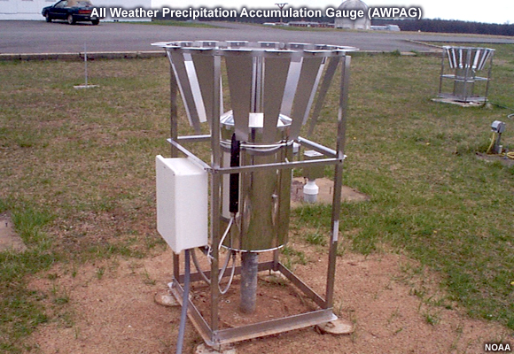
.. |Rooftop optical recording gauge| image:: media/ch3/image_obs_popout_gaugeqpe7.jpg
   :width: 6.04167in
   :height: 4.16667in
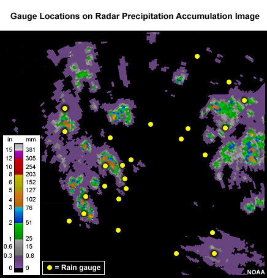
.. |Heavy rainfall falling vertically| image:: media/ch3/image_obs_popout_gaugeqpe27.jpg
   :width: 5.83333in
   :height: 4.375in
.. |Rainfall in hurricane falling at an angle| image:: media/ch3/image_obs_popout_gaugeqpe24.jpg
   :width: 5.83333in
   :height: 4.375in
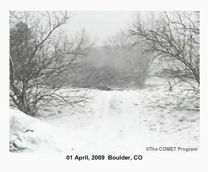
.. |Fall angle and gauge catch for 2-mm diameter raindrops at 0 m/s wind speed| image:: media/ch3/image_obs_popout_gaugeqpe14.jpg
   :width: 6.04167in
   :height: 5.10417in
.. |Fall angle and gauge catch for 2-mm diameter raindrops at 5 m/s wind speed| image:: media/ch3/image_obs_popout_gaugeqpe11.jpg
   :width: 6.04167in
   :height: 5.10417in
.. |Fall angle and gauge catch for 2-mm diameter raindrops at 10 m/s wind speed| image:: media/ch3/image_obs_popout_gaugeqpe5.jpg
   :width: 6.04167in
   :height: 5.10417in
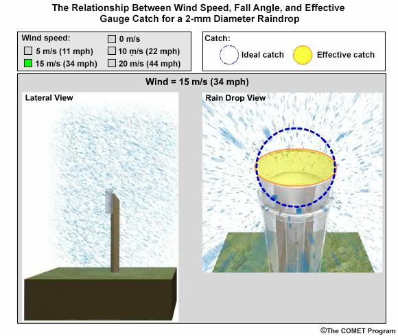
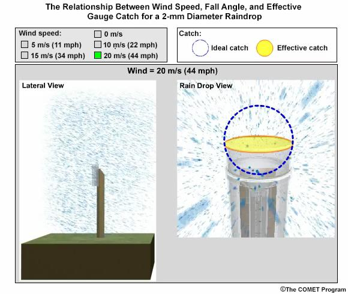
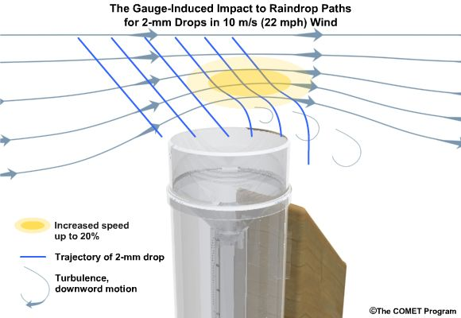
.. |Effects of wind turbulence near the ground on precipitation and gauge catch| image:: media/ch3/image_obs_popout_gaugeqpe17.jpg
   :width: 6.04167in
   :height: 4.16667in
.. |Effects of wind turbulence near the ground on precipitation and gauge catch - wind blockage by trees| image:: media/ch3/image_obs_popout_gaugeqpe31.jpg
   :width: 6.04167in
   :height: 4.16667in
.. |Effects of wind turbulence near the ground on precipitation and gauge catch - tree blockage and elevated gauge| image:: media/ch3/image_obs_popout_gaugeqpe4.jpg
   :width: 6.04167in
   :height: 4.16667in
.. |SNOTEL site Idaho| image:: media/ch3/image_obs_popout_gaugeqpe2.jpg
   :width: 5.47222in
   :height: 4.09722in
.. |SNOTEL site| image:: media/ch3/image_obs_popout_gaugeqpe9.jpg
   :width: 5.47222in
   :height: 4.09722in
.. |image12| image:: media/ch3/image_obs_popout_gaugeqpe33.jpg
   :width: 5.47222in
   :height: 4.09722in
.. |Relationship between wind speed and gauge measurement for liquid hydrometeors| image:: media/ch3/image_obs_popout_gaugeqpe25.jpg
   :width: 6.04167in
   :height: 4.16667in
.. |Photo of snow blowing around rain gauge| image:: media/ch3/image_obs_popout_gaugeqpe37.jpg
   :width: 3.64583in
   :height: 3.02083in
.. |Photo of snow blown in gauge on side| image:: media/ch3/image_obs_popout_gaugeqpe13.jpg
   :width: 4.16667in
   :height: 4.16667in
.. |Plot of studies gauge catch ratio to wind speed for various gauges| image:: media/ch3/image_obs_popout_gaugeqpe36.gif
   :width: 4.16667in
   :height: 3.125in
.. |image13| image:: media/ch3/image_obs_popout_gaugeqpe26.gif
   :width: 4.16667in
   :height: 3.125in
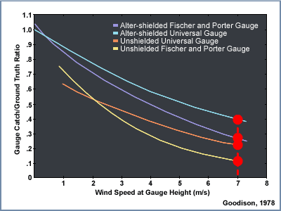
.. |image15| image:: media/ch3/image_obs_popout_gaugeqpe23.jpg
   :width: 4.09722in
   :height: 5.47222in
.. |4 inch rain gauge| image:: media/ch3/image_obs_popout_gaugeqpe30.jpg
   :width: 5.20833in
   :height: 3.90278in
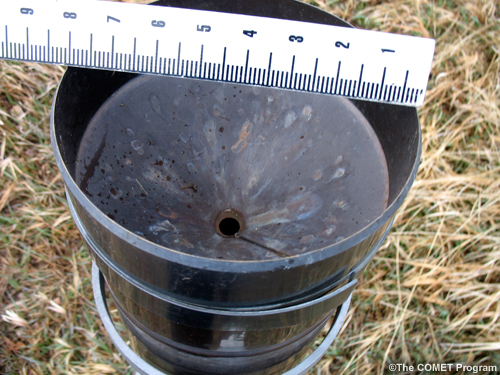
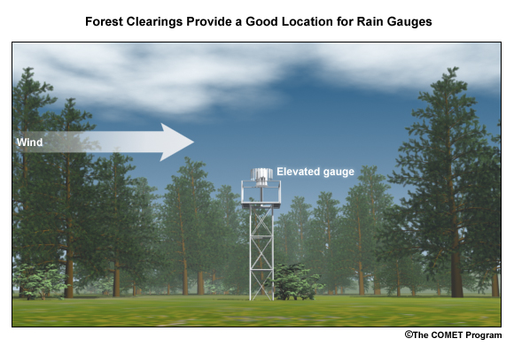
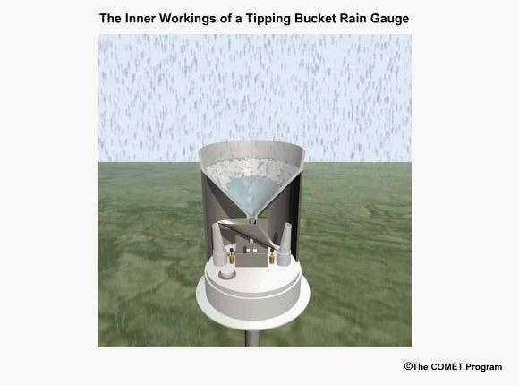
.. |image16| image:: media/ch3/image_obs_popout_gaugeqpe16.jpg
   :width: 6.04167in
   :height: 4.47917in
.. |All weather precipitation accumulation gauge (AWPAG) with double-structure wind shield| image:: media/ch3/image_obs_popout_gaugeqpe29.jpg
   :width: 6.04167in
   :height: 4.16667in
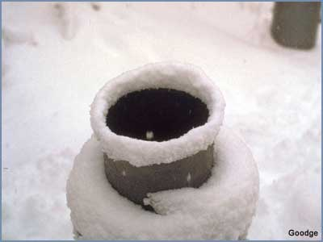
.. |Checking a rain gauge in snow conditions| image:: media/ch3/image_obs_popout_gaugeqpe22.jpg
   :width: 4.16667in
   :height: 5.55556in
.. |Taking a snow core sample| image:: media/ch3/image_obs_popout_gaugeqpe21.jpg
   :width: 5.73611in
   :height: 4.27778in
.. |Map of coop rain gauge locations in the US| image:: media/ch3/image_obs_popout_gaugeqpe19.gif
   :width: 6.5in
   :height: 4.34722in

3.2.2 **Beyond gauges - alternative precipitation data sets**
~~~~~~~~~~~~~~~~~~~~~~~~~~~~~~~~~~~~~~~~~~~~~~~~~~~~~~~~~~~~~

Given the limitations of rain gauge networks in their spatial coverage
(including wind-speed sampling error, etc., see popout above for
details), a primary source for alternative precipitation estimates are
gauge-adjusted radar estimates, in regions where radar beam coverage is
sufficient. The strengths of these derived estimates are as follows.
**High spatial resolution:** outside of point-based rain gauges, radar
systems provide some of the highest-resolution data on precipitation
patterns, allowing for detailed mapping of rainfall and storm structures
while still providing coverage over broad areas. **Wide coverage:**
Radar can cover large geographical areas that might be difficult to
monitor using ground-based instruments alone. This wide coverage is
particularly useful in remote or inaccessible regions (as long as there
is no beam-blockage). **Detection of precipitation type:** Advanced
radar systems can differentiate between types of precipitation (rain,
snow, hail).

However, gauge-adjusted radar estimates also have the following
limitations. **Attenuation:** Radar signals can be attenuated by heavy
precipitation, especially in convective storms. This attenuation can
lead to underestimations of rainfall intensity at greater distances from
the radar site. **Ground (or other) clutter:** Objects on or near the
ground (buildings, hills, trees) can reflect radar signals, resulting in
ground clutter that obscures or mimics precipitation signals, leading to
inaccuracies; note that above-ground flying insects can also cause
similar problems. **Elevation angle limitations:** The radar beam
travels in a straight line, while the Earth curves away from it. At
longer distances, this can cause the radar to overshoot lower-altitude
precipitation, leading to underestimations of rainfall close to the
ground. **Range degradation:** The quality and accuracy of radar data
decrease with distance due to the spreading of the radar beam and
increasing altitude of observation. This makes long-range precipitation
estimates less reliable. **Dependence on reflectivity:** Radar estimates
precipitation by measuring the reflectivity of water particles in the
air. This method assumes a relationship between the size and type of
particles and the intensity of precipitation, which has its own
inaccuracies. **Calibration and maintenance:** Radar systems require
regular calibration and maintenance to ensure their accuracy.
Calibration must often be localized to account for regional climatic and
environmental conditions, adding complexity to their operation.
**Spatial representation:** radar beams are of a certain width, and as
such, the measurements implicitly are a type of representative average
over the region of coverage. This can be a strength or a weakness
depending on if the implicit sampling area corresponds to that of the
researcher’s interest. Note that this spatial discretization also
implicitly dampens extremes that would be captured through point-based
gauge measurements. **Length of historical record and changes in
estimation quality through time:** some of the most significant radar
technologies did not become operational until the 1990s (with
dual-polarization and doppler capabilities), so care should be taken
when utilizing radar-based precision estimates preceding this time
period. However, note that over the US it is possible to assess the
level of uncertainty in derived radar precipitation estimates for a
given location, as shown in the figure below of the Radar Quality Index
(RQI), which shows the impact of non-uniform coverage of radar
that is related to the elevation of the radar sample, distance from the
radar, and the impact of mountains.

|image7|

*Figure: the Radar Quality Index (RQI) provides a measure how useful
radar might be for precipitation estimates based on the amount of
unblocked radar sampling below the freezing level. The scale is 0 to
100%, with the high end indicating good radar coverage, and the low end
indicating poor coverage typically due to terrain blocking or increasing
distance from the radar. This image is from February. The distance that
high RQI values extend from the radar is typically better during summer
when there is more convective precipitation and higher freezing levels.*

Taken together, gauge-adjusted radar estimates provide some of the most
dependable and accurate estimates of precipitation over the contiguous
U.S. (CONUS), but with the following caveats: use outside of CONUS (e.g.
insufficient radar coverage), in mountainous areas (e.g. beam blockage),
variability in the quality of the estimates in space (e.g. range
degradation) and time (e.g. changes in coverage and technologies used
over the last 60 years).

Below we provide a brief overview of some of the changes in radar
estimates since their operational use by the National Weather Service in
1957.

– popout Ch 3.1 Radar technology changes

.. dropdown:: **Radar technology changes

    Radar technology and coverage used for precipitation observations has evolved significantly since its inception. Here are key milestones and changes in radar’s use for weather observation:

    **Early Developments and WSR-57 (1950s)**

    -  **Initial Use**: Radar technology initially developed for military purposes during World War II was adapted for weather observation.

    -  **WSR-57**: The first dedicated weather radar network, Weather Surveillance Radar-1957 (WSR-57), was deployed. It provided basic reflectivity data, showing areas of precipitation.

    **WSR-74 (1970s)**

    -  **Improved Technology**: The WSR-74 was an upgraded version of the WSR-57, with better resolution and reliability.

    -  **Increased Coverage**: More radar units were installed across the United States, providing better national coverage.

    **NEXRAD (WSR-88D) (1990s)** 

    -  **Next Generation Radar (NEXRAD)**: The WSR-88D, implemented in the early 1990s, marked a significant leap forward. It provided Doppler capabilities, allowing for the measurement of precipitation velocity (indicating wind speeds and direction within storms).

    -  **Dual Polarization**: In the 2010s, NEXRAD radars were upgraded with dual-polarization technology, which sends out both horizontal and vertical pulses. This enhancement allowed for better differentiation between types of precipitation (rain, snow, hail) and improved estimates of precipitation rates and quantities.

    **Phased Array Radar (2000s - Present)**

    -  **Phased Array Technology**: Research and development into phased array radar technology, which allows for faster and more flexible scanning of the atmosphere, began. Phased array radars can rapidly switch between different observation modes and provide more timely data.

    -  **Enhanced Detection**: This technology offers potential improvements in detecting severe weather phenomena, such as tornadoes and microbursts, more quickly and accurately.

    **Advances in Data Processing and Integration**

    -  **Improved Algorithms**: Advances in data processing algorithms have led to more accurate and detailed precipitation estimates and forecasts.

    -  **Integration with Other Data Sources**: Modern radar systems integrate data from satellites, weather stations, and other sensors, providing a more comprehensive understanding of weather systems.

    **Future Developments**

    -  **Continued Innovation**: Ongoing research aims to further enhance radar technology with even faster data acquisition, higher resolution, and better predictive capabilities.

    These advancements have greatly enhanced the accuracy, reliability, and detail of precipitation observations, significantly improving weather and precipitation estimation and severe weather warning systems.

    Below we provide additional introductory details on the derivation, strengths, and limitations of quantitative precipitation estimates (QPE) derived from radar, including limits due to beam blockage and mountainous regions (which also pose problems for gauges), quality control methods, and a brief discussion of satellite-derived QPE.

— popout Ch 3.1 Radar QPE

3.2.2 **Weather climatologies**
~~~~~~~~~~~~~~~~~~~~~~~~~~~~~~~~~~~~~~~~~~~~~~~~~~~~~~~~~~~~~

A weather climatology is sometimes used to augment weather variable
estimates. These climatologies are especially useful in regions with
limited capacity for measurements or rapidly changing terrain features,
the latter causing weather variable dependence on this topographic
variability (e.g. :mark:`sharp changes in elevation and/or nearby large
bodies of water)` as well as potentially limiting the ability for direct
observation (such as in cases of radar beam blockage as discussed in the
previous section). Some of the more commonly used climatologies (which
can include a variety of weather variables, and may have daily weather
estimates for some products) are t:mark:`he Parameter-elevation
Regressions on an Independent Slopes Model, or PRISM from Oregon State
(for more information on precipitation climatology guidance from PRISM
see: http://www.prism.oregonstate.edu/); Daymet daily surface weather
and climatological summaries from Oak Ridge National Laboratory
(https://daymet.ornl.gov/); gridMET from the Climatology Lab of the
University of California-Merced
(https://www.climatologylab.org/gridmet.html); and the Livneh data sets
from the University of Colorado
(https://ciresgroups.colorado.edu/livneh/data).`

|PRISM Precipitation Annual Climatology for the US|

*Figure: The Parameter-elevation Regressions on an Independent Slopes
Model, or PRISM, provides a commonly-used precipitation climatology
tool. For more information on precipitation climatology guidance from
Parameter-elevation Regressions on an Independent Slopes Model (PRISM),
see:* http://www.prism.oregonstate.edu/\ *.*

:mark:`The approach used by PRISM using gauge and terrain data is
considered the 3-dimensional (3-D) approach. This can be very useful in
terrain-affected areas – see figures below. The areas that are within
100 km of the green shading on this map are where PRISM uses the 3-D
approach for QPE. This would also include all of the Hawaiian Islands
and most of Alaska. In the white areas on this map, PRISM uses a 2-D
process. This is basically a distance-weighted gauge analysis.`

|PRISM effective terrain areas|

*:mark:`Figure: Effective terrain grid for the U.S. Shaded areas denote
terrain features that are`*

*:mark:`expected to produce significant terrain-induced (3D)
precipitation patterns.`*

*:mark:`Unshaded grid cells as far as 100 km away from the shaded areas
may also be`*

*:mark:`considered 3D; see text for discussion. Grid resolution is 2.5
minutes (~ 4 km). (Source:
https://prism.oregonstate.edu/documents/pubs/2002_influenceTerrain_daly.pdf)`*

:mark:`Below we provide more introductory information on the PRISM
approach.`

— popout Ch 3.1 PRISM

**Reanalysis**

Climate reanalysis is a method used to reconstruct past climate
conditions by combining historical observational data with modern
climate models. This approach provides a comprehensive and consistent
dataset of atmospheric, oceanic, and land-surface conditions over an
extended period. The historical observational data can come from weather
stations, satellites, ships, buoys, and other sources, and typically
undergo rigorous quality control to correct errors and inconsistencies.
The climate models used are often numerical weather prediction (NWP)
models, sophisticated models that simulate the Earth's atmosphere,
oceans, and land surface based on physical laws. The integration of the
observational data into the NWP models is done through a process called
data assimilation. For a time period of interest and for a given (grid-)
location, data assimilation systems utilizes different mathematical
methods (e.g. 4D-Var, Ensemble Kalman Filter, etc.) to combine often
unevenly spatially-distributed observations with errors in a prescribed
time-window of interest with a NWP-derived estimate constrained by
previous observations on a regularly spaced grid to obtain what is
called an optimal estimate of the state of the Earth system (i.e.
estimates of atmospheric parameters such as air temperature, pressure
and wind at different altitudes, and surface parameters such as
rainfall, soil moisture content, ocean-wave height and sea-surface
temperature, produced for all locations on earth) at the time of
interest, and its time evolution constrained by physical laws. This
combinatorial process is typically done by adjusting the NWP estimate in
a physically consistent manner so that it matches the latest
observations closely, while taking into account the relative
uncertainties in the observations and the NWP estimates (somewhat
mimicking the production of day-to-day weather forecasts, which use an
analysis of the current state of the Earth system as their starting
point).

|image8|

*:mark:`Figure: A schematic of the reanalysis process. (Source: ECMWF)`*

Although reanalyses have proven to be quite useful in general, they have
their limitations. Even though the reanalysis framework is consistently
applied over long time periods that can extend back several decades or
more, the one component that does vary are the sources and amount of the
raw input data due to changing global observational networks. Due to
this changing mix of observations, the reliability of the reanalysis can
considerably vary depending on the location, time period, and variable
considered; and this changing mix, along with biases in observations and
models, can also introduce spurious variability and trends into the
output. And of particular importance to this primer, variables relating
to the hydrological cycle such as precipitation (P) and evaporation (E)
are derived quantities that are calculated from the primary variables
(or differences in the primary variables) of the NWP model, and
therefore not directly predicted by the model's governing equations,
making them especially sensitive to inaccuracies in the numerical
modeling process. As such, reanalysis-derived hydrologic cycle variables
need to be used with caution and and assessed for their physical
reasonableness. Consider the figure below (from Trenberth et al. 2011),
which compares two reanalysis products (NASA MERRA and ECMWF
ERA-Interim) and shows how E-P is of different sign between the two
products over central Africa (but noting this is an analysis from over a
decade ago)! However, we note that just as reanalysis products continue
to improve in accuracy and their ability to remove past known
deficiencies, some products (e.g. ERA5) also are providing information
about :mark:`uncertainty: data from areas or periods where observations
are sparser are likely to be less certain.`

|image9|

*Figure: Evaporation minus Precipitation in MERRA (top) and ERA-Interim
(bottom) based on Trenberth et al. (2011). (Contributed by J Fasullo and
NCAR Climate Data Guide)*

**Further renalysis resources**

-  :mark:`NCAR Climate Data Guide:
   https://climatedataguide.ucar.edu/climate-data/atmospheric-reanalysis-overview-comparison-tables`

-  :mark:`ECMWF reanalysis description:
   https://www.ecmwf.int/en/research/climate-reanalysis`

-  :mark:`ECMWF Reanalysis fact sheet:
   https://www.ecmwf.int/en/about/media-centre/focus/2023/fact-sheet-reanalysis`

**Blending multiple sensors and data products**

Multiple sensors and data products are often employed, especially in the
case of producing time-series of data, to compensate for deficiencies in
each product alone. :mark:`As an example, over CONUS radar and rain
gauge networks have been the primary tools for precipitation analyses,
but advances in satellite tools for precipitation analysis are showing
great promise in areas with poor coverage from radar and rain gauge
networks, especially over Alaska. Particularly promising are tools that
merge data from different satellites.`

:mark:`One particular example of a blended time-series data product that
employs multiple sensors is the NOAA Analysis Of Record for Calibration
(AORC), a gridded record of near-surface weather conditions covering the
continental United States and Alaska and their hydrologically
contributing areas. Derived weather variables include hourly total
precipitation, temperature, specific humidity, terrain-level pressure,
downward longwave and shortwave radiation, and west-east and south-north
wind components, with this suite of eight variables sufficient to drive
most land-surface and hydrologic models and is used as input to the
National Water Model (NWM) retrospective simulation. As an example of
this blending process, consider that the AORC was constructed from over
a dozen individual time-series and climatological datasets, not all of
which were available through the entire period-of-record. The best
available input dataset for each of the constituent elements was used at
any given time and place. Some alternative time-series data (such as
satellite data) were used to replace the input forcings at particular
areas or used to temporally disaggregate higher-temporal resolution
data. The climatological datasets were used to bias-correct the time
series data (such as PRISM [Vose et al., 2014] and Livneh [Livneh et
al., 2015] data), and were all developed based on ground-based gauge
observations.`

:mark:`**Further AORC details:** see Analysis of Record for Calibration:
Version 1.1, Sources, Methods, and Verification, National Weather
Service, Office of Water Prediction, Oct. 2021.`

**Broader climate variable observation resources**

There continues to be a broad range of remotely sensed
hydrologically-relevant data sources that continue to be made available
and can help offset and supplement some of the data sets mentioned above
(e.g. GPM and SWOT), especially in regions with limited observed
coverage, and the reader is encouraged to continue to monitor the
availability of additional resources that could help with their
hydrometeorological data needs. Examples:

-  Global Precipitation Measurement: https://gpm.nasa.gov/missions/GPM

-  Surface Water and Ocean Topography Mission:
   https://swot.jpl.nasa.gov/

**Further Resources**

For further resources and guidance on observational data sets, please
see:

-  the NSF NCAR Climate Data Guide: https://climatedataguide.ucar.edu/

-  IPCC AR6 WG1 Annex I Observational Products (filtered table of North
   American and water cycle focused provided below)
   https://www.ipcc.ch/report/ar6/wg1/

-  Data sources that were developed or referenced by the NOAA Technical
   Support Unit supporting the U.S. Fifth National Climate Assessment
   can be found here:

   -  NCA5 Atlas https://atlas.globalchange.gov/

   -  Global Change Information System https://data.globalchange.gov/

   -  NOAA’s nClimGrid monthly
      https://www.ncei.noaa.gov/access/metadata/landing-page/bin/iso?id=gov.noaa.ncdc:C00332

   -  NOAA’s nClimGrid daily
      https://www.ncei.noaa.gov/products/land-based-station/nclimgrid-daily

   -  NOAA’s nClimDiv climate indices
      https://www.ncei.noaa.gov/access/metadata/landing-page/bin/iso?id=gov.noaa.ncdc:C00005

-  Below we provide a list of IPCC AR6-referenced climate variable
   observational products applicable to the U.S. and North America. The
   table lists observational datasets commonly used for climate studies
   that are considered well-vetted by the scientific community. The
   table documents the details of the types and versions of datasets,
   the time period they cover, and citations and (where available) web
   links to the data. Reanalyses data products are included. Datasets
   are sorted alphabetically according to the dataset name or, if there
   is no formal name, the name of the responsible institution or lead
   author.

— pop out Table Ch3.1 Observational datasets

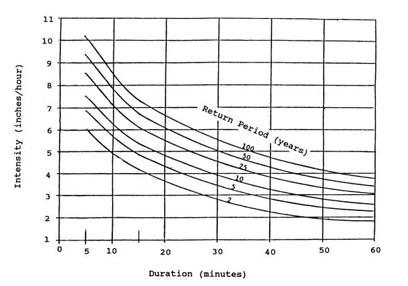
.. |image6| image:: media/ch3/image_obs7.png
   :width: 6.5in
   :height: 4.40278in
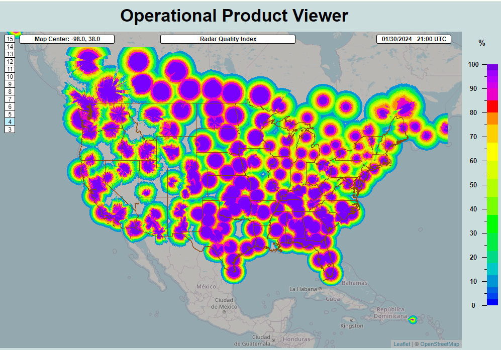
.. |PRISM Precipitation Annual Climatology for the US| image:: media/ch3/image_obs5.jpg
   :width: 6.04167in
   :height: 4.58333in
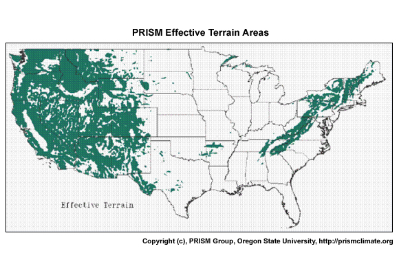
.. |image8| image:: media/ch3/image_obs1.jpg
   :width: 6.5in
   :height: 4.33333in
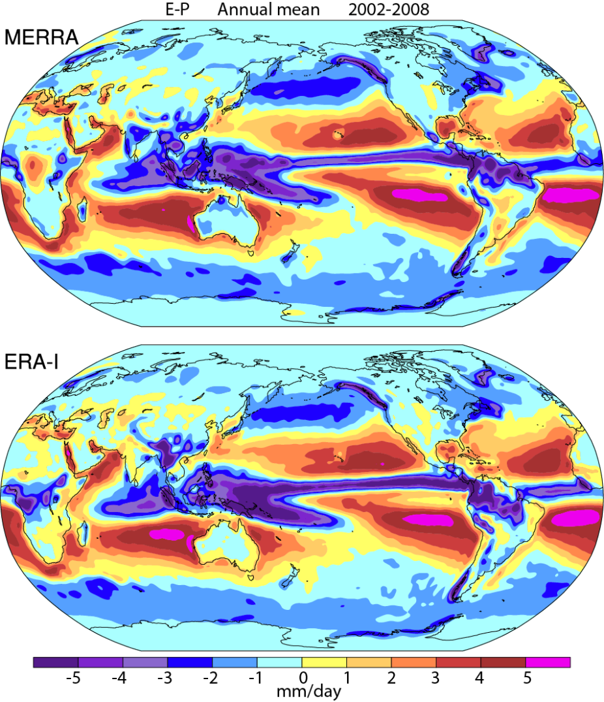
