.. vim: syntax=rst

Chapter 3 Characterize baseline quantities of interest, uncertainties
=====================================================================

This Chapter provides an overview and guidance on the following topics:

-  Observation-based water-cycle datasets for North America and their
   strengths and weaknesses

-  Characterizing baseline natural variability and introduction to the
   attribution of observed changes

**Table of Contents**

-  Introduction

   -  Weather and climate

   -  Natural factors influencing climate variability

-  Observational datasets and their strengths and weaknesses

-  Baseline natural variability and detection and attribution of
   observed changes

-  Key takeaways from the chapter

-  References

3.1 Introduction
-------------------------------------------------

In any study of future impacts of climate change, it is essential to
first characterize and quantify the baseline, or starting point, of the
study area of interest, which includes understanding the natural
variability of the water system being studied, independent of
anthropogenic impacts (e.g.,changes in radiative forcing
due to changes in CO2 emissions, land-use changes, etc.). In addition,
when using future numerical-based climate modeling outputs, some form of
bias correction using local observations is also essential for making
the results physically-relevant, as well as ensuring the climate model
outputs are applicable as inputs into local impact models. The first part of
this chapter discusses observational data sources that would be relevant
for both of these topics. Note that our coverage of climate variables in
this primer is primarily on the atmospheric “flux” terms into and out of
the surface (see figure below) of the hydrologic cycle components:
precipitation and the climate variables that impact evapotranspiration
(temperature, solar insolation, longwave radiation, wind speed,
relative humidity); this contrasts with those variables that are
subsurface variables, and those that are more “point-based” and
diagnosed through local-impact model research (e.g.,streamflow, sediment
transport, storage, etc.).

|image1|

*The components of the hydrologic cycle*

In the second section of this chapter we discuss the concept of the
baseline natural variability of a system under study and ways to detect
and potentially attribute the contribution of observed changes to
natural and anthropogenic factors. Because climate change is a
phenomenon that is typically characterized by slow changes through time,
and that anthropogenic-induced climate change predominantly began in the
mid-19th century (when atmospheric concentrations of CO2 began to show a
marked increase correlating with industrial activities), significant
changes may be detected through examination of the historical record,
depending on the study area. At the same time, detection depends on how
large the “natural variability” of the system of interest is. The
Earth's climate systems exhibit natural variability due to a range of
factors. These include variations in solar radiation (e.g., solar
cycles), volcanic activity, ocean currents, atmospheric circulation
patterns such as El Niño and La Niña, and geological processes like the
shifting of tectonic plates (at time-scales of millions of years).
Additionally, feedback mechanisms within the Earth's climate system can
amplify or dampen these variations, leading to fluctuations in
temperature, precipitation patterns, and other climatic parameters over
different timescales, from years to centuries and beyond. The figure
below from the Intergovernmental Panel on Climate Change (IPCC:
https://www.ipcc.ch/report/ar6/syr/figures/figure-2-1) shows on the left
panel the increase in the global surface temperature through time, while
the panel at the right shows estimates of how much these temperature
changes have been attributed to total human influence; solar and
volcanic drivers; and internal climate variability. Although at the
global scale, human impacts are the dominant contributor to these
changes, natural variability generally becomes relatively a much larger
contributor to observed changes as the spatial region of interest gets
smaller, and as the timescales of interest also decrease.

|image2|

*Figure: :mark:`Left panel: the global surface temperature (shown as
annual anomalies from a 1850–1900 baseline) has increased by around
1.1°C since 1850–1900. Right panel: temperature change attributed to:
total human influence; its decomposition into changes in greenhouse gas
(GHG) concentrations and other human drivers (aerosols, ozone and
land-use change (land-use reflectance)); solar and volcanic drivers; and
internal climate variability. Whiskers show likely ranges. Source:`
IPCC: https://www.ipcc.ch/report/ar6/syr/figures/figure-2-1.*

Further below we provide introductory information on the distinction of
weather and climate (i.e. differences in what are often termed “time
scales of interest”) and a description of the natural factors that
influence our climate over time.

.. dropdown:: **Weather vs Climate**

    Most of us know that climate and weather are not the same. It is sometimes said, "Climate is what you expect, weather is what you get."

    **Weather** describes the details of what we experience over the course of hours and days.

    |image3|

    **Climate** is the statistical representation of weather over days, months, seasons, years, decades, and longer

    |image4|

    **A weather prediction, or forecast,** describes the near-term likelihood of a weather event such as a specific occurrence of rain or snow and/or the expected change in temperature. A weather forecast, for example, might read, "colder with a 70% chance of snow this afternoon."

    **A climate prediction,** on the other hand, might call for below-average precipitation and near-average temperature over the next 30 days.`

    **Climate-model output:** used to generate statistics of weather phenomena`

      -Mean and variability of precipitation and temperature

      -Collective impact of weather events

    **Projections:** Lack specificity and predictability

    Climate models do predict specific weather events many years into the future, but not with the intention for use as time- and site-specific forecasts. Rather, the intended use of climate-model output is to generate statistics of weather phenomena, such as means and variability of precipitation or temperature, to characterize the collective impact of weather events. These climate predictions are typically referred to as projections or simulations and lack the short-term specificity of weather predictions.`

.. dropdown:: **Natural factors impacting climate variability**

    Earth's climate shifts over time because so many different land, ocean, and space phenomena have influence. The sun is the main driver of Earth's climate, as it provides most of the energy. The sun's energy output increased about a tenth of a percent from 1750 to 1950, which contributed about 0.2°F (0.1°C) warming in the first part of the 20th century. But since 1979, when we began taking measurements from space, the data show no long-term change in total solar energy, even though Earth has been warming.

    |Graphic showing Milankovitch cycles|

    Repetitive cycles in Earth's orbit can influence the angle and timing of sunlight. The tilt and wobble of Earth's axis and the degree to which its orbit is stretched produce the Milankovitch cycles, which scientists believe both triggered and rewarmed ice ages for the last few million years. But these changes take thousands of years, and so cannot explain the warming in this century.

    |Graphic showing continental drift|

    [Click to open a drifting continents & ocean currents animation.](https://www.meted.ucar.edu/broadcastmet/climate/media/video/continents_currents.mp4)

    Drifting continents make a big difference in climate over millions of years by changing ice caps at the poles and by steering ocean currents, which transport heat and cold throughout the ocean depths. These currents in turn influence atmospheric processes. Snow and ice on Earth also affect climate because they reflect more solar energy than darker land cover or open water.

    |Global average surface temperature change with volcanic eruptions|

    Huge volcanic eruptions can cool Earth by injecting ash and tiny particles into the stratosphere. The resulting haze shades the sun for a year or two after each major blast. Dust and tiny particles thrown into the air by both natural processes and human activities can have a similar effect, although some absorb sunlight and help heat the climate.

    |Incoming solar radiation and the effect of increasing greenhouse gases|

    Greenhouse gases, which occur both naturally and as a result of human activities, also influence Earth's climate.

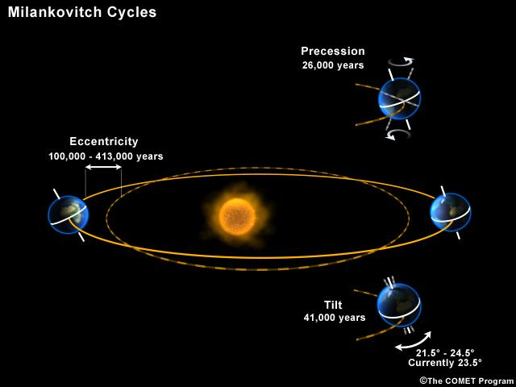
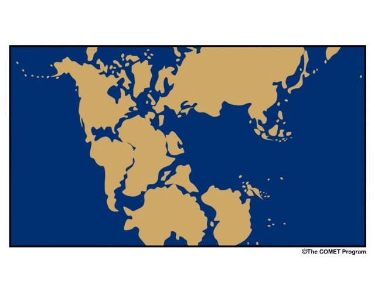
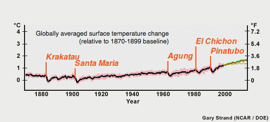
.. |Incoming solar radiation and the effect of increasing greenhouse gases| image:: media/ch3/image_intro_popout_natl4.jpg
   :width: 6.5in
   :height: 4.875in
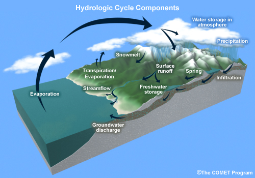
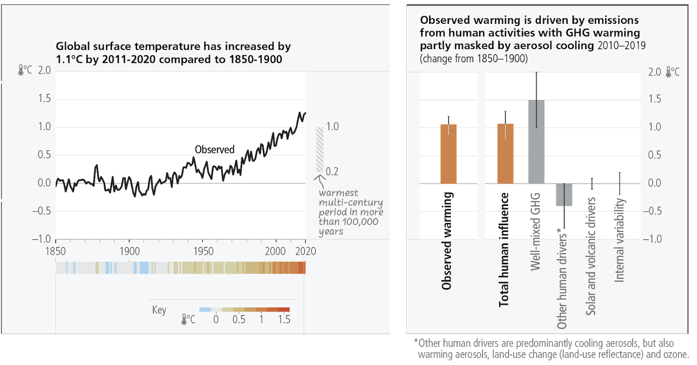
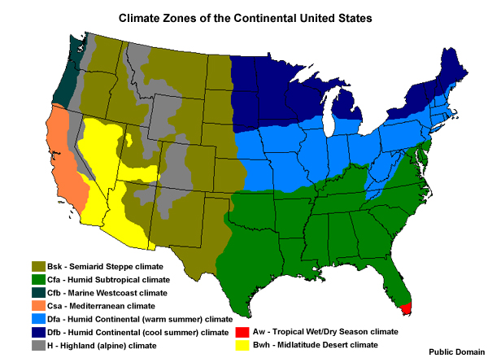
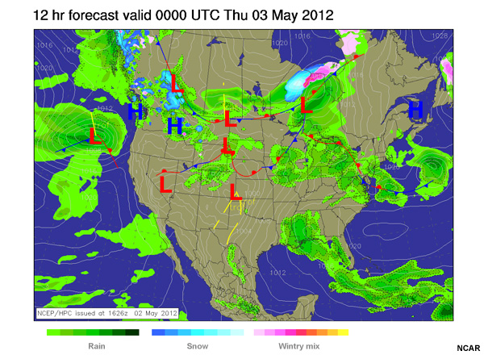

3.2 Observational datasets and their uncertainties
--------------------------------------------------

Climate-sensitive terrestrial water-related research and impact studies
can take many forms, often examining very specific, localized
phenomena (e.g.,climate impacts on seasonal lake mixing). The intent of
this section is to offer guidance on data sources of larger spatial-scale atmospheric flux terms that can provide what are termed hydrologic
cycle “forcings” to more localized impact models, divided in the context
of this chapter into precipitation and components of evapotranspiration.
In this section, we begin by discussing the theoretical ideal for
obtaining a “localized,” dense observational dataset, along with
practical needs and considerations. We follow this with a discussion of
considerations for supplementing these datasets with larger
spatial-scale and longer temporal-scale datasets, concluding this
section by providing links to useful observational datasets and
resources.

Before we begin this discussion, it is helpful to keep some questions in
mind related to the spatial, temporal, and distributional climate-data
attributes required to capture the local-impact phenomena being studied,
and when assessing the adequacy of observational datasets.

-  Is the phenomenon highly variable in space such that only localized
   sampling is sufficient (e.g.,often occurring in regions of strong
   topographical gradients)?

-  Is the phenomenon more likely related to specific weather events or 
   year-by-year changes in climate averages?

-  Are temporal averages of the variables sufficient (e.g., monthly,
   daily, hourly, etc.) and/or is the phenomenon critically dependent on
   extremes in intensity, frequency, and duration?

-  If extremes are the primary focus, are there historical
   records long enough to capture these extremes at sufficient temporal/spatial
   resolution to drive local impact models?

|image5|

*Figure: one of the most monitored attributes of local rainfall are
changes in its Intensity-Duration-Frequency (IDF) relationship.*

These questions often highlight the need for datasets developed from a
combination of different data sources and meteorological tools and
approaches to ensure a comprehensive understanding of the weather and
climatological conditions of interest, which we talk about next.

3.2.1 **Ideal local datasets.**
~~~~~~~~~~~~~~~~~~~~~~~~~~~~~~~~~

Arguably the ideal data for researchers who are interested in obtaining
variables and datasets that can then provide or force detailed and
localized ecosystem and impact models (e.g., storage, surface water
flows, stream temperatures, etc.) would be to have **gauge-derived
instrumented measurements** of all climate variables of interest at high
enough density, sampling frequency, and historical record to capture all
dominant scales of spatial and temporal heterogeneity across the study
domain of interest, which are more often than not, unattainable. In this context,
weather gauges are often considered the best source of truthful weather
information for several reasons. **Accuracy and precision**: if properly
calibrated and maintained, weather gauges provide accurate and precise
measurements of temperature, precipitation, wind speed, humidity; fluxes
of energy, momentum, and moisture; and long- and shortwave radiation.
**Direct measurement:** Unlike other methods that might rely on indirect
indicators or modeled inputs, weather gauges collect direct, empirical
data from the environment. **Localized information:** These instruments
provide data specific to their location, particularly useful for
research purposes where understanding microclimates or specific local
phenomena is crucial. **Extremes:** As opposed to other measurement
techniques and approaches that often implicitly represent spatial or
temporal averages, gauges are point-based in nature, allowing them to
capture the widest range of temporal and spatial variability, given sufficient spatial and temporal resolution.
**Long-term data collection, standardization and calibration:** Many
gauging approaches have remained consistent for many decades (or can be
easily cross-compared to modernized techniques), along with
universally accepted and consistent standardization and calibration
approaches, means weather gauges are often resource for long-term
archives of meteorological data, essential for studying climate change,
weather patterns, and long-term trends. **Sufficient for
climatologies**: even if sparsely-located gauges may be insufficient to
represent a time-series of weather across a region, they may be
sufficient to represent the long-term climatology if the region is
largely homogenous in its weather patterns (note: a weather
climatology refers to the statistical representation of the long-term
weather conditions at a particular location or over a specific region,
typically involving the analysis of weather data over extended periods,
typically 30 years or more, to understand the typical weather patterns
and variations of an area).

However, weather gauges also have certain drawbacks.
**Representativeness:** Point observations are rarely sufficient
to represent spatial patterns of precipitation; this is especially true
in regions with sharp changes in elevation and/or nearby large bodies of
water. **Wind and turbulence-dependent errors for precipitation
gauges:** The wind over and around raised gauges can distort the
measurement of the flux of hydrometeors falling to the ground. Typically, the higher the wind speed, the higher the distortion.
**Susceptibility to local interferences:** Weather gauges can be
affected by local environmental factors such as buildings, trees, and
other obstructions that can alter wind patterns or create microclimates.
This can lead to data that may not accurately represent broader weather
conditions. **Maintenance and calibration needs:** These instruments
require regular maintenance and calibration to ensure accuracy. This can
lead to data gaps that degrade the reliability of any dataset based on
consistent measurements. Ideally, quality-control records would be kept
and available for quality confirmation. **Limited range:** A single
weather gauge provides data only for its immediate location. While this
is also considered a strength, it does require siting of multiple
gauges to obtain a comprehensive view of weather over a larger area, if
required. See figure below of the density of rain gauges used for
observation quality control of the U.S. National Centers for
Environmental Prediction Multi-Radar Multi-Sensor (MRMS) system (Zhang
et al., 2016).

|image6|

*Figure: the MRMS locations of rain gauge sites, with the white plus
signs indicating locations of the ~7000 hourly gauges. (Source: Zhang et
al., 2016)*

Even where these local data may not in and of
themselves be sufficient to cover project needs and provide a sufficient
observational baseline, they can still provide an important (local)
evaluation of the supplemental (larger scale) datasets that are being
used.

**Further resources**

-  Further information on the strengths and limitations of snow
   measurements can be found under (“How Well Are We Measuring Snow
   Post-SPICE?”, Kochendorfer et al., 2022)
   https://doi.org/10.1175/BAMS-D-20-0228.1.

-  Also more detailed information on the estimation of precipitation and
   the strengths and deficiencies of rain gauges is found in the
   following pop-out:

.. dropdown:: **Rain gauge QPE**

    As long as humans have kept weather records, there has been a need to capture precipitation in some sort of collection device.

    Today’s precipitation gauges, hereafter referred to as rain gauges, are the current version of those collection devices.

    |Automated tipping bucket gauge|

    Rain gauges come in a variety of styles, both manual and automated...

    |All weather precip accumulation gauge (AWPAG)|

    and are used to measure rain as well as the liquid equivalent of frozen precipitation.

    |Rooftop optical recording gauge|

    In this section we will discuss the reality of the term “ground truth.” By doing so, we will discuss the impact on gauge measurement, or “gauge catch,” from wind, the physical characteristics and location of the gauge, and the characteristics of the precipitation. We will offer some perspective on these issues with respect to whether the gauge is automated or manual.

    **Rain Gauge QPE » Are they really ground truth?**

    Often referred to as “ground truth,” rain gauges are subject to errors from a variety of sources. Although gauges often provide excellent point measurements, at times the error in those measurements can be quite large. Sources of error include the construction and exposure of the gauge itself, the characteristics of the precipitation, and the weather conditions.

    Even a perfectly accurate rain-gauge network, if such a thing exists, may not be representative of the areal variations in the precipitation accumulation. Because they are point measurements, gauges are only representative of the immediate vicinity where they are located.

    |Gauge locations on radar precip accumulation image|

    **Rain Gauge QPE » Exercise: Gauges, Wind, and Fall Angle**
 

    In still air the hydrometeors that make up precipitation fall vertically downward to the gauge.

    |Heavy rainfall falling vertically|

    Wind causes precipitation to fall at an angle with respect to the vertical. In addition, the gauge itself presents an obstacle to the flow. This results in altered wind patterns near the gauge.

    |Rainfall in hurricane falling at an angle|

    The effects of the wind will vary depending on hydrometeor phase and size.

    -  No wind: precipitation falls vertically downward

    -  Wind causes precipitation to fall at an angle

    -  Wind causes altered wind patterns near gauge

    -  Wind effects vary with hydrometeor phase and size

    |still|

    *Download Video*

    In this exercise we will consider typical 2-mm-diameter raindrop. We will take the perspective of 2-mm drops falling toward the gauge opening. Consider a 0° fall angle to be that of rain falling perfectly vertical, and a 90° fall angle is rain blowing perpendicular to the gauge.

    Compare how the fall angle changes in the following figures, along with the effective collection area of the gauge, as wind speed changes. For each wind speed, you can compare the ideal catch area of the gauge with the effective catch area that is determined by the fall angle. When you are ready, answer the questions provided.

    |Fall angle and gauge catch for 2-mm diameter raindrops at 0 m/s wind speed|

    *Download Video*

    |Fall angle and gauge catch for 2-mm diameter raindrops at 5 m/s wind speed|

    *Download Video*

    |Fall angle and gauge catch for 2-mm diameter raindrops at 10 m/s wind speed|

    *Download Video*

    |Fall angle and gauge catch for 2-mm diameter raindrops at 15 m/s wind speed|

    *Download Video*

    |Fall angle and gauge catch for 2-mm diameter raindrops at 20 m/s wind speed|

    *Download Video*

    **Rain Gauge QPE » Gauges, Wind, and Turbulence**

    The exercise that you just completed showed a simplified view of the impact of wind on gauge catch. The fall-angle considerations represent a worst-case scenario. But in addition to fall-angle considerations, turbulence in the flow may influence the trajectory of hydrometeors. This may partially offset errors caused by the wind. Spacing between hydrometeors may also change due to wind effects, possibly offsetting some of the wind-induced errors.

    Here we see an increase in wind speed over the gauge, but we also see turbulence-induced downward motion. Note from the trajectories that this may increase catch, although sometimes the primary gauge-induced downward motion may be downwind of the gauge.

    |image10|

    *Download Video*

    Ground-induced turbulence in the vicinity of the gauge may be much more important for improving gauge catch than turbulence induced by the gauge itself.

    |Effects of wind turbulence near the ground on precipitation and gauge catch|

    As long as the ground objects are not tall enough to intercept incoming precipitation, the turbulence-induced downward motion has the effect of steering the hydrometeors vertically toward the ground.

    |Effects of wind turbulence near the ground on precipitation and gauge catch - wind blockage by trees|

    Elevated gauges are less likely to benefit from ground-induced turbulence.

    |Effects of wind turbulence near the ground on precipitation and gauge catch - tree blockage and elevated gauge|

    A clearing within the trees may provide the best balance between reducing wind speed but not altering precipitation distribution too much. Remember that the effects from deciduous trees are seasonal.

    |SNOTEL site Idaho|

    (Note: This measurement station also includes a snow pillow used to measure the weight of accumulated snow. Snow pillows will be discussed in more detail later. )

    |SNOTEL site|

    |image12|

    **Rain Gauge QPE » Rain, Gauge Catch, and Wind**
  
    In summary, gauge catching rain is influenced by both the fall angle and the turbulence in the vicinity of the gauge.

    |Effects of wind turbulence near the ground on precipitation and gauge catch - tree blockage and elevated gauge|

    Fall angles that depart from the verical will result in a reduction of the gauge's effective collection area. Turbulence partially offsets this problem by inducing downward motion around the gauge.

    This graphic shows the generalized relationship between wind speed and gauge catch for liquid hydrometeors. The gauge catch is expressed as the ratio of the gauge measurement to what actually fell, so values less than 1.0 are measures of underestimation by the gauge.

    |Relationship between wind speed and gauge measurement for liquid hydrometeors|

    For a typical size raindrop of 2-2.5 mm, a general rule of thumb is to expect a 1% loss of precipitation for every 1 mph increment in wind speed. This converts to 2.2% for every 1 m/s.

    Therefore, a 9 m/s (20 mph) wind speed may be expected to result in an underestimation factor of 0.80, or a 20% underestimation of the rainfall.

    There is a large envelope of uncertainty due to the variability in drop sizes, the steadiness of the wind, and the gauge location. Here are a few main points to remember. The best measurements in windy conditions will be in situations with large raindrops, gauges near ground level, and shielded gauges. The poorest measurements will be with small raindrops and drizzle drops, and when gauges are directly exposed to the wind.

    **Rain Gauge QPE » Snow, Gauge Catch, and Wind**
 
    As demonstrated in the exercise, snow is more severely impacted by wind.

    |Photo of snow blowing around rain gauge|

    *Download Video*

    This photograph shows the typical collection of snow in a rain gauge with relatively light winds of 5 m/s (11 mph). The snow is drifted up on one side illustrating that only a portion of the opening, on the downwind side, was effectively collecting the snow.

    |Photo of snow blown in gauge on side|

    A 5 m/s (11 mph) wind will result in gauge undercatch for snowflakes on the order of tens of percent. The studies plotted on this graph show that at a wind speed of 7 m/s (15 mph) the gauge may be catching only 10-50% of what actually falls! Even in the two studies where the gauge catch was improved through use of wind shields, the gauge catch at 7 m/s is still 50% or less. The magnitude of the problem will vary with snowflake characteristics. Denser crystals will have fewer gauge catch errors than low density crystals.

    |Plot of studies gauge catch ratio to wind speed for various gauges|

    |image13|

    |image14|

    Snow pillows are a technology used at SNOTEL sites in the western United States. These weigh the snow on the ground to get a liquid equivalent. Users in the NWS generally find that these data are superior to those provided by automated gauges.

    |image15|

    More information can be found at the United States Department of Agriculture, Natural Resources Conservation Service (NRCS) site: http://www.wcc.nrcs.usda.gov/snow/.

    **Rain Gauge QPE » Effects from Gauge Characteristics**
  
    A gauge aperture of at least 102 mm (4 in) in diameter is desirable. These NOAA-approved clear plastic gauges have 4-inch diameter apertures. Smaller openings will increase the likelihood of under catch.

    |4-inch rain gauge|

    The NWS cooperative climate station manual gauges have a 203-mm (8-inch) aperture.

    |8-inch rain gauge|

    As mentioned earlier, gauge catch is sometimes improved when nearby vegetation disrupts the wind. A good location may be a forest clearing where the trees are not close enough to directly intercept the precipitation.

    |Elevated gauge in a forest clearing|

    The reason to elevate gauges or place them on rooftops is often driven by security concerns rather than science. This increases the likelihood of wind-induced errors.

    **Rain Gauge QPE » Measurements from Automated Gauges**
   
    Automated rain gauges are preferred by many professional users such as the NWS. Automation allows for the assimilation of numerous reports from remote regions.

    A widely used type of automated gauge in the United States is the tipping bucket style. These allow for high temporal resolution.

    |Inner workings of a tipping bucket rain gauge|

    *Download Video*

    Problems associated with automated gauge measurements are often a function of precipitation rate and precipitation phase.

    Precipitation phase refers to whether the hydrometeors are liquid, liquid, and below freezing such as freezing rain, or frozen, such as hail or snow.

    |image16|

    *Download Video*

    Freezing and frozen precipitation present a difficult problem for gauge measurement. This is particularly true for the popular automated tipping bucket gauge. To obtain a liquid-equivalent measurement, the gauge must be heated to melt the frozen precipitation. This can and often does lead to sublimation or evaporation of precipitation without measuring it, resulting in underestimates. In addition, if the snowfall rate is very great, the melting will not occur fast enough to prevent gauge overflow, again leading to underestimation.

    Precipitation rate can also impact the accuracy of the gauge measurement. Although this varies with gauge design, the problem has been primarily with the tipping-bucket-style gauge as described in the rain-gauge webcast referred to earlier.

    The NWS is testing an automated “weighing” gauge known as the all weather precipitation accumulation gauge (AWPAG). There is still some heating of the rim to help direct snow into the gauge where a weight will determine the liquid equivalent. However, the heated area is not nearly as large as that in the tipping bucket gauges used by the NWS. Therefore, the errors with evaporation and sublimation should be reduced.

    |All weather precip accumulation gauge (AWPAG)|

    Initial testing showed disappointing results in snow, perhaps due mainly to wind effects.

    A new double wind shield version of the AWPAG gauge being deployed may help reduce the problems with measuring snow.

    |All weather precipitation accumulation gauge (AWPAG) with
    double-structure wind shield|

    As mentioned earlier, “snow pillow” estimates at SNOTEL sites are often used instead of gauges where they are available.

    **Rain Gauge QPE » Measurements from Manual Gauges**
   
    Manual gauge reports suffer from the lack of high temporal resolution. This makes manual reports less suitable for software programs that need fast access to high-resolution gauge reports.

    However, manual gauges are visited routinely and therefore problems that affect gauge measurement may be identified more promptly. These problems can include insect or bird nests, leakage, overflow, blockage from rapidly growing vegetation, and vandalism.

    |Rain gauge in snow|

    Provided that gauge overflow does not occur during intense hail or snowfall, manual gauges may allow more accurate liquid-equivalent measurements with frozen precipitation. Snow and hail are melted and measured manually.

    |Checking a rain gauge in snow conditions|

    In addition, the observer may collect a “core” measurement of snow from the ground if they determine that this will provide a more representative sample than the snow that was collected by the gauge. Core measurements are intended to minimize the errors caused by the wind. A well trained observer may therefore provide improved liquid-equivalent readings.

    |Taking a snow core sample|

    There are numerous manual gauge networks. Two well known ones are the cooperative observing network and the Community Collaborative Rain, Hail, and Snow observing network (CoCoRaHS).

    The cooperative observing network, which is sponsored by NOAA’s National Weather Service, has observers in every state. Roughly 80% of the network still uses manual gauges.

    |Map of coop rain gauge locations in the U.S.|

    The CoCoRaHS network is nationwide in the United States: http://www.cocorahs.org/.

    **Rain Gauge QPE » Rain Gauge QPE Key Points**
  
    -  Rain gauges can provide excellent information if they are well maintained, optimally located, and the wind is light.

    -  Rain gauges are point estimates and will not necessarily provide good spatial resolution.

    -  Wind causes significant errors in the gauge catch resulting in underestimation errors. These errors are greatest in strong wind, for exposed gauges, and for snowflakes and small liquid drops.

    -  Wind-induced fall angles reduce the effective catch area of the gauge. Turbulence can induce downward motion that partially offsets the fall angle problem.

    -  In situations where good radar coverage exists, radar may incur less uncertainty in high-wind situations than the gauges. A user of multiple precipitation sensors may want to consider the possibility that under such conditions it may not be wise to adjust the radar with the rain gauge data.

    **Reference**
    https://www.meted.ucar.edu/hydro/precip_est/part1_measurement/
 

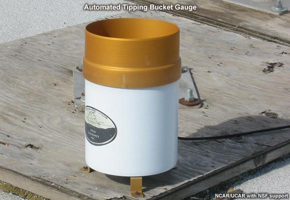
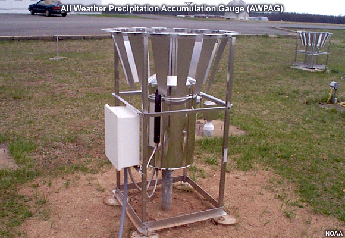
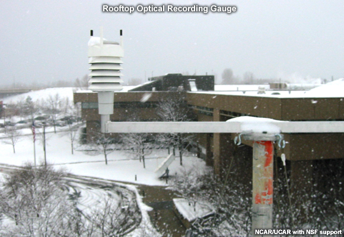
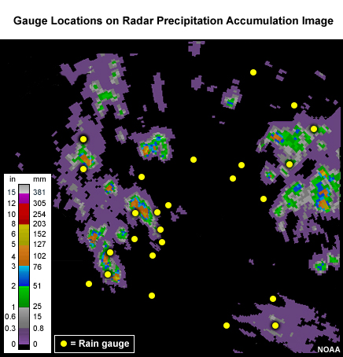
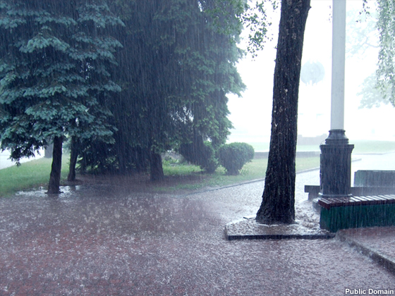
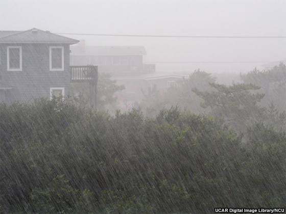
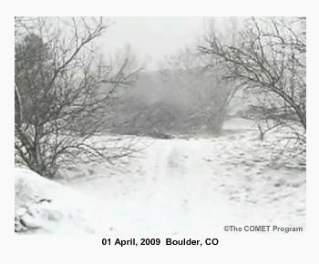
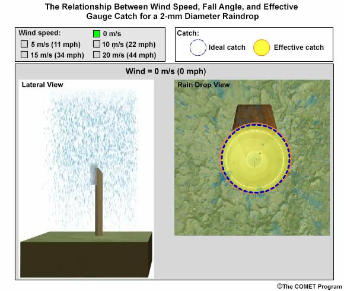
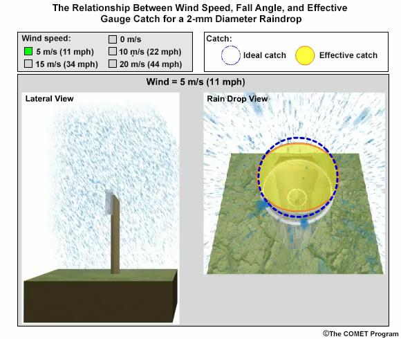
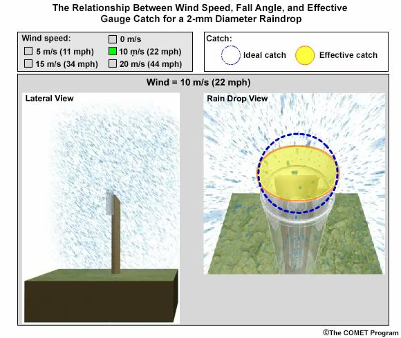
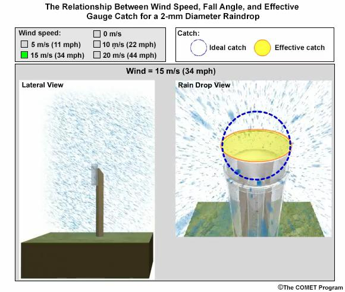
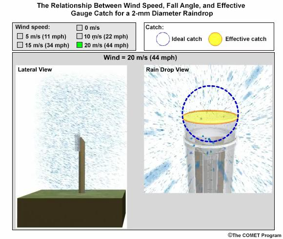
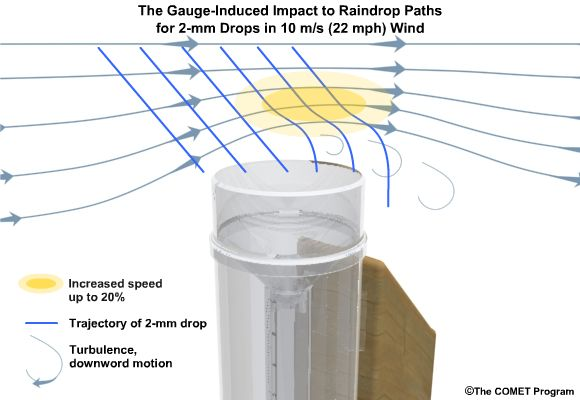
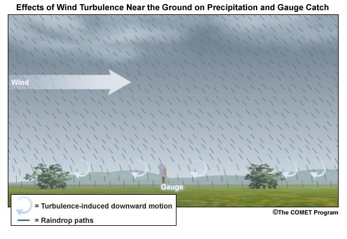
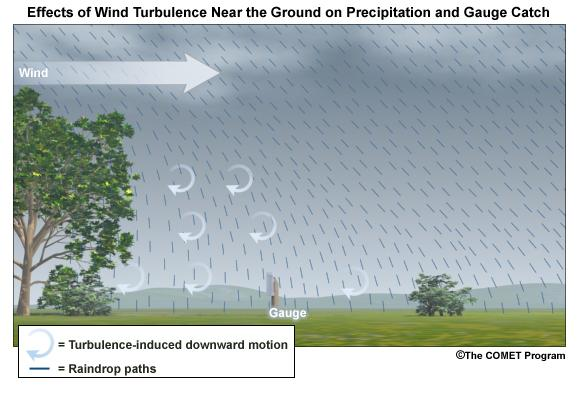
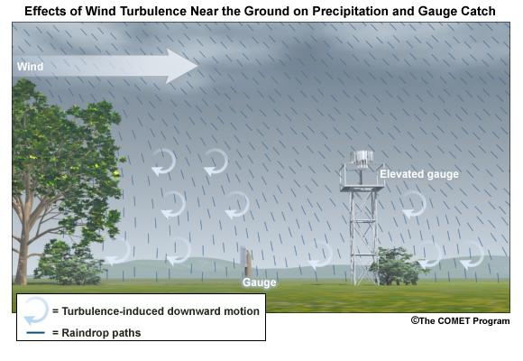
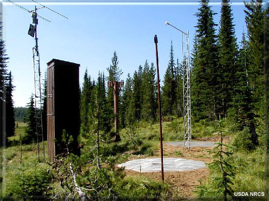
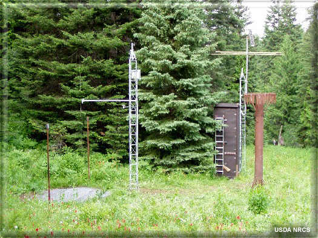
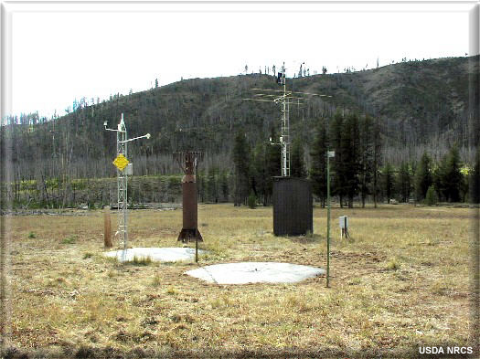
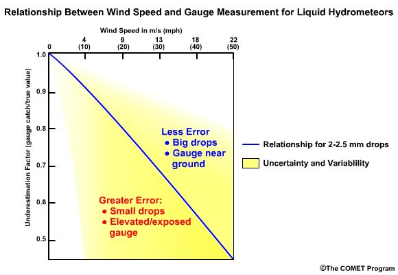
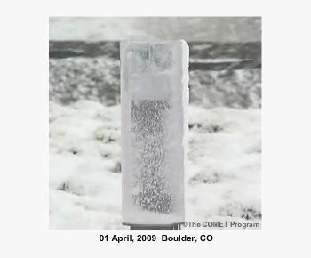
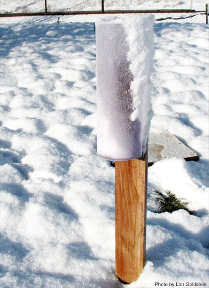
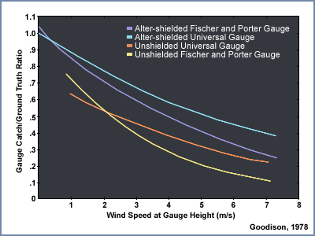
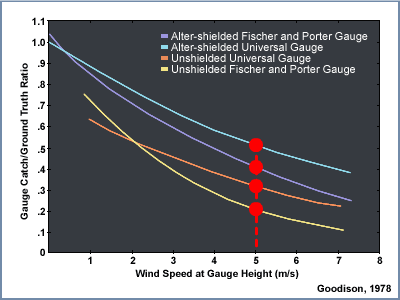
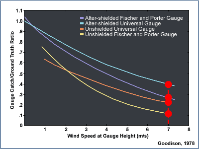
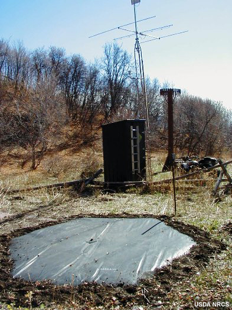
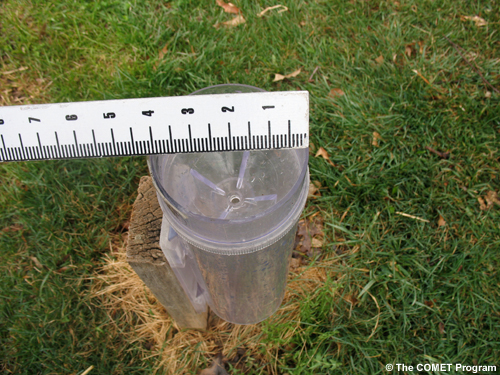
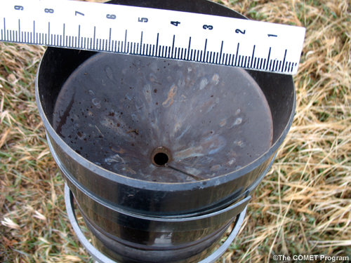
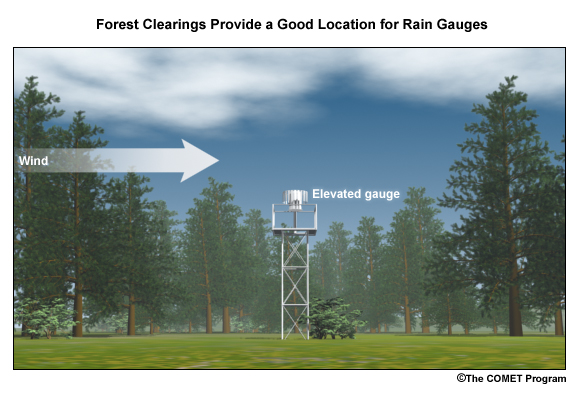
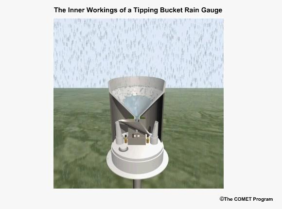
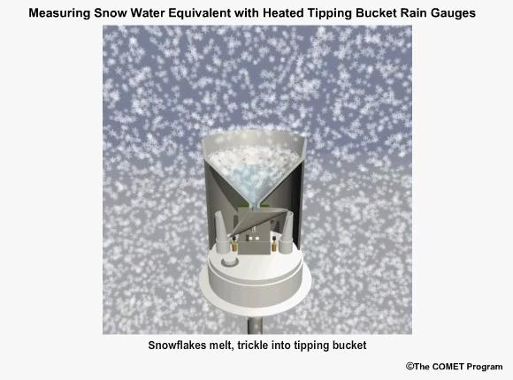
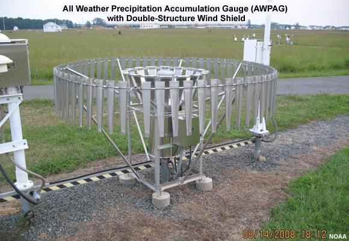
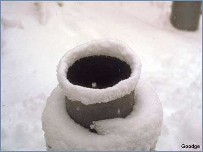
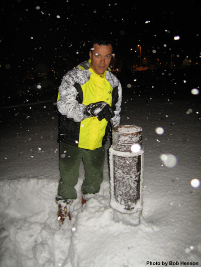
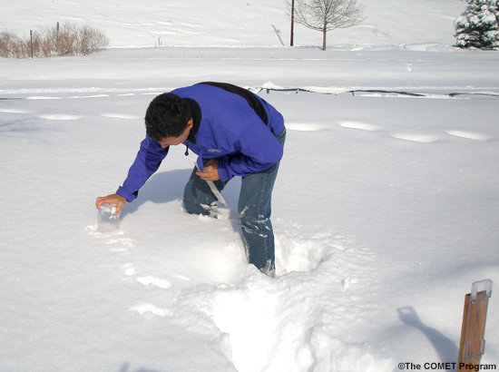
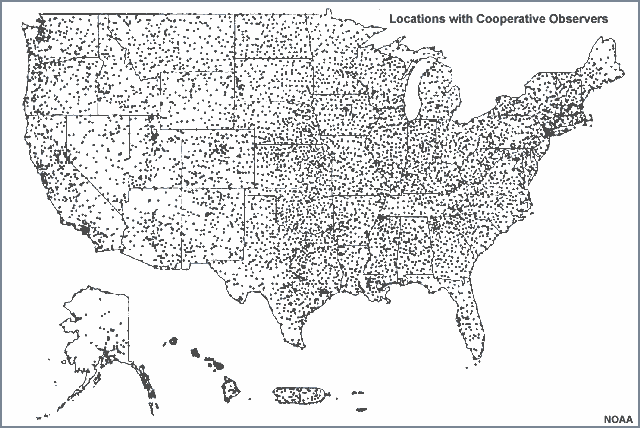

3.2.2 **Beyond gauges - alternative precipitation datasets**
~~~~~~~~~~~~~~~~~~~~~~~~~~~~~~~~~~~~~~~~~~~~~~~~~~~~~~~~~~~~~

Given the spatial coverage limitations of rain-gauge networks (including wind-speed sampling error, etc., see popout above for
details), a primary source for alternative precipitation estimates are
gauge-adjusted radar estimates, in regions where radar-beam coverage is
sufficient. The strengths of these derived estimates are as follows.
**High spatial resolution:** outside of point-based rain gauges, radar
systems provide some of the highest-resolution data on precipitation
patterns, allowing for detailed mapping of rainfall and storm structures
while still providing coverage over broad areas. **Wide coverage:**
Radar can cover large geographical areas that might be difficult to
monitor using ground-based instruments alone. This wide coverage is
particularly useful in remote or inaccessible regions (as long as there
is no beam-blockage). **Detection of precipitation type:** Advanced
radar systems can differentiate between types of precipitation (rain,
snow, hail).

However, gauge-adjusted radar estimates also have the following
limitations. **Attenuation:** Radar signals can be attenuated by heavy
precipitation, especially in convective storms. This attenuation can
lead to underestimations of rainfall intensity at greater distances from
the radar site. **Ground (or other) clutter:** Objects on or near the
ground (buildings, hills, trees) can reflect radar signals, resulting in
ground clutter that obscures or mimics precipitation signals, leading to
inaccuracies. Most operational radar systems including the WSR-88D effectively filter out the ground echoes, limiting the impact of stationary clutter. However non-stationary clutter including vehicle and train traffic, sea-surface clutter and clutter from wind farms cannot be filtered effectively leading to errors.
It is important to note that above-ground flying insects, birds, and bats can also cause
similar problems. **Elevation angle limitations:** The radar beam
travels in a nearly straight line (it is typically refracted slightly towards the surface by the atmosphere), while the Earth curves away from it. At
longer distances, this can cause the radar to overshoot lower-altitude
precipitation, leading to errors in estimated rainfall close to the
ground due to evaporation and the horizontal advection of the measured precipitation. Also, at long ranges, part or all of the radar beam may be located above the 0 deg C level, so it is measuring the ice or melting ice above the rain and not the rain itself. **Range degradation:** The quality and accuracy of radar data
decrease with distance due to the spreading of the radar beam and
increasing altitude of observation. This makes long-range precipitation
estimates less reliable. **Dependence on reflectivity:** Radar traditionally estimates
precipitation by measuring the reflectivity of water particles in the
air. This method assumes a relationship between the size and type of
particles and the intensity of precipitation, which has its own
inaccuracies. The introduction of dual-polarization measurements has reduced, but not eliminated, these issues. **Calibration and maintenance:** Radar systems require
regular calibration and maintenance to ensure their accuracy.
Calibration must often be adjusted locally to account for regional climatic and
environmental conditions, adding complexity to their operation.
**Spatial representation:** radar beams are a certain width, and as
such, the measurements implicitly are a type of representative average
over the region of coverage. This can be a strength or a weakness
depending on whether the implicit sampling area corresponds to that of the
researcher’s interest. Note that this spatial discretization also
 dampens extremes that would be captured through point-based
gauge measurements. **Length of historical record and changes in
estimation quality through time:** some of the most significant radar
technologies did not become operational until the 1990s or later (with
dual-polarization and doppler capabilities), so care should be taken
when using radar-based precision estimates preceding this time
period. However, note that over the U.S. it is possible to assess the
level of uncertainty in derived radar-precipitation estimates for a
given location, as shown in the figure below of the Radar Quality Index
(RQI), which shows the impact of non-uniform coverage of radar related to the elevation of the radar sample, distance from the
radar, and the impact of mountains.

|image7|

*Figure: the Radar Quality Index (RQI) provides a measure for how useful
radar might be for precipitation estimates based on the amount of
unblocked radar sampling below the freezing level. The scale is 0 to
100%, with the high end indicating good radar coverage, and the low end
indicating poor coverage, typically due to terrain blocking or increasing
distance from the radar. This image is from February. The distance that
high RQI values extend from the radar is typically better during summer
when there is more convective precipitation and higher freezing levels.*

Taken together, gauge-adjusted radar estimates provide some of the most
dependable and accurate estimates of precipitation over the contiguous
U.S. (CONUS) with the following caveats: use outside of CONUS (e.g.
insufficient radar coverage), in mountainous areas (e.g.,beam blockage),
variability in the quality of the estimates in space (e.g.,range
degradation) and time (e.g.,changes in coverage and technologies used
over the last 60 years).

Below we provide a brief overview of some of the changes in radar
estimates since their first operational use by the National Weather Service in
1957.

.. dropdown:: **Radar technology changes**

    Radar technology and coverage used for precipitation observations has evolved significantly since its inception. Here are key milestones and changes in radar’s use for weather observation:

    **Early Developments and WSR-57 (1950s)**

    -  **Initial Use**: Radar technology that was initially developed for military purposes during World War II was adapted for weather observation.

    -  **WSR-57**: The first dedicated weather-radar network, Weather Surveillance Radar-1957 (WSR-57), was deployed. It provided basic reflectivity data, showing areas of precipitation.

    **WSR-74 (1970s)**

    -  **Improved Technology**: The WSR-74 was an upgraded version of the WSR-57, with better resolution and reliability.

    -  **Increased Coverage**: More radar units were installed across the United States, providing broader national coverage.

    **NEXRAD (WSR-88D) (1990s)** 

    -  **Next Generation Radar (NEXRAD)**: The WSR-88D, implemented in the early 1990s, marked a significant leap forward. It provided Doppler capabilities, enabling the measurement of precipitation velocity (indicating wind speeds and direction within storms).  The WSR-88Ds were also double the wavelength (10 cm S-band versus 5 cm C-band) resulting in dramatically reduced attenuation.

    -  **Dual Polarization**: In the 2010s, NEXRAD radars were upgraded with dual-polarization technology, which sends out both horizontally and vertically polarized pulses. This enhancement allowed for better differentiation between types of precipitation (rain, snow, hail) and improved estimates of precipitation rates and quantities.

    **Phased Array Radar (2000s - Present)**

    -  **Phased-Array Technology**: Research and development into phased-array radar technology, which allows for faster and more flexible scanning of the atmosphere, began. Phased-array radars can rapidly switch between different observation modes and provide more timely data.

    -  **Enhanced Detection**: This technology offers potential improvements in detecting severe weather phenomena, such as tornadoes and microbursts, more quickly and accurately.

    **Advances in Data-Processing and Integration**

    -  **Improved Algorithms**: Advances in data-processing algorithms have led to more accurate and detailed precipitation estimates and forecasts. For example the automated detection and removal of ground clutter and transmitting advanced waveforms that are used to extend the unambiguous range. 

    -  **Integration with Other Data Sources**: Modern systems integrate data from radars, satellites, weather stations, and other sensors, providing a more comprehensive understanding of weather systems.

    **Future Developments**

    -  **Continued Innovation**: Ongoing research aims to further enhance radar technology with even faster data acquisition, higher resolution, and better predictive capabilities.

    These advancements have greatly enhanced the accuracy, reliability, and detail of precipitation observations, significantly improving weather and precipitation estimation and severe-weather warning systems.

Below we provide additional introductory details on the derivation, strengths, and limitations of quantitative precipitation estimates (QPE) derived from radar, including limits due to beam blockage and mountainous regions (which also pose problems for gauges), quality-control methods, and a brief discussion of satellite-derived QPE.

.. dropdown:: **Radar QPE**

    **I. Introduction » What is Quantitative Precipitation Estimation (QPE)?**

    The term Quantitative Precipitation Estimation, or QPE, refers to the estimation of observed precipitation.

    |24h QPE|

    This is different than a forecast of precipitation which is referred to as a Quantitative Precipitation Forecast, or QPF.

    |48 h QPE|

    You may wonder why precipitation is only an estimate if it is “observed.” Observed precipitation is only an estimate because the tools used provide inexact approximations of the actual magnitude and distribution of precipitation.

    **I. Introduction » QPE Methods and Tools**

    Radar is a remote-sensing QPE tool with excellent spatial and temporal resolution. However, radar coverage may be inconsistent from place to place and from storm to storm.

    |Illustration of radar, satellite and rain gauges sensing a convective cloud system.|

    Satellite is another remote sensing QPE tool, but with much coarser resolution than radar.

    |image21|

    Even rain gauges, which are ground-based measurements, are subject to errors and cannot resolve the spatial detail of precipitation patterns.

    |image22|

    A precipitation climatology is sometimes used to augment the estimates of observed precipitation. This can be very useful in regions where precipitation distribution, and the ability to observe it, is greatly affected by terrain features.

    **II. Remote Sensing of QPE**

    Precipitation accumulation is routinely derived from radar and satellite observations. Despite the inconsistencies in radar-derived precipitation from location to location and from season to season, radar guidance is considered superior to satellite guidance of QPE in many areas. This is mainly due to the superior resolution in both space and time and often better quantitative guidance.

    |Radar-derived Total Accumulation|

    Topics in this section include the relationship between drop-size distribution, the Z-R relationship, and derived rainfall; the impact of snow on radar-derived estimates, the potential QPE improvement with polarimetric radar, radar coverage issues, and the concept of radar climatology. A brief summary of issues regarding satellite-derived QPE will follow the radar sections.

    **II. Remote Sensing of QPE » Reflectivity-Rainfall Rate (Z-R) and Drop Size Distribution (DSD)**

    Radar reflectivity (Z), expressed in units of dBZ, is used to compute rainfall rates (R) in mm/h using a reflectivity to rainfall rate relationship. This is known as the Z-R relationship. Rainfall rates then get integrated over time to produce accumulation for various time periods.

    |Hybrid Reflectivity near LaCrosse, WS 0057 UTC 19 Aug 2007|

    |Instantaneous Radar-derived Rainfall Rate near LaCrosse, WS at 0057 UTC 19 Aug 2007|

    |Storm Total Radar-Derived Rainfall Accumulation near LaCrosse, WS 0057 UTC 19 Aug 2007|

    The relationship between reflectivity and rainfall rate, and thus the Z-R relationship, varies with time, location, and season. Hydrometeor properties that influence the Z-R relationship include size, concentration, and phase. Accuracy of derived rainfall rates is further impacted by the presence of non-hydrometeors, and whether the radar is sampling a region that is representative of precipitation reaching the ground.

    |Convective storm illustration with close up of hydrometeor sizes|

    |Convective storm illustration with close up of hydrometeor concentration|

    |Convective storm illustration with close up of hydrometeor phases|

    |Convective storm illustration with close up of non-hydrometeors|

    |Convective storm illustration with hydrometeor sampling by radar|

    Hydrometeor shape, which is related to hydrometeor size and phase, is also important information for understanding the relationship between reflectivity and precipitation rates. Large liquid drops are more oblate in shape than smaller ones. For horizontally-polarized radars like the WSR88-D, greater horizontal diameters reflect more energy back to the radar. This results in greater derived rainfall rates.

    |Drop shapes as a function of size|

    Even relatively small 13-mm- (half-inch) diameter hailstones contribute greatly to radar reflectivity. That’s why the presence of hail results in anomalously high derived-rainfall rates. This anomaly is typically minimized through use of rainfall-rate thresholds.

    **In Depth: Reflectivity Factor, Z**

    **Z = ∫ N(D) D\ 6 dD**

    | **Z** = reflectivity factor
    | **D** = drop diameter
    | **N(D)** = number of drops of given diameter per cubic meter

    This equation is presented to explain the sensitivity of reflectivity factor, Z, to drop diameter. Because the drop diameter is raised to the 6th power, small changes in drop diameter result in very large changes to Z. And large changes to Z result in large changes to derived rainfall rates.

    Drop size distribution (DSD) refers to the size and concentration of drops in a volume, say a cubic meter. Here we show two DSDs.

    |DSDs with equivalent reflectivity but different rainfall rates|

    The radar is more sensitive to the horizontal diameter of the hydrometeors than it is to the concentration of hydrometeors. Therefore, a small number of large hydrometeors can result in the same reflectivity value as a very large number of smaller drops. But the DSD on the right is producing greater rainfall rates. The two DSDs should therefore be represented by different Z-R relationships.

    The DSD can vary significantly and quickly in both space and time. This means that it may be appropriate to have more than one Z-R relationship in effect at the same time. As of this writing, the NOAA National Mosaic and Multisensor QPE (NMQ) radar precipitation product can utilize numerous Z-R relationships based on atmospheric conditions.

    Here we have a region with a squall line that most likely has a DSD consistent with convective rainfall. Nearby stratiform precipitation will exhibit a different DSD and should be associated with a different Z-R relationship than the convective area. As the precipitation system moves, the Z-R relationship at any one location should change with time.

    |Reflectivity Image at 2126 UTC 15 November 2008|

    **II. Remote Sensing of QPE » Reflectivity and Snow**

    As snowflakes begin to melt, a coating of water can make them “appear” as very large raindrops to the radar. This can cause very high reflectivity and overestimated rainfall rates at the ground below where the radar is sampling the melting layer aloft.

    |Radar and melting snow|

    Pure snowflakes and crystals violate the assumption of liquid hydrometeors that go into the Z-R equation. However, several research institutions are working on radar-derived snowfall including Z-S, or reflectivity snowfall rate relationships.

    **II. Remote Sensing of QPE » Precipitation Estimates with Dual Polarimetric Radar**

    Advances are made in radar technology every year. As this lesson is being developed, dual polarized radar, or polarimetric radar, is the most impactful with respect to precipitation.

    |Sample data from dual-polarimetric Radar|

    Since the WSR-88D radar network was upgraded to dual-polarization capabilities in about 2010 and 2011, many of the ambiguities associated with the phase, size, and distribution of hydrometeors have been greatly reduced. Further, the overall data quality has been improved with the addition of dual-polarization data. For example, ground clutter, bright-band and biological echoes are difficult to reliably identify and remove with traditional radars. But with dual-polarization radars these sources of contamination are readily identified by automated algorithms. Although errors from DSD variations, bright-band contamination and clutter remain ongoing issues for the WSR-88D radar data, the errors associated with them have been substantially reduced with the addition of dual-polarization capability.     

    Excellent training resources on precipitation measurement using polarimetric radar is available from NOAA’s WDTD. We will not repeat those lessons here, but we strongly encourage you to review them: http://www.wdtb.noaa.gov/courses/dualpol/Outreach/.

    In addition to reflectivity estimates that we are familiar with, dual-polarization radar allows for estimates of the average shapes of hydrometeors within the resolution volume and whether or not differently shaped hydrometeors are collocated, i.e., mixed phase. This is accomplished by transmitting and receiving both a horizontally and a vertically polarized radar beam. By measuring the different returns from these two polarizations, one can estimate the shape and the effects from different hydrometeor shapes, which increase the accuracy of precipitation estimates and hydrometeor type classification.

    For example, we can determine if the prominent reflectors are large raindrops, which tend to be oblate with a large horizontal axis. We can also determine if the hydrometeors are more spherical, which is consistent with small raindrops. Or we can discern whether the hydrometeors are highly reflective and generally spherical, consistent with hail. Other measures can be used to estimate the presence of snow, insects, or ground targets.

    |Reflector shape is a function of its size, phase, and type|

    **II. Remote Sensing of QPE » Radar Sampling of Precipitation**

    Most of the discussion so far is applicable for areas with good radar coverage. Good radar coverage is determined by three main factors.

    1. There are no obstructions of the low-level radar beam from terrain features or other ground targets like buildings.

    2. Precipitation systems extend through a deep portion of the troposphere, as we see with convective storms.

    3. The density of radar sites is sufficient. In other words, the radars are close enough to each other so that all radar sampling is occurring in the low levels of the atmosphere.

    |Influences on radar coverage - mountains|

    |Influences on radar coverge - deep convection|

    |Influences on radar coverage - low level sampling|

    The radar beam gets higher in the atmosphere with distance from the radar. Even a low tilt angle like 0.5° is ~1.5 km (5,000 ft) above the ground at 100 km from the radar, and 5.2 km (17,000 ft) high at 230 km. Therefore, to sample the low-level precipitation, which is most likely to be representative of the precipitation reaching the ground, radars need to be positioned close to each other.

    |Height above the ground of radar sample as a function of range|

    For stratiform precipitation, it is best to sample the lowest 1 km of the atmosphere, which typically occurs within 50 km of the radar. Beyond 50 km, the radar sample may be questionable. This range can be further limited by terrain blocking of the radar beam. Sampling of stratiform precipitation is almost always poor beyond 100 km from the radar.

    |Radar coverage of precipitation with range - assuming no beam blocking|

    Convective precipitation is distributed over a much deeper layer of the atmosphere than stratiform precipitation. Therefore, in seasons and locations where convection is common and terrain is minimal, the radar may be able to sample precipitation well at long distances from the radar, perhaps beyond 150 km. Shallow convection may be undersampled by the radar at ranges closer than 150 km. Range coverage is worse for snow.

    **II. Remote Sensing of QPE » Radar Coverage**

    Here are the NWS radar locations with the ideal 230-km range shown with yellow circles. The density of weather radars is generally lower in the Western United States and Alaska than in other parts of the country. These maps do not account for terrain features that can greatly reduce the radar coverage.

    |Locations of WSR-88D radars with the idealized 230-km coverge areas|

    For many locations and precipitation regimes, it’s unrealistic to expect good precipitation estimates with the idealized 230-km coverage shown here. A more realistic radius of 100 or 150 km would show greater and more numerous gaps, especially in the Western United States. In the winter, the range of realistic coverage may shrink to less than a 100-km radius.

    A more realistic coverage is shown here with a map of the height above ground level (AGL) of the radar sampling. It is for November 10th, 2008. Although this map can change depending on weather conditions and radar operations, the basic pattern will be the same.

    |Height above ground level of radar coverage, 1755 UTC 10 Nov 2008 CONUS|

    The light blues show where there is good coverage of the low levels. The best low-level coverage is obviously in areas with relatively flat terrain and good radar density. Recall that for stratiform precipitation, radar coverage can be significantly impacted if the radar sampling is 1 km or more above the ground, as shown in the dark blue, greens, yellows, and reds. Even in the Central and Eastern U.S., stratiform precipitation may be significantly underestimated in places. In the West, radar sampling can be more than 3 km above the ground in large areas. This results in completely missed precipitation systems, especially stratiform. This is also a problem in Alaska. As an example, let’s look more closely at radar coverage in the northwestern portion of the contiguous United States.

    **II. Remote Sensing of QPE » Radar Climatology**

    To account for the geographic and seasonal variability, the NWS has radar coverage maps. Here we see the warm-season effective radar coverage for the Northwest. The color-shaded areas are where radar climatology shows good coverage from at least one radar. The individual colors depict which radar the “good” coverage will come from. For example, the white area shows where radar estimates would come from the radar at Boise, Idaho, KCBX.

    |Warm season radar coverage for the northwest river forecast center area|

    KCBX is considered good here because 1) this radar is able to sample precipitation, and 2) in areas of overlap with neighboring radars, KCBX is sampling from a lower elevation. The jagged appearance is caused by mountains preventing uniformly good coverage throughout the entire 230-km radius.

    These are produced by the NWS radar climatology program, RADCLIM. We will briefly demonstrate radar climatology based on frequency of occurrence of precipitation for Boise, Idaho.

    |Radar climatology analysis and display (Radclim)|

    The precipitation frequency of occurrence starts with a precipitation threshold for defining what we will consider precipitation. Let’s use a threshold of 0.0 mm which means that any time there is more than 0.0 mm detected by the radar, we have a precipitation event. We could choose a higher threshold if we wanted to filter out light events.

    The frequency of precipitation, for each radar bin, is the number of times more than 0.0 mm was observed divided by all of the radar observations in the dataset. We get this image for the Boise radar. The radar is in the center of the 230-km radius of ideal radar coverage.

    |Frequency of occurrence of non-zero radar-derived precipitation at the Boise, ID (KCBX): Warm season|
  
    The different colors show the different frequencies of occurrence. As distance increases from the radar, the frequency of precipitation decreases, indicated by blue and black colors. Note the large areas with very low frequencies of occurrence, are shown as black. These do not represent natural precipitation distribution. Rather, it shows where the radar sampling is greatly inhibited by terrain blocking.

    **II. Remote Sensing of QPE » Radar Coverage Map**

    So now we want to choose a precipitation frequency threshold to represent effective radar coverage. In other words, we will say, “only when precipitation occurred at least this often, will we trust the radar estimates.”

    In this example, a frequency of occurrence of 0.006 was chosen. This means that we will only consider radar bins where greater than 0.0 mm occurred at least 0.006, or 0.6% of the time according to the radar climatology.
  
    |Warm season effective radar coverage for Boise, ID (KCBX)|
    This figure shows all non-black shaded areas shown on the radar coverage map as white shading. So the white shading is where we assume there is good radar coverage. We should assume bad coverage in the black areas. In the black areas, precipitation estimates should come from other radars or other sources such as rain gauges and satellite. 

    The choice of frequency threshold is somewhat subjective, based on forecaster experience regarding what produces the most useful guidance.

    Radar climatologies are generated for specific months or seasons. Let’s go back to the summer season radar coverage for the northwestern portion of the contiguous United States. All of the non-black areas are where we can assume there is good radar coverage. 

    In the cool season, there is more low-level precipitation and thus the effects of terrain and distance on radar precipitation estimates are more severe. Note the sharp decrease in good radar coverage in the radar coverage map for the Northwest in the cool season.

   |image23|

    |Cool season radar coverage for the northwest river forecast center|

    These types of radar coverage maps, based on radar climatology, are used in MPE to determine where radar-derived data should be used.

    **II. Remote Sensing of QPE » Satellite QPE**

    Satellite estimation of precipitation is potentially useful in areas with poor coverage from radars and rain gauges. Although satellite sampling is more consistent from place to place than radar sampling, satellite-derived precipitation is lower resolution and generally less accurate than radar-derived precipitation. It is therefore considered a supplement, not a replacement for the radar products.

    |1 hr satellite estimated precip as of 1515 UTC 17 Apr 2009|

    Satellite-derived rainfall products perform best in the tropics and in the middle latitudes during the warm season. In other words, it verifies best when the wind shear is relatively low and precipitation is dominated by convection. These are not the conditions in the radar-sparse Western United States during the wintertime wet season.

    This NOAA product, known as the hydro-estimator, applies a terrain factor to the precipitation estimate using 700 mb winds. This helps to resolve the spatial distribution of the precipitation. Other improvements to precipitation rates may be achieved by applying factors related to cloud, moisture, and stability characteristics.

    |24 hr satellite estimated precip as of 1200 UTC 5 Jan 2008|

    For satellite Hydro-Estimator rainfall products:
    http://www.star.nesdis.noaa.gov/smcd/emb/ff/HydroEst.php

    In addition to adjustments based on both measured and modeled environmental properties, there is increasing use of additional sensor capabilities such as microwave satellite sensing and lightning detection. Passive microwave observations allow detection of water and ice within the cloud to derive more accurate rainfall rates. However, because microwave-sensing capabilities are specific to polar-orbiting satellites, the temporal frequency is much less than that of the hydro-estimator products based on geostationary satellites.

    The Self-Calibrating Multivariate Precipitation Retrieval product, (SCaMPR) is an example of combining the temporal resolution of geostationary satellites with the more accurate estimation of rainfall rates of polar orbiters, and previews the next generation of operational satellite-based precipitation estimation tools.

    |SCaMPR 24 hr estimated precip at 1200 UTC 13 Apr 2009|

    For more information on efforts pertaining to real time satellite-based precipitation estimation at NOAA, please see:
    http://www.star.nesdis.noaa.gov/smcd/emb/ff/index.html.

    Multi-satellite precipitation products have also greatly benefited from the new constellation of polar-orbiting satellites, known as the GPM, or Global Precipitation Measurement mission.

    **II. Remote Sensing of QPE » Remote Sensing QPE Key Points**

    -  Radar data, where available, provide the best resolution in space and time.

    -  The best radar coverage occurs with convective precipitation, liquid precipitation, and in regions with minimal terrain features.

    -  Errors in radar-derived precipitation are associated with variations in drop size distributions, precipitation phase, and lack of low-level information.

    -  Dual-polarized radars estimate hydrometeor shapes, and have generated more accurate precipitation products.

    -  Satellite-derived precipitation is a supplement in regions with poor radar and rain-gauge coverage.

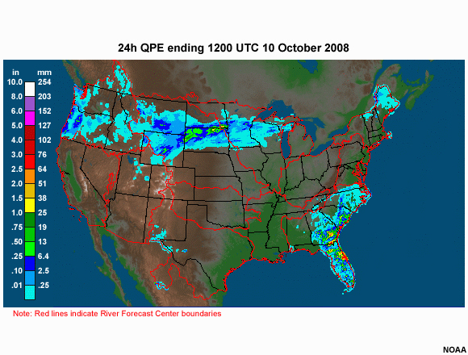
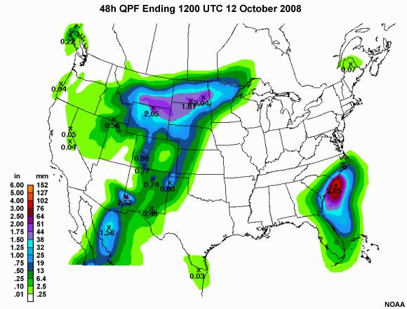
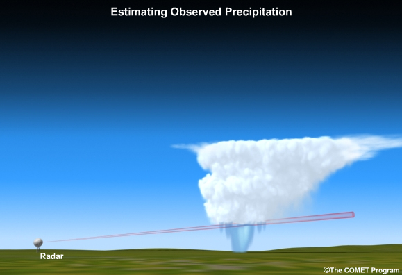
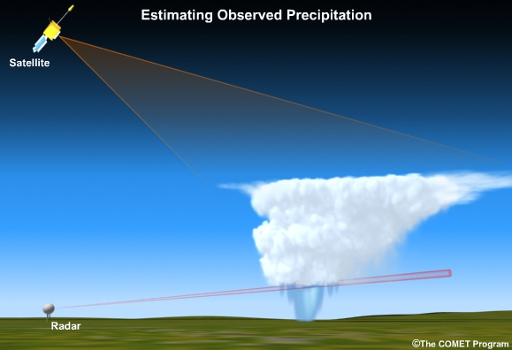
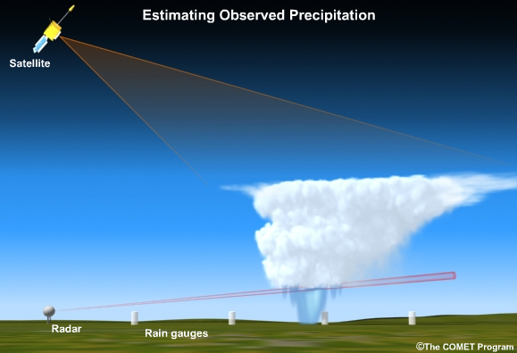
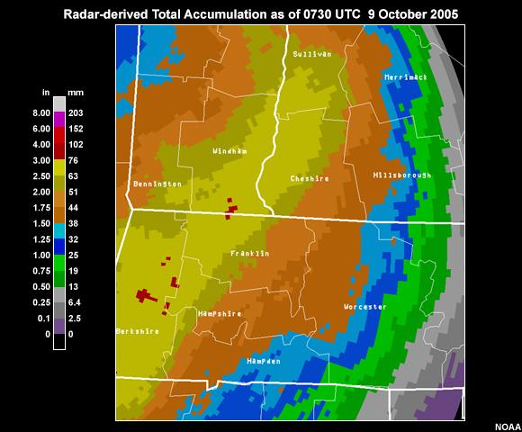
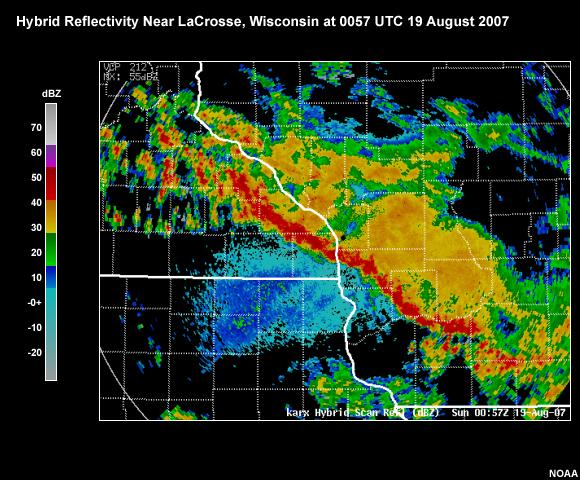


3.2.3 **Weather climatologies**
~~~~~~~~~~~~~~~~~~~~~~~~~~~~~~~~~~~~~~~~~~~~~~~~~~~~~~~~~~~~~

A weather climatology is sometimes used to augment weather-variable
estimates. These climatologies are especially useful in regions with
limited capacity for measurements or rapidly changing terrain features,
the latter causing weather-variable dependence on this topographic
variability (e.g.,sharp changes in elevation and/or nearby large
bodies of water) as well as potentially limiting the ability for direct
observation (such as in cases of radar-beam blockage as discussed in the
previous section). Some of the more commonly used climatologies (which
can include a variety of weather variables, and may have daily weather
estimates for some products) are the Parameter-elevation
Regressions on an Independent Slopes Model, or PRISM from Oregon State
(for more information on precipitation climatology guidance from PRISM
see: http://www.prism.oregonstate.edu/); Daymet daily surface weather
and climatological summaries from Oak Ridge National Laboratory
(https://daymet.ornl.gov/); gridMET from the Climatology Lab of the
University of California-Merced
(https://www.climatologylab.org/gridmet.html); and the Livneh datasets
from the University of Colorado
(https://ciresgroups.colorado.edu/livneh/data).`

|PRISM Precipitation Annual Climatology for the U.S.|

*Figure: The Parameter-elevation Regressions on an Independent Slopes
Model (PRISM) is a commonly-used precipitation climatology
tool. For more information on precipitation climatology guidance from
Parameter-elevation Regressions on an Independent Slopes Model (PRISM),
see:* http://www.prism.oregonstate.edu/\ *.*

The approach used by PRISM using gauge and terrain data is
considered the 3-dimensional (3-D) approach. This can be very useful in
terrain-affected areas (see figures below). The areas that are within
100 km of the green shading on this map are where PRISM uses the 3-D
approach for QPE. This would also include all of the Hawaiian Islands
and most of Alaska. For the white areas on this map, PRISM uses a 2-D
process. This is basically a distance-weighted gauge analysis.

|PRISM effective terrain areas|

*Figure: Effective terrain grid for the U.S. Shaded areas denote terrain features that are expected to produce significant terrain-induced (3D) precipitation patterns. Unshaded grid cells as far as 100 km away from the shaded areas may also be considered 3D; see text for discussion. Grid resolution is 2.5 minutes (~ 4 km). (Source: https://prism.oregonstate.edu/documents/pubs/2002_influenceTerrain_daly.pdf)*

Below we provide more  information on the PRISM
approach.

.. dropdown:: **PRISM**
    **Precipitation Climatology/PRISM**

    Precipitation climatology guidance can be used to help fill in the gaps where estimates of observed precipitation are poor. The most widely used precipitation climatology tool in the United States as of 2009 is the PRISM model. Prior to its use in multiple-sensor precipitation estimation (MPE), PRISM was used extensively in several River Forecast Centers in the Western United States.

    |Prism precipitation maps|

    Topics in this section include the rationale for PRISM, the use of PRISM data, and limitations of using precipitation climatology for QPE.

    **Precipitation Climatology/PRISM » PRISM**

    Developed at Oregon State University, PRISM climatology products include precipitation climatology guidance for the contiguous United States...

    |PRISM precipitation: annual climatology for the CONUS 1971-2000|

    ...the Hawaiian Islands, Puerto Rico, Guam, and...

    |PRISM Precipitation annual climatology for Hawaii|

    ...Alaska, along with portions of neighboring Canadian provinces.

    |PRISM Precipitation Annual climatology for Alaska and the Yukon|

    Products and detailed presentations about deriving those products are available for download from the PRISM group at Oregon State University: http://www.prism.oregonstate.edu/.

    PRISM precipitation climatologies are based on the historic record of measured precipitation at point locations, geographic input, especially terrain information, and in some cases, the prevailing wind direction. Streamflow discharge measurements are used to correlate basin precipitation climatology with runoff climatology and thus provide a rough validation check on the precipitation amount.

    |Gauge locations and topography of Olympic peninsula|

    Point observations are rarely sufficient to represent spatial patterns of precipitation. This is especially true in regions with sharp changes in elevation and/or nearby large bodies of water. PRISM uses the known relationships of precipitation with geographic features. An automated statistical approach is used for efficiency, but this is guided by human expertise.

    |PRISM annual precip climatology with raingauge locations for the Olympic peninsula|

    **Precipitation Climatology/PRISM » Basic Use of PRISM**

    PRISM precipitation climatology may be used for both observed precipitation (QPE) and forecast precipitation (QPF).

    Deriving QPE from PRISM precipitation climatology starts with point values, such as reading from a rain gauge. From there we derive the ratio of the point value to the PRISM value.

    |Using gauge reports and PRISM to get QPE 2|

    In this example we assume the gauge reading is 40 mm (1.57 in) and the PRISM value at that point is 20 mm (0.79 in). The ratio of 40 over 20 is 2.0. Now, we apply that ratio to other PRISM values.

    |Using gauge reports and PRISM to get QPE 3|

    This adjusts the areal precipitation estimate by the ratio of 2.0 but it preserves the gradients and the relative magnitudes that we see in the PRISM data.

    |Using gauge reports and PRISM to get QPE 4|

    Of course this process is done for numerous gauge locations using distance-weighting schemes.

    |24-hr precip accumulation from daily QC program as of 1200 UTC 23 Jan 2008|

    This approach using gauge and terrain data is considered the 3-dimensional (3-D) approach. This can be very useful in terrain-affected areas. The areas that are within 100 km of the green shading on this map are where PRISM uses the 3-D approach for QPE. This would also include all of the Hawaiian Islands and most of Alaska. In the white areas on this map, PRISM uses a 2-D process. This is basically a distance-weighted gauge analysis.

    |PRISM effective terrain areas|

    **Precipitation Climatology/PRISM » Limitations of Precipitation Climatology**

    As with any climatological data, there are limitations. Climatology averages the individual events in a dataset. Individual precipitation events may show large departures from climatology, especially in the locations of extreme and sharp gradients. However, even with these limitations, there are regions that will likely benefit somewhat from climatological tools.

    Individual events will often be closer to climatology in regions with large orographic influences.

    |Salt lake city|

    In addition, regions that tend to receive widespread, stratiform precipitation will be closer to climatology than areas dominated by convection.

    |Strat clounds rainy road with cars|

    So the western coasts of North America may be the areas that can benefit most from climatological adjustments to QPE. Keep in mind that departures from climatological norms will likely have greater impacts as one looks at smaller basins.


.. |PRISM precipitation: annual climatology for the CONUS 1971-2000| image:: media/ch3/image_obs_popout_prism1.jpg
   :width: 6.04167in
   :height: 4.58333in


3.2.4 **Reanalysis**
~~~~~~~~~~~~~~~~~~~~~~~~~~~~~~~~~

Climate reanalysis is a method used to reconstruct past climate
conditions by combining historical observational data with modern
climate models. This approach provides a comprehensive and consistent
dataset of atmospheric, oceanic, and land-surface conditions over an
extended period. The historical observational data can come from weather
stations, satellites, ships, buoys, and other sources, and typically
undergo rigorous quality control to correct errors and inconsistencies.
The climate models used are often numerical weather prediction (NWP)
models, sophisticated models that simulate the Earth's atmosphere,
oceans, and land surface based on physical laws. The integration of the
observational data into the NWP models is done through a process called
data assimilation. For a given period of interest and for a given (grid-)
location, data assimilation systems use different mathematical
methods (e.g.,4D-Var, Ensemble Kalman Filter, etc.) to combine often
unevenly spatially-distributed observations with errors in a prescribed
time-window of interest with a NWP-derived estimate constrained by
previous observations on a regularly spaced grid to obtain what is
called an optimal estimate of the state of the Earth system (i.e.
estimates of atmospheric parameters such as air temperature, pressure
and wind at different altitudes, and surface parameters such as
rainfall, soil moisture content, ocean-wave height and sea-surface
temperature, produced for all locations on earth) at the time of
interest, and its time evolution constrained by physical laws. This
combinatorial process is typically done by adjusting the NWP estimate in
a physically consistent manner so that it matches the latest
observations closely, while taking into account the relative
uncertainties in the observations and the NWP estimates (somewhat
mimicking the production of day-to-day weather forecasts, which use an
analysis of the current state of the Earth system as their starting
point).

|image8|

*Figure: A schematic of the reanalysis process. (Source: ECMWF)*

Although reanalyses have proven to be quite useful in general, they have
their limitations. Even though the reanalysis framework is consistently
applied over long time frames that can extend back several decades or
more, the one component that does vary are the sources and amount of the
raw input data due to changing global observational networks. Due to
this changing mix of observations, the reliability of the reanalysis can
vary considerably depending on the location, time frame, and variable
considered; and this changing mix, along with biases in observations and
models, can also introduce spurious variability and trends into the
output. Of particular importance to this primer, variables relating
to the hydrological cycle such as precipitation (P) and evaporation (E)
are derived quantities that are calculated from the primary variables
(or differences in the primary variables) of the NWP model, and
therefore not directly predicted by the model's governing equations,
making them especially sensitive to inaccuracies in the numerical
modeling process. As such, reanalysis-derived hydrologic cycle variables
need to be used with caution and and assessed for their physical
reasonableness. Consider the figure below (from Trenberth et al. 2011),
which compares two reanalysis products (NASA MERRA and ECMWF
ERA-Interim) and shows how E-P is of different sign between the two
products over central Africa (but noting this is an analysis from over a
decade ago)! However, we note that just as reanalysis products continue
to improve in accuracy and their ability to remove formerly known
deficiencies, some products (e.g.,ERA5) also are providing information
about uncertainty: data from areas or periods where observations
are sparser are likely to be less certain.

|image9|

*Figure: Evaporation minus Precipitation in MERRA (top) and ERA-Interim
(bottom) based on Trenberth et al. (2011). (Contributed by J Fasullo and
NCAR Climate Data Guide)*

**Further renalysis resources**

-  NCAR Climate Data Guide:
   https://climatedataguide.ucar.edu/climate-data/atmospheric-reanalysis-overview-comparison-tables

-  ECMWF reanalysis description:
   https://www.ecmwf.int/en/research/climate-reanalysis

-  ECMWF Reanalysis fact sheet:
   https://www.ecmwf.int/en/about/media-centre/focus/2023/fact-sheet-reanalysis

3.2.5 **Blending multiple sensors and data products**
~~~~~~~~~~~~~~~~~~~~~~~~~~~~~~~~~~~~~~~~~~~~~~~~~~~~~~~~

Multiple sensors and data products are often employed, especially in the
case of producing time-series of data, to compensate for deficiencies in
each product alone. As an example, over-CONUS radar and rain-gauge networks have been the primary tools for precipitation analyses,
but advances in satellite tools for precipitation analysis are showing
great promise in areas with poor coverage from radar and rain-gauge
networks, especially over Alaska. Particularly promising are tools that
merge data from different satellites.

One particular example of a blended time-series data product that
employs multiple sensors is the NOAA Analysis Of Record for Calibration
(AORC), a gridded record of near-surface weather conditions covering the
continental United States and Alaska and their hydrologically
contributing areas. Derived weather variables include hourly total
precipitation, temperature, specific humidity, terrain-level pressure,
downward longwave and shortwave radiation, and west-east and south-north
wind components, with this suite of eight variables sufficient to drive
most land-surface and hydrologic models and is used as input to the
National Water Model (NWM) retrospective simulation. As an example of
this blending process, consider that the AORC was assembled from over
a dozen individual time-series and climatological datasets, not all of
which were available through the entire period-of-record. The best
available input dataset for each of the constituent elements was used at
any given time and place. Some alternative time-series data (such as
satellite data) were used to replace the input forcings at particular
areas or used to temporally disaggregate higher-temporal resolution
data. The climatological datasets were used to bias correct the time-series data (such as PRISM [Vose et al., 2014] and Livneh [Livneh et
al., 2015] data), and were all developed based on ground-based gauge
observations.

**Further AORC details:** see Analysis of Record for Calibration:
Version 1.1, Sources, Methods, and Verification, National Weather
Service, Office of Water Prediction, Oct. 2021.

3.2.6 **Broader climate variable observation resources**
~~~~~~~~~~~~~~~~~~~~~~~~~~~~~~~~~~~~~~~~~~~~~~~~~~~~~~~~

There continues to be a broad range of remotely sensed
hydrologically-relevant data sources that continue to be made publically available
and can help offset and supplement some of the datasets mentioned above
(e.g.,GPM and SWOT), especially for regions with limited observed
coverage, and the reader is encouraged to continue to monitor the
availability of additional resources that could help with their
hydrometeorological data needs. Examples:

-  Global Precipitation Measurement: https://gpm.nasa.gov/missions/GPM

-  Surface Water and Ocean Topography Mission:
   https://swot.jpl.nasa.gov/

3.2.7 **Further Resources**
~~~~~~~~~~~~~~~~~~~~~~~~~~~~~~~~~~~~~~~~~~~~~~~~~~~~~~~~

For further resources and guidance on observational datasets, please
see:

-  the NSF NCAR Climate Data Guide: https://climatedataguide.ucar.edu/

-  IPCC AR6 WG1 Annex I Observational Products (filtered table of North
   American and water cycle focused provided below)
   https://www.ipcc.ch/report/ar6/wg1/

-  Data sources that were developed or referenced by the NOAA Technical
   Support Unit supporting the U.S. Fifth National Climate Assessment
   can be found here:

   -  NCA5 Atlas https://atlas.globalchange.gov/

   -  Global Change Information System https://data.globalchange.gov/

   -  NOAA’s nClimGrid monthly
      https://www.ncei.noaa.gov/access/metadata/landing-page/bin/iso?id=gov.noaa.ncdc:C00332

   -  NOAA’s nClimGrid daily
      https://www.ncei.noaa.gov/products/land-based-station/nclimgrid-daily

   -  NOAA’s nClimDiv climate indices
      https://www.ncei.noaa.gov/access/metadata/landing-page/bin/iso?id=gov.noaa.ncdc:C00005

-  Below we provide a list of IPCC AR6-referenced climate variable
   observational products applicable to the U.S. and North America. The
   table lists observational datasets commonly used for climate studies
   that are considered well vetted by the scientific community. The
   table documents the details of the types and versions of datasets,
   the time frame they cover, and citations and (where available) web
   links to the data. Reanalysis data products are included. Datasets
   are sorted alphabetically according to the dataset name or, if there
   is no formal name, the name of the responsible institution or lead
   author.

.. dropdown:: **Table of Observational datasets**
 
    .. csv-table:: Observational datasets
       :file: _files/Table3_1.csv  
       :header-rows: 1
   


.. |image8| image:: media/ch3/image_obs1.jpg
   :width: 6.5in
   :height: 4.33333in


.. vim: syntax=rst

3.3 Baseline natural varaiblity and detection and attribution of observed changes
------------------------------------------------------------------------------------

This section provides an introduction to ways to understand and quantify
the baseline or climate starting point of the study area of interest,
and the natural variability of the system itself, outside of its
evolution under climate change impacts, as well as how to define changes
that have already been occurring due to climate change. We start with a
brief overview of what these different types of variability are, where
they have already been observed, then discuss methods that can be more
generally applied to a particular region to discern these different
types of variability.

As background, the pop-out below provides background information on the
Earth’s energy balance, the factors that influence it, and thus lead to
climate variability and change.

.. dropdown:: Earth’s energy balance and the greenhouse effect

    **Earth’s Energy Balance and the Greenhouse Effect**
    ~~~~~~~~~~~~~~~~~~~~~~~~~~~~~~~~~~~~~~~~~~~~~~~~~~~~

    |still|

    The Earth is in a delicate equilibrium of solar energy (mainly shortwave
    ultraviolet) coming in and longwave energy (mainly infrared) going out.
    Slight alterations to this balance impact weather and climate. These can
    be caused by the natural cycles of climate variability, such as volcanic
    eruptions, that temporarily reduce the amount of solar energy reaching
    the Earth’s surface, thus disrupting the energy balance.

    |Volcanic eruption|

    Small changes to the balance of energy between the Sun and Earth are
    driving recent trends in global temperature.

    The diagram below of the energy cycle shows the amount of energy, in
    Watts per square meter, that comes into the Earth-atmosphere-ocean
    system, stays within it, and leaves. Notice that about one third of the
    342 W/m2 of solar energy (the yellow arrows) is reflected back to space
    by the atmosphere or surface, while about two thirds is absorbed. As
    we’ve seen, the magnitude of solar energy reflected by aerosols
    sometimes increases temporarily after major volcanic eruptions, leading
    to temporary decreases in solar energy reaching Earth’s surface.

    On the right side of the diagram, the red arrows show the amount of
    terrestrial energy (mainly infrared) emitted by the Earth’s surface and
    atmosphere. Some is radiated back to space. But due to the presence of
    greenhouse gases, carbon dioxide, and water vapor in particular, a
    significant portion is absorbed by the atmosphere and re-radiated back
    to Earth. The “Back Radiation” portion of the diagram shows the heat
    energy radiated from the atmosphere to the surface. This is the
    **Greenhouse Effect**. Without naturally occurring greenhouse gases, the
    Earth would be an inhospitably cold and frozen planet.

    |The Earth-Sun Energy Balance|

The pop-out below provides introductory information on
natural climate variability versus anthropogenic climate change examples
for streamflow, CO2 emissions, and global temperature anomalies.

.. dropdown:: Introductory information

    **Natural Climate Variability versus Climate Change**
    ~~~~~~~~~~~~~~~~~~~~~~~~~~~~~~~~~~~~~~~~~~~~~~~~~~~~~

    |Ice core from Antarctica|

    Scientists have explored past global temperature trends using proxy
    data—tree rings, ice cores, etc.—that show the Earth has had numerous
    and somewhat irregular swings in temperature over the past several
    hundred thousand years. Those swings in temperature contribute to
    variations in other natural phenomena such as streamflow.

    |Map of Colorado River Basin.|

    To take one example, tree ring analysis can be used to reconstruct
    streamflow in the rivers of the western United States. This has been
    done for rivers such as the Colorado River at Lee's Ferry, in the state
    of Arizona.

    |A reconstruction of streamflow for the Colorado River at Lees Ferry
    based on tree ring data.|

    The reconstructed streamflow shows large swings in annual streamflow
    volume on the Colorado River. Multi-year periods of wet and dry can be
    seen in the 25-year running mean of the annual streamflow.

    |Graph of temperatures and CO2 concentrations for the past 800,000
    years|

    Ice cores, on the other hand, can provide a depiction of changes in
    global temperature and CO\ :sub:`2` levels over the past several hundred
    thousand years. This graphic shows that warmer periods coincide with
    higher levels of CO\ :sub:`2`.

    Carbon dioxide levels have naturally fluctuated between 180 parts per
    million (ppm) and 280 ppm. This is an example of a naturally occurring
    climate forcing. Human industrialization has been a major source of the
    increase in CO\ :sub:`2` in the most recent century, with average annual
    concentrations exceeding 420 ppm in 2024. This is an example of
    anthropogenic forcing. We can see how carbon dioxide concentration has
    continued to rise over the last decade, as seen in the black line in the
    figure below.

    |Red line shows annual fluctuation in CO2 Concentration from 2012-2016.
    Black line shows the smoothed upward trend.|

    Trajectories of past global mean temperatures have been estimated using
    experiments conducted with Atmosphere-Ocean General Circulation Models
    (AOGCMs). Experiments that do not incorporate anthropogenic forcing
    produce the trajectory shown with the blue line and the light blue
    uncertainty bounds in the figure below.

    The black line shows the observed global mean temperatures. You can see
    that the experiments that do not include anthropogenic forcings fail to
    reproduce the warming that has been observed over the past half century.

    Experiments were also run that do include anthropogenic forcings. This
    trajectory is shown with the red line and pink uncertainty bounds. You
    can see that when anthropogenic forcings are included, the global
    climate models do produce results that very closely match the observed
    warming trends. This suggests that anthropogenic factors have emerged as
    a significant contributor to global warming.

    |Models of 20th century climate run with and without anthropogenic
    greenhouse gases|

**Climate variability**
^^^^^^^^^^^^^^^^^^^^^^^^^^^^^^^^^^^^^^^^^^^^^^^^^^^^^^^^^^^^^^

When accounting for climate change impacts on research in water and
environmental studies, it is important to differentiate between climate
variability, for which the past can be a guide, and climate change,
where the past is not necessarily a good predictor as climate change
involves changes to this natural variability. Starting off this section,
we will review some of the natural climate cycles and occurrences.

.. dropdown:: Regular climate cycle

    **Regular Climate Cycle**
    ~~~~~~~~~~~~~~~~~~~~~~~~~

    |image1|

    The most regular climate cycle is the change of seasons. The seasons
    determine the times of year when precipitation may be most abundant,
    evapotranspiration will peak, tropical cyclones are most likely to form,
    and snowpack accumulates and melts. Although the change of seasons is
    very dependable, there is often year-to-year variation.

    |before|\ |after|

    To illustrate natural season-to-season variability, here we see
    differences in snowpack on the first of April in two consecutive years.
    The 2011 analysis shows large areas with above average snowpack in the
    central Rocky Mountain region and California Sierra Nevada Range in the
    United States. In 2012, these same areas had abnormally low snowpack,
    reflecting a less productive snow season. Good research planning allows
    for such variation. But will the expected range of snowpack change as
    the climate warms?

When speaking of climate change, we are referring to changes in average
weather conditions that persist over multiple decades or longer. Climate
change encompasses both increases and decreases in temperature, as well
as shifts in precipitation, changes in frequency and location of severe
weather events, and changes to other features of the climate system.The
principal natural drivers of climate change (which are also termed
external natural forcings), include changes in incoming solar radiation
(through solar cycles), volc:mark:`anic activity, orbital cycles, and
changes in global biogeochemical cycles.`

.. dropdown:: Irregular climate impacts

    **Irregular Climate Impacts**
    ~~~~~~~~~~~~~~~~~~~~~~~~~~~~~

    |Time series, observed, (1880-2000) of Global Temperature Change
    Relative to 1870-1899 Baseline with Five Major Volcanoes Indicated|

    Major volcanic eruptions are irregular natural climate events. In this
    global temperature time series, we can see how the sun-shielding
    properties of atmospheric aerosols from volcanic eruptions result in
    decreased global average temperatures. Notice how Mt. Pinatubo’s 1991
    eruption decreased global average temperatures for 1-2 years.

.. dropdown:: Very long-term climate variability

    **Very Long-term Climate Variability**
    ~~~~~~~~~~~~~~~~~~~~~~~~~~~~~~~~~~~~~~

    There are much longer climate variability cycles associated with changes
    in the Earth’s orbital eccentricity and its tilt with respect to the
    Sun.

    |Graphic showing Milankovitch cycles|

    These cycles, known as the Milankovitch Cycles, lead to big changes in
    the amount and distribution of solar energy on the Earth’s surface. The
    global temperature during these long-duration cycles ranges from being
    much colder (the ice ages) to much warmer than the current global
    average temperature.

    |Graph of temperatures and CO2 concentrations for the past 800,000
    years|

    Milankovitch Cycles unfold on timescales much longer than a human life
    span, from tens to hundreds of thousands of years. The rate of change
    associated with the Milankovitch Cycles is so slow that it will not
    impact water research planning for the next century or so.

Major anthropogenic drivers include atmospheric aerosols (fine
solid particles or liquid droplets), land-use change, and CO2 and
non-CO2 greenhouse gasses. The natural and anthropogenic drivers taken
together make up what are called climate forcings.

.. dropdown:: Climate forcings

    **Climate Forcings**
    ~~~~~~~~~~~~~~~~~~~~

    In this pop-out, we will examine how a number of forcings (both
    natural and anthropogenic) have influenced the energy balance between
    the Earth and Sun from 1880 to 2014, determining if each forcing has had
    a warming effect (in which case the forcing goes above the zero change
    line) or a cooling effect (in which case the forcing goes below the zero
    change line).

    **Natural Factors**
    ~~~~~~~~~~~~~~~~~~~

    Solar irradiance leads to some cyclic warming, but has a very small
    magnitude.

    |Exploring the Impact of Climate Forcings on Global Energy Balance|

    Volcanic eruptions have a notable cooling impact due to increased
    atmospheric albedo triggered by reflective volcanic aerosols. The
    cooling from volcanoes in the period examined was temporary, never
    lasting more than a few years. And, they had no real impact on the
    long-term trend.

    |image2|

     What effect does a typical large volcano have on carbon dioxide
    concentration compared to the effect from human activity? The diagram
    shows that in a typical year, the CO2 emissions from anthropogenic
    sources is 135 times greater than those from volcanoes, with some
    studies showing even greater differences. Even the 1991 eruption of Mt
    Pinatubo put roughly 1/500th of the 2010 emissions from anthropogenic
    activity into the atmosphere.

    |Comparison of the typical annual CO2 output from global volcanic
    activity versus human activity.|

    **Land Use**
    ~~~~~~~~~~~~~~~~~~~~

    Now we'll look at the Land Use Forcings. What impact does land
    use have on the solar energy absorbed at the Earth’s surface?

    |image3|

    Land use leads to very small decreases in the energy absorbed at
    the surface, or small amounts of cooling. That’s because replacing
    forests with agricultural or urban land tends to increase the surface
    albedo and reflect more solar energy back to space.

    **Climate Forcings – What is Albedo**
    ~~~~~~~~~~~~~~~~~~~~~~~~~~~~~~~~~~~~~

    |California/Nevada January Snowcover Comparison: 2013 versus 2014|

    Albedo is a measure of how well a surface can reflect solar energy.
    Reflective surfaces, like snow, ice, and clouds, have high albedo and
    are efficient at reflecting solar energy back to space. In the satellite
    images centered on the Sierra Nevada, snow and clouds have very high
    albedo and appear white. You can see that there may be large
    year-to-year differences in snow cover and thus the albedo. Even desert
    sands have high albedo and show up as relatively bright in this visible
    satellite imagery.

    Dark colored surfaces have low albedo and absorb solar energy. This
    impacts the solar energy absorbed by Earth. Forest areas appear dark on
    visible satellite images, and are more efficient at absorbing solar
    energy. Bodies of water appear very dark and have very low albedos.

    **Anthropogenic Aerosols`**
    ~~~~~~~~~~~~~~~~~~~~~~~~~~~~~~~~~~

    Now we’ll look at the impact of Anthropogenic Aerosols (those
    resulting from human activity). What kind of impacts are related to
    anthropogenic aerosols?

    |image4|

    Anthropogenic aerosols have both warming and cooling impacts.
    That's because different aerosols have opposite effects on albedo. Dark
    particulates, such as black carbon, decrease albedo and increase
    absorption of solar energy, resulting in a warming effect. This occurs
    in the atmosphere as a whole, but also when black carbon settles out on
    otherwise reflective surfaces, such as snow and ice.`

    |image5|

    Other aerosols in the atmosphere are reflective and increase atmospheric albedo. This can occur from the aerosols themselves reflecting sunlight back to space, 
    or from aerosol enhancement of cloud development (an indirect effect). Cloud tops have high albedo and reflect solar energy back to space.

    What has the overall impact of anthropogenic aerosols been?

    |image6|

    The reflective anthropogenic aerosols dominate and thus the
    impact of all anthropogenic aerosols leads to climate cooling.

    **Greenhouse Gases**
    ~~~~~~~~~~~~~~~~~~~~~~~~~~~~

    Now we’ll look at the impact of Greenhouse Gases. All of the
    greenhouse gases result in a warming trend. Well-mixed gases, such as
    carbon dioxide, methane, and nitrous oxide, have the greatest impact,
    and this impact is increasing with time.

    |image7|

    The magnitude of the warming from greenhouse gas forcing is
    greater than the notable cooling effect from reflective aerosols.

    **All Forcings**
    ~~~~~~~~~~~~~~~~~~~~~~~~

     Now we’ll look at all forcings combined.

    |image8|

    When all variables are included in one time series, the trend
    induced by greenhouse gas forcing is clear. Net climate forcing has
    increased by 1 to 2 Watts per square meter since pre-industrial times,
    leading to the warming of the Earth by 1ºC (1.8ºF) through 2015. The
    warming effect induced by greenhouse gases has been tempered by the
    overall cooling effect of anthropogenic aerosols, and occasional
    short-duration cooling from volcanic aerosols.

    **Climate Change and Climate Forcings**
    ~~~~~~~~~~~~~~~~~~~~~~~~~~~~~~~~~~~~~~~~~~~~~~~

    As we’ve seen, anthropogenic climate forcings result in a steady
    trend in global warming, with short-term variations caused by natural
    factors. Anthropogenic forcings have led to both global cooling (from
    reflective aerosols) and warming (from greenhouse gases) but the warming
    dominates over periods of multiple decades or longer.

    |Time series, observed and projected, (1880-2099) of Global Temperature
    Change Relative to 1870-1899 Baseline|

    By the middle part of the 21st century, even the cooling impact
    from notable volcanoes like Krakatau and Pinatubo won’t be able to
    temporarily cool the average global temperature to average 20th-century
    levels according to climate model projections.

    |Graph of temperatures and CO2 concentrations for the past 800,000
    years|

    When viewed in the context of Earth's average temperature over
    hundreds of thousands of years, the current warming is on par with some
    past epochs. But the increase in carbon dioxide, the most abundant
    anthropogenic greenhouse gas, is much greater than in past warm periods.
    This suggests that our very rapid warming--and it is very rapid on the
    geologic time scale--is just beginning. This greenhouse gas-induced
    warming is likely to dwarf the cooling factors as we move through the
    21st century.

The pop-out below discusses how the components of the energy cycle are
expected to change over the next few decades based on anthropogenic
changes to specific forcings.

.. dropdown:: Climate forcings impact on energy balance

    **Climate Forcings Impact on Energy Balance**
    ~~~~~~~~~~~~~~~~~~~~~~~~~~~~~~~~~~~~~~~~~~~~~

    In this pop-out we discuss how the components of the energy cycle are
    expected to change over the next few decades based on anthropogenic
    changes to specific forcings (discussed in previous pop-outs), while
    assuming continued emissions of greenhouse gases:

    |The Earth-Sun Energy Balance, annotated for an exercise|

    -  Incoming solar radiation (1) should stay the same over the time
       period of decades.

    -  Total reflected solar radiation from Earth (2 and 4) is uncertain.
       Increases in reflected solar energy are likely given that reflective
       aerosols and/or cloud cover continue to increase. But the uncertainty
       is because surface albedo should decrease with the continued loss of
       snow and ice.

    -  The amount of solar energy absorbed at the ground is uncertain. Of 
       the solar radiation that reaches the surface, a greater proportion is
       likely to be absorbed (3) due to the continued loss of snow and ice,
       but increases in reflective aerosols and clouds could reduce the
       amount of solar energy reaching the ground.

    -  As the global land and ocean surfaces (5) continue to warm on
       average, the radiative energy from the surface should continue to
       increase.

    -  Increasing greenhouse gases (6) will likely increase the amount of
       terrestrial radiation that is radiated back to the surface.

    -  The longwave radiation leaving the Earth (7) should decrease because
       more is being trapped by the atmosphere.

    -  It is important to note that the answers for all of the longwave
       fluxes could be different if rapid emissions reduction occurs.

In addition to these secular changes to the climate, there is
also variability that originates from natural processes within the
coupled ocean-atmosphere-cryosphere-land-biosphere system that is
generally termed internally generated variability, arising primarily
from the uneven distribution of energy across the planet at any given
time (Lehner and Deser, 2023). A primary source of internal variability
is the atmospheric general circulation with its day-to-day and
week-to-week weather fluctuations with limits to their predictability
past a couple of weeks, and can be termed random- or stochastic
processes past those limits. In general, the climate system is highly
variable at regional scales, and that such internally-generated
variability is irregular in time and carries limited predictability.
Processes arising from the coupling between the ocean and atmosphere are
also important sources of internally generated variability that give
rise to distinctive patterns (or “modes”) of variability on interannual
and longer timescales (Deser and Phillips, 2023). Examples include the
interannual events of El Niño Southern Oscillation (ENSO); and the
Pacific Decadal Oscillation (PDO) and the Atlantic Multidecadal
Oscillation (AMO) patterns which can influence regional climate
conditions, such as droughts or cooling periods. It is a central
scientific challenge to identify anthropogenic influences on weather and
climate amidst this background of internal variability (Deser et al.,
2020).

.. dropdown:: Semiregular climate cycles`

    **Semiregular Climate Cycles**
    ~~~~~~~~~~~~~~~~~~~~~~~~~~~~~~

    Recurring, but less regular, climate cycles often have a large influence
    on how the seasonal climate variations play out.

    A well known, semi-regular climate cycle is associated with the El Niño
    Southern Oscillation (ENSO). ENSO can have a significant impact on
    precipitation and temperature in many regions of the world in a cycle
    that recurs roughly every 3-4 years.

    In the contiguous United States, the ENSO cycle can have large
    influences on precipitation distribution, especially in the cool season.

    Below we see the typical impacts of El Niño versus La Niña on both the
    sea surface temperature anomalies of the tropical Pacific Ocean, and the
    November through March precipitation in the contiguous United States.
    The difference can be very important for snowpack and the potential for
    regional floods and drought. There are differences from one cycle to the
    next, but these composite maps provide guidance based on historic data.
    Note that La Niña typically results in a drier winter across a broader
    area than El Niño.

    |image9|

    |image10|

    Like ENSO, there are other natural atmospheric and oceanic cycles that
    have regional impacts on precipitation and temperature, including the
    Pacific Decadal Oscillation (PDO), as seen below. And like ENSO, local
    research planning typically considers the range of variations that these
    cycles cause.

    |(a) Typical wintertime SST (colors), sea level pressure (contours), and
    surface windstress (arrows) anomaly during warm and cool phases of PDO.
    (b) Monthly PDO index from 1925 to Sep 2006|

Natural climate variability can temporarily obscure or intensify
anthropogenic climate change on decadal time scales, especially in
regions with large internal interannual-to-decadal variability. Both the
rate of long-term change and the amplitude of interannual (year-to-year)
variability differ between global, regional and local scales, between
regions and across climate variables, thus influencing when changes
become apparent. As an example, tropical regions have experienced less
warming than most others, but also exhibit smaller interannual
variations in temperature. Accordingly, the signal of change is more
apparent in tropical regions than in regions with greater warming but
larger interannual variations (IPCC WG1).

The relative influence of natural and anthropogenic-induced
variability is also dependent on the spatial scale of the system being
examined. In general, the signs of climate change are unequivocal at the
global scale but are more difficult to discern on smaller spatial
scales. Discernible changes also depend on the climate variable. For
example, changes in average rainfall are becoming clear in some regions,
but not in others, mainly because natural year-to-year variations in
precipitation tend to be large relative to the magnitude of the
long-term trends.

The case study in the pop-out below of surface temperature
changes over time provides a visualization of natural variability and
its sensitivity to spatial- and temporal-scales, along with sensitivity
and detection of secular anomalies and trends.

.. dropdown:: Natural variability case study

    **Natural Variability Case Study**
    ~~~~~~~~~~~~~~~~~~~~~~~~~~~~~~~~~~

    This case study provides a visual sense for the natural variability in long-term temperature trends across time-scales and
    spatial-scales, and the discernment of significant changes outside of
    this natural variability. Shown in the two figures below are the surface
    temperature trends since 1880 comparing the observed temperature record
    of two domains: 1) “Global: Land + Ocean” (first figure) and, 2)
    “Global: Land Only” (second figure). The blue line in the graph depicts
    the global mean annual temperature anomalies from 1880 to 2014. An
    “anomaly” is simply the departure of a temperature from a baseline, in
    this case the average temperature. For example, if the average
    temperature for today is 15°C but the actual temperature is 18°C, then
    the temperature anomaly is +3°C. If the actual temperature was 12°C,
    then the anomaly would be -3°C. In these two times series, the anomalies
    are based on the 30-year average from 1951-1980. Therefore, the
    anomalies show the departure of each average annual temperature from
    that 30-year average. The red line represents the trend for the entire
    1880-2014 period. You can see year-to-year variability in the anomalies,
    as well as variability on the decadal time scale.

    |image11|

    |image12|

    The overall warming trend (red line) for “Global: Land Only” is a
    bit steeper than “Global: Land + Ocean”. The “Land Only” trend shows
    more than a +0.5°C departure from the mean by 2014, while the "Land +
    Ocean” trend shows a little less than a +0.5°C departure. Due to the
    oceans' ability to store heat, the global warming trend is a bit slower
    when they are included. This, then, also highlights the dependence of
    land temperature variability on its proximity to large water bodies.

    Below we highlight the dependence on the variability to (smaller)
    spatial scale, showing the trend for the Contiguous United States.

    |image13|

    The “Contiguous United States” trend shows a little less rapid
    warming than the “Global: Land Only" areas, but the year-to-year
    variability is much greater. Generally, the variability will continue to
    increase as the spatial domain covered decreases. The 48 contiguous
    states make up only 1.6% of the global surface and are not, by
    themselves, a good measure of global trends.

    Next we focus on the dependence of trend on time period, and
    again examine the “Global: Land + Ocean” domain (shown below). If we
    were to fit 10-year trend lines over differing periods of this record,
    one would find 10-year periods with upward, downward, and no trend in
    temperature. For example, the decade of 1941-1950 shows distinct
    cooling, while the overlapping decade of 1933-1942 shows very distinct
    warming. Since the mid-20th century, 10-year temperature trends are
    mainly warming, although there are flat periods as well as year-to-year
    variation (noting that the last 10-year period shown in the graph below,
    2005-2014, has no trend but is warmer than every other 10-year period in
    the 20th century). Internal variability drivers are the predominant
    mechanisms for this year-by-year, decadal-by-decadal trend variability
    and the motivation to “smooth over” this variability is one reason why
    both the World Meteorological Organization (WMO) and the National
    Oceanic and Atmospheric Administration (NOAA) represent 30 years as the
    period of time used to define a climate station’s “climate normals”.
    Note that one of the “climate normal” periods is shown below covering
    1938-1967.

    |image14|

    Interestingly, during this 30-year period (1938-1967) the global
    surface temperature actually decreased by about 0.1°C, and was caused by
    the backscattering to space of sulfate particles from the increased
    burning of fossil fuels, and was thus a cooling anthropogenic climate
    driver. However, this trend stopped once the United States and other
    countries began to lower sulfur emissions in the 1970s to reduce acid
    rain and respiratory illnesses (since 1975, the average global
    temperature has risen by about 0.15-0.2°C per decade). This observed
    cooling effect is one reason why the injection of sulfate aerosols into
    the upper atmosphere is actively being considered as one mechanism of
    geoengineering to limit global warming.

**Detection and Attribution**

Detection and Attribution is a complex scientific discipline, so below
we provide only an overview of this field along with some of the more
common detection and attribution approaches, and refer the reader to the
following resources for more detailed information (the latter three from
which we draw much of the material presented below):

-  The International Detection and Attribution Group (IDAG;
   http://www.image.ucar.edu/idag/ and
   http://www.clivar.org/clivar-panels/etccdi/idag/international-detection-attribution-group-idag),
   an international group of scientists who have collaborated since 1995
   on assessing and reducing uncertainties in the estimates of climate
   change.

-  Contribution of Working Group I to the Sixth Assessment Report of the
   Intergovernmental Panel on Climate Change (IPCC, 2021), Chapter 1
   (Chen et al., 2021), Chapter 3 (Eyring et al., 2021), Chapter 10
   (Doblas-Reyes et al., 2021), and Chapter 11 (Seneviratne et al.,
   2021).

-  The Fourth National Climate Assessment Volume I (USGCRP, 2017),
   Chapter 3 (Knutson et al., 2017) and Appendix C (Knutson, 2017).

-  The National Academies of Sciences, Engineering, and Medicine. 2016.
   Attribution of Extreme Weather Events in the Context of Climate
   Change (NAS, 2016)

*Detection –* Detection and attribution are two important concepts in
the field of climate science, particularly when studying climate change.
Detection refers to the process of demonstrating that some aspect of
climate has changed in some statistical sense, without providing a
reason for that change. It is about identifying a significant change in
the climate system (temperature, precipitation, wind patterns, shifts in
seasonal cycles, etc.) that is above and beyond the natural internal
variability of the system. Detection does not imply understanding the
cause of changes; it's about observing (or making a determination beyond
a level of significance) that a change has occurred, and provides the
basis for attributing these changes to specific causes, such as human
activities. Because of the presence of natural variability and other
noise in the data under study, distinguishing a climate-change induced
signal is more often a statistical process (e.g. a detectable observed
change is one which is determined to be highly unlikely to occur – say,
less than about a 10% chance – due to internal variability alone).

The popout below provides an overview of the changes in climate variable
statistical distributions that could result from climate change. In
context of detection, there are a variety of statistical tests that can
be used to test the significance of differences between distributions
(e.g. the Kolmorgorav-Smirnov two sample test that two data samples come
from the same distribution; NIST, 2023; Chakravart et al., 1967; Press
et al., 1992).

.. dropdown::  Climate change and extremes

    **Climate Change and Extremes**
    ~~~~~~~~~~~~~~~~~~~~~~~~~~~~~~~

    Just as changes in annual and seasonal mean temperature and
    precipitation are very important to water research and resources,
    depending on the particular focus of the planning, changes in short
    duration extremes can be very important too. Extremes can have direct
    impacts on habitat, and pose risks to infrastructure. It is important to
    get a sense for what extremes represent from a statistical standpoint.
    Extreme weather is a bit relative. For example, a hot day in
    Wyoming would be considered a mild one in Arizona. And we don't
    generally notice changes in climate because most weather falls within
    the range of what is expected. It is mainly the extreme events that get
    our attention—events that are outside our normal experience and that
    often inflict human suffering. So how might global warming affect
    climate extremes and extreme weather? There are several possible ways.

    Temperature at a given location can be roughly represented with a bell
    curve or a normal distribution, similar to the top panel in the figure
    below, with the majority of the observations in the middle, hot
    and cold events in the tails of the curve, but with rare events
    of extremely cold or extremely warm temperatures at the ends.
    Global warming could shift the distribution to the right when
    the average temperature increases. Temperatures that used to be
    unusually high become more common, while heat levels not reached before
    become more probable. Cold extremes still occur, but become less common.
    Although not shown here, a:mark:`nother possibility is that climate
    change increases the variance (or width) in the distribution of
    temperature—in other words, it increases the range of possibilities at
    both ends of the distribution. Or climate change could result in a
    combination of the two types of distributions. We don't *a priori* know
    exactly how the distributions of weather variables in each specific
    location will be impacted.

    |Graphic depicting how a warmer climate affects extremes in temperature
    and precipitation|

    Precipitation curves have only one tail for the extreme precipitation
    events, as shown in the bottom panel of the figure above (with
    the two-parameter gamma traditionally used; Ye et al., 2018). In a
    warmer climate with more atmospheric water vapor, generally, more
    intense precipitation events become more common. Recent observations
    back this up, with high-end precipitation events becoming less rare than
    they have been, in general.

*Attribution –* On the other hand, attribution deals with determining
the most likely causes for those detected changes in the climate. This
involves assessing the various natural and anthropogenic (human-induced)
factors that could have led to the observed changes, with these often
complex, interacting factors that can range in scales from molecular to
global, seconds to millennia. Attribution studies can use statistical
tests as well as climate models, to evaluate the relative contributions
of various causes to climate change (along with an assignment of
statistical confidence), like greenhouse gas emissions, solar radiation,
and volcanic activity, with the latter (coupled climate models) being an
especially powerful tool with potential to turn on and off factors in
controlled numerical simulations of the areas and events of interest. A
supporting concept is the idea of emergence of a climate change signal
or trend, referring to when a change in climate (the ‘signal’) becomes
larger than the amplitude of natural or internal variations (defining
the ‘noise’) (AR6). This concept is often expressed as a
‘signal-to-noise’ ratio (S/N) and emergence occurs at a defined
threshold of this ratio (e.g., S/N >1 or 2) (Chen et al., 2021).

*Elements of a Detection and Attribution Study –* The AR6 Cross-Working
Group Box on Attribution (Hope et al., 2021) provides a brief discussion
and figure (reproduced below), on *Steps towards an attribution
assessment*; and a similar discussion on four core elements to any
detection and attribution study is also provided in AR5 WG1 (Bindoff et
al., 2013: *10.2.1 The Context of Detection and Attribution*). Taken
together the following general steps are identified: a) the unambiguous
framing of what changes are being attributed to; b) clearly define the
indicators of the observed change or event, including observations of
one or more climate variables, such as surface temperature, that are
understood, on physical grounds, to be relevant to the process in
question, and note the quality of the observations; c) the
identification of the possible and plausible drivers of change,
including an estimate of how external drivers of climate change have
evolved before and during the period under investigation, including both
the driver whose influence is being investigated (such as rising
greenhouse gas levels) and potential confounding influences (such as
solar activity); d) the development of a hypothesis or theory for the
linkage with a quantitative physically based understanding, normally
encapsulated in a model, of how these external drivers are thought to
have affected these observed climate variables; e) and a system or
method to test the hypothesis or theory, typically including an
estimate, often but not always derived from a physically based model, of
the characteristics of variability expected in these observed climate
variables due to random, quasi-periodic and chaotic fluctuations
generated in the climate system that are not due to externally driven
climate change.

|image15|

*Figure: Cross-Working Group Box: Attribution, Figure 1 \|
Schematic of the steps to develop an attribution assessment, and the
purposes of such assessments. Methods and systems used to test the
attribution hypothesis or theory include: model-based fingerprinting;
other model-based methods; evidence-based fingerprinting; process-based
approaches; empirical or decomposition methods; and the use of multiple
lines of evidence. Many of the methods are based on the comparison of
the observed state of a system to a hypothetical counterfactual world
that does not include the driver of interest to help estimate the causes
of the observed response.*

*Attribution Methods –* Concerning the attribution methods or system to
test the hypothesis or theory, Bindoff et al. (2013) highlight that the
attribution of observed changes is not possible without some kind of
model of the relationship between external climate drivers and
observable variables given that we cannot observe a world in which
either anthropogenic or natural forcing is absent. Such models may be
very simple (e.g. a set of statistical assumptions) or very complex
(e.g. coupled Earth System Model), and that it is not necessary (or
possible) for them to be correct in all respects, but they must provide
a physically consistent representation of processes and scales relevant
to the attribution problem in question.

Some of the most powerful tools in the attribution process are models of
the system of interest that use “what if” approaches to isolate the
impacts of anthropogenic (and other) factors that are hypothesized to be
driving the changes in the observed record. It is to be noted with very
high confidence (IPCC, 2021) that the CMIP6 model ensemble reproduces
the observed historical global surface temperature trend and variability
with biases small enough to support detection and attribution of
human-induced warming (Eyring, et al., 2021), and that CMIP6 also
includes an extensive set of idealized and single forcing experiments
for attribution (Eyring et al., 2016; Gillett et al., 2016), but with
the important caveat that numerical models, however complex, cannot be a
perfect representation of the real world, and their use requires
considering the limitations of each model simulation (see 1.5.4 in Chen
et al., 2021). The figure below highlights an earlier effort that used
the “what if” approach on a global scale, where the impacts of
anthropogenic forcings are isolated through the use of NCAR’s coupled
Earth System Model. Trajectories of past global mean temperatures have
been estimated using experiments that do not incorporate anthropogenic
forcing produce the trajectory shown with the blue line and the light
blue uncertainty bounds. The black line shows the observed global mean
temperatures. You can see that the experiments that do not include
anthropogenic forcings fail to reproduce the warming that has been
observed over the past half century. Experiments were also run that do
include anthropogenic forcings. This trajectory is shown with the red
line and pink uncertainty bounds. You can see that when anthropogenic
forcings are included, the global climate models do produce results that
very closely match the observed warming trends. This suggests that
anthropogenic factors have emerged as a significant contributor to
global warming.

|image16|

A more recent approach in climate modeling for detection and attribution
is to run a "Large Ensemble" of historical (and future) simulations,
where each member of the ensemble is subject to natural+anthropogenic
external forcings, but starts from a slightly different initial
condition, which results in a different trajectory of internal
variability once the memory of the initial state is lost. One can
estimate the forced component from the ensemble-average at any point in
time, since the internal component is randomly phased across the
different members of the ensemble. The figure below (Deser et al., 2020)
illustrates how the random phasing of internal variability of 60-year
trends over North America can obscure the forced trend at any given
location. Note the regional differences in the spatial patterns of the
trends over this time period (comparing the coldest and warmest ensemble
members for the same model on the bottom row); and by extension, how
much greater the natural variability is at these smaller spatial scales.
Such Large Ensembles, then, provide context for interpreting observed
trends. In this context, the actual observed trajectory can be
considered as one realization of many possible alternative worlds that
experienced different weather. This can also be demonstrated by the
construction of ‘observation-based large ensembles’, which are alternate
possible realizations of historical observations that retain the
statistical properties of observed regional weather (e.g., McKinnon and
Deser, 2018; Chen, et al., 2021). Referring back to the concept of
signal-to-noise and to the second panel of the figure, the ratio of the
mean shift from zero of the distributions (forced signal) compared to
(some metric of) their spread (internal variability “noise”) provides a
degree of the emergence in the anthropogenically-forced North America
heating trend.

|image17|

*Figure: The distribution of 60-yr annual temperature trends
(1951–2010) over North America (24–72° N, 180–62° W) from seven ESM LEs
(thin curves), 40 different CMIP5 models (grey shading), and
observations (Berkeley Earth Surface Temperature; vertical black line).
The maps show the associated patterns of temperature trends: top row,
observed and the forced component (estimated by the ensemble mean) from
two LEs (CESM1 in green and MPI in purple); bottom row, individual
ensemble members from CESM1 (green) and MPI (purple) with the weakest
(‘coldest’) and strongest (‘warmest’) trends. Note that the individual
member maps show the total (forced-plus-internal) trends in the model
LEs. Observed trends are analogous to an individual ensemble member in
that they reflect forced and internal contributions. From: Deser et al.,
2020, Nat. Clim. Chang., 10, 277-286, doi:10.1038/s41558-020-0731-2,
Copyright 2020 Nature Climate Change.*

Generally, attribution methods are grouped into two categories:
*Attribution of observed climate change to anthropogenic forcing* and
*Attribution of weather and climate events to anthropogenic forcing*, as
will the discussion that follows. Because the focus of this primer is on
climate change impacts on North America water studies, the focus in what
follows will be on regional approaches to this topic, referencing
Doblas-Reyes, et al. (2021) for the discussion of *Attribution of
observed climate change to anthropogenic forcing*, referencing
Seneviratne et al. (2021) for *Attribution of weather and climate events
to anthropogenic forcing*, and we refer the reader to Eyring et al.
(2021) for a discussion of the methods used for global-scale studies.

*Attribution Methods: Attribution of observed climate change to
anthropogenic forcing –* Here, regional-scale attribution is the process
of evaluating the relative contributions of multiple causal factors (or
drivers) to regional climate change. Specific regional conditions and
responses may simplify or complicate attribution on those scales. In
general, regional climate variations are larger than the global mean
climate, adding additional uncertainty to attribution. In contrast with
global-scale attribution methods where internal variability might be
considered as a noise problem, the preliminary detection step is not
always required to perform regional-scale attribution since causal
factors of regional climate change may also include internal modes of
variability in addition to external natural and anthropogenic forcing.
Other complicating factors include an increased similarity among the
responses to different external forcings leading to a more difficult
discrimination of their effects, the importance at regional scale of
some omitted forcings in global model simulations, and model biases
related to the representation of small-scale phenomena (Zhai et al.,
2018). These statistical limitations may be reduced by *process-based
(or regional-scale) attribution*, focusing on the physical processes
known to influence the response to external forcing and internal
variability. We provide a summary of these attribution methodologies in
what follows, after first noting that these methodologies rely upon the
availability of high-quality observational datasets as well as
multi-model simulations of the historical period constrained by
different external forcing combinations, including single-forcing
experiments and single-model initial-condition large ensembles (SMILEs).

Standard approaches include *optimal fingerprinting* methods that are
based on multivariate linear regression and assume that the observed
change consists of a linear combination of externally forced signals
plus internal variability. The main goal is to determine the extent to
which observed climate changes can be attributed to specific external
forcings. The regressors are the expected space–time response patterns
to different climate forcings (fingerprints), and the residuals
represent internal variability. Steps in *optimal fingerprinting*
include:

1. Model Simulation:

   -  Control Runs: These simulations run climate models with no
      external forcings, representing natural variability.

   -  Forced Runs: These simulations include different external forcings
      (e.g., greenhouse gases, aerosols, solar radiation).

2. Fingerprint Identification:

   -  Pattern Recognition: Using climate models, scientists identify the
      spatial and temporal patterns of climate response (fingerprints)
      to each type of forcing.

   -  Signal Estimation: The patterns represent the expected climate
      response to specific forcings.

3. Statistical Analysis:

   -  Linear Regression: The observed climate data is expressed as a
      linear combination of the fingerprints plus a residual term
      representing natural variability.

   -  Estimation: The coefficients in the regression indicate the
      strength of each forcing's contribution to the observed changes.

4. Optimal Filtering:

   -  Noise Reduction: Statistical techniques are used to filter out the
      noise (natural variability) from the signal (forced response).

   -  Weighting: Optimal weighting is applied to maximize the
      signal-to-noise ratio, enhancing the detection of the
      fingerprints.

Regional studies that have used this approach to detect multi-decadal
precipitation changes due to anthropogenic forcing for several regions
include: Ma et al., 2017; Song et al., 2014; Zhou et al., 2017; Tian et
al., 2018; Delworth and Zeng (2014); and Dey et al., 2019a, b.

*Other Spatiotemporal Statistical Methods –* From Doblas-Reyes et al.
(2021), The primary objective of any attribution method is to optimally
separate the influences of external forcing and internal variability on
a global or regional climate record. In a multi-model ensemble context,
the estimation of the externally-forced climate response has been
typically performed by ensemble averaging of linear trends or regional
domain spatial average, thus not taking into account the available and
complete space and time covariance information. Methods using
spatiotemporal information to improve the separation between external
and internal drivers in multiple or single historical climate
realizations performed by a given global model include pattern filtering
methods such as signal-to-noise maximizing empirical orthogonal
functions (Ting et al., 2009); dynamical adjustment to extract the
response to external forcing in an observed or simulated single
realization (Smoliak et al., 2015; Deser et al., 2016; Sippel et al.,
2019); time scale separation methods (DelSole et al., 2011; Wills et
al., 2018, 2020); and the ensemble empirical mode decomposition method
(Wu and Huang, 2009; Wilcox et al., 2013; Ji et al., 2014; Qian and
Zhou, 2014), which decomposes data, such as time series of historical
temperature and precipitation, into independent oscillatory modes of
decreasing frequency..

*Attribution Methods: Attribution of weather and climate events to
anthropogenic forcing –* Here with reference to Hope et al. (2021) and
Seneviratne, et al. (2021), we discuss methods to attribute the change
in likelihood or characteristics of weather or climate events or classes
of events to underlying drivers, where typically, historical changes,
simulated under observed forcings, are compared to a counterfactual
climate simulated in the absence of anthropogenic forcing.

The outcome of event attribution is dependent on the definition of the
event (Leach et al., 2020), as well as the framing (Otto et al., 2016;
Christidis et al., 2018; Jézéquel et al., 2018) and uncertainties in
observations and modeling. Attribution statements are also dependent on
the spatial (Uhe et al., 2016; Cattiaux and Ribes, 2018;
Kirchmeier-Young et al., 2019) and temporal (Harrington, 2017; Leach et
al., 2020) extent of event definitions, as events of different scales
involve different processes (Zhang et al., 2020) and large-scale
averages generally yield higher attributable changes in magnitude or
probability due to the smoothing out of noise. In general, confidence in
attribution statements for large-scale heat and lengthy extreme
precipitation events have higher confidence than shorter and more
localized events, such as extreme storms, an aspect also relevant for
determining the emergence of signals in extremes or the confidence in
projections (see also the tables of confidence in extremes for North
America in the next section).

Trend detection using optimal fingerprinting methods is a
well-established field. However, there are specific challenges when
applying optimal fingerprinting to the detection and attribution of
trends in extremes and on regional scales where the lower signal-
to-noise ratio is a challenge.

Apart from the detection and attribution of trends in extremes, new
approaches have been developed to answer the question of whether, and to
what extent, external drivers have altered the probability and intensity
of an individual extreme event (NASEM, 2016). A commonly used approach –
often called the risk-based approach in the literature, and referred to
here as the ‘probability-based approach’ – produces statements such as
‘anthropogenic climate change made this event type twice as likely’ or
‘anthropogenic climate change made this event 15% more intense’. This is
done by estimating probability distributions of the index characterizing
the event in today’s climate, as well as in a counterfactual climate,
and either comparing intensities for a given occurrence probability
(e.g., 1-in-100-year event) or probabilities for a given magnitude.
There are a number of different analytical methods encompassed in the
probability-based approach, building on observations and statistical
analyses (e.g., van Oldenborgh et al., 2012), optimal fingerprint
methods (Sun et al., 2014), regional climate and weather forecast models
(e.g., Schaller et al., 2016), global climate models (GCMs) (e.g., Lewis
and Karoly, 2013), and large ensembles of atmosphere-only GCMs (e.g.,
Lott et al., 2013).

Another approach examines facets of the weather and thermodynamic status
of an event through process-based attribution (Hauser et al., 2016;
Shepherd et al., 2018; Grose et al., 2018). Using these techniques,
attributable human influence has been found for heavy precipitation, and
certain types of droughts and tropical cyclones (e.g., Herring et al.,
2021).

**Observed Climate Impacts**

|image18|

**What are we certain about?** On a global scale we know that sea
and land ice volume are decreasing as average temperature, evaporation,
and atmospheric water vapor are increasing.

**What are we pretty sure about?** There are likely to be some
regional differences from the global averages, but most regions are
likely to experience the following:

-  more frequent wet and/or dry extremes brought about by warmer
   temperatures,

-  increased evapotranspiration, and

-  changes to precipitation intensity, distribution, and phase
   (liquid versus frozen).

These changes may lie outside the range of observations in the
period of record, and will need to be taken into account in water
research and resources planning.

.. dropdown::  Trends Impacting Water and Environmental Resources Planning

    The following observed and/or projected trends have an impact on planning for water and environmental resources.

    - Global average temperature has been warming and will continue to warm through the 21st century

    - Short-term natural cycles of increased warming interspersed with cooling (or slower warming) will be superimposed on the overall long-term warming

    - Average snow cover and snowpack in the United States is likely to decrease through the 21st century

    - Precipitation extremes (wet and dry) are likely to continue increasing through the 21st century, with some regional trends toward either more wet or more dry

    These climate trends have, and will continue to have, impacts on water resources 

The need for understanding the influence of climate change on the U.S.
water sector, its impacts, and need for informed decision-making across
the U.S. is highlighted in The Fifth National Climate Assessment (NCA5;
https://nca2023.globalchange.gov/; see Chapter 2 for more in-depth
discussion) produced by the U.S. Global Change Research Program, with
the following key message, “The effects of human-caused climate change
are already far-reaching and worsening across every region of the United
States.” In addition, the NCA5 states that, “Changes in multiple aspects
of climate are apparent in every U.S. region … warming is apparent in
every region … average annual precipitation is increasing in most
regions, except in the Northwest, Southwest, and Hawai‘i, where
precipitation has decreased … heavy precipitation events are increasing
everywhere except Hawai‘i and the US Caribbean” (see NCA5 for further
information on how CC affects the U.S.’s physical Earth systems, current
and future risks, and what can be done to reduce those risks, in each of
the 10 NCA5-defined regions.

|image19|

*From NCA5*

|image20|

*The frequency and intensity of heavy precipitation events have
increased across much of the United States, particularly the eastern
part of the continental US, with implications for flood risk and
infrastructure planning. Maps show observed changes in three measures of
extreme precipitation: (a) total precipitation falling on the heaviest
1% of days, (b) daily maximum precipitation in a 5-year period, and (c)
the annual heaviest daily precipitation amount over 1958–2021. Numbers
in black circles depict percent changes at the regional level. Data were
not available for the US-Affiliated Pacific Islands and the US Virgin
Islands. Figure credits: from NCA5, (a) adapted from Easterling et al.
2017; (b, c) NOAA NCEI and CISESS NC.*

|image21|

*Over much of the country, the risk of warm nights has increased while
the risk of cold days has decreased. The risk of hot days has also
increased across the western US. This figure shows the observed change
in the number of (a) hot days (days at or above 95°F), (b) cold days
(days at or below 32°F), and (c) warm nights (nights at or above 70°F)
over the period 2002–2021 relative to 1901–1960 (1951–1980 for Alaska
and Hawai‘i and 1956–1980 for Puerto Rico). Data were not available for
the US-Affiliated Pacific Islands and the US Virgin Islands. Figure
credit: from NCA5, Project Drawdown, Washington State University
Vancouver, NOAA NCEI, and CISESS NC.*

.. _section-1:

.. _section-2:

*Precipitation Variability and Trends –* Unlike temperature, it is much
more difficult to detect a steady global trend in precipitation,
although trends toward wetter or drier conditions exist in certain
regions. A warmer atmosphere can hold more water vapor. This can lead to
longer precipitation-free periods, but also more intense precipitation
when it does rain or snow.

|image22|

*Percent increases in the amount of precipitation falling in the
heaviest 1% of all daily events (1958 to 2012) for different regions of
the contiguous United States. The changes in the Southwest are likely
masked by high natural variability. (Figure source: from NCA5, updated
from Karl et al. 2009).*

Observations in the United States from 1958-2012 show that the amount of
precipitation falling in the heaviest 1% of daily events is increasing
in all states except Hawaii. The Northeast and upper Midwest have the
most notable increase in intense precipitation. The interrelationships
between precipitation and other climate variables are important to
hydrology. Temperature affects the hydrological cycle due to its
influence on evapotranspiration, water temperature, precipitation phase,
and melting, among other things.

|image23|

In the western part of the contiguous United States, the observed trend
in April 1st snowpack is decreasing in a majority of locations,
especially the northern Rockies and Pacific Northwest.

|image24|

*water year precipitation of the Southwest U.S.A., 1894-2008.
Multidecadal wet and dry episodes are labeled. Precipitation is
expressed as mean deviation from individual station averages. USGS*

Historic observations in the southwestern United States show multi-year
periods of both positive and negative annual precipitation anomalies
rather than a long-term trend in precipitation amount. Because the
warmer temperatures of recent decades can contribute to greater
evapotranspiration, the negative precipitation anomalies may result in
more severe drought compared to similar negative precipitation anomalies
of the early 20th century.

*Trends in Extremes –* Observation-based studies show that natural
variability in temperature continues on the background of overall
warming. Precipitation trends show a tendency for more extremes, both
wet and dry, on a global scale, with some regional trends toward either
wetter or drier overall.

Typically, water research, resources planning, operations, and
management already consider natural climate variability. As we move into
the future, natural climate variability will continue, but it will be
superimposed on a trend caused by climate change. As the “background”
climate warms the global mean, the extremes associated with natural
variability may reach magnitudes rarely or never before seen in the
observed record.

*Regional Information on Extremes –* The table below are taken from IPCC
AR6 (Seneviratne et al., 2021) and provides summary regional assessments
for hot extremes (HOT EXT.), heavy precipitation (HEAVY PRECIP.),
agriculture and ecological droughts (AGR./ECOL. DROUGHT), and
hydrological droughts (HYDR. DROUGHT). It shows the direction of change
and level of confidence in the observed trends (column OBS.), human
contribution to observed trends (ATTR.), and projected changes at 1.5°C,
2°C and 4°C of global warming for each AR6 region. Projections are shown
for two different baseline periods: 1850–1900 (pre-industrial) and
1995–2014 (modern or recent past) (see Seneviratne et al., 2021 Section
1.4.1 for more details). Direction of change is represented by an upward
arrow (increase) and a downward arrow (decrease). Level of confidence is
reported for LOW: low, MED.: medium, HIGH: high; levels of likelihood
(only in cases of high confidence) include: L: likely , VL: very likely
, EL: extremely likely , VC: virtual certain. Dark orange shading
highlights high confidence (also including likely , very likely ,
extremely likely and virtually certain changes) increases in hot
temperature extremes, agricultural and ecological drought, or
hydrological droughts. Yellow indicates medium confidence increases in
these extremes, and blue shadings indicate decreases in these extremes.
High confidence increases in heavy precipitation are highlighted in dark
blue, while medium confidence increases are highlighted in light blue.
No assessment for changes in drought with respect to the 1995–2014
baseline is provided, which is why the respective cells are
empty.\ |image25|

|image26|

|image27|


.. |Volcanic eruption| image:: media/ch3_2/image30.jpg
   :width: 6.5in
   :height: 4.875in
.. |The Earth-Sun Energy Balance| image:: media/ch3_2/image35.jpg
   :width: 6.5in
   :height: 4.58333in
.. |Ice core from Antarctica| image:: media/ch3_2/image13.jpg
   :width: 6.25in
   :height: 4.58333in


.. |Graph of temperatures and CO2 concentrations for the past 800,000 years| image:: media/ch3_2/image40.jpg
   :width: 6.45833in
   :height: 3.59722in
.. |Red line shows annual fluctuation in CO2 Concentration from 2012-2016. Black line shows the smoothed upward trend.| image:: media/ch3_2/image45.jpg
   :width: 6.5in
   :height: 5.01389in


.. |Time series, observed, (1880-2000) of Global Temperature Change Relative to 1870-1899 Baseline with Five Major Volcanoes Indicated| image:: media/ch3_2/image42.jpg
   :width: 6.5in
   :height: 2.33333in


.. |image2| image:: media/ch3_2/image25.jpg
   :width: 6.5in
   :height: 3.05556in
.. |Comparison of the typical annual CO2 output from global volcanic activity versus human activity.| image:: media/ch3_2/image15.jpg
   :width: 6.5in
   :height: 3.05556in
.. |image3| image:: media/ch3_2/image38.jpg
   :width: 6.5in
   :height: 3.05556in

.. |image4| image:: media/ch3_2/image27.jpg
   :width: 6.5in
   :height: 3.05556in


.. |image8| image:: media/ch3_2/image17.jpg
   :width: 6.5in
   :height: 3.05556in
.. |Time series, observed and projected, (1880-2099) of Global Temperature Change Relative to 1870-1899 Baseline| image:: media/ch3_2/image11.jpg
   :width: 6.5in
   :height: 2.04167in


.. |(a) Typical wintertime SST (colors), sea level pressure (contours), and surface windstress (arrows) anomaly during warm and cool phases of PDO. (b) Monthly PDO index from 1925 to Sep 2006| image:: media/ch3_2/image10.jpg
   :width: 5.45833in
   :height: 5.69444in
.. |image11| image:: media/ch3_2/image33.jpg
   :width: 6.5in
   :height: 3.05556in
.. |image12| image:: media/ch3_2/image6.jpg
   :width: 6.5in
   :height: 3.05556in


.. |image21| image:: media/ch3_2/image46.jpg
   :width: 6.5in
   :height: 2.88889in


