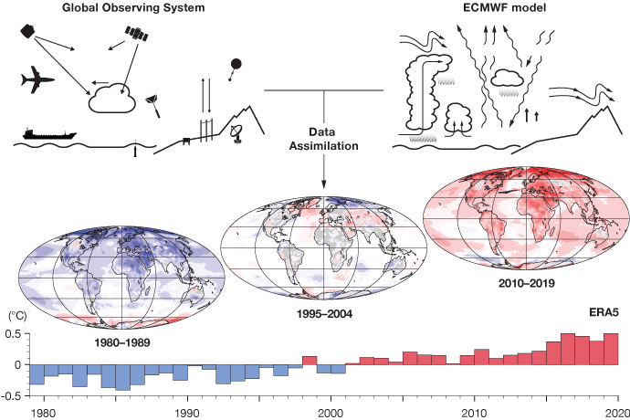

.. vim: syntax=rst

3.1 Observational datasets and their uncertainties
--------------------------------------------------

Climate-sensitive terrestrial water-related research and impact studies
can take many forms, often dealing with very specific, localized
phenomena (e.g. climate impacts on seasonal lake mixing). The intent of
this section is to provide guidance on data sources of larger spatial
scale atmospheric flux terms that can provide what are termed hydrologic
cycle “forcings” to more localized impact models, divided in the context
of this chapter into precipitation and components of evapotranspiration.
In this section, we begin by discussing the theoretical ideal for
obtaining a “localized”, dense observational data set, along with
practical needs and considerations. We follow this with a discussion of
considerations for supplementing these data sets with larger
spatial-scale and longer temporal-scale datasets, concluding this
section by providing links to potential observational datasets and
resources.

Before we begin this discussion, it is helpful to have some questions in
mind related to the spatial, temporal, and distributional climate data
attributes required to capture the local impact phenomena being studied,
and when assessing the adequacy of observational datasets:

-  Is the phenomenon highly variable in space such that only localized
   sampling is sufficient (e.g. often occurring in regions of strong
   topographical gradients)?

-  Is the phenomenon more related to specific weather events or more to
   year-by-year changes in climate averages?

-  Are temporal averages of the variables sufficient (e.g. monthly,
   daily, hourly, etc.) and/or is the phenomenon critically dependent on
   extremes in intensity, frequency, and duration?

-  If extremes are the primary focus, are there long enough historical
   records to capture these extremes at sufficient temporal/spatial
   resolution to drive local impact models?

|image1|

*Figure: one of the most monitored attributes of local rainfall are
changes in its Intensity-Duration-Frequency (IDF) relationship.*

These questions often highlight the need for data sets developed from a
combination of different data sources and meteorological tools and
approaches to ensure a comprehensive understanding of the weather and
climatological conditions of interest, which we talk about next.

**Ideal local data sets**

Arguably the ideal data for researchers who are interested in obtaining
variables and datasets that can then provide or force detailed and
localized ecosystem and impact models (i.e. storage, surface water
flows, stream temperatures, etc.) would be to have **gage-derived
instrumented measurements** of all climate variables of interest at high
enough density, sampling frequency, and historical record to capture all
dominant scales of spatial and temporal heterogeneity across the study
domain of interest (more often than not, unattainable). In this context,
weather gauges are often considered the best source of truthful weather
information for several reasons. **Accuracy and precision**: if properly
calibrated and maintained, weather gauges provide accurate and precise
measurements of temperature, precipitation, wind speed, humidity; fluxes
of energy, momentum, and moisture; and long- and short-wave radiation.
**Direct measurement:** Unlike other methods that might rely on indirect
indicators or modeled inputs, weather gauges collect direct, empirical
data from the environment. **Localized information:** These instruments
provide data specific to their location, particularly useful for
research purposes where understanding microclimates or specific local
phenomena is crucial. **Extremes:** As opposed to other measurement
techniques and approaches that often implicitly represent spatial or
temporal averages, gauges are point-based in nature, allowing them to
capture the widest range of temporal and spatial variability.
**Long-term data collection, standardization and calibration:** Many
gauging approaches have remained consistent for many decades (or can be
easily cross-compared to modernized techniques), along with
universally-accepted and consistent standardization and calibration
approaches, means weather gages are often resource for long-term
archives of meteorological data, essential for studying climate change,
weather patterns, and long-term trends. **Sufficient for
climatologies**: even if sparsely-located gauges may be insufficient to
represent a time-series of weather across a region, they may be
sufficient to represent the long-term climatology if the region is
sufficiently homogenous in its weather patterns (note: a :mark:`weather
climatology refers to the statistical representation of the long-term
weather conditions at a particular location or over a specific region,
typically involving the analysis of weather data over extended periods,
typically 30 years or more, to understand the typical weather patterns
and variations of an area`).

However, weather gauges also come with certain drawbacks.
**Representativeness:** :mark:`Point observations are rarely sufficient
to represent spatial patterns of precipitation; this is especially true
in regions with sharp changes in elevation and/or nearby large bodies of
water.` **Wind and turbulence-dependent errors for precipitation
gauges:** The wind over and around raised gauges can distort the
measurement of the flux of hydrometeors falling to the ground, with
typically the higher the wind speed, the higher the distortion.
**Susceptibility to local interferences:** Weather gauges can be
affected by local environmental factors such as buildings, trees, and
other obstructions that can alter wind patterns or create microclimates.
This can lead to data that may not accurately represent broader weather
conditions. **Maintenance and calibration needs:** These instruments
require regular maintenance and calibration to ensure accuracy. This can
lead to data gaps that degrade the reliability of any dataset based on
consistent measurements. Ideally, quality control records would be kept
and available for quality confirmation. **Limited range:** A single
weather gauge provides data only for its immediate location; while this
is also considered a strength, this does require siting of multiple
gauges to get a comprehensive view of weather over a larger area, if
required. See figure below of the density of rain gauges used for
observation quality control of the U.S. National Centers for
Environmental Prediction Multi-Radar Multi-Sensor (MRMS) system (Zhang
et al., 2016).

|image2|

*Figure: the MRMS locations of rain gauge sites, with the white plus
signs indicating locations of the ~7000 hourly gauges. (Source: Zhang et
al., 2016)*

However, we stress that even where these local data may not in and of
themselves be sufficient to cover project needs and provide a sufficient
observational baseline, they can still provide an important (local)
evaluation of the supplemental (larger scale) data sets that are being
utilized.

**Further resources**

-  Further information on the strengths and limitations of snow
   measurements can be found under (“How Well Are We Measuring Snow
   Post-SPICE?”, Kochendorfer et al., 2022)
   https://doi.org/10.1175/BAMS-D-20-0228.1.

-  Also more detailed information on the estimation of precipitation and
   the strengths and deficiencies of rain gauges is found in the
   following pop-out:

— popout Ch 3.1 Rain gauge QPE

**Beyond gauges - alternative precipitation data sets**

Given the limitations of rain gauge networks in their spatial coverage
(including wind-speed sampling error, etc., see popout above for
details), a primary source for alternative precipitation estimates are
gauge-adjusted radar estimates, in regions where radar beam coverage is
sufficient. The strengths of these derived estimates are as follows.
**High spatial resolution:** outside of point-based rain gauges, radar
systems provide some of the highest-resolution data on precipitation
patterns, allowing for detailed mapping of rainfall and storm structures
while still providing coverage over broad areas. **Wide coverage:**
Radar can cover large geographical areas that might be difficult to
monitor using ground-based instruments alone. This wide coverage is
particularly useful in remote or inaccessible regions (as long as there
is no beam-blockage). **Detection of precipitation type:** Advanced
radar systems can differentiate between types of precipitation (rain,
snow, hail).

However, gauge-adjusted radar estimates also have the following
limitations. **Attenuation:** Radar signals can be attenuated by heavy
precipitation, especially in convective storms. This attenuation can
lead to underestimations of rainfall intensity at greater distances from
the radar site. **Ground (or other) clutter:** Objects on or near the
ground (buildings, hills, trees) can reflect radar signals, resulting in
ground clutter that obscures or mimics precipitation signals, leading to
inaccuracies; note that above-ground flying insects can also cause
similar problems. **Elevation angle limitations:** The radar beam
travels in a straight line, while the Earth curves away from it. At
longer distances, this can cause the radar to overshoot lower-altitude
precipitation, leading to underestimations of rainfall close to the
ground. **Range degradation:** The quality and accuracy of radar data
decrease with distance due to the spreading of the radar beam and
increasing altitude of observation. This makes long-range precipitation
estimates less reliable. **Dependence on reflectivity:** Radar estimates
precipitation by measuring the reflectivity of water particles in the
air. This method assumes a relationship between the size and type of
particles and the intensity of precipitation, which has its own
inaccuracies. **Calibration and maintenance:** Radar systems require
regular calibration and maintenance to ensure their accuracy.
Calibration must often be localized to account for regional climatic and
environmental conditions, adding complexity to their operation.
**Spatial representation:** radar beams are of a certain width, and as
such, the measurements implicitly are a type of representative average
over the region of coverage. This can be a strength or a weakness
depending on if the implicit sampling area corresponds to that of the
researcher’s interest. Note that this spatial discretization also
implicitly dampens extremes that would be captured through point-based
gauge measurements. **Length of historical record and changes in
estimation quality through time:** some of the most significant radar
technologies did not become operational until the 1990s (with
dual-polarization and doppler capabilities), so care should be taken
when utilizing radar-based precision estimates preceding this time
period. However, note that over the US it is possible to assess the
level of uncertainty in derived radar precipitation estimates for a
given location, as shown in the figure below of the Radar Quality Index
(RQI), which :mark:`shows the impact of non-uniform coverage of radar
that is related to the elevation of the radar sample, distance from the
radar, and the impact of mountains.`

|image3|

*Figure: the Radar Quality Index (RQI) provides a measure how useful
radar might be for precipitation estimates based on the amount of
unblocked radar sampling below the freezing level. The scale is 0 to
100%, with the high end indicating good radar coverage, and the low end
indicating poor coverage typically due to terrain blocking or increasing
distance from the radar. This image is from February. The distance that
high RQI values extend from the radar is typically better during summer
when there is more convective precipitation and higher freezing levels.*

Taken together, gauge-adjusted radar estimates provide some of the most
dependable and accurate estimates of precipitation over the contiguous
U.S. (CONUS), but with the following caveats: use outside of CONUS (e.g.
insufficient radar coverage), in mountainous areas (e.g. beam blockage),
variability in the quality of the estimates in space (e.g. range
degradation) and time (e.g. changes in coverage and technologies used
over the last 60 years).

Below we provide a brief overview of some of the changes in radar
estimates since their operational use by the National Weather Service in
1957.

– popout Ch 3.1 Radar technology changes

Below we provide additional introductory details on the derivation,
strengths, and limitations of quantitative precipitation estimates (QPE)
derived from radar, including limits due to beam blockage and
mountainous regions (which also pose problems for gauges), quality
control methods, and a brief discussion of satellite-derived QPE.

— popout Ch 3.1 Radar QPE

**Weather climatologies**

A weather climatology is sometimes used to augment weather variable
estimates. These climatologies are especially useful in regions with
limited capacity for measurements or rapidly changing terrain features,
the latter causing weather variable dependence on this topographic
variability (e.g. :mark:`sharp changes in elevation and/or nearby large
bodies of water)` as well as potentially limiting the ability for direct
observation (such as in cases of radar beam blockage as discussed in the
previous section). Some of the more commonly used climatologies (which
can include a variety of weather variables, and may have daily weather
estimates for some products) are t:mark:`he Parameter-elevation
Regressions on an Independent Slopes Model, or PRISM from Oregon State
(for more information on precipitation climatology guidance from PRISM
see: http://www.prism.oregonstate.edu/); Daymet daily surface weather
and climatological summaries from Oak Ridge National Laboratory
(https://daymet.ornl.gov/); gridMET from the Climatology Lab of the
University of California-Merced
(https://www.climatologylab.org/gridmet.html); and the Livneh data sets
from the University of Colorado
(https://ciresgroups.colorado.edu/livneh/data).`

|PRISM Precipitation Annual Climatology for the US|

*Figure: The Parameter-elevation Regressions on an Independent Slopes
Model, or PRISM, provides a commonly-used precipitation climatology
tool. For more information on precipitation climatology guidance from
Parameter-elevation Regressions on an Independent Slopes Model (PRISM),
see:* http://www.prism.oregonstate.edu/\ *.*

:mark:`The approach used by PRISM using gauge and terrain data is
considered the 3-dimensional (3-D) approach. This can be very useful in
terrain-affected areas – see figures below. The areas that are within
100 km of the green shading on this map are where PRISM uses the 3-D
approach for QPE. This would also include all of the Hawaiian Islands
and most of Alaska. In the white areas on this map, PRISM uses a 2-D
process. This is basically a distance-weighted gauge analysis.`

|PRISM effective terrain areas|

*:mark:`Figure: Effective terrain grid for the U.S. Shaded areas denote
terrain features that are`*

*:mark:`expected to produce significant terrain-induced (3D)
precipitation patterns.`*

*:mark:`Unshaded grid cells as far as 100 km away from the shaded areas
may also be`*

*:mark:`considered 3D; see text for discussion. Grid resolution is 2.5
minutes (~ 4 km). (Source:
https://prism.oregonstate.edu/documents/pubs/2002_influenceTerrain_daly.pdf)`*

:mark:`Below we provide more introductory information on the PRISM
approach.`

— popout Ch 3.1 PRISM

**Reanalysis**

Climate reanalysis is a method used to reconstruct past climate
conditions by combining historical observational data with modern
climate models. This approach provides a comprehensive and consistent
dataset of atmospheric, oceanic, and land-surface conditions over an
extended period. The historical observational data can come from weather
stations, satellites, ships, buoys, and other sources, and typically
undergo rigorous quality control to correct errors and inconsistencies.
The climate models used are often numerical weather prediction (NWP)
models, sophisticated models that simulate the Earth's atmosphere,
oceans, and land surface based on physical laws. The integration of the
observational data into the NWP models is done through a process called
data assimilation. For a time period of interest and for a given (grid-)
location, data assimilation systems utilizes different mathematical
methods (e.g. 4D-Var, Ensemble Kalman Filter, etc.) to combine often
unevenly spatially-distributed observations with errors in a prescribed
time-window of interest with a NWP-derived estimate constrained by
previous observations on a regularly spaced grid to obtain what is
called an optimal estimate of the state of the Earth system (i.e.
estimates of atmospheric parameters such as air temperature, pressure
and wind at different altitudes, and surface parameters such as
rainfall, soil moisture content, ocean-wave height and sea-surface
temperature, produced for all locations on earth) at the time of
interest, and its time evolution constrained by physical laws. This
combinatorial process is typically done by adjusting the NWP estimate in
a physically consistent manner so that it matches the latest
observations closely, while taking into account the relative
uncertainties in the observations and the NWP estimates (somewhat
mimicking the production of day-to-day weather forecasts, which use an
analysis of the current state of the Earth system as their starting
point).

|image4|

*:mark:`Figure: A schematic of the reanalysis process. (Source: ECMWF)`*

Although reanalyses have proven to be quite useful in general, they have
their limitations. Even though the reanalysis framework is consistently
applied over long time periods that can extend back several decades or
more, the one component that does vary are the sources and amount of the
raw input data due to changing global observational networks. Due to
this changing mix of observations, the reliability of the reanalysis can
considerably vary depending on the location, time period, and variable
considered; and this changing mix, along with biases in observations and
models, can also introduce spurious variability and trends into the
output. And of particular importance to this primer, variables relating
to the hydrological cycle such as precipitation (P) and evaporation (E)
are derived quantities that are calculated from the primary variables
(or differences in the primary variables) of the NWP model, and
therefore not directly predicted by the model's governing equations,
making them especially sensitive to inaccuracies in the numerical
modeling process. As such, reanalysis-derived hydrologic cycle variables
need to be used with caution and and assessed for their physical
reasonableness. Consider the figure below (from Trenberth et al. 2011),
which compares two reanalysis products (NASA MERRA and ECMWF
ERA-Interim) and shows how E-P is of different sign between the two
products over central Africa (but noting this is an analysis from over a
decade ago)! However, we note that just as reanalysis products continue
to improve in accuracy and their ability to remove past known
deficiencies, some products (e.g. ERA5) also are providing information
about :mark:`uncertainty: data from areas or periods where observations
are sparser are likely to be less certain.`

|image5|

*Figure: Evaporation minus Precipitation in MERRA (top) and ERA-Interim
(bottom) based on Trenberth et al. (2011). (Contributed by J Fasullo and
NCAR Climate Data Guide)*

**Further renalysis resources**

-  :mark:`NCAR Climate Data Guide:
   https://climatedataguide.ucar.edu/climate-data/atmospheric-reanalysis-overview-comparison-tables`

-  :mark:`ECMWF reanalysis description:
   https://www.ecmwf.int/en/research/climate-reanalysis`

-  :mark:`ECMWF Reanalysis fact sheet:
   https://www.ecmwf.int/en/about/media-centre/focus/2023/fact-sheet-reanalysis`

**Blending multiple sensors and data products**

Multiple sensors and data products are often employed, especially in the
case of producing time-series of data, to compensate for deficiencies in
each product alone. :mark:`As an example, over CONUS radar and rain
gauge networks have been the primary tools for precipitation analyses,
but advances in satellite tools for precipitation analysis are showing
great promise in areas with poor coverage from radar and rain gauge
networks, especially over Alaska. Particularly promising are tools that
merge data from different satellites.`

:mark:`One particular example of a blended time-series data product that
employs multiple sensors is the NOAA Analysis Of Record for Calibration
(AORC), a gridded record of near-surface weather conditions covering the
continental United States and Alaska and their hydrologically
contributing areas. Derived weather variables include hourly total
precipitation, temperature, specific humidity, terrain-level pressure,
downward longwave and shortwave radiation, and west-east and south-north
wind components, with this suite of eight variables sufficient to drive
most land-surface and hydrologic models and is used as input to the
National Water Model (NWM) retrospective simulation. As an example of
this blending process, consider that the AORC was constructed from over
a dozen individual time-series and climatological datasets, not all of
which were available through the entire period-of-record. The best
available input dataset for each of the constituent elements was used at
any given time and place. Some alternative time-series data (such as
satellite data) were used to replace the input forcings at particular
areas or used to temporally disaggregate higher-temporal resolution
data. The climatological datasets were used to bias-correct the time
series data (such as PRISM [Vose et al., 2014] and Livneh [Livneh et
al., 2015] data), and were all developed based on ground-based gauge
observations.`

:mark:`**Further AORC details:** see Analysis of Record for Calibration:
Version 1.1, Sources, Methods, and Verification, National Weather
Service, Office of Water Prediction, Oct. 2021.`

**Broader climate variable observation resources**

There continues to be a broad range of remotely sensed
hydrologically-relevant data sources that continue to be made available
and can help offset and supplement some of the data sets mentioned above
(e.g. GPM and SWOT), especially in regions with limited observed
coverage, and the reader is encouraged to continue to monitor the
availability of additional resources that could help with their
hydrometeorological data needs. Examples:

-  Global Precipitation Measurement: https://gpm.nasa.gov/missions/GPM

-  Surface Water and Ocean Topography Mission:
   https://swot.jpl.nasa.gov/

**Further Resources**

For further resources and guidance on observational data sets, please
see:

-  the NSF NCAR Climate Data Guide: https://climatedataguide.ucar.edu/

-  IPCC AR6 WG1 Annex I Observational Products (filtered table of North
   American and water cycle focused provided below)
   https://www.ipcc.ch/report/ar6/wg1/

-  Data sources that were developed or referenced by the NOAA Technical
   Support Unit supporting the U.S. Fifth National Climate Assessment
   can be found here:

   -  NCA5 Atlas https://atlas.globalchange.gov/

   -  Global Change Information System https://data.globalchange.gov/

   -  NOAA’s nClimGrid monthly
      https://www.ncei.noaa.gov/access/metadata/landing-page/bin/iso?id=gov.noaa.ncdc:C00332

   -  NOAA’s nClimGrid daily
      https://www.ncei.noaa.gov/products/land-based-station/nclimgrid-daily

   -  NOAA’s nClimDiv climate indices
      https://www.ncei.noaa.gov/access/metadata/landing-page/bin/iso?id=gov.noaa.ncdc:C00005

-  Below we provide a list of IPCC AR6-referenced climate variable
   observational products applicable to the U.S. and North America. The
   table lists observational datasets commonly used for climate studies
   that are considered well-vetted by the scientific community. The
   table documents the details of the types and versions of datasets,
   the time period they cover, and citations and (where available) web
   links to the data. Reanalyses data products are included. Datasets
   are sorted alphabetically according to the dataset name or, if there
   is no formal name, the name of the responsible institution or lead
   author.

— pop out Table Ch3.1 Observational datasets

.. |image1| image:: media/ch3/image_obs2.png
   :width: 5.38263in
   :height: 3.77339in
.. |image2| image:: media/ch3/image_obs7.png
   :width: 6.5in
   :height: 4.40278in
.. |image3| image:: media/ch3/image_obs6.png
   :width: 6.5in
   :height: 4.54167in
.. |PRISM Precipitation Annual Climatology for the US| image:: media/ch3/image_obs5.jpg
   :width: 6.04167in
   :height: 4.58333in
.. |PRISM effective terrain areas| image:: media/ch3/image_obs3.jpg
   :width: 6.04167in
   :height: 4.16667in

.. |image5| image:: media/ch3/image_obs4.png
   :width: 6.5in
   :height: 7.54167in
