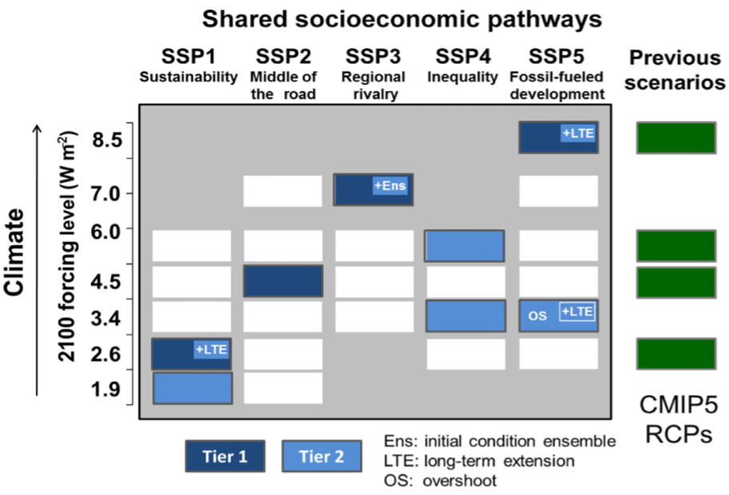
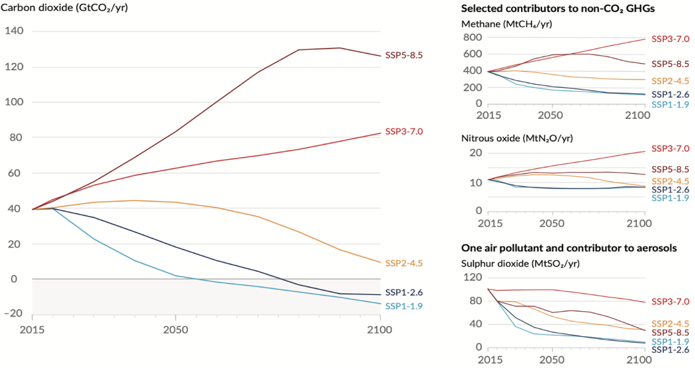
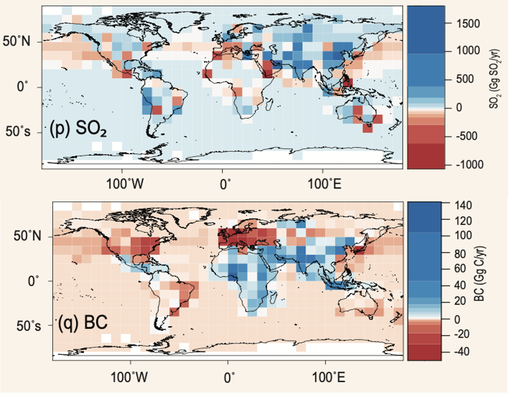
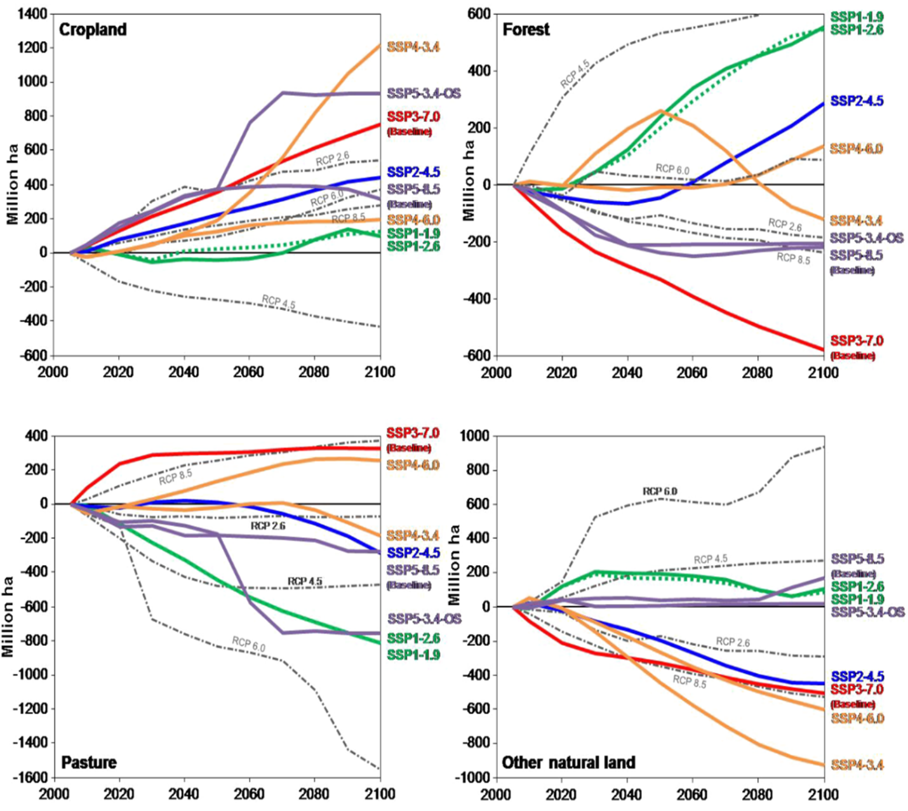
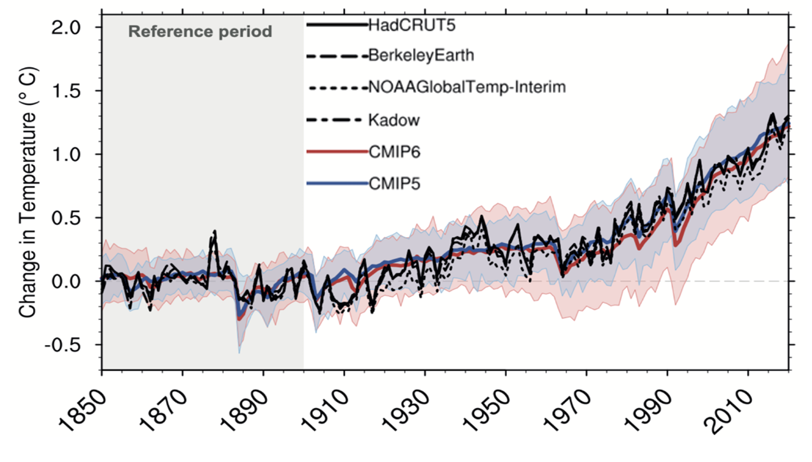
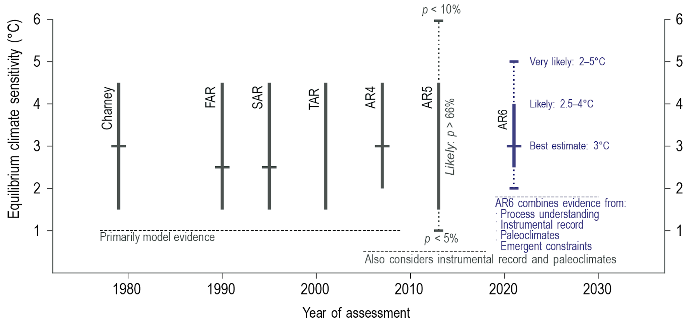
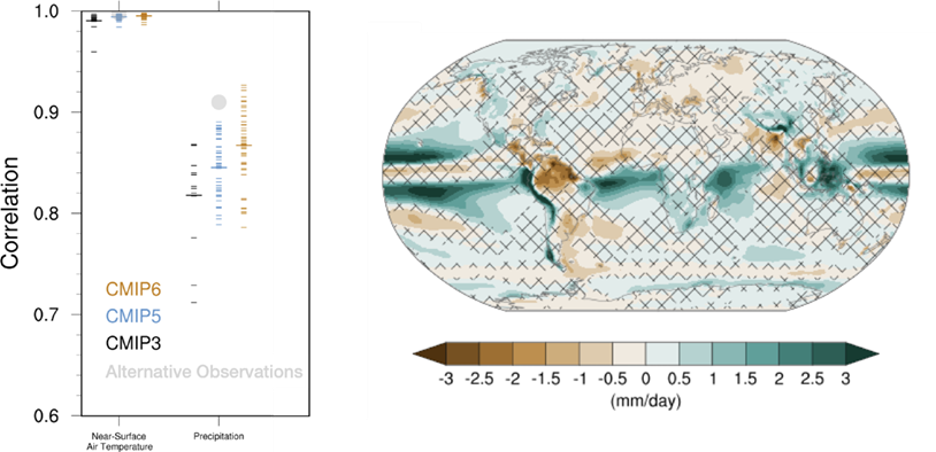
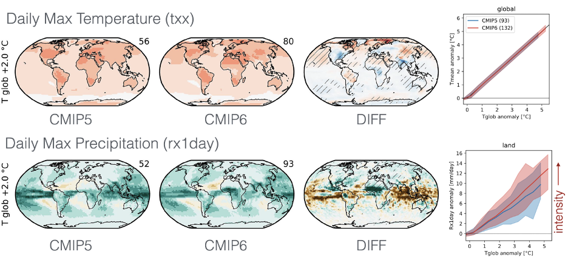
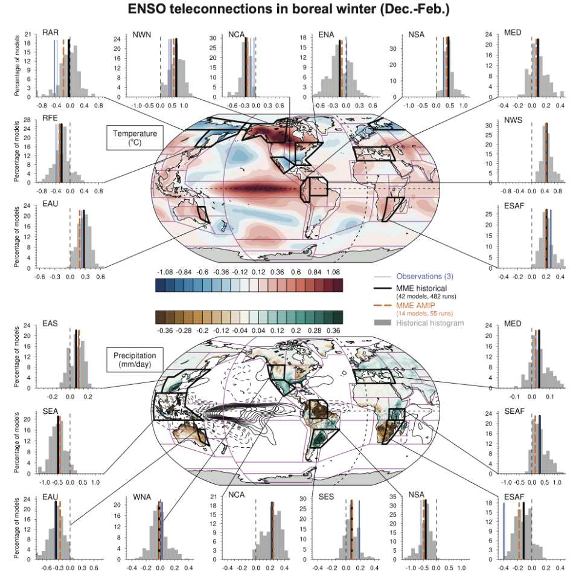

.. vim: syntax=rst

Chapter 4: Understanding GCM climate change modeling and attributes, strengths, limitations
===========================================================================================

This Chapter provides an overview and guidance on the following topics:

-  Introduction to the Intergovernmental Panel on Climate Change (IPCC),
   The Coupled Model Intercomparison Projects (CMIP), the National
   Climate Assessments (NCA), and other institutions and institutional
   arrangements that provide climate-change-relevant information for
   North America.

-  Overview of how GCMs are utilized under the IPCC framework

-  Some of the limitations and challenges of GCMs: historical
   perspectives, current strengths and abilities, and ongoing challenges

-  Resources where GCM-derived future climate change outputs can be
   found for future applications

**Table of Contents**

-  Introduction

-  Goals of IPCC, CMIPs

-  What do climate projections (IPCC scenarios) mean and their
   assumptions

-  Processes captured/not captured

-  General limitations and future improvements

-  Already downscaled Data sets available

-  Key takeaways from the chapter

-  References

4.1 Introduction
---------------------------------

This chapter provides an overview of General Circulation Models (GCMs),
also known as Global Climate Models, and how they are employed within
the international research consortia providing research and data
relevant for understanding and characterizing the impacts of climate
change. In this chapter, we provide an overview of the strengths and
weaknesses of GCMs, which are the fundamental tools used in climate
science to provide insights into our understanding of climate change.
These sophisticated computer models simulate the Earth’s climate
systems, including the atmosphere, oceans, land surface, and ice,
enabling an accounting of the energy storage and energy fluxes into
and out of the earth system. 

*Here are some key benefits of GCMs to climate-change understanding.*

.. dropdown:: Provides Projections of Future Climate Conditions and Support for International Climate Assessments

    GCMs enable scientists to project future climate conditions under
    various scenarios, such as those outlined in the IPCC SRES, RCP, and SSP
    frameworks (which we discuss further below). By inputting different
    concentrations of greenhouse gases, GCMs can simulate how the climate
    might change in the future and provide the scientific basis for the
    climate projections and policies discussed in IPCC reports, helping to
    inform policymakers, businesses, and the public about potential risks
    and necessary adaptations.

.. dropdown:: Provides an Understanding of Climate Processes and Evaluation of Climate Change Impacts

    GCMs simulate the complex interactions between different components of
    the Earth's climate system. This helps scientists understand fundamental
    processes such as the water cycle, energy balance, and atmospheric
    dynamics. By modeling these processes, GCMs provide insights into how
    changes in one part of the system (like increased atmospheric CO2) can
    affect other parts (like global temperature and precipitation patterns).
    This in turn, helps assess potential impacts of climate change on various
    sectors, including agriculture, water resources, and health. For
    instance, models can project changes in rainfall patterns, heat waves,
    and the frequency of extreme weather events, which are crucial for
    planning and mitigation strategies in vulnerable regions.

.. dropdown:: Allows for Testing Hypotheses and Development of Mitigation and Adaptation Strategies

    GCMs are valuable for testing scientific hypotheses about the climate
    system. By altering specific variables or processes within the model,
    researchers can explore how these changes affect climate outcomes,
    thereby testing our understanding of climate mechanisms and feedbacks,
    and contributing to detection and attribution studies (discussed in
    Chapter 3). This also allows researchers to simulate different future
    climate scenarios in developing effective climate-change mitigation and
    adaptation strategies, such as emission reductions, reforestation, and
    technological innovations including geoengineering, in curbing climate
    impacts.

While GCMs are invaluable, they do come with *limitations*. Their accuracy
depends on the quality of input data, the precision of mathematical
formulations, and the computing power available that constrains the
temporal and spatial resolution of the calculations. Moreover, there is
inherent uncertainty in modeling complex systems, which means that while
GCMs are excellent for exploring possible futures, they cannot predict
exact outcomes, an issue we will discuss further in this chapter,
including the discussion of ensembles. Despite these challenges, GCMs
are still the predominant tool for advancing our understanding of
climate dynamics and informing global response strategies and
policy-making in addressing the challenges of climate change.

Further below we provide a broader introduction to the climate modeling
process.

To learn more about climate models visit `Introduction Introduction to Climate Models <https://ncar.github.io/climate-primer-water/cookbook.html#introduction-to-climate-models/>`_

4.2 Goals of the IPCC, CMIPs, NCA
------------------------------------

**4.2.1 IPCC**
^^^^^^^^^^^^^^^^^^^^^^^^^^^^^^^^^^^^^^^^^^^^^^^^

The Intergovernmental Panel on Climate Change (IPCC) is the United
Nations body tasked with assessing the science related to climate change, with
its objective to provide governments at all levels with the scientific
information that they can use to formulate climate policies. The
assessments are provided regularly (approximately every 5-7 years), with
IPCC Reports being one of the primary modalities, covering the
scientific basis of climate change, its impacts and future risks, and
options for adaptation and mitigation. 

*The IPCC's primary goals*

.. dropdown:: Assess Scientific Information

    in its assessment reports through
    comprehensive reviews of the latest scientific literature on climate
    change, its impacts, and potential future risks, involving
    synthesizing findings from thousands of scientific studies; and
    special reports on specific aspects of climate change as requested by
    the IPCC member governments, addressing emerging issues or areas
    requiring detailed examination.

.. dropdown:: Evaluate Climate Change Impacts and Risks 

    on global and regional scales by sssessing the observed and projected impacts of climate
    change on natural and human systems at both global and regional
    scales. This includes examining effects on ecosystems, weather
    patterns, sea levels, and human health. And provide risk analyses by
    Analyzing the risks associated with different levels of global
    warming, providing insights into the potential consequences of
    various climate change scenarios.

.. dropdown:: Inform Policymakers 

    with scientific information that is
    policy-relevant but not policy-prescriptive. This means offering
    evidence-based findings without advocating for specific policies.
    Also provides Summaries for Policymakers that distill the key
    findings of comprehensive reports into actionable information for
    decision-makers.

.. dropdown:: Support International Climate Negotiations 
    
    such as providing
    scientific assessments that support the United Nations Framework
    Convention on Climate Change and international climate negotiations.
    IPCC reports are often used as the scientific basis for global
    climate agreements and negotiations, such as the Paris Agreement.

.. dropdown:: Assess Mitigation and Adaptation Strategies

    Evaluate strategies for
    reducing greenhouse gas emissions and enhancing carbon sinks. This
    includes assessing the potential of renewable energy, energy
    efficiency, carbon capture and storage, and other mitigation
    technologies. And assess strategies for adapting to the impacts of
    climate change. This includes evaluating measures to increase
    resilience in agriculture, water resources, infrastructure, and
    public health.

Note that the IPCC’s goals, as stated above, do not explicitly include
the mandate of providing future-change model outputs and datasets that
would be useful, say, for this primer’s user audience (aka needed to
drive more local-scale impact models). However, Section *Learn More* provides
resources where many of these data, including CMIP6 [discussed below]
and other data, can be found.

**4.2.2 CMIP**
^^^^^^^^^^^^^^^^^^^^^^^^^^^^^^^^^^^^^^^^^^^^^^^^

The Coupled Model Intercomparison Project (CMIP) is a collaborative
framework designed to synthesize climate-modeling efforts from a number of
weather and climate centers to improve knowledge of past, present, and
future climate change from natural variability or in response to
anthropogenic changes to radiative forcing [1]_. CMIP is under the
Working Group on Coupled Modelling (WGCM) of the World Climate Research
Programme (WCRP), with the latter under the joint sponsorship of the
World Meteorological Organization (WMO) and the International Council
for Science (ISCU). In terms of the CMIP acronym, “Coupled” refers
to the interconnected components of the climate system (e.g., land, air,
water, etc.) that are simulated by the climate models; “intercomparison”
references the many models that are available to compare with
observations and to one another to characterize model uncertainty and
scenario uncertainty. The CMIP project started in 1995 and has multiple
versions of generated datasets, including CMIP3 (2005), CMIP5 (2011)
(there was no CMIP4), and CMIP6 (2018), with the members of the CMIP
Core Panel currently working on the design of CMIP7. 

*Important goals of CMIP*

-  Standardize global climate model (GCM) experiments and model output
-  Compare and evaluate GCMs used in the climate studies`
-  Make the CMIP GCM data publicly available

**4.2.3 CORDEX**
^^^^^^^^^^^^^^^^^^^^^^^^^^^^^^^^^^^^^^^^^^^^^^^^

One notable model intercomparison project under the umbrella
of CMIP is the COordinated Regional Climate Down-scaling Experiment or
CORDEX (Gutowski et al. 2016), for comparing and evaluating regional
dynamical and statistical downscaling techniques and their
appropriateness for climate services. This project has helped to
coordinate higher-resolution regional modeling studies for different
regions around the world. This experiment complements and adds value to
the CMIP global models, particularly in complex topography zones,
coastal areas and small islands, as well as for extremes.

**4.2.4 NCA**
^^^^^^^^^^^^^^^^^^^^^^^^^^^^^^^^^^^^^^^^^^^^^^^^

The National Climate Assessment (NCA) is a key initiative of the U.S.
Global Change Research Program (USGCRP) and is aimed at assessing and
summarizing the impacts of climate change on the country and involves
contributions from hundreds of experts across various sectors. The Global Change Research Act of 1990 mandates that the USGCRP
deliver a report to Congress and the President not less frequently than
every four years that “integrates, evaluates, and interprets the
findings of the Program and discusses the scientific uncertainties
associated with such findings; analyzes the effects of global change on
the natural environment, agriculture, energy production and use, land
and water resources, transportation, human health and welfare, human
social systems, and biological diversity; and analyzes current trends in
global change, both human-induced and natural, and projects major trends
for the subsequent 25 to 100 years.” 

*The main goals of the National Climate Assessment*

.. dropdown:: Inform policy guidance and resource-management decision-making 
   
    by providing policy-neutral and policy-relevant information
    accessible and actionable.

.. dropdown:: Enhance Public Awareness and Understanding 

    about the causes, impacts,
    and potential solutions to climate change, aiming to make the
    scientific information accessible to a broad audience.

.. dropdown:: Evaluate Climate Impacts and Vulnerabilities 

    through Regional
    Assessments providing detailed assessments of climate impacts and
    vulnerabilities at regional scales; and Sectoral Assessments
    evaluating the impacts of climate change on various sectors, such as
    health, agriculture, water resources, energy, ecosystems, and
    infrastructure.

.. dropdown:: Assess Adaptation and Mitigation Strategies

    assess the
    science of adapting to a changing climate, emissions reductions, and
    other efforts that together describe the US’s existing and potential
    response to climate change, including benefits, trade-offs, targets,
    limitations, and best practices (while not evaluating or recommending
    specific adaptation or mitigation policies). 

4.3 What climate projections and IPCC climate-change scenarios mean and their assumptions
-------------------------------------------------------------------------------------------------

Since the early iterations of the IPCC process, a suite of coordinated
experiments under the CMIP framework have been performed to offer a
multi-model view of potential futures (e.g., Taylor et al. 2012). To
drive the different coordinated experiments, several scenarios were
developed. Over time, this process has been formalized and the initial
scenarios from the Special Report on Emissions Scenarios (SRES,
Nakicenovic and Swart, 2000) of CMIP3 were replaced by Representative
Concentration Pathways (RCPs, Moss et al. 2010, van Vuuren et al., 2011;
van Vuuren et a. 2014) of CMIP5. For the CMIP6 process (Eyring et al.
2016), a new model intercomparison project was adopted called the
ScenarioMIP (O’Neill et al. 2016) in which the Shared Socio-economic
Pathways, or SSPs, were presented with the goal to better understand the
physical system as well as its impacts on societies. Among other
improvements, this framework has helped inform the UNFCCC to formulate
the Paris Agreement (IPCC 2016) with the stated objectives of limiting
warming to below 2°C, or even 1.5°C (e.g., Rogelj et al. 2018). Below is
a further description and comparison of these frameworks (SRES, RCPs,
SSPs) developed by the IPCC community for climate modeling and
assessment of future scenarios regarding greenhouse gas emissions and
their impacts:

SRES (Special Report on Emissions Scenarios)

-  Developed by: Intergovernmental Panel on Climate Change (IPCC) in
   2000, and used in the IPCC’s Third and Fourth Assessment Reports.

-  Purpose: To explore different scenarios of future emissions based on
   varying economic, social, and environmental developments without
   assigning likelihood to any scenario.

-  Features:

   -  Four narrative families (A1, A2, B1, B2) reflecting different
      developmental pathways.

   -  Scenarios are "baseline" scenarios, they do not take into
      account any current or future measures to limit greenhouse gas
      emissions (e.g., the Kyoto Protocol).

RCP (Representative Concentration Pathways)

-  Developed by: Introduced in the IPCC’s Fifth Assessment Report
   (2014).

-  Purpose: To provide a set of four greenhouse gas concentration (as
   opposed to the SRES focus on emission inputs into the earth system)
   trajectories adopted by the climate-modeling community for the
   physical science basis of climate projections.

-  Features:

   -  Four pathways (RCP2.6, RCP4.5, RCP6, RCP8.5) representing
      different climate futures based on the radiative forcing in watts
      per square meter by 2100 (2.6 W/m\ :sup:`2`, 4.5 W/m\ :sup:`2`,
      etc.).

   -  Includes the impact of potential future policies by considering
      different levels of greenhouse gas emissions and concentrations.

SSP (Shared Socioeconomic Pathways)

-  Developed by: First used extensively in the IPCC’s Sixth Assessment
   Report (2021).

-  Purpose: To provide a more comprehensive framework that integrates
   RCPs with socioeconomic factors that might influence greenhouse gas
   emissions.

-  Features:

   -  Five pathways (SSP1 through SSP5) integrating RCPs within broader
      narratives about socioeconomic changes, such as demographic,
      economic, and technological developments, intended to span the
      range of plausible futures, including: a world of
      sustainability-focused growth and equality (SSP1); a “middle of
      the road” world where trends broadly follow their historical
      patterns (SSP2); a fragmented world of “resurgent nationalism”
      (SSP3); a world of ever-increasing inequality (SSP4); and a world
      of rapid and unconstrained growth in economic output and energy
      use (SSP5).

   -  Each SSP has different "challenges to mitigation" and "challenges
      to adaptation", providing a matrix of scenarios for more refined
      analysis.

Comparison and Contrast

-  Application in Climate Models: SRES scenarios were used primarily
   before the development of RCPs, which are now commonly used in
   climate modeling along with SSPs. SSPs are particularly significant
   for their use in exploring the impacts of socioeconomic factors on
   emission scenarios and vice versa.

-  Policy Integration: SRES scenarios did not consider future climate
   policies explicitly. RCPs began to incorporate potential future
   policies indirectly through assumptions about radiative forcing. SSPs
   explicitly integrate both mitigation and adaptation challenges within
   their scenarios, offering a nuanced framework for policy discussions.

In summary, as climate science has advanced, so too has the complexity
and applicability of these scenarios. Each successive framework has
built upon the last, providing more detailed tools for understanding and
addressing the multifaceted challenges of climate change.

*Further details on SSPs*

The figure below presents the simple framing of the different societal
storylines that form the basis of the new SSPs. At their core, they
represent different societal development pathways that are describing
their respective “worlds”: SSP1 sustain-ability; SSP2 middle of the
road; SSP3 regional rivalry; SSP4 inequality; and SSP5 fossil-fueled
development. For each of these storylines, different outcomes regarding
emissions and thus concentrations of greenhouse gasses, aerosol, and
land-use changes can be considered (e.g., Riahi et al., 2017). The
ScenarioMIP process then performed a selection of scenarios that offer
continuation to previous assessment reports. The core (Tier 1) scenarios
offered to the climate-modeling communities were: SSP1-2.6, with an end-of-century radiative forcing of about 2.6 W/m\ :sup:`2`; SSP2-4.5 with
4.5 W/m\ :sup:`2`; SSP3-7.0 with 7 W/m\ :sup:`2`, and SSP5-8.5 with 8.5
W/m\ :sup:`2`.

|image1|

*Figure: SSPs from ScenarioMIP matrix with associated select forcing
levels (Tier 1), from O’Neill et al., 2016.*

Notable characteristics of the different SSPs are illustrated in the
three figures below for well mixed global emissions; spatial emission-pattern differences between CMIP6 and CMIP5; and land-use changes over
time, respectively.

|image2|

*Figure: Emissions of well-mixed greenhouse gases (CO\ 2, CH\ 4, N2O) as
well as SO\ 2. (Source: IPCC, 2021)*

|image3|

*Figure: Spatial emissions differences between CMIP6 and the previous
CMIP5 emissions for SO\ 2 (top) and black carbon (bottom). (Source:
IPCC, 2021)*

|image4|

*Figure: Global time-series of land use changes (in million hectares)
(Source: IPCC, 2021)*

.. dropdown:: **Modeling groups were also encouraged to perform additional experiments beyond Tier 1 scenarios.** 

    These experiments are associated with scenarios that contain reductions later in the century (so called “overshoot scenarios”) as well as a low-end emission scenario in line with the Paris Agreement (IPCC 2016): SSP1-1.9. Because of the large computational demand, most modeling centers only performed the core Tier 1 experiments. Some centers managed to simulate a large number of ensemble members for select experiments. These experiments are the CMIP6 simulations associated with the ScenarioMIP project. However, there are a total of 23 independent intercomparison projects that are part of CMIP6, and thus significantly more model output is available to study physical systems.

4.4 Earth-system climate modeling – historical perspective
-------------------------------------------------------------

.. dropdown:: **Modeling of the Earth’s climate system has and continues to evolve and innovate.** 

    During the mid to late 1990s, the representation of a coupled atmosphere-ocean system without flux corrections [2]_ was a key achievement that could be used to study consequences of evolving greenhouse-gas concentrations. This was followed by the introduction of aerosols (primarily sulfate and later others), allowing for the evaluation of the spatial climate footprint imposed by these emissions. In the early 2000s, the objectives moved to the proper representation of the seasonal cycles, followed by a focus on the power spectrum of internal variability [3]_, and especially of El Niño-Southern Oscillation fluctuations. More recently, climate-modeling efforts have focused on processes with more significant regional or local impacts. For example, there has been an emphasis on understanding the nature of extreme rainfall, as well the processes linking the middle atmosphere to the lower atmosphere. These processes affect the variability in storm tracks, allowing for the application of these models for more time-dependent problems, such as forecasts at sub-seasonal, to seasonal, to decadal timescales (Towler and Yates 2021).

.. dropdown:: **The need for accounting for more interactions between the climate and the Earth system has led to the incorporation of additional complex components.** 

    For example: New polar ice-sheet models simulate ice dynamics and their potentially important links to sea level. Beyond transporting aerosols and including their radiative effects, new atmospheric physics and chemistry modules simulate the formation and removal of aerosols as well as their interactions with clouds and precipitation, which represents some of the most complex physical challenges. The global carbon cycle can now be simulated so that atmospheric greenhouse-gas concentrations no longer have to be prescribed but rather are predicted by the models based on emission time series and the coupled system’s response. These new developments reflect a greater level of maturity in modeling that now more closely reflects the integration of processes and their uncertainties, and can better reflect the attributes of the shared socioeconomic pathways (SSPs, discussed in 4.B) and the response of the whole Earth system to societal development scenarios. For exploring these complex scenarios, sophisticated Earth-system models coupling all of these processes together have become the prerequisite.

.. dropdown:: **However, the scales at which this information is offered typically requires further processing for many practical applications on the ground.** 

    While scientific advances and computational power have allowed the models to include more complex components, their spatial resolution has not significantly advanced over the past decade, still largely constrained by computation limitations. Every time the spatial resolution of a climate model is increased, the demand for more computational resources grows significantly. Thus, the global models have generally remained at horizontal resolutions of around 100 km. This deficiency in properly representing important local factors, such as topography, the land-sea interface, etc. still requires downscaling approaches, either in dynamical form (see CMIP’s CORDEX effort in section 4.A.; Giorgi and Gutowski 2015), through statistical means, or some hybrid form. Most recently, even Machine Learning (ML) has been employed to achieve higher resolutions (Watson-Parris 2021). While ML and Artificial Intelligence (AI) techniques will quite likely revolutionize the overall enterprise of modeling (replacing parameterizations, offering higher-resolution ensembles, etc.), the need for a physics-based core that more faithfully can represent the non-linear interactions and evolution of the system will probably remain (e.g., O’Gorman and Dwyer 2018; Huntingford et al. 2019).

.. dropdown:: **Nevertheless, these modeling developments strengthen confidence in the understanding of climate-change processes and contribute to reducing uncertainty.** 

    They now provide a robust foundation to offer projections of possible future changes, with increasing and direct relevance for society in planning and decision-making. These projections (see below: drivers of change) fit into the current understanding of the evolving climate over past centuries, millennia, and back millions of years both in magnitude as well as key determined characteristics of change, again, confirming the increasingly robust scientific “partnership” between observations, theory/modeling, and paleoclimate reconstructions (geologic records).

4.5 Earth-system climate modeling – current strengths and abilities
-----------------------------------------------------------------------

.. dropdown:: **Climate models offer the only practical way to integrate highly non-linear systems (or system of systems) and then provide insights into their interactions.** 

    Models help translate the physics of the dynamical interactions and allow us to explore ranges of outcomes [4]_. The drivers of change are well documented, their imprints within the climate system have been identified (detected and attributed, e.g., Gillett et al. 2016), and thus, there exists robust confidence in the tools for exploring different potential future pathways of climate and what they will likely mean on the ground. As a foundational example, the figure below shows how the global temperature record since 1850 has been reproduced by the current ensemble of models.

    |image5|

    *Figure: Change in global average temperature since 1850 using four observational series and two multi-model ensembles with their ranges. (Source: ESMValTools Eyring et al. 2020 and IPCC, 2021.)*

.. dropdown:: **This ability of models to reproduce the temporal evolution of the climate system has strengthened our confidence in properly contrasting the changes between different societal emission pathways**. 

    The magnitude of global surface-air temperature change associated with future emissions and thus atmospheric concentrations of the main drivers (well mixed greenhouse gasses and aerosols) is associated with the system’s sensitivity to these changes. Uncertainties about this central quantity still exist, but the range that is to a large part driven by aerosols and how they interact with clouds, has been further reduced in the recent years since Charney et al. (1979) by using observational constraints (Sherwood et al. 2020; Hausfather et al. 2020; Brunner et al. 2020; Gillett et al. 2021; Ribes et al. 2021). The figure below shows the evolution of best estimates of climate sensitivity over the years.

    |image6|

    *Figure: Evolution of the equilibrium climate sensitivity of the global surface air temperature. First, Second, and Third Assessment Report: FAR, SAR, and TAR; Assessment Reports 4, 5, and 6: AR4, AR5, AR6. From Charney et al. (1979) to AR6 (Source: IPCC, 2021).*

.. dropdown:: **The spatial skill of models in reproducing the observed patterns continues to improve, with temperature historically already well represented, and precipitation gradually improving.** 

    The panels show the progression of the spatial correlation of temperature and precipitation of CMIP models against reference observations (left panel) and a global map of precipitation bias of the CMIP6 multi-model ensemble mean (right panel). Temperature structures have historically been very well represented (indicated by very high correlation coefficients), while precipitation patterns have improved more gradually. However, precipitation “skill” also suffers from the fact that there are large differences between observational datasets, and thus assessing the actual quality is more challenging. Still, the continuous increase in correlation against observations is obvious. The right panel shows the spatial structure of the biases, where the tropical regions stand out for their large biases – part of which can be related to the coarse spatial representation in climate models (i.e. coastal upwelling areas are not well resolved), but also the systematic errors due to double Intertropical Convergence Zone (ITCZ) representation and tropical convection dynamics [5]_.

    |image7|

    *Figure: Improvements of temperature and precipitation pattern correlation over the course of three CMIP generations (left panel). CMIP6 multi-model precipitation bias (right panel), with crossed lines indicating regions with conflicting signal. Source: ESMVal Tools, Eyering et al., 2020.*

.. dropdown:: **Some of the differences in climate modeling results have decreased over time; others have increased.** 

    In the figure below, differences between CMIP5 and CMIP6 results are very small in the global temperature field, except in the Arctic where CMIP6 shows somewhat larger changes in sea ice. For precipitation, however, more differences are seen in the tropics with often increased intensity of daily maximum precipitation compared to the earlier generation of models. This reflects the development process in the different modeling groups that are aiming toimprove the utility of the model output, where extreme precipitation is a climate variable that is in high demand (e.g., Trenberth et al. 2003; Seneviratne et al. 2012).

    |image8|

    *Figure: Comparison of changes in daily maximum temperature (top) and daily maximum precipitation (bottom) between CMIP5 and CMIP6. The right panels show a summary of these changes relative to the global mean temperature. Temperature changes are well aligned between the two generations of CMIP, but precipitation projections show a distinct increase in intensity in the new CMIP6 models (red) compared to earlier versions of CMIP5 (blue). Source: IPCC, 2021.*

.. dropdown:: **Climate models have also improved in representing climate variability across a broad range of timescales.** 

    Diagnostics comparing the global models against observations demonstrate continued improvements (Lauer et al. 2020). The figure below illustrates the spatial structure of El Niño – Southern Oscillation (ENSO) related variability and how models manage to reproduce the key features. Overall reasonable direction and magnitudes of anomalies can be seen, though challenges in duration and frequency (power spectrum) of events remain. However, it also needs to be kept in mind that for many of the impacts related to potential changes in the statistics of these modes of variability, the observational record is often too short to allow for a robust identification of trends on the mode as well as the stability of teleconnections (see e.g., Krokos et al., 2019). While we can describe what global models project in terms of trends of these modes, a validation of these trends through theory and observations is often missing.

    |image9|

    *Figure: El Nino-Southern Oscillation teleconnections in boreal winter as represented in CMIP6. (Source: IPCC, 2021)*

.. dropdown:: **In conclusion, climate modeling has made steady improvements over the years and now represents a strong basis to inform adaptation and mitigation action.** 

    The GCM models of the Earth system have been able to provide decision makers with a growing confidence in the way processes that dominate future climate under different scenarios are reflected in modeling frameworks. The above examples illustrate the increasing accuracy by which temperature, precipitation and other large-scale patterns are effectively reproduced within models under different socioeconomic development scenarios. In fact, models are now so detailed, that they can be used to spot errors in the observational record (e.g., Santer et al. 2003; 2011), even as the observational record has been used to validate climate models.

4.6 Earth system climate modeling – ongoing challenges
------------------------------------------------------------

.. dropdown:: **Despite the progress, uncertainties remain regarding climate models’ ability to represent the earth-climate system.** 

     Importantly, reducing these uncertainties will not change the fundamental, robust conclusion that climate change is largely driven by anthropogenic emissions of GHGs. However, improving the predictive capability of climate models at the spatial and temporal scales necessary for decision-making will help reduce criticism when discussing the uncertainties of climate modeling results. There are several scientific challenges that the climate modeling community continue to work on, with the following bullets a sample of such challenges.

.. dropdown:: *Aerosol-cloud interactions* 

    One of the largest modeling challenges is associated with the processes of aerosol-cloud interactions (Gettelman and Sherwood, 2016). Even when the composition of aerosols are generally known - and thus one can calculate their “direct radiative effect” (e.g. Osipov et al. 2015) - how these particles interact with clouds and influence cloud structure and evolution, and then how they influence precipitation (the “indirect effect”, see Shine et al. 2015; Anisimov et al., 2018; Francis et al. 2021), is highly uncertain and can depend on numerous, very detailed processes. The large uncertainties in aerosol forcing are associated with these issues. The consequences of these processes, however, are important because they have a substantial influence on the sensitivity of the climate system (Sherwood et al. 2020). To make matters worse, potential future change in aerosol composition will continue to challenge the ability to accurately model aerosol-cloud interactions. Improved understanding of cloud-aerosol dynamics will remain a high priority for years to come.

.. dropdown:: *Ice sheet dynamics.* 

    A newer topic within CMIP is the simulation of the response of polar ice sheets to the changing climate. Earlier generations of models did not contain dynamic ice sheet components and thus were hampered in estimating future changes in global sea level. Several of this latest generation of models include polar ice sheets and thus the model-based estimates of sea level have been corrected upwards. However, the lack of long-term observations in the vicinity of the ice sheets on ice sheet stability and the ocean-ice interface limits the confidence in the results at the present time.

.. dropdown:: *Carbon cycle feedback loops*

    Another focal point of development is centered on the carbon cycle feedback, and how it interacts with vegetation and land use (Friedlingstein et al. 2014). The carbon cycle contains many feedback mechanisms, some of which are positive and speed up warming trends (e.g., an increase of dead trees in a forest reduces gross primary productivity which means less carbon dioxide is being absorbed from the air for photosynthesis) and some of which are negative and serve to slow the warming trend (e.g., ocean buffering resists changes in ocean pH to some extent). Some feedbacks are highly local and extremely sensitive to environmental conditions. Therefore, even the sign over large areas are difficult to constrain. This topic too will remain as a priority challenge in future CMIP efforts.

.. dropdown:: *Artificial intelligence* 

    As mentioned above, the role of ML/AI approaches within models and in the post-processing of outcomes will dramatically change in the years ahead. The opportunities that these computationally efficient techniques offer is difficult to exaggerate. Still, there will be the problems of stationarity, and physics-based non-linear dynamics that will have to be overcome. Nevertheless, a new class of tools is likely to emerge that will increasingly influence how we approach simulations and explore ranges of impacts. The activities towards “Digital Twins” of the Earth will heavily rely on these methods.

.. dropdown:: *Ground truthing* 

    Finally, the challenge of maintaining continued, high-quality observational networks remains a serious challenge in many parts of the globe despite the increase in capabilities of using remotely sensed information from ever more capable satellite platforms. Still, without ground truthing, there will continue to be challenges in estimating critical parameters such as precipitation (Song and Bai, 2016, Chen et al. 2019).

4.7 GCM future climate datasets
-----------------------------------

Note that the IPCC’s goals, as stated above in this chapter, do not
explicitly include the mandate of providing future change model outputs
and data sets that would be useful, say, for this primer’s user audience
(aka needed to drive more local scale impact models). However, with this
said, both the IPCC’s `Data Distribution
Centre <https://www.ipcc-data.org/>`__ (DDC) and CMIP’s :mark:``Program
for Climate Model Diagnosis and
Intercomparison <https://pcmdi.llnl.gov/>`__ (PCMDI) at Lawrence
Livermore National Laboratory have been supporting access to data sets
that would be useful for the audience, with the `PCMDI ESGF
Portal <https://aims2.llnl.gov/search>`__ being a well-used portal for
acquiring dynamical downscaling data sets. Also, NCAR also has its CMIP
Analysis Platform
(https://www.cisl.ucar.edu/computing-data/data/cmip-analysis-platform)
that gives researchers convenient access to climate data from CMIP,
along with direct access to other related NCAR model data dealing with
climate change. Two examples are the CESM Large Ensemble Community
Project (LENS; https://www.cesm.ucar.edu/community-projects/lens) and
the follow-on LENS2
(https://www.cesm.ucar.edu/community-projects/lens2),`\ publicly
available sets of climate model simulations intended for advancing
understanding of internal climate variability and climate change through
the generation of many ensembles starting from initial starting points
in the atmosphere (LENS and LENS2) and ocean (just LENS2). This
initialization design is intended to enable an assessment of oceanic and
atmospheric contributions to ensemble spread (i.e. the natural
variability of the Earth system), and the impact of initial-condition
memory on the global Earth system.

One word of caution: the historic period GCM CMIP6 outputs to these
models are provided so that researchers can assess the GCM skill at
reproducing the general statistical behavior of the Earth system,
including trends and potential biases in this behavior. However these
data are not designed to be compared with specific historic events (e.g.
a specific year’s and region’s heat wave or flooding event), since the
models’ states are started from an observed initial state, but then are
free to internally equilibrate, with only certain historic forcings
providing the models with further constraints as they run forward over
the historic period. The constraining forcings are:

-  **Greenhouse Gases:** Concentrations of CO2, CH4, N2O, and other
   greenhouse gases.

-  **Aerosols and Ozone:** Historical data on aerosols (such as sulfate,
   black carbon, organic carbon) and ozone concentrations.

-  **Land Use Changes:** Historical land use and land cover changes,
   including deforestation, urbanization, and agricultural practices.

-  **Solar and Volcanic Activity:** Variations in solar irradiance and
   major volcanic eruptions.

Note that this lack of constraints on the GCMs over the historic period
is in contrast to how these same GCMs might be used to produce
reanalysis data sets over the historic period, where model states are
continually brought back to be consistent to observations collected over
the period.

Ch4 References
--------------

   Abramowitz, G. et al., 2019: ESD Reviews: Model dependence in
   multi-model climate ensembles: weighting, sub-selection and
   out-of-sample testing. *Earth System Dynamics*, **10(1)**, 91–105,
   doi:10.5194/esd-10-91-2019.

   Anisimov, A. et al. 2018: Observations and cloud-resolving modeling
   of haboob dust storms over the Arabian peninsula. Journal of
   Geophysical Research: Atmospheres, 123, 12,147–12,179.
   https://doi.org/10.1029/ 2018JD028486 

   Birkel, S.D., P.A. Mayewski, K.A. Maasch, A. Kurbatov, and B. Lyon,
   2018: Evidence for a volcanic underpinning of the Atlantic
   multidecadal oscillation. *npj Climate and Atmospheric Science*,
   **1(1)**, 24, doi:10.1038/ s41612-018-0036-6.

   Brunner, L. et al., 2020: Reduced global warming from CMIP6
   projections when weighting models by performance and independence.
   Earth System Dynamics, 11(4), 995–1012, doi:10.5194/esd-11-995-2020.

   Charney, J.G. et al., 1979: Carbon Dioxide and Climate: A Scientific
   Assessment. National Research Council (NRC). The National Academies
   Press, Washington, DC, USA, 34 pp., doi:10.17226/12181.

   Chen, S. et al., 2019: Added Value of a Dynamical Downscaling
   Approach for Simulating Precipitation and Temperature Over Tianshan
   Mountains Area, Central Asia. Journal of Geophysical Research:
   Atmospheres, 124(21), 11051–11069, doi:10.1029/2019jd031016.

   Deser, C., R. Knutti, S. Solomon, and A.S. Phillips, 2012:
   Communication of the role of natural variability in future North
   American climate. *Nature Climate Change*, 2(11), 775–779,
   doi:10.1038/nclimate1562.

   Deser, C., A.S. Phillips, M.A. Alexander, and B. Smoliak, 2014:
   Projecting North American climate over the next 50 years: Uncertainty
   due to internal variability. Journal of Climate, 27(6), 2271–2296,
   doi:10.1175/jcli-d-13-00451.1.

   Eyring, V. et al., 2016: Overview of the Coupled Model
   Intercomparison Project Phase 6 (CMIP6) experimental design and
   organization. Geoscientific Model Development, 9(5), 1937–1958,
   doi:10.5194/gmd-9-1937-2016.

   Eyring, V. et al., 2020: Earth System Model Evaluation Tool
   (ESMValTool) v2.0 – an extended set of large-scale diagnostics for
   quasi-operational and comprehensive evaluation of Earth system models
   in CMIP. Geoscientific Model Development, 13(7), 3383–3438,
   doi:10.5194/gmd-13-3383-2020.

   Fischer, E.M., U. Beyerle, and R. Knutti, 2013: Robust spatially
   aggregated projections of climate extremes. Nature Climate Change, 3,
   1033–1038, doi:10.1038/nclimate2051.

   Fischer, E.M., J. Sedláček, E. Hawkins, and R. Knutti, 2014: Models
   agree on forced response pattern of precipitation and temperature
   extremes. Geophysical Research Letters, 41(23), 8554–8562,
   doi:10.1002/2014gl062018.

   Francis D., et al., 2021: Summertime dust storms over the Arabian
   Peninsula and impacts on radiation, circulation, cloud development
   and rain. Atm. Res., 250, doi:10.1016/ j.atmosres.2020.105364.

   Friedlingstein, P. et al., 2014: Uncertainties in CMIP5 Climate
   Projections due to Carbon Cycle Feedbacks. Journal of Climate, 27(2),
   511–526, doi:10.1175/jcli-d-12-00579.1.

   Gettelman, A. and S.C. Sherwood, 2016: Processes Responsible for
   Cloud Feedback. Current Climate Change Reports, 2(4), 179–189,
   doi:10.1007/ s40641-016-0052-8.

   Gillett, N.P. et al., 2016: The Detection and Attribution Model
   Intercomparison Project (DAMIP v1.0) contribution to CMIP6.
   Geoscientific Model Development, 9(10), 3685–3697,
   doi:10.5194/gmd-9-3685-2016.

   Gillett, N.P. et al., 2021: Constraining human contributions to
   observed warming since the pre-industrial period. Nature Climate
   Change, 11(3), 207–212, doi:10.1038/s41558-020-00965-9.

   Giorgi F. and W.J. Gutowski Jr., 2015: Regional Dynamical Downscaling
   and the CORDEX Initiative. Ann. Review of Environment and Resoruces,
   40, 467-490, doi:10.1146/annurev-environ-102014-021217.

   Gutowski Jr., W.J. et al., 2016: WCRP cOordinated Regional
   Downscaling eXperiment (CORDEX): a diagnostic MIP for CMIP6.
   Geoscientific Model Development, 9(11), 4087–4095,
   doi:10.5194/gmd-9-4087-2016.

   Hausfather, Z., H.F. Drake, T. Abbott, and G.A. Schmidt, 2020:
   Evaluating the performance of past climate model projections.
   Geophysical Research Letters, 47, e2019GL085378,
   doi:10.1029/2019gl085378.

   Hawkins, E. and R. Sutton, 2009: The Potential to Narrow Uncertainty
   in Regional Climate Predictions. *Bulletin of the American
   Meteorological Society*, 90(8), 1095–1108,
   doi:10.1175/2009bams2607.1.

   Huntingford, C., E.S. Jeffers, M.B. Bonsall, H.M. Christensen, T.
   Lees, and H. Yang, 2019: Machine learning and artificial intelligence
   to aid climate change research and preparedness. Environmental
   Research Letters, 14, 124007, doi: 10.1088/1748-9326/ab4e55.

   IPCC 2016: Paris Agreement:
   https://unfccc.int/sites/default/files/resource/parisagreement_publi-cation.pdf

   IPCC, 2021: *Climate Change 2021: The Physical Science Basis.
   Contribution of Working Group I to the Sixth Assessment Report of the
   Intergovernmental Panel on Climate Change* [Masson-Delmotte, V., P.
   Zhai, A. Pirani, S.L. Connors, C. Péan, S. Berger, N. Caud, Y. Chen,
   L. Goldfarb, M.I. Gomis, M. Huang, K. Leitzell, E. Lonnoy, J.B.R.
   Matthews, T.K. Maycock, T. Waterfield, O. Yelekçi, R. Yu, and B. Zhou
   (eds.)]. Cambridge University Press, Cambridge, United Kingdom and
   New York, NY, USA, 2391 pp. doi:10.1017/9781009157896.

   Khodri, M. et al., 2017: Tropical explosive volcanic eruptions can
   trigger El Niño by cooling tropical Africa. *Nature Communications*,
   **8(1)**, 778, doi:10.1038/s41467-017-00755-6.

   Kirchmeier-Young, M.C., H.Wan, X. Zhang, and S.I. Seneviratne, 2019:
   Importance of Framing for Extreme Event Attribution: The Role of
   Spatial and Temporal Scales. Earth’s Future, 7(10), 1192–1204,
   doi:10.1029/2019ef001253.

   Krokos G., et al., 2019: Natural climate oscillations may counteract
   Red Sea warming over the coming decades. Geophys. Res. Lett., 46,
   3454-3461, doi:10.1029/2018GL081397.

   Lauer, A. et al., 2020: Earth System Model Evaluation Tool
   (ESMValTool) v2.0 – diagnostics for emergent constraints and future
   projections from Earth system models in CMIP. Geoscientific Model
   Development, 13(9), 4205–4228, doi:10.5194/gmd-13-4205-2020.

   Lehner, F. et al., 2020: Partitioning climate projection uncertainty
   with multiple large ensembles and CMIP5/6. *Earth System Dynamics*,
   11(2), 491–508, doi:10.5194/esd-11-491-2020.

   Maher, N., S. McGregor, M.H. England, and A. Gupta, 2015: Effects of
   volcanism on tropical variability. *Geophysical Research Letters*,
   **42(14)**, 6024–6033, doi:10.1002/2015gl064751.

   Maher, N. et al., 2019: The Max Planck Institute Grand Ensemble:
   Enabling the Exploration of Climate System Variability. *Journal of
   Advances in Modeling Earth Systems*, 11(7), 2050–2069,
   doi:10.1029/2019ms001639.

   Maher, N., S.B. Power, and J. Marotzke, 2021: More accurate
   quantification of model-to-model agreement in externally forced
   climatic responses over the coming century. Nature Communications,
   12(1), 788, doi:10.1038/s41467- 020-20635-w.

   Marotzke, J. and P.M. Forster, 2015: Forcing, feedback and internal
   variability in global temperature trends. Nature, 517(7536), 565–570,
   doi:10.1038/ nature14117.

   Masson, D. and R. Knutti, 2011: Climate model genealogy. *Geophysical
   Research Letters*, **38(8)**, L08703, doi:10.1029/2011gl046864.

   Moss, R.H. et al., 2010: The next generation of scenarios for climate
   change research and assessment. Nature, 463, 747,
   doi:10.1038/nature08823.

   Murphy, J.M. et al., 2004: Quantification of modelling uncertainties
   in a large ensemble of climate change simulations. *Nature*,
   **430(7001)**, 768–772, doi:10.1038/nature02771.

   Nakicenovic N., and R. Swart, 2000: Special report on emissions
   scenarios (SRES). Cambridge University Press, Cambridge, UK.

   O’Gorman, P.A., and J. G. Dwyer. 2018: Using machine learning to
   parameterize moist convection: Potential for modeling of climate,
   climate change, and extreme events. Journal of Advances in Modeling
   Earth Systems, 10, 2548-2563, doi:10.1029/2018MS001351.

   O’Neill, B.C. et al., 2016: The Scenario Model Intercomparison
   Project (ScenarioMIP) for CMIP6. Geoscientific Model Development,
   9(9), 3461– 3482, doi:10.5194/gmd-9-3461-2016.

   Osipov S, et al. 2015: Diurnal cycle of the dust instantaneous direct
   radiative forcing over the Arabian Peninsula. Atmos. Chem. Phys, 15,
   9537-9553, doi:10.5194/acp-15-9537-2015.

   Otterå, O.H., M. Bentsen, H. Drange, and L. Suo, 2010: External
   forcing as a metronome for Atlantic multidecadal variability. *Nature
   Geoscience*, **3(10)**, 688–694, doi:10.1038/ngeo955.

   Riahi K, et al., 2017: The Shared Socioeconomic Pathways and their
   energy, land use, and greenhouse gas emissions implications: An
   overview. Glob. Env. Change, 42, 153-168,
   doi:10.1016/j.gloenvcha.2016.05.009.

   Ribes, A., S. Qasmi, and N.P. Gillett, 2021: Making climate
   projections conditional on historical observations. Science Advances,
   7(4), 1–10, doi:10.1126/sciadv.abc0671.

   Rogelj, J. et al., 2018: Mitigation Pathways Compatible with 1.5°C in
   the Context of Sustainable Development. In: Global Warming of 1.5°C.
   An IPCC Special Report on the impacts of global warming of 1.5°C
   above pre- industrial levels and related global greenhouse gas
   emission pathways, in the context of strengthening the global
   response to the threat of climate change, [Masson-Delmotte, V. et al.
   (eds.)]. In Press, pp. 93–174, www.ipcc.ch/sr15/ chapter/chapter-2.

   Rowell, D.P., 2012: Sources of uncertainty in future changes in local
   precipitation. Climate Dynamics, 39(7–8), 1929–1950,
   doi:10.1007/s00382-011-1210-2.

   Saffioti, C., E.M. Fischer, and R. Knutti, 2017: Improved Consistency
   of Climate Projections over Europe after Accounting for Atmospheric
   Circulation Variability. Journal of Climate, 30(18), 7271–7291,
   doi:10.1175/jcli-d-16-0695.1.

   Santer et al. 2003: Influence of satellite data uncertainties on the
   detection of externally forced climate change. Science, 300,
   1280-1284.

   Santer et al. 2011: The reproducibility of observational estimates of
   surface and atmospheric temperature change. Science, 334 ,1232-1233,
   doi:10.1126/science.1216273.

   Seneviratne, S.I. et al., 2012: Changes in Climate Extremes and their
   Impacts on the Natural Physical Environment. In: Managing the Risks
   of Extreme Events and Disasters to Advance Climate Change Adaptation.
   A Special Report of Working Groups I and II of the Intergovernmental
   Panel on Climate Change [Field, C.B. et al. (eds.)]. Cambridge
   University Press, Cambridge, United Kingdom and New York, NY, USA,
   pp. 109–230, doi:10.1017/cbo9781139177245.006.

   Sherwood, S.C. et al., 2020: An Assessment of Earth’s Climate
   Sensitivity Using Multiple Lines of Evidence. Reviews of Geophysics,
   58(4), e2019RG000678, doi:10.1029/2019rg000678.

   Shine, K.P., R.P. Allan, W.J. Collins, and J.S. Fuglestvedt, 2015:
   Metrics for linking emissions of gases and aerosols to global
   precipitation changes. Earth System Dynamics, 6(2), 525–540,
   doi:10.5194/esd-6-525-2015.

   Smith, D.M. et al., 2016: Role of volcanic and anthropogenic aerosols
   in the recent global surface warming slowdown. *Nature Climate
   Change*, **6(10)**, 936–940, doi:10.1038/nclimate3058.

   Song, S. and J. Bai, 2016: Increasing Winter Precipitation over Arid
   Central Asia under Global Warming. Atmosphere, 7(10), 139,
   doi:10.3390/atmos 7100139.

   Taylor, K.E., R.J. Stouffer, and G.A. Meehl, 2012: An Overview of
   CMIP5 and the Experiment Design. Bulletin of the American
   Meteorological Society, 93(4), 485–498,
   doi:10.1175/bams-d-11-00094.1.

   Towler, E., and Yates, D. 2021: Incorporating multiyear temperature
   predictions for water resources planning. Journal of Applied
   Meteorology and Climatology, 60(2), 171-183.

   Trenberth K.E., A. Dai, R.M. Rasmussen, and D.B. Parsons, 2003: The
   changing character of precipitation. Bull. Am. Meteorol. Soc., 84(9),
   1205-1218.

   van Vuuren, D.P. et al., 2011: The representative concentration
   pathways: an overview. Climatic Change, 109(1–2), 5–31, doi:10.1007/
   s10584-011-0148-z.

   van Vuuren, D.P. et al., 2014: A new scenario framework for Climate
   Change Research: scenario matrix architecture. Climatic Change,
   122(3), 373–386, doi:10.1007/s10584-013-0906-1.

   Watson-Parris, D. 2021: Machine learning for weather and climate are
   worlds apart. Phil. Trans. Roy. Met. Soc., A, 379(2194): 20200098,
   doi:10.1098/rsta.2020.0098.

   Wilby, R.L. and S. Dessai, 2010: Robust adaptation to climate change.
   *Weather*, 65(7), 180–185, doi:10.1002/wea.543.

   Wilcox, L.J. et al., 2020: Accelerated increases in global and Asian
   summer monsoon precipitation from future aerosol reductions.
   *Atmospheric Chemistry and Physics*, **20(20)**, 11955–11977,
   doi:10.5194/acp-20-11955-2020.

   Zanchettin, D., 2017: Aerosol and Solar Irradiance Effects on Decadal
   Climate Variability and Predictability. *Current Climate Change
   Reports*, **3(2)**, 150– 162, doi:10.1007/s40641-017-0065-y.

   Zuo, M., W. Man, T. Zhou, and Z. Guo, 2018: Different Impacts of
   Northern, Tropical, and Southern Volcanic Eruptions on the Tropical
   Pacific SST in the Last Millennium. *Journal of Climate*, **31(17)**,
   6729–6744, doi:10.1175/ jcli-d-17-0571.1

.. [1]
   Radiative forcing is a measure of how the energy balance of the
   Earth–atmosphere system is influenced. The word 'radiative forcing'
   is used because these factors change the balance between incoming
   solar radiation and outgoing IR radiation within the Earth's
   atmosphere.

.. [2]
   Refers to the practice of modifying the fluxes (of heat and water)
   between the atmosphere and ocean in coupled atmosphere–ocean models.
   This modification is designed to minimize the climate drift that
   occurs during model integration. These flux adjustments are typically
   a function of location and season.

.. [3]
   Refers to the mean of the impact variances for each climate model.
   The power spectrum of internal variability quantifies how variance is
   distributed over frequencies and is useful for identifying periodic
   behavior in time series.

.. [4]
   The detailed summaries across the chapters of the Working group I
   report of the 6th Assessment Report of the IPCC provide an in-depth
   description of the state of knowledge within each of the components
   of the Earth’s climate system.

.. [5]
   The double- ITCZ problem refers to the excessive precipitation that
   is produced in the Southern Hemisphere tropics, which resembles a
   Southern Hemisphere counterpart to the strong Northern Hemisphere
   ITCZ. It is arguably the most significant and most persistent bias of
   the global climate models.

