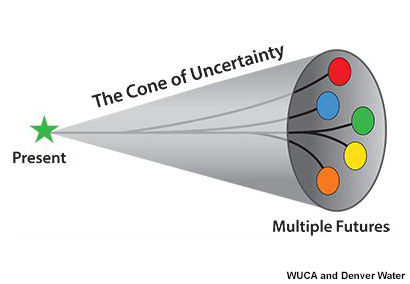
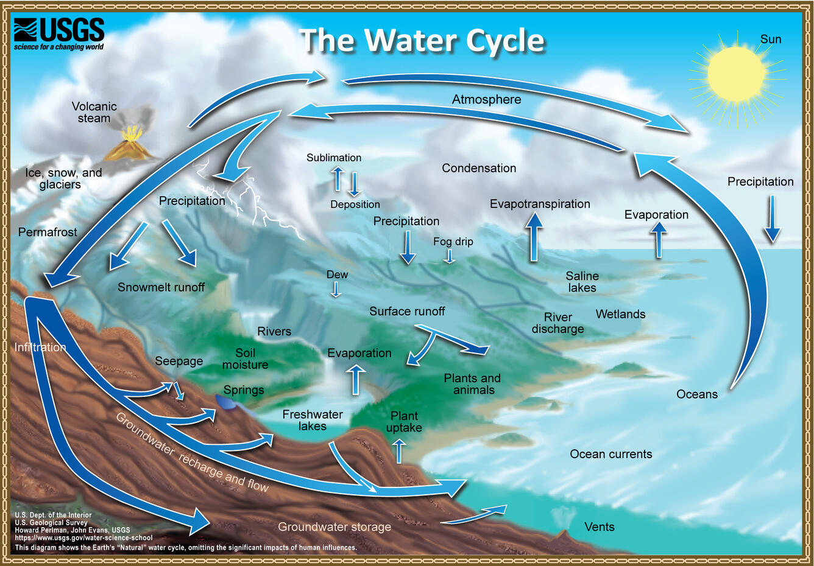
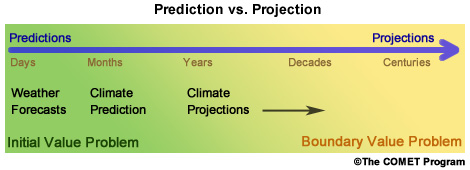

.. vim: syntax=rst

Chapter 2 Climate and Water Availability Assessments
======================

2.1 Water Availability Assessments
----------------------------------

Understanding what climate elements are important in water availability
assessments help us focus our efforts when completing climate change
impact studies. Climate changes, particularly changes in temperature and
precipitation, have a direct impact on two key elements of the
hydrologic cycle: evaporation and precipitation. Other elements of the
hydrologic cycle—snowmelt, runoff, streamflow, and storage—are
consequently impacted. It is also important to understand other,
non-climate related attributes of climate change scenarios (e.g.
socio-economic projections, land use change assumptions, etc.) that will
impact water availability. While this climate primer will only cover
attributes and the use of the climate change scenarios, it is also
important to mention that projected changes in elements outside climate
change scenarios, such as changes in water management systems (e.g.
diversions, storage, demand side management), will also impact future
water availability. These are often evaluated in Integrated Assessment
Models.

|image3|

Perlman, Howard and Evans, John. The Natural Water Cycle (JPG). USGS.
https://www.usgs.gov/media/images/natural-water-cycle-jpg OCTOBER 16,
2019

**Issues with spatial and temporal covariance**

a. Issues with spatial and temporal covariance

b. Thresholds/extremes, weather typing

   1. Important variables

      a. P,T,

c. Culling ensembles

d. Applying climate deltas (e.g., temperature warming)

e. Land use / land cover

f. Socio-economic aspects

g. Preparation for running impacts models for climate change impacts:

1. Surface water hydrology

2. Crop irrigation water requirements

3. Inland water temperature

4. Sediment transport

5. Long term planning of water resources

2.2 What is needed for science and research support
-----------------------------------------------------
*Note: This following section is summarized from COMET MetEd's* `Climate and Water Resource Management Part 2 <https://www.meted.ucar.edu/education_training/lesson/1245>`_

2.2.1 Define the problem/objective
^^^^^^^^^^^^^^^^^^^^^^^^^^^^^^^^^^

With any scientific research tasked to consider climate change, the
starting point is to ask: what is the central aim of the study?
For example:

-  How often might water temperatures in streams be too dangerous for
   aquatic life in the 2050-2080 period?

-  Why might we fail to reach water delivery targets in the 2070-2100 period?

-  What are the chances of dropping below reservoir low-pool levels for
   more than one consecutive year in the 2040-2070 period?

Each of these questions is examining the impacts of a future climate on
a system performance measure. Below are example measures for these questions. 
Water managers, scientific experts (e.g., aquatic biologists), and 
stakeholders are all good resources for defining these performance measures. 
The problem and performance measures should be defined early in the study to 
inform selection of datasets and models that are optimal (in terms of resolutions, 
accuracies, uncertainties) for the problem and target metrics.

+-------------------------------------------------+-----------------------+
| **Research Question**                           | **System Performance  |
|                                                 | Measures**            |
+=================================================+=======================+
| How often might water temperatures              | Threshold maximum     |
| in streams be too dangerous for aquatic life    | water temperature     |
| in the 2050-2080 period?                        | and threshold         |
|                                                 | exposure duration     |           
+-------------------------------------------------+-----------------------+
| Why might we fail to reach water delivery       | Annual water          |
| targets in the 2070-2100 period?                | delivery targets      |
+-------------------------------------------------+-----------------------+
| What are the chances of dropping below          | Reservoir low-pool    |
| reservoir low-pool levels for more than one     | threshold             |
| consecutive year in the 2040-2070 period?       |                       |
+-------------------------------------------------+-----------------------+

2.3.2 What is relevant, reliable, and practical?
^^^^^^^^^^^^^^^^^^^^^^^^^^^^^^^^^^^^^^^^^^^^^^^^

Once you’ve defined your research questions and objectives, there are three
primary questions to answer when scoping a study that involves the
integration of climate change information:

1. What is relevant?

   a. Identify which climate impacts and climate-derived data are
      important. The answer will likely vary depending on the research topic
      and specific decisions that need to be made.

2. What is reliable?

   a. There is a varying degree of confidence in projected climate and
      climate-derived data. You must consider which set of climate
      projection data to rely on and which potential climate futures to
      consider.

3. What is practical?

   a. The realities of the project, such as the availability of
      resources, time, and personnel.

The answer to these questions are closely related to the specifics of the 
project goals, location, and stakeholder needs, and can vary from project to
project. You will need to balance the relevancy of the data and its
reliability with the practicality of implementation.

.. dropdown:: What is relevant?
    
    Simply stated, the “\ **what is relevant**\ ” question asks you to identify which 
    climate impacts and climate-derived data are important. The answer will likely vary 
    depending on the research topic and specific decisions that need to be made.        
    When determining what data are relevant to a study, you should consider:

    1. Climate data that describe potential future climate conditions relevant to the study goals.

    2. System performance measures that are relevant.

    For a specific watershed, snowmelt may be more relevant to seasonal streamflow and groundwater recharge than rainfall. Therefore, projections of snowpack and snowmelt would be very useful.

    Here are some of the data derived, at least in part, from temperature and precipitation projections:

    -  Snow, snowpack, and seasonal snowmelt

    -  Water demand (agricultural or municipal)

    -  Potential evaporation and evapotranspiration

    -  Streamflow (and streamflow extremes)

    -  Severe drought

    -  Severe flood

    -  Sediment generation and transport

    -  Water temperature

    -  Water chemistry

  
    **Examples of relevant data for different studies**                   
                                                                           
     Relevant data for *Reservoir Operations* focused on the frequency of  
     dropping below a particular reservoir pool elevation may include:     
                                                                           
     -  Precipitation                                                      
                                                                           
     -  Temperature                                                        
                                                                           
     -  Evaporation                                                        
                                                                           
     -  Snow water equivalent                                              
                                                                           
     -  Streamflow                                                         
                                                                           
     Relevant data for *long-term planning* may include:                   
                                                                           
     -  Temperature trends and the potential future range                  
                                                                           
     -  Precipitation trends and the potential future range                
                                                                           
     -  Drought                                                            
                                                                           
     -  Flood (both common and extreme)                                    
                                                                           
     Relevant data for *species recovery and adaptive management* may      
     include:                                                              
                                                                           
     -  Water quality (water temperature, water chemistry,          
        sediment)                                                          
                                                                           
     -  Temperature trends and the potential future range                  
                                                                           
     -  Precipitation trends and the potential future range                
                                                                           
     -  Drought                                                            
                                                                           
     -  Flood                                                              
                                                                           
     Relevant data for *infrastructure* may include:                   
                                                                           
     -  Flood (extreme)                                        
                                                                           
     -  Drought                                                            
                                                                           
     -  Water quality issues (water temperature, water chemistry,          
        sediment)                                                          

.. dropdown:: What is reliable?
    
    The “\ **what is reliable”** question recognizes that there are varying degrees of confidence in projected climate and climate-derived data. In understanding what is reliable you should think about the following:

    -  Balance reliability with relevancy

    -  Consider time horizons for the study

    -  Use historical observations to help determine reliability

    You should consider which set of climate projection data to rely on and which potential climate futures to consider. Issues of reliability and uncertainty, and how they depend on time-horizon, spatial-scale, and means or extremes of a climate variable, are also discussed in `Chapter 3 <https://ncar.github.io/climate-primer-water/baselines.html>`_ of this primer.

    Given the inherent uncertainty in climate projections, when considering climate futures, you may need to strike a balance between using climate data that is relevant and using data that is reliable enough for the purpose and particulars of your project. For example, highly uncertain data may be fine for a project exploring system vulnerabilities to potential climate change scenarios but may be far too unreliable to underpin an infrastructure investment.

    Balancing Reliability With Relevancy

    |image1|

    How do you determine which data are reliable enough to be trusted with answering the questions posed by the project? Here the challenge is to determine how reliable data needs to be for you to consider it “reliable enough” for inclusion as potential future climate data.

    On a relative scale of reliability, average long-term temperature trends are the most reliable. In addition, many projects require future temperature-derived information, such as frequency of heat waves, seasonal snow, and potential evaporation. These are less reliable but still considered relatively reliable at representing potential future climate. The slightly lower rating is due to the need for more time- and space-specific information, and the influence of less reliably projected phenomena such as precipitation, wind, and cloudiness.

    Precipitation projections are more uncertain, but may still be relatively reliable on larger regional scales and for long-term averages. Depending on your research questions, objectives such as long-term planning, reservoir operations, and adaptive management may still benefit from precipitation data that are only moderately reliable at describing potential future climates.

    For specific short-duration, local-area precipitation and precipitation-derived variables, reliability is much lower. Yet these data are highly relevant to research questions related to extreme precipitation and runoff thresholds. Since extremes, by definition, occur rarely, you need to represent low-probability, high consequence events in a potential future climate.

    Other approaches may help with extracting the most reliable possible information about local extremes, such as those related to the study time period and/or the use of historical observations.

    A study’s time horizon may help minimize some of the reliability issues when dealing with highly uncertain climate variables. Consider the cone below, where the lines and colored circles represent the hypothetical futures for five climate projections. The left side represents the current time, the right side 2100.

    |image2|

    Historical observations may be used to increase our confidence in using variables with high uncertainty by providing context about the range of future conditions. This issue is also discussed in `Chapter 3 <https://ncar.github.io/climate-primer-water/baselines.html>`_ of this primer. Historical observations fall into two categories:

    -  Those from the period of instrumentation, which contains directly measured amounts and timing as well as trends

    -  Paleo observations from ice cores, tree rings, alluvial deposits, or other proxy data, which provide estimates from before the period of instrumentation

    The historical record of temperature, precipitation, snowfall, and other variables can be merged with projected trends to provide an estimate of the time sequencing of events, such as drought and flood, in potential future climates. Although the past is not a perfect predictor of the future sequencing of climate events, it may be the most reliable guidance for informing research questions that need that kind of information. An example of how this sequencing is carried out is provided in `Chapter 5 <https://ncar.github.io/climate-primer-water/downscaling.html>`_. This can be very important for objectives such as reservoir operations, long-term planning, and species recovery, where the regularity and frequency of events, like severe drought, are relevant and need the most reliable guidance.

.. dropdown:: What is practical?
    
    The “\ **what is practical**\ ” question is related to the realities of the project, such as the availability of resources, time, and personnel.
    Questions to think about include the following:

    -  Do you have the necessary resources and modeling capabilities?

    -  How might climate change affect your modeling approach?

    -  What climate change influences are practical to represent?

    Is it practical to expect that your study will sufficiently model system metrics? You may need to consider the following questions to answer that:

    -  Are the models needed to incorporate climate change readily available?

    -  How easy are they to run and how long do they take to run?

    -  What are the implications of having to link multiple models, for example, a hydrological model that produces water temperature with a reservoir operations model?

    The answers may determine whether the project has a good chance for successful completion.

    Climate change itself may influence the choices you make for modeling and analyzing data for your study. For example, water temperature in a stream that has been controlled by groundwater input historically may need to be controlled by reservoir releases in the future. Such a study may require detailed information about the time evolution of variables as the climate changes. Model issues may pose constraints, making certain approaches impractical given your project resources.

    Is it practical to consider multiple futures given the following:

    -  Resources and personnel available

    -  Desire for project partners to explore the range of possibilities

    -  Complexity and particular requirements for modeling the relevant influences

    In some cases, using a small set of climate change scenarios (such as a wet scenario and a dry scenario for long-term planning for water availability) may be the most practical approach for balancing multiple futures with limited resources. In this way, the study can explore a range of potential future climates with relatively low impacts on its resources. `Chapter 5 <https://ncar.github.io/climate-primer-water/downscaling.html>`_ of this primer will explore this issue further by providing an example of how this process is carried out.

2.2.3 Predictions vs. Projections vs. Scenarios vs. Storylines
^^^^^^^^^^^^^^^^^^^^^^^^^^^^^^^^^^^^^^^^^^^^^^^^^^^^^^^^^^^^^^

As we look towards the future, there are different ways to estimate what
it will look like. This section will provide a brief overview of the
different terms such as forecasts, predictions, projections, scenarios,
and narratives/storylines.

**Predictions vs. Projections**

Predictions and forecasts are probabilistic estimates of the future 
based on current conditions, with the expectation that decisions made today
will have little impact on the estimates. Climate predictions refers to 
the short-term evolution of a weather system from an initial state under 
constant boundary conditions. The initial value is represented by the initial 
states of the climate system, including ocean heat content, and surface snow and
ice cover. Predictions are associated with probability that can be verified.
At lead times of weeks to months, predictions are typically based on
both initial and boundary values. Climate predictions, such as seasonal
outlooks, El Niño forecasts, and seasonal hurricane outlooks, fall into
this category. 

Projection refers to how the statistical measures associated with a
climate system will change in response to changing boundary values.
Climate projections are generally framed as "if-then" statements where
decisions made today and in the future are expected to impacts estimates.
Projections, like predictions, may also be associated with
probabilities, but they often cannot be verified in time to provide
meaningful feedback to the climate modeling system.

+--------------------------------+--------------------------------+
| **Predictions and Forecasts**  | **Projections**                |
+================================+================+===============+
| Short-term evolution from      | "If-then" statements, with     |
| initial state with constant    | changing statistics in         |
| boundary conditions            | response to changing boundary  |
|                                | values                         |           
+--------------------------------+--------------------------------+
| Probability that can be        | Probability cannot be verified |
| verified                       | in time to provide meaningful  |
|                                | feedback                       |
+--------------------------------+--------------------------------+
| Examples: seasonal outlooks,   | Examples: end-of-century       |
| El Niño forecasts, and         | temperature increase range     |
| seasonal hurricane outlooks    |                                |
+--------------------------------+--------------------------------+

|image4|

**Scenarios**

Scenarios are projections of what potential futures look like. They
require context and are generally used in pairs (e.g., with and without
mitigation) or ensembles (e.g., the IPCC SSSP-RCP scenarios). There
are many different types of scenarios used in climate modeling, and 
many are linked.

**"Climate change scenario"** describes a set of possible mean
characteristics of a future climate; for example, hotter and wetter. 
Climate models are used to produce climate projections. Climate projections 
inform, or provide the detailed climate information needed for climate 
change scenarios. 

**“Emissions scenarios”** represent realistic pathways of greenhouse
gas concentrations given effects on the likely emissions rates due
to changes in anthropogenic factors. The emissions scenarios are the 
driving force, or cause; the climate change scenarios capture the effect. 
Emissions scenarios are used as boundary value input for climate models. 

**"Socioeconomic scenarios"** represent societal drivers, including 
impacts from demographic, economic, and technological factors.

**Narratives or Storylines**

`Shepherd et al. (2018) <https://doi.org/10.1007/s10584-018-2317-9>`_ 
define storylines (or narratives) as "physically self-consistent unfolding 
of past events, or of plausible future events or pathways." Storylines 
focus on understanding driving factors and impacts. They are useful 
when orienting towards stakeholder decision-making and policy, which are 
often driven by impactful events. Storylines are also useful for "bottom-up" 
approaches where you want to work backward from a particular event and "stress test"
the system with compounding drivers (e.g., climate change and urbanization).

An example use of storylines for water availability assessments is provided in
`Chapter 8 <https://ncar.github.io/climate-primer-water/casestudies.html>`_

2.2.4 Paradigm (Process)
^^^^^^^^^^^^^^^^^^^^^^^^

|image5|

The process to prepare data for running climate change impact models 
includes four main steps.

We start with questions about how climate change might affect future
water resources. The first step is to develop a basic recognition
of key terminology and processes for global climate modeling. Then we
develop regionally applicable climate projections, determine climate
change scenarios and select associated climate projections to inform
them, and finally develop "climate-adjusted weather" inputs for each of
the climate change scenarios.

This last step will result in the inputs for models that simulate future
impacts on surface hydrology and crop irrigation requirements.

It is important to remember that this process is just one way to prepare
climate change impacts. There are a number of other methods, each with
their own strengths and weaknesses.

2.2.5 Bias Correction/Downscaling Overview
^^^^^^^^^^^^^^^^^^^^^^^^^^^^^^^^^^^^^^^^^^

Errors occur in most models. Some errors have consistency in their
patterns or recurrence. For example, a climate model may consistently
simulate too little precipitation when compared to the observed values.
In this case the model has a dry bias. A bias is more easily removed
than random errors. Removing bias helps us improve confidence in climate
projections.

In addition to bias correction, spatial downscaling is often done to
make climate simulations more regionally relevant. Downscaling allows
aspects of climate change to be presented on a spatial scale that is
useful for analyzing and simulating climate impacts. Regions where local
manifestations of climate patterns result from complex topography or
coastal interfaces may find downscaling a necessity.There are many
spatial downscaling methods, but they can generally be classified into
two categories: 1) statistical, and 2) dynamical.

References:
Shepherd, T.G., Boyd, E., Calel, R.A. et al. Storylines: an alternative approach to representing uncertainty in physical aspects of climate change. Climatic Change 151, 555–571 (2018). https://doi.org/10.1007/s10584-018-2317-9

.. |image1| image:: media/ch2/image3.png
   :width: 6.5in
   :height: 3.30556in

.. |image5| image:: media/ch2/image1.png
   :width: 6.5in
   :height: 3.94444in
