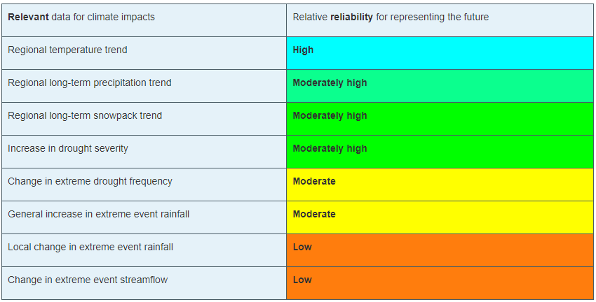

.. vim: syntax=rst

Chapter 2 Introduction
======================

2.1 Climate Primer Motivation: Empathy Interviews
-------------------------------------------------

The purpose of this Climate Primer is to provide succinct guidance to
the USGS on how climate and climate change information can be most
useful, focusing on the needs and priorities of the Water Mission Area
(WMA) . There is a proliferation of climate and climate change data
available, and this Primer is meant to help navigate what can be an
overwhelming amount of information. To help guide the development of the
Primer, the NCAR team conducted hour-long interviews with 6 members of
the WMA which included research hydrologists and a data
scientist/ecologist. The goal of the interviews was to understand how
USGS scientists are using climate and climate change information in the
WMA, questions and struggles they have with using the information, and
what type of support would be most useful to them regarding climate and
climate change information.

The following is a list of questions that were discussed in the
interviews.

1) What is the main water concern you are working on (e.g., groundwater
   / surface water interactions, salinity, ecological flows)? Why is it
   important? How does climate impact that component?

2) How do you and/or your organization view climate change (e.g. it’s
   important and we need to include it; we would like to include it but
   not sure of best approach or are resource-constrained; it is not one
   of our top concerns)

3) Have you used climate and climate change information (observations or
   weather/climate forecasts or climate change model “runs”)? If so, how
   have you used them ? What was your best/worst experience with using
   climate and climate change information?

4) What time horizon do you plan for?

5) What are you most curious about/least understand/want to know more
   about concerning climate change in general, and with respect to
   climate change information being provided by the IPCC/CMIP/climate
   change modeling community?

6) Do you have enough background knowledge on climate science to be
   dangerous?

7) Any final thoughts/feedback on the primer and/or interview
   process/etc that you’d like to share?

The interviews resulted in rich discussions on the focus and goals of
the USGS Water Mission Area along with where there may be gaps in
expertise and what would be most useful from the perspective of those
interviewed. Below is a summary of areas where the USGS Water Mission
has focused their work and areas where this group could use more
guidance on how to understand and use climate and climate change data..

**Main water concerns USGS Water Mission Area is working on**\ *:*

-  Coordinating broad water availability assessments - historic and
   future

   -  Supply, demand, quality

   -  Components of water cycle (precip, evap, soil moisture,
      streamflow, surface water, groundwater)

-  Water budget components (dissolved solids, groundwater/surface water
   interactions, water quantity and quality)

-  Land use and management impacts on water

-  Past and future snow impacts

-  Stream and lake temperatures, salinity, nitrates

-  Number of times/days thresholds are exceeded

-  Spatial and temporal covariability

**Desired information from a climate primer**

-  Basics of climate change data

   -  How to evaluate datasets

      -  Which are good for past vs future analysis

      -  Are some ‘better’ than others and if so, why?

   -  Where to obtain datasets, scripts to help with downloading and
      converting datasets

   -  Understanding downscaling

   -  Uncertainties, bias’s, limitations

      -  How to characterize and put a number to uncertainties

      -  Understand how bias’s impact results

-  Recommendations for good observational datasets

-  Provide a ‘standardized approach’ for using climate and climate
   change information

   -  How to go from observation to climate change impacts

   -  What to do if there are data gaps

-  High level overview to understand main issues

   -  How to decipher what is ‘real’ and what to trust in literature

   -  Glossary of terms

-  Guidelines on how to present outputs in a reasonable way

   -  Understanding of attribution (what was from climate vs other
      issues)

-  How to combine multiple future projections of other variables…i.e.
   Future land use with future climate change

2.2 What is needed for “science and research” support
-----------------------------------------------------

2.2.1 Define the problem/objective.
~~~~~~~~~~~~~~~~~~~~~~~~~~~~~~~~~~~

With any scientific research tasked to consider climate change, the
starting point is to simply ask what is the central aim of the study..
These can be as simple as:

-  How often might water temperatures in streams be too dangerous for
   aquatic life in the 2050-2080 period?

-  How and why might instream flow targets not be achievable out into
   the future?

-  What is the study’s time horizon of analysis? 2020 to 250? 2020 to
   2100? Other time periods? in the 2070-2100 period?

-  What are the chances of dropping below reservoir low pool levels for
   more than one consecutive year in the 2040-2070 period?

Each of these questions is examining the impacts of a future climate on
a system performance measure. Here are the measures for the questions.

+-------------------------------------------------+--------------------+
| **Study Questions**                             | **System           |
|                                                 | Performance        |
|                                                 | Measures**         |
+=================================================+====================+
| How often might water temperatures in streams   | Threshold maximum  |
| be too dangerous for aquatic life in the        | water temperature  |
| 2050-2080 period?                               |                    |
+-------------------------------------------------+--------------------+
| Why might we fail to reach water delivery       | Annual water       |
| targets in the 2070-2100 period?                | delivery targets   |
+-------------------------------------------------+--------------------+
| What are the chances of dropping below          | Reservoir low pool |
| reservoir low pool levels for more than one     | threshold          |
| consecutive year in the 2040-2070 period?       |                    |
+-------------------------------------------------+--------------------+

2.2.1.1 What is relevant, reliable and practical
^^^^^^^^^^^^^^^^^^^^^^^^^^^^^^^^^^^^^^^^^^^^^^^^

Once you’ve defined your study questions and objectives, there are three
primary questions to answer when scoping a study that involves the
integration of climate change information:

1. What is relevant?

   a. Identify which climate impacts and climate-derived data are
      important. The answer will likely vary depending on the mission
      area and specific decisions that need to be made.

2. What is reliable?

   a. There is a varying degree of confidence in projected climate and
      climate-derived data. We must consider which set of climate
      projection data to rely on and which potential climate futures to
      consider

3. What is practical?

   a. The realities of the project, such as the availability of
      resources, time, and personnel.

The answer to these questions are closely related to the
specifics of the study goals and needs, and can vary from study to
study. You will need to balance the relevancy of the data and its
reliability with the practicality of implementing the study.

.. dropdown:: What is relevant?
    
    {{Simply stated, the “\ **what is relevant**\ ” question asks you to identify which climate impacts and climate-derived data are important. The answer will likely vary depending on the mission area and specific decisions that need to be made.        
When determining what data are relevant to a study, you should consider:

1. Climate data that describe potential future climate conditions
   relevant to the study goals

2. System performance measures that are relevant

For a specific watershed, snowmelt may be more relevant to seasonal
streamflow and groundwater recharge than rainfall. Therefore,
projections of snowpack and snowmelt would be very useful.

Here are some of the data derived, at least in part, from temperature
and precipitation projections:

-  Snow, snowpack, and seasonal snowmelt

-  Water demand (agricultural or municipal)

-  Potential evaporation and evapotranspiration

-  Streamflow (and streamflow extremes)

-  Severe drought

-  Severe flood

-  Sediment generation and transport

-  Water temperature

-  Water chemistry

+-----------------------------------------------------------------------+
| **Examples of relevant data for different studies**                   |
|                                                                       |
| Relevant data for *Reservoir Operations* focused on the frequency of  |
| dropping below a particular reservoir pool elevation may include:     |
|                                                                       |
| -  Precipitation                                                      |
|                                                                       |
| -  Temperature                                                        |
|                                                                       |
| -  Evaporation                                                        |
|                                                                       |
| -  Snow water equivalent                                              |
|                                                                       |
| -  Streamflow                                                         |
|                                                                       |
| Relevant data for *long-term planning* may include:                   |
|                                                                       |
| -  Temperature trends and the potential future range                  |
|                                                                       |
| -  Precipitation trends and the potential future range                |
|                                                                       |
| -  Drought                                                            |
|                                                                       |
| -  Flood (both common and extreme)                                    |
|                                                                       |
| Relevant data for *species recovery and adaptive management* may      |
| include:                                                              |
|                                                                       |
| -  Water quality issues (water temperature, water chemistry,          |
|    sediment)                                                          |
|                                                                       |
| -  Temperature trends and the potential future range                  |
|                                                                       |
| -  Precipitation trends and the potential future range                |
|                                                                       |
| -  Drought                                                            |
|                                                                       |
| -  Flood                                                              |
|                                                                       |
| Relevant data for i\ *nfrastructur*\ e may include:                   |
|                                                                       |
| -  Flood (those that are rare)                                        |
|                                                                       |
| -  Drought                                                            |
|                                                                       |
| -  Water quality issues (water temperature, water chemistry,          |
|    sediment)                                                          |
+=======================================================================+
+-----------------------------------------------------------------------+
}}
:::
::::

**What is reliable?**
'''''''''''''''''''''

The “\ **what is reliable”** question recognizes that there is a varying
degree of confidence in projected climate and climate-derived data. In
understanding what is reliable we should think about the following:

-  Balance reliability with relevancy

-  Consider time horizons for the study

-  Use historical observations to help determine reliability

We must consider which set of climate projection data to rely on and
which potential climate futures to consider.The issues of reliability
and uncertainty and how they depend on time-horizon, spatial-scale, and
means or extremes of a climate variable is also discussed in Chapter III
of this primer.

Given the inherent uncertainty in climate projections, when considering
climate futures, you may need to strike a balance between using climate
data that is relevant and using data that is reliable enough for the
purpose and particulars of your study. For example, highly uncertain
data may be fine for a study exploring system vulnerabilities to
potential climate change scenarios but may be far too unreliable to
underpin an infrastructure investment.

Figure X Balancing Reliability With Relevancy

|image1|

How do you determine which data are reliable enough to be trusted with
answering the questions posed by the scoping study? Here the challenge
is to determine how reliable data needs to be for us to consider it
“reliable enough” for inclusion as potential future climate data.

On a relative scale of reliability, average long-term temperature trends
are the most reliable. In addition, many mission areas require future
temperature-derived information, such as frequency of heat waves,
seasonal snow, and potential evaporation. These are less reliable but
still considered relatively reliable at representing potential future
climate. The slightly lower rating is due to the need for more time- and
space-specific information, and the influence of less reliably projected
phenomena such as precipitation, wind, and cloudiness.

Precipitation projections are more uncertain but may still be relatively
reliable on larger regional scales and for long-term averages. Depending
on your study questions, mission areas such as Long-term Planning,
Reservoir Operations, and Adaptive Management may still benefit from
precipitation data that are only moderately reliable at describing
potential future climates.

Once we are considering specific short-duration, local-area
precipitation and precipitation-derived variables, reliability is much
lower. Yet, these data are highly relevant to study questions related to
extreme precipitation and runoff thresholds. Since extremes, by
definition, occur rarely, we need to represent low-probability, high
consequence events in a potential future climate.

Other approaches may help with extracting the most reliable possible
information about local extremes, such as those related to the study
time period and/or the use of historic observations.

A study’s time horizon may help minimize some of the reliability issues
when dealing with highly uncertain climate variables. Consider the cone
below, where the lines and colored circles represent the hypothetical
futures for five climate projections. The left side represents the
current time, the right side 2100.

|image2|

Historical observations may be used to increase our confidence in using
variables with high uncertainty by providing context about the range of
future conditions. This issue is also discussed in Chapter III of this
primer. Historic observations fall into two categories:

-  Those from the period of instrumentation, which contains directly
   measured amounts and timing as well as trends

-  Paleo observations from ice cores, tree rings, alluvial deposits, or
   other proxy data, which provide estimates from before the period of
   instrumentation

The historical record of temperature, precipitation, snowfall, and other
variables can be merged with projected trends to provide an estimate of
the time sequencing of events, such as drought and flood, in potential
future climates. Although the past is not a perfect predictor of the
future sequencing of climate events, it may be the most reliable
guidance for informing study questions that need that kind of
information. An example of how this sequencing is carried out is
provided in Chapter V .This can be very important for mission areas such
as Reservoir Operations, Long-term Planning, and Species Recovery, where
the regularity and frequency of events, like severe drought, are
relevant and need the most reliable guidance.

**What is practical?**
''''''''''''''''''''''

The “\ **what is practical**\ ” question is related to the realities of
the project, such as the availability of resources, time, and personnel.
Questions to think about include the following:

-  Do you have the necessary resources and modeling capabilities?

-  How might climate change affect your modeling approach?

-  What climate change influences are practical to represent?

Is it practical to expect that your study will sufficiently model system
metrics? You may need to consider the following questions to answer
that:

-  Are the models needed to incorporate climate change readily
   available?

-  How easy are they to run and how long do they take to run?

-  What are the implications of having to link multiple models, for
   example, a hydrological model that produces water temperature with a
   reservoir operations model?

The answers may determine whether the study has a good chance for
successful completion.

Climate change itself may influence the choices you make for modeling
and analyzing data for your study. For example, water temperature in a
stream that has been controlled by groundwater input historically may
need to be controlled by reservoir releases in the future. Such a study
may require detailed information about the time evolution of variables
as the climate changes. Model issues may pose constraints, making
certain approaches impractical given your project resources.

Is it practical to consider multiple futures given the following:

-  Resources and personnel available

-  Desire for study partners to explore the range of possibilities

-  Complexity and particular requirements for modeling the relevant
   influences

In some cases, using a small set of climate change scenarios (such as a
wet scenario and a dry scenario for long term planning for water
availability) may be the most practical approach for balancing multiple
futures with limited resources. In this way, the study can explore a
range of potential future climates with relatively low impacts on its
resources. Chapter V of this primer will explore this issue further by
providing an example of how this process is carried out.

2.2.2. Water Availability Assessments
~~~~~~~~~~~~~~~~~~~~~~~~~~~~~~~~~~~~~

Understanding what climate elements are important in water availability
assessments help us focus our efforts when completing climate change
impact studies. Climate changes, particularly changes in temperature and
precipitation, have a direct impact on two key elements of the
hydrologic cycle: evaporation and precipitation. Other elements of the
hydrologic cycle—snowmelt, runoff, surface streamflow, and storage—are
consequently impacted. It is also important to understand other,
non-climate related attributes of climate change scenarios (e.g.
socio-economic projections, land use change assumptions, etc.) that will
impact water availability. While this climate primer will only cover
attributes and the use of the climate change scenarios, it is also
important to mention that projected changes in elements outside climate
change scenarios such as changes in water management systems (e.g.
diversions, storage, demand side management) will also impact future
water availability. These are often evaluated in Integrated Assessment
Models.

|image3|

Perlman, Howard and Evans, John. The Natural Water Cycle (JPG). USGS.
https://www.usgs.gov/media/images/natural-water-cycle-jpg OCTOBER 16,
2019

Issues with spatial and temporal covariance
'''''''''''''''''''''''''''''''''''''''''''

a. Issues with spatial and temporal covariance

b. Thresholds/extremes, weather typing

   1. Important variables

      a. P,T,

c. Culling ensembles

d. Applying climate deltas (e.g., temperature warming)

e. Land use / land cover

f. Socio-economic aspects

g. 

Preparation for running impacts models for climate change impacts:

1. Surface water hydrology

2. Crop irrigation water requirements

3. Inland water temperature

4. Sediment transport

5. Long term planning of water resources

2.2.3. Predictions vs. Projections vs. Scenarios, vs. Narratives and Storylines
~~~~~~~~~~~~~~~~~~~~~~~~~~~~~~~~~~~~~~~~~~~~~~~~~~~~~~~~~~~~~~~~~~~~~~~~~~~~~~~

As we look towards the future, there are different ways to estimate what
it will look like. This section will provide a brief overview of the
different terms such as forecasts, predictions, projections, scenarios,
and narratives.

-  Predictions and Forecasts

   -  Short-term evolution from initial state with constant boundary
      conditions

   -  Probability that can be verified

      -  Examples: seasonal outlooks, El Niño forecasts, and seasonal
         hurricane outlooks

-  Projections

   -  Changing statistics in response to changing boundary values

   -  Probability cannot be verified in time to provide meaningful
      feedback

      -  Examples:

-  Scenarios

   -  “Climate change scenario" describes a set of possible mean
      characteristics of a future climate;

      -  Examples: hotter and wetter.

   -  “Emission scenarios” represent realistic pathways of greenhouse
      gas concentrations given effects on the likely emissions rates due
      to changes in anthropogenic factors.

      -  Shared Socio-Economic Pathways (SSPs)

         -  Examples: impacts from demographic, economic, and
            technological factors.

   -  

-  Narratives/storylines

   -  ???

Predictions vs Projections
''''''''''''''''''''''''''

At lead times of weeks to months, predictions are typically based on
both initial and boundary values. Climate "predictions" such as seasonal
outlooks, El Niño forecasts, and seasonal hurricane outlooks fall into
this category. The initial value is represented by the initial states of
the climate system, including ocean heat content, and surface snow and
ice cover.

Predictions:

-  Short-term evolution from initial state with constant boundary
   conditions

-  Probability that can be verified

Projections:

-  Changing statistics in response to changing boundary values

-  Probability cannot be verified in time to provide meaningful feedback

Think of the difference between predictions and projections in the
following way: Prediction refers to the short-term evolution of a
weather system from an initial state under constant boundary conditions.
Predictions are associated with probability that can be verified.

Projection refers to how the statistical measures associated with a
climate system will change in response to changing boundary values.
Projections, like predictions, may also be associated with
probabilities, but they often cannot be verified in time to provide
meaningful feedback to the climate modeling system.

|image4|

Scenarios
'''''''''

The term "climate change scenario" describes a set of possible mean
characteristics of a future climate; for example, hotter and wetter. The
emissions scenarios are the driving force, or cause; the climate change
scenarios capture the effect. Emissions scenarios are used as boundary
value input for climate models. Climate models are used to produce
climate projections. Climate projections inform, or provide the detailed
climate information needed for climate change scenarios.

2.2.4 Paradigm (Process)
~~~~~~~~~~~~~~~~~~~~~~~~

|image5|

The process to prepare data for running impacts models for climate
change impacts includes four main steps.

We start with questions about how climate change might affect future
water resources. Then, the first step is to develop a basic recognition
of key terminology and processes for global climate modeling. Then we
develop regionally applicable climate projections, determine climate
change scenarios and select associated climate projections to inform
them, and finally develop "climate-adjusted weather" inputs for each of
the climate change scenarios.

This last step will result in the inputs for models that simulate future
impacts on surface hydrology and crop irrigation requirements.

It is important to remember that this process is just one way to prepare
climate change impacts. There are a number of other methods, each with
their own strengths and weaknesses.

2.2.5. Bias Correction/Downscaling Overview
~~~~~~~~~~~~~~~~~~~~~~~~~~~~~~~~~~~~~~~~~~~

Errors occur in most models. Some errors have consistency in their
patterns or recurrence. For example, a climate model may consistently
simulate too little precipitation when compared to the observed values.
In this case the model has a dry bias. A bias is more easily removed
than random errors. Removing bias helps us improve confidence in climate
projections.

In addition to bias correction, spatial downscaling is often done to
make climate simulations more regionally relevant. Downscaling allows
aspects of climate change to be presented on a spatial scale that is
useful for analyzing and simulating climate impacts. Regions where local
manifestations of climate patterns result from complex topography or
coastal interfaces may find downscaling a necessity.There are many
spatial downscaling methods, but they can generally be classified into
two categories: 1) statistical, and 2) dynamical.

.. |image2| image:: media/ch2/image5.png
   :width: 4.27083in
   :height: 2.95833in
.. |image3| image:: media/ch2/image4.png
   :width: 6.5in
   :height: 4.52778in
.. |image4| image:: media/ch2/image2.png
   :width: 4.89583in
   :height: 1.77083in
.. |image5| image:: media/ch2/image1.png
   :width: 6.5in
   :height: 3.94444in
