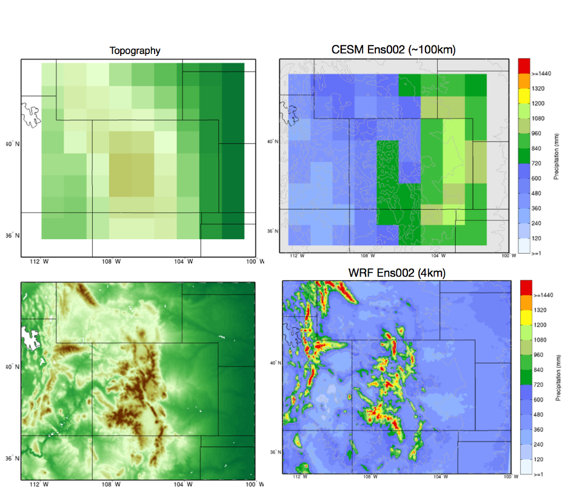

==========================================
Chapter 6: Place-Based Climate Projections
==========================================

6.1 Introduction
================

Despite continuing improvements in Global Climate Models (GCMs) and
computational capabilities of high-performance computers, the spatial
resolution of the current suite of GCMs is typically too coarse for
direct use in project-specific applications. For example, the spatial
resolution of the GCMs included in the most recent Coupled Model
Intercomparison Project Phase 5 and 6 (CMIP5 and CMIP6) ranged from
approximately 0.5 degree to 4 degrees in horizontal resolution
(approximately 50 km to 400 km) (Taylor et al., 2012:mark:`;` ). To
overcome resolution issues, downscaling is a common approach for
translating the climate change signals represented by climate models to
changes in meteorological parameters at the regional and local scales.
Downscaling bridges the gap between the coarse resolution of climate
models and the finer scale needed for impact assessments on water
resources, agriculture, ecosystems, and other sectors. Figure 1 compares
simulated precipitation results from a coarse resolution GCM against a
high resolution regional model, where it is evident that the high
resolution model is capable of resolving important meteorological
processes resulting in a much more realistic characterization of
precipitation (GUTMANN, NCAR).

Downscaling involves techniques aimed at enhancing the spatial and
temporal resolution of data obtained from GCMs. Downscaling is critical
for hydrologic analysis, which greatly benefits from high-resolution
climate data, with scales of few kilometers and hourly to daily
timesteps.

Downscaling techniques are broadly categorized into two main types:
statistical and dynamical, although there are many examples where both
techniques are used together to improve the performance of the regional
climate information. Several downscaling techniques are available, from
simple statistical methods, to computationally intensive dynamical
modeling approaches, and new machine learning methods (). While each
method has its pros and cons, as noted in our conclusion, it's important
to recognize that while these methods can enhance detail based on
broader scale simulations, the majority cannot influence the larger
scale dynamics that actually occur in the climate system. However, new
generations of climate models are addressing this issue, with some GCMs
run at 5 kilometer resolution globally, and a new generation of models
employing unstructured grids, which allows for high resolution in places
of interest (e.g. the Sierra or Rocky Mountains) and lower resolution
where detailed fields are not needed (i.e. the Oceans). Given that it
takes considerable effort to develop high quality, useful climate
datasets, practitioners have generally made use of datasets that are
developed by the climate science community, with data distributions
generally made available through accessible data portals.

|image1|

Downscaling from coarse resolution grids of global earth systems models,
with resolutions of about 100 km, to fine scales of a high resolution
regional model (~4km resolution), where the left top panels show the
representative topography and the resulting precipitation over the Rocky
Mountains of Colorado, while the bottom two panel are the high
resolution topography and associated precipitation pattern over the same
region for the high resolution model.

6.2 Approaches to downscaling
=============================

There are a multitude of techniques for translating coarse resolution
GCM into fine-scale, local meteorological data that is useful in
hydrologic modeling and analysis. A summary of the overall approaches to
downscaling are shown in Figure 6.1, suggesting a degree of complexity
of methods and approaches, with ‘simpler’ approaches on the left to more
complex and computational intensive approaches to the right. Downscaling
techniques include fairly simple “Delta Change” methods, to more
sophisticated statistical methods that increasingly make use of machine
learning, and dynamical methods, which make use of physical/process
based models. Statistical downscaling uses statistical or mathematical
relationships to refine coarse GCM output to a finer scale, while
dynamical downscaling employs more detailed regional climate models to
resolve finer-scale features. These models use the GCM output as
boundary conditions to enhance resolution over typically smaller spatial
areas.

Recent developments in machine learning have introduced new methods that
blend some of the benefits and drawbacks of both statistical and
dynamical approaches. These techniques are applicable for enhancing both
spatial and temporal resolution. In statistical methods, the
modifications to spatial and temporal data can usually be handled
separately, while dynamical downscaling allows for a flexible temporal
resolution, since RCM’s simulate the full 3-dimensional atmosphere that
conserves mass, energy, and momentum and represents the energy budget.
Statistical downscaling is typically not computationally expensive nor
does it typically require large amounts of computing power or data
storage, while dynamically downscaling typically requires High
Performance Computing (HPC), which is both computationally and data
intensive. The Figure attempts to summarize from the simplest (left), to
the most complex (right). This is certainly not exhaustive and there are
likely other approaches that are represented by this figure.

|image2|

Figure 1. A summary of the various downscaling methods and their
general. The

6.2.1 Statistical Downscaling
-----------------------------

Statistical downscaling techniques can be employed to enhance both the
temporal and spatial resolution of data, making it more applicable for
hydrologic modeling applications. There are various statistical methods
available, each utilizing statistical relationships between broad-scale
climate variables from General Circulation Models (GCMs) and observed
local climate data to create finely tuned projections for specific
areas. For instance, one might use high-resolution observed data and
average it across the coarser grid squares of a GCM. On days when
temperature and humidity in the observed, coarse data match those in the
GCM data, it can be assumed that the high-resolution temperature and
precipitation patterns for that day in the GCM will mirror those of the
similar days in the observed data. Statistical downscaling methods
include delta change (or change factor) methods, regression techniques,
weather generators, and weather classification strategies (Ekstrom et
al., 2015). Each method has its own set of strengths and weaknesses, as
detailed in Table 1.

*Some advantages and disadvantages of statistical downscaling include:*

Statistical downscaling depends on the availability and quality of
historical observational data for calibration. In regions with limited
or poor-quality historical data, statistical downscaling might be
limited. ​Generally, the methods create relationships between
historically observed climate and climate simulations from GCM output,
whereby the assumption that the historical relationships will hold into
the future.

Delta Change Methods
^^^^^^^^^^^^^^^^^^^^

A simple, but informative method to explore climate change sensitivity
of hydrologic systems is referred to as the “Delta Change” approach. It
starts by exploring the observational record of climate variables like
temperature, precipitation, wind speed, and others. This dataset
represents the "baseline" or reference period. Then change factors are
derived from global climate models, providing projections of how these
climate variables might change in the future under various greenhouse
gas concentration scenarios.

Delta change factors are derived as the difference between the future
climate projections of the GCMs against a historical baseline (usually
averages over a specified reference period) and these differences, or
deltas, are typically in terms of changes in mean temperature,
precipitation amounts, etc., are then applied to the historical data to
create adjusted datasets. For example, if the delta for temperature is a
+2°C increase, this change is added to the historical temperature
records to generate a "future" dataset.

Non-Parametric Methods
^^^^^^^^^^^^^^^^^^^^^^

In the context of downscaling global climate models (GCMs),
"non-parametric" downscaling refers to statistical approaches that do
not make assumptions about the underlying probability distributions of
the variables involved. Instead, they use more flexible statistical
techniques that can capture complex, nonlinear relationships between
variables. Resampling techniques include bootstrap resampling or Monte
Carlo resampling methods that can be used to generate ensemble datasets
that represent uncertainty in the downscaling process without relying on
specific parametric assumptions

Non-parametric downscaling methods offer advantages in capturing complex
relationships and handling non-linearities in the climate system, which
may be particularly important when downscaling GCM outputs to local or
regional scales where these relationships can be highly variable.
However, they may also require serially complete, spatially dense, and
long-length datasets and can be more computational demand than
parametric methods.

Some of the more common Non-Parametric techniques include:

**The Locally Constructed Analog (LOCA) method**, which constructs local
analogs by identifying days in the historical observational record with
similar large-scale climate patterns to those simulated by the climate
model. The selected analogs are weighted based on their similarity to
the target pattern and then interpolated to the desired observational
grid.Focuses on single-variable analogs, with a primary emphasis on
spatial patterns and high-resolution consistency with observations.

**The Multivariate Adaptive Constructed Analogs (MACA**) downscaling
method identifies analog days in the historical record that closely
match the multivariate climate conditions of each day in the GCM
simulations. These analogs are selected based on multiple climate
variables (e.g., temperature, precipitation) to ensure a comprehensive
representation of climate conditions. Once the analog days are
identified, their observed weather patterns are used to construct a
high-resolution climate dataset corresponding to the GCM projections.
This involves combining the observed data from the analog days with the
simulated data to generate downscaled outputs. MACA is considered
“adaptive” as it allows for the ability to adjust the selection of
analog days over time and space, ensuring that the downscaling remains
relevant as climate conditions evolve. The primary difference between
MACA uses a multivariate approach to downscaling, considering multiple
climate variables simultaneously to construct analogs.

**Machine learning approaches** such as support vector machines, random
forests (He et al. 2016), neural networks, and kernel-based methods can
be used to learn the relationship between large-scale and local-scale
climate variables from historical data without assuming a specific
functional form. A Machine Learning method by Benton et al. (2022)
demonstrates how a neural network can be used to generate high spatial
and temporal resolution wind and solar data from GCMs (Creswell et al.,
2018). The approach uses generative adversarial networks or (GANs),
which is trained on observed wind and solar data at 4-km hourly
resolution against the same meteorological fields at 100-km resolution
to learn the relationship between these variables across spatial scales.
The model is then applied to downscale 100-km daily GCM output to 4 km
hourly resolution, with the assumption that the relationships are the
same in observational and GCM data, and will hold into the future.

**The Bias-Correction-Spatial Disaggregation (BCSD)** is a well
established method of statistical downscaling, whereby climate model
outputs are corrected for systematic biases compared to observed data,
which are then spatially interpolated to a finer grid. The bias
correction usually entails quantifying the difference between the model
output and observed data, often using quantile mapping, which matches
the cumulative distribution functions (CDFs) of the model data with the
observations. Spatial interpolation methods such as (e.gbilinear
interpolation, nearest-neighbor interpolation) are then applied to the
bias corrected data at the GCM scale to a finer grid.

**The K Nearest Neighbor algorithm**, The k-Nearest Neighbor (k-NN)
method is another statistical downscaling technique used to refine
coarse-resolution climate model outputs to finer spatial resolutions.
This approach relies on the similarity between observed and modeled data
patterns to generate high-resolution climate projections. A unique
aspect of K-NN is the ability to craft scenario ‘narratives’, that are
conditioned off of particular attributes of a GCM, such as drier and
warmer, or ‘much drier and warmer (Yates et al. 2005). The K-NN

Parametric Methods
^^^^^^^^^^^^^^^^^^

Parametric statistical downscaling employs statistical models that
assume a specific functional form or distribution for the relationship
between large-scale climate variables (predictors) and local-scale
climate variables (predictands). These methods are called "parametric"
because they involve fitting parameters of a predefined statistical
model to the data. The parameters of the statistical model establish the
relationship between large-scale climate variables (such as 500 millibar
height, vertically integrated moisture, etc.) simulated by GCMs and
local-scale climate variables at the downscale level (such as
temperature and precipitation at specific locations). These parametric
methods typically involve fitting regression models, such as linear
regression or multiple linear regression, to historical climate data to
establish the relationship between large-scale and local-scale
variables.

A well established, statistical downscaling approach has been developed
by Rob Wilby. Known as the Statistical DownScaling Model, SDSM is a
climate scenario generation tool that uses a multiple linear regression
technique to establish statistical relationships between large-scale
predictors (such as those from GCMs) and local climate variables such as
daily precipitation and temperature (predictands). The tool is available
online, well documented in terms of understanding and implementation,
and can be freely downloaded from the SDSM website
(https://sdsm.org.uk/). SDSM has been used globally for various
applications, including water resource management, flood risk
assessment, and urban climate studies​.

GCM output that has been spatially downscaled and bias-corrected can
help address the scale issue, but only in areas where extensive local
climatic records are available to support the downscaling and bias
correction process. A range of different downscaling approaches

have been developed, ranging from simple delta approaches, whereby the
historical meteorological record is simply incrementally adjusted, to
more sophisticated statistical methods that relate large-scale
atmospheric processes to local scale observations.

For hydrologic applications, the target variables are most often -
Precipitation, Maximum and Minimum Temperature, Maximum and Minimum
Relative Humidity, Windspeed, and Solar Radiation. Ideally, these are at
a daily timestep, with some datasets available sub-daily.

Table 1. Statistical downscaling approaches

.. list-table:: Table 1. Statistical Downscaling Approaches
   :widths: 25 25 25 25
   :header-rows: 1

   * - Downscaling Method
     - Pros
     - Cons
     - Tools/Data Available?
   * - Delta Change
     - Simple to implement. Insightful in terms of sensitivity.
     - Not physically consistent. Unrealistic physical change.
     - Generally method is simple enough to be directly used in a hydrologic model.
   * - MACA- Multivariate Adaptive Constructed Analogs (MACA)
     - Considers multiple climate variables simultaneously.
     - Relies on quality of observational record. Needs a long obs record. More sophisticated due to multi-variate aspect.
     - A github R code is available: https://github.com/earthlab/cft
   * - LOCA- Locally Constructed Analogs
     - Simpler in terms of handling single variables.
     - Relies on a high quality observational historical dataset (similar to MACA).
     - https://loca.ucsd.edu/
   * - Bias-Correction Spatial Disaggregation (BCSD)
     - Maintains the statistical properties of historical observations (also a pro).
     - The spatially interpolated data can not represent spatial heterogeneity. Extremes are under-sampled.
     - https://ds.nccs.nasa.gov/thredds/catalog/AMES/NEX/GDDP-CMIP6/catalog.html
   * - K-Nearest Neighbor (K-NN)
     - Simple and robust methods. Varying ways to implement to generate future climate projections.
     - Relies on a high quality observational historical dataset (similar to MACA).
     - Both R and Python offer extensive KNN packages for generating downscaled data
   * - AI and Machine Learning
     - Robust and efficient. Powerful in finding relationships among variables. Computationally efficient.
     - Assumes historical relationships will hold into the future. Can be difficult to implement and somewhat of a ‘black-box’.
     - Both R and Python offer extensive machine learning.
   * - Parametric Statistical Downscaling
     - Statistically rigorous. Autocorrelation and cross-correlations between large-scale variables.
     - More effort to implement. Need to develop statistical relationships. Selection of predictors should be explored.
     - https://www.sdsm.org.uk/sdsmmain.html; https://climate-scenarios.canada.ca/?page=pred-cmip6

6.2.2 Dynamical Downscaling
---------------------------

Dynamical downscaling involves the combined use of both global and
regional climate models (RCMs) to achieve higher spatial resolution and
in some cases temporal resolution, over specific geographic areas.
Traditionally, RCMs take outputs from GCMs as boundary
conditions—assuming GCM data to be accurate at the edges of the RCM’s
domain—and provide more detailed regional climate information. While
RCMs can be applied to any location, their high-resolution design makes
them computationally intensive, typically limiting their application to
regions a few thousand kilometers on a side, given sufficient resources.
Despite this computational demand, RCMs offer enhanced flexibility in
variable outputs and maintain more physically consistent results.
However, RCM-downscaled outputs can retain biases from the GCM inputs
and may introduce additional uncertainties. This reality means that RCM
datasets typically require an additional post-processing step typically
in the form of a bias correction. Nevertheless, RCMs can improve the
representation of fine-scale weather variability influenced by local or
micro-climate conditions, which are crucial for understanding extreme
weather events impacting the power sector. These benefits and the
challenges related to information transfer between GCMs and mesoscale
models are thoroughly discussed in Hong & Kanamitsu (2014).

Similar to statistical downscaling, many institutions provide publicly
available dynamically downscaled products. However, these products often
have limitations regarding the number of years, scenarios, regions, and
variables they cover. The Coordinated Regional Climate Downscaling
Experiment (CORDEX) is one such product, designed to evaluate regional
climate model performance through a series of experiments, including
generating regional climate projections (Giorgi & Gutowski, 2015).
Although CORDEX is readily accessible, its primary focus on model
intercomparison means that other dynamically downscaled products might
be better suited for specific regions and applications. In addition,
CORDEX data have historically been relatively coarse in spatial
resolution (> 25 km), and thus not well suited for regional hydrologic
applications, where spatial gradients and their influence on weather and
climate are critical to represent.

Intermediate Complexity Models
^^^^^^^^^^^^^^^^^^^^^^^^^^^^^^

Fully dynamical Global and Regional Climate models are expensive to run,
as they have a substantial computation requirement for simulating both
past and future climate. A novel alternative to the full physics models
are what is known are intermediate complexity models, One such model is
NSF NCAR’s ICAR- The Intermediate Complexity Atmospheric Research (ICAR)
model- which is a simplified atmospheric model designed primarily for
climate downscaling and atmospheric sensitivity testing. ICAR is a
quasi-dynamical downscaling approach that uses simplified wind dynamics
to perform high-resolution meteorological simulations 100 to 1000 times
faster than a traditional atmospheric model and can therefore be used to
better characterize uncertainty across numerical weather prediction
models and climate models, and in dynamical downscaling
(https://github.com/NCAR/icar).

Pseudo Global Warming
^^^^^^^^^^^^^^^^^^^^^

The PGW approach involves modifying historical weather data with
future climate change signals derived from global climate models (GCMs)
to simulate specific weather events under future climate conditions.
This method allows researchers to isolate the effects of climate change
on weather events by comparing the outcomes of the modified
(pseudo-warmed) simulations against the original historical data. The
steps typically involved in the PGW approach are:

* to add more
* to add more

6.2.3 Variable Resolution GCM
-----------------------------

|image3|

.. _section-1:

6.2.4 Pre and Post- Processing of Climate Models
------------------------------------------------

Bias Correction
^^^^^^^^^^^^^^^

A reality of both GCMs and RCMs is the fact that both are prone to
biases due to our limited ability to represent the true state of the
climate system, as our representation of model physics,
parameterizations, and initial conditions are imperfect and the climate
system is chaotic (Lorenz 1963). These biases can significantly affect
the accuracy and reliability of the downscaled climate projections. To
address this, bias correction techniques are employed. Bias correction
involves adjusting the model outputs to better match observed data.
There are two primary stages at which bias correction can be applied:
pre-bias correction and post-bias correction.

While dynamical downscaling with regional climate models (RCMs) helps
refine the coarse resolution outputs global climate models (GCMs), both
GCMs and RCMs are prone to biases due to imperfections in model physics,
parameterizations, and initial conditions. These biases can
significantly affect the accuracy and reliability of the downscaled
climate projections. To address this, bias correction techniques are
employed. Bias correction involves adjusting the model outputs to better
match observed data. There are two primary stages at which bias
correction can be applied: pre-bias correction and post-bias correction.

**Pre-bias correction is applied before the dynamical downscaling
process**. This involves adjusting the outputs of the GCMs before they
are used as boundary conditions for the RCMs. The advantage of pre-bias
correction is that it ensures the inputs fed into the RCMs are already
adjusted for biases, which can lead to more accurate boundary conditions
and potentially more accurate downscaled outputs. This method helps in
aligning the large-scale drivers with observed data, which can be
particularly beneficial in regions where the RCMs' performance is highly
sensitive to the accuracy of the boundary conditions.

**Post-bias correction is applied after the dynamical downscaling
process**. This method involves adjusting the outputs of the RCMs to
match observed data. The main advantage of post-bias correction is that
it directly targets the biases in the high-resolution climate
projections produced by the RCMs. This approach allows for the
correction of biases introduced at both the GCM and RCM stages.
Post-bias correction can be more flexible and targeted, as it deals
directly with the final outputs that are used for impact studies and
decision-making. In summary, both pre- and post-bias correction
techniques are essential for improving the reliability of downscaled
climate projections. Pre-bias correction ensures that the inputs to RCMs
are more accurate, potentially enhancing the overall downscaling
process. Post-bias correction directly addresses the biases in the final
high-resolution outputs, ensuring that the downscaled projections are
more aligned with observed data. The choice between pre- and post-bias
correction, or a combination of both, depends on the specific
requirements of the study and the characteristics of the region and
models being used.

6.3 References
==============

He, X., Chaney, N. W., Schleiss, M., & Sheffield, J. (2016).
Spatial downscaling of precipitation using adaptable random forests.
*Water resources research*, *52*\ (10), 8217-8237.

Lorenz, Edward N. (March 1963). `"Deterministic Nonperiodic
Flow" <https://doi.org/10.1175%2F1520-0469%281963%29020%3C0130%3Adnf%3E2.0.co%3B2>`__.
*Journal of the Atmospheric Sciences*. **20** (2): 130–141.

Pinto, James O., Andrew J. Monaghan, Luca Delle Monache, Emilie
Vanvyve, and Daran L. Rife. "Regional assessment of sampling techniques
for more efficient dynamical climate downscaling." Journal of climate
27, no. 4 (2014): 1524-1538.

Kotamarthi, R., Hayhoe, K., Mearns, L. O., Wuebbles, D., &
Jacobs, J. (2021). Dynamical Downscaling. In Downscaling Techniques for
High-Resolution Climate Projections (pp. 64-81). Cambridge University
Press. DOI: 10.1017/9781108601269.005

PRECIS Model Usage for China’s Extreme Temperatures. (2024).
Sustainability, 16(7), 3030. DOI: 10.3390/su16073030

Wilby, R. L., et al. (2004). Statistical downscaling of general
circulation model output: A case study. Climate Research, 27, 211-229.
DOI: 10.3354/cr027211

Hempel, S., Frieler, K., Warszawski, L., Schewe, J., & Piontek,
F. (2013). A trend-preserving bias correction – the ISI-MIP approach.
Earth System Dynamics, 4(2), 219-236. DOI: 10.5194/esd-4-219-2013

Moore, N., & Luo, L. (2021). Dynamical and statistical
downscaling for hydrological predictions. Hydrology and Earth System
Sciences, 25, 1205-1225. DOI: 10.5194/hess-25-1205-2021

Kuswanto, H., et al. (2021). Bias correction methods for climate
impact projections. Journal of Climate, 34(5), 1751-1767. DOI:
10.1175/JCLI-D-20-0506.1

McSweeney, C. F., & Jones, R. G. (2016). The effect of bias
correction on future climate projections. Climatic Change, 134, 635-646.
DOI: 10.1007/s10584-015-1565-3

Pielke, R. A., et al. (2012). Dynamical downscaling: Assessment
of value retained and added using the Regional Atmospheric Modeling
System (RAMS). Journal of Geophysical Research: Atmospheres, 117,
D05127. DOI: 10.1029/2011JD016630

Giorgi, F., & Mearns, L. O. (1999). Introduction to special
section: Regional climate modeling revisited. Journal of Geophysical
Research: Atmospheres, 104(D6), 6335-6352. DOI: 10.1029/98JD02072

Christensen, J. H., & Christensen, O. B. (2003). Severe
summertime flooding in Europe. Nature, 421(6925), 805-806. DOI:
10.1038/421805a

Leung, L. R., & Qian, Y. (2003). The sensitivity of precipitation
and snowpack simulations to model resolution via dynamical downscaling
of GCM output. Journal of Hydrometeorology, 4(6), 1025-1043. DOI:
10.1175/1525-7541(2003)004<1025>2.0.CO;2

Laprise, R. (2008). Regional climate modeling. Journal of
Computational Physics, 227(7), 3641-3666. DOI:
10.1016/j.jcp.2006.10.024

Xu, Z., et al. (2020). Regional climate modeling for Australia:
past performance and future projections. Climate Dynamics, 54,
3239-3263. DOI: 10.1007/s00382-020-05152-3

Feser, F., & Barcikowska, M. (2013). The influence of spectral
nudging on typhoon formation and path in regional climate models.
Climate Dynamics, 41, 1025-1045. DOI: 10.1007/s00382-013-1746-x

Di Luca, A., et al. (2013). Comparison of statistical and
dynamical downscaling of precipitation over Australia from a global
climate model. Journal of Geophysical Research: Atmospheres, 118(12),
585-604. DOI: 10.1002/jgrd.50139

Liu, C., et al. (2012). Dynamical downscaling of precipitation
and temperature changes over China using a regional climate model with
two parameterization schemes. Climate Dynamics, 39, 345-365. DOI:
10.1007/s00382-012-1412-5

Torma, C., et al. (2015). On the added value of regional climate
modeling: Does a high-resolution model improve the simulation of
precipitation? Monthly Weather Review, 143(2), 476-496. DOI:
10.1175/MWR-D-14-00034.1

Gao, X. J., et al. (2011). A comparison of downscaling techniques
for producing high-resolution climate projections: application to the
Yellow River basin, China. Climate Research, 47, 197-209. DOI:
10.3354/cr00981

Evans, J. P., & McCabe, M. F. (2013). Effect of model resolution
on a regional climate model simulation over southeast Australia. Climate
Research, 56, 131-145. DOI: 10.3354/cr01152

Teutschbein, C., & Seibert, J. (2012). Bias correction of
regional climate model simulations for hydrological climate-change
impact studies: Review and evaluation of different methods. Journal of
Hydrology, 456-457, 12-29. DOI: 10.1016/j.jhydrol.2012.05.052

.. |image1| image:: media/ch6/image3.png
   :width: 6.5in
   :height: 5.625in
.. |image2| image:: media/ch6/image2.png
   :width: 6.28671in
   :height: 3.03912in

