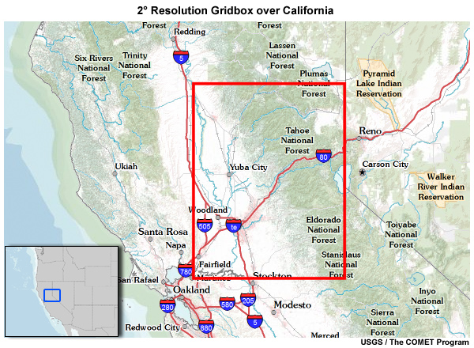
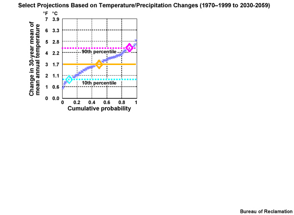

.. vim: syntax=rst

Chapter 8: Pulling it Altogether-Case Studies – Case Study 2: Preparing Hydro-climate Inputs for Climate Change in Water Resource Planning
==========================================================================================================================================

Problem Statement: You have been asked to prepare temperature and
precipitation future climate data inputs for general use in impact
models for climate change impacts, such as:

-  Surface water hydrology

-  Crop irrigation water requirements

-  Inland water temperature

-  Sediment transport

-  Long term planning of water resources

|image1|

Climate changes, particularly changes in temperature and precipitation,
have a direct impact on two key elements of the hydrologic cycle:
evaporation and precipitation. Other elements of the hydrologic
cycle—snowmelt, runoff, surface streamflow, and storage—are consequently
impacted. We will focus on the development of temperature and
precipitation inputs (focusing on amount, not phase) that can be used
for modeling the other elements of the hydrologic cycle.

|image2|

The process presented here includes four main steps. We start with
questions about how climate change might affect future water resources.
Then, the first step is to develop a basic recognition of key
terminology and processes for global climate modeling, much of which we
covered earlier in this primer, but review key terms here. Then we
develop regionally applicable climate projections, determine climate
change scenarios and select associated climate projections to inform
them, and finally develop "climate-adjusted weather" inputs for each of
the climate change scenarios. This last step will result in the inputs
for models that simulate future impacts on surface hydrology and crop
irrigation requirements.

It is important to remember that this process is just one way to prepare
climate change impacts. There are a number of other methods, each with
their own strengths and weaknesses.

STEP 1. Climate Terms
=====================

:mark:`The terms and acronyms below will be important to understand as
we go through this case study:.`

-  Climate – :mark:`It is sometimes said, "Climate is what you expect,
   weather is what you get." **Climate** is the statistical
   representation of weather over days, months, seasons, years, decades
   and longer.`

-  Weather – :mark:`describes the details of what we experience over the
   course of hours and days.`

-  Predictions – A weather **prediction**, or forecast, describes the
   near-term likelihood of a weather event such as a specific occurrence
   of rain or snow and/or the expected change in temperature. A weather
   forecast, for example, might read, "colder with a 70% chance of snow
   this afternoon." A climate prediction, on the other hand, might call
   for below average precipitation and near average temperature over the
   next 30 days.

-  Projections – :mark:`Climate models do predict specific weather
   events many years into the future, but not with the intention for use
   as time and site-specific forecasts. Rather, the intended use of
   climate model output is to generate statistics of weather phenomena,
   such as means and variability of precipitation or temperature, and
   thus to characterize the collective impact of weather events. These
   climate predictions are typically referred to as **projections**, or
   **simulations**, and lack the short-term specificity of weather
   predictions. Think of the difference between predictions and
   projections in the following way: Prediction refers to the short-term
   evolution of a weather system from an initial state under constant
   boundary conditions. Predictions are associated with probability that
   can be verified. Projection refers to how the statistical measures
   associated with a climate system will change in response to changing
   boundary values. Projections, like predictions, may also be
   associated with probabilities, but they often cannot be verified in
   time to provide meaningful feedback to the climate modeling system.`

-  Initial values – :mark:`To distinguish weather predictions versus
   climate projections, we use the terms **initial value** problem
   versus **boundary value** problem. Weather predictions are primarily
   initial value problems. For example, a Numerical Weather Prediction
   (NWP) model will use the initial value, based on observed conditions,
   and predict how those conditions will evolve with time. When we are
   looking at hours and days we are clearly in the weather prediction
   end of the spectrum where initial values are highly important. The
   initial value is represented by the initial states of the climate
   system, including ocean heat content, and surface snow and ice
   cover.`

-  Boundary values and climate forcings – :mark:`With climate models,
   boundary values are increasingly important. The term "boundary
   values" is used to describe the factors that serve to limit the
   possible outcomes in a system.` :mark:`Boundary values, sometimes
   referred to as climate forcings, describe the physical states of the
   Earth-atmosphere-ocean system that are prescribed to simulate natural
   and human-influenced processes. When we are considering years,
   decades, and centuries into the future, we are talking about the
   projection end of the spectrum, where boundary values are more
   important than initial values.`

-  Anthropogenic – :mark:`Natural boundary values, or climate forcings
   of a climate simulation would include, but are not limited to,
   changes in volcanic aerosol concentrations, solar insolation cycles,
   and sea surface temperatures. Human-influenced, also called
   "*anthropogenic*", boundary value variables would include changes in
   greenhouse gas concentrations and alterations of land surfaces.`

-  Emissions scenarios – This refers to storylines of possible future
   changes in greenhouse gas concentrations in the IPCC reports prior to
   Assessment Report 5. The different possible changes described by
   these storylines are often referred to as "pathways."

-  Climate change scenarios – describes a set of possible mean
   characteristics of a future climate; for example, hotter and wetter.
   The emissions scenarios are the driving force, or cause; the climate
   change scenarios capture the effect. So an example of an emissions
   scenario would be: CO\ :sub:`2` concentration will increase to 550
   parts per million, (ppm) by 2050 and 700 ppm by 2100—as shown in the
   middle emisions scenario on the left. A corresponding climate change
   scenario would be: global mean temperature will increase steadily by
   2°C by 2050 and almost 3°C by 2100.

-  SRES – Special Report on Emissions Scenarios

-  RCP – Representative Concentration Pathway

-  GCM – General Circulation Model, sometimes called Global Climate
   Model

-  ESM – "coupled Earth System Model" or "coupled climate model", where
   there are land, cryospheric, atmosphere, and ocean component models.
   Note the previously-used term “:mark:`coupled atmosphere-ocean
   general circulation model”, or AOGCM, which just highlighted the
   atmosphe and ocean components.`

-  IPCC – International Panel on Climate Change

STEP 2. Develop Regionally Applicable Climate Projections
=========================================================

|image3|

:mark:`In this STEP2, we will process coarse-scale ESM projection data
to make it more relevant for regional applications. Specifically, we
will focus on developing regionally applicable climate projection data
through bias correction, and downscaling. We will be using the
Bias-Correction and Spatial Downscaling methodology, or BCSD. This
method has been applied to the multi-model data set represented in the
IPCC Assessment Report 4, AR4 (noting that the most recent report is
IPCC Assessment Report 4, AR6).`

**:mark:`Model Resolution Considerations`**
~~~~~~~~~~~~~~~~~~~~~~~~~~~~~~~~~~~~~~~~~~~

|image4|

:mark:`In this graphic of December–January–February precipitation, the
observations are used to produce a high spatial resolution 4-km grid.
ESM precipitation is at a coarser grid, equivalent to gridboxes greater
than 312 km on each side (this is typical for AR4, noting that typical
AR6 model resolutions are higher, roughly ½ of this). This is too coarse
to adequately resolve even some of the larger drainage basins,
particularly where orographic effects impact precipitation distribution.
Through a process called downscaling we can create higher spatial
resolution, 36-km, for ESM precipitation.`

:mark:`Requirements for local assessments of hydrology and crop water
demands:`

-  :mark:`Model biases removed`

-  :mark:`Short time steps`

-  :mark:`High spatial resolution`

:mark:`Local assessments of hydrology and crop irrigation requirements
ideally require climate information in which there are no model biases.
In addition, many regional assessments require data that are output in
short time steps, with high spatial resolution to represent relatively
local regions.`

:mark:`There are trade-offs in confidence when global model output is
regenerated with high spatial resolution. The questions you are trying
to address should guide your requirements. In this case study, we will
take ESM data, bias-correct it, and downscale it to 1/8° with monthly
and daily time steps, appropriate for specific watershed areas.`

|image5|

:mark:`Although ESMs produce high temporal resolution output, such as
daily timesteps, these are not meant to be guidance for specific events.
Rather the simulation results are intended to be more reliable when
expressed statistically over longer time periods. Here we see the
30-year mean annual temperatures for three different future periods, and
three different emissions scenarios.`

:mark:`Considerations for time resolution choice`

-  :mark:`Errors in future simulations greater for shorter time steps`

-  :mark:`Balance the need for high resolution vs. sensitivity to
   uncertainty`

-  :mark:`Monthly time steps can be used to generate seasonal cycles`

:mark:`The choice of time step is typically a balance between the
sensitivity to uncertainty, and the need for high resolution in time. In
general, the higher the time resolution—that is, the smaller the time
steps—the less certainty there is in the results. Monthly time steps
have been chosen in many US Bureau of Reclamation studies as an
appropriate time resolution for climate projections. From monthly times
steps we can represent seasonal cycles.`

:mark:`Addressing spatial resolution needs for regional studies requires
developing spatial detail that does not exist in the raw ESM data. The
160-km grid resolution here represents one of the higher resolution AR4
models (noting again that many of the more current AR6 models have
significantly higher resolution than this). This resolution still
results in smoothing important terrain features that can be seen more
easily in the 48-km grid resolution of a regional climate model.`

|image6|

:mark:`For the various models that contribute to AR4, the spatial
resolution varies from gridbox sizes of 122 to 498 km on the side, with
a median of 312 km. This varies depending on latitude. The lack of high
spatial resolution makes it especially difficult to represent orographic
impacts, even for large watersheds.`

:mark:`Bias correction:`

-  :mark:`Removal of consistent, systematic error`

:mark:`Downscaling:`

-  :mark:`Accounting for local controls on regional climate`

-  :mark:`Reproduction of global projections on a finer spatial scale`

:mark:`Bias correction and downscaling are two issues typically
addressed together when relating global projections to local impacts
assessments. Bias correction is the removal of consistent, systematic
error in the model output. Downscaling involves accounting for local
controls on regional climate. The outcome of downscaling is to reproduce
global projections with higher spatial resolution to represent finer
scale basin processes. We will show a method that performs bias
correction before downscaling, but it may be performed after downscaling
depending on the downscaling method that is used.`

**:mark:`Bias Correction`**
~~~~~~~~~~~~~~~~~~~~~~~~~~~

:mark:`Here we are demonstrating bias correction of model data using
hypothetical data.`

|image7|

:mark:`Errors occur in ESMs as is the case with most models. Some errors
are random and difficult to adjust for. In this time series there is no
clear relationship between the observed and the projected monthly
precipitation.`

|image8|

:mark:`Other errors have consistency in their patterns or recurrence.
For example, the climate model may consistently simulate too little
precipitation. In this time series we can see that the projected April
monthly values are always too low when compared to the observed values.
In this case we have a dry bias. A bias is more easily removed than
random errors. Removing bias helps us improve confidence in climate
projections.`

**:mark:`Bias Correction: Historical Period`**
~~~~~~~~~~~~~~~~~~~~~~~~~~~~~~~~~~~~~~~~~~~~~~

|image9|

:mark:`In reality, model bias isn't typically corrected by one constant
adjustment factor. For example, model bias may be magnitude dependent.
In this time series comparing observed April monthly precipitation and
ESM-simulated April values for a 20-year historical period, we see that
the sign of simulation errors for the dry years is different than the
sign of simulation errors for the wet years. There is still a
consistent, systematic error, but the sign and magnitude of the error
depends on the precipitation value. In this case, the simulated dry
values are too wet and the simulated wet values are too dry.`

:mark:`So we need to quantify the bias correction across a range of
values. To do this we compare observed values to the simulated values
for the historical period. For precipitation, the bias correction will
be multiplicative based on the ratio of observed to simulated values.
The bias correction, when applied, should result in adjusted simulated
values that equal the observations. In this case, we will make the dry
simulated values wetter and the wet values drier.`

:mark:`Let's see how that works by first ranking the 20 simulated values
in the time series from lowest to highest. We will focus on the lowest,
middle and highest value in this example. The lowest simulated
value—rank number 1—is 5. The corresponding observed value is 3.`

:mark:`The bias correction factor would be 0.6 for the simulated value
for rank number 1.`

+--------------+--------------+-------------------+-------------------+
| *            | **:mar       | **:ma             | **:mark:`Bias     |
| *:mark:`Rank | k:`Simulated | rk:`Corresponding | correction        |
| of simulated | historical   | observed value`** | (observed /       |
| value`**     | value`**     |                   | simulated)`**     |
+==============+==============+===================+===================+
| :mark:`1`    | :mark:`5`    | :mark:`3`         | :mark:`0.60`      |
+--------------+--------------+-------------------+-------------------+
| :mark:`2`    | :mark:`5.5`  | :mark:`4`         | :mark:`0.73`      |
+--------------+--------------+-------------------+-------------------+
| :mark:`3`    | :mark:`5.5`  | :mark:`4`         | :mark:`0.73`      |
+--------------+--------------+-------------------+-------------------+
| :mark:`4`    | :mark:`6`    | :mark:`5`         | :mark:`0.83`      |
+--------------+--------------+-------------------+-------------------+
| :mark:`5`    | :mark:`6`    | :mark:`5`         | :mark:`0.83`      |
+--------------+--------------+-------------------+-------------------+
| :mark:`6`    | :mark:`6`    | :mark:`6`         | :mark:`1.00`      |
+--------------+--------------+-------------------+-------------------+
| :mark:`7`    | :mark:`6`    | :mark:`6`         | :mark:`1.00`      |
+--------------+--------------+-------------------+-------------------+
| :mark:`8`    | :mark:`6`    | :mark:`6`         | :mark:`1.00`      |
+--------------+--------------+-------------------+-------------------+
| :mark:`9`    | :mark:`6`    | :mark:`6`         | :mark:`1.00`      |
+--------------+--------------+-------------------+-------------------+
| :mark:`10`   | :mark:`6`    | :mark:`6`         | :mark:`1.00`      |
+--------------+--------------+-------------------+-------------------+
| :mark:`11`   | :mark:`6.5`  | :mark:`7`         | :mark:`1.08`      |
+--------------+--------------+-------------------+-------------------+
| :mark:`12`   | :mark:`6.5`  | :mark:`7`         | :mark:`1.08`      |
+--------------+--------------+-------------------+-------------------+
| :mark:`13`   | :mark:`6.5`  | :mark:`7`         | :mark:`1.08`      |
+--------------+--------------+-------------------+-------------------+
| :mark:`14`   | :mark:`6.5`  | :mark:`7`         | :mark:`1.08`      |
+--------------+--------------+-------------------+-------------------+
| :mark:`15`   | :mark:`6.5`  | :mark:`7`         | :mark:`1.08`      |
+--------------+--------------+-------------------+-------------------+
| :mark:`16`   | :mark:`7`    | :mark:`8`         | :mark:`1.14`      |
+--------------+--------------+-------------------+-------------------+
| :mark:`17`   | :mark:`7`    | :mark:`8`         | :mark:`1.14`      |
+--------------+--------------+-------------------+-------------------+
| :mark:`18`   | :mark:`7.5`  | :mark:`9`         | :mark:`1.20`      |
+--------------+--------------+-------------------+-------------------+
| :mark:`19`   | :mark:`7.5`  | :mark:`9`         | :mark:`1.20`      |
+--------------+--------------+-------------------+-------------------+
| :mark:`20`   | :mark:`8`    | :mark:`10`        | :mark:`1.25`      |
+--------------+--------------+-------------------+-------------------+

:mark:`The bias correction factor is the observed over the simulated
value, in this case 3 over 5, or 0.60. When the simulated value of 5 is
multiplied by 0.60, we get the observed value of 3.`

:mark:`Likewise, a simulated value in the middle of the observed
ranking—rank #10— is 6. The observed value is also 6. So the bias
correction is 6/6, or 1.00. Thus, there is no correction needed.`

:mark:`The highest simulated value is 8—rank #20— and the corresponding
observed value is 10. The resulting bias correction is 10/8, or 1.25.`

|image10|

:mark:`To help visualize a distribution of values we develop a
Cumulative Distribution Function, or CDF, from the time series data.`

:mark:`You can learn more about what CDFs are in the COMET module:
`Introduction to Verification of Hydrologic
Forecasts <https://www.meted.ucar.edu/training_module.php?id=486>`__,
section 2.`

:mark:`This CDF shows the probability of non-exceedance, expressed as
cumulative probability on the Y axis, versus the April monthly
precipitation amount on the X axis. Let's look at an example of how this
is read. For a cumulative probability of 0.80, the monthly precipitation
is 7.5. Since the CDF is based on non-exceedance probability, this means
that there is an 80 percent chance that the value of 7.5 won't be
exceeded. In other words, there is an 80% chance that precipitation will
be less than or equal to 7.5. Thus, 7.5 is in the top 20 percent of
values.`

:mark:`The monthly precipitation value of 4.5 would be associated with a
cumulative probability of 0.20.`

:mark:`This means that there is only a 20% chance that 4.5 won't be
exceeded. Thus 4.5 is in the lower 20% of the distribution of monthly
values.`

|image11|

:mark:`The red CDF represents values in a historical simulation. So the
blue is the observation-based CDF and the red CDF is simulation-based.
It is important to note that the space between the two CDFs provides a
visual depiction of the bias for each probability. Value-specific bias
correction factors are used to remove the bias. For example, if the
model simulates a value of 7.5, we see from the simulation-based CDF
that a simulated value of 7.5 has a cumulative probability of about
0.95. At that same cumulative probability, we see the observation-based
CDF gives us a value of about 9. Thus, all simulated values of 7.5,
including future values, will be bias corrected so that they will equal
9.`

:mark:`When the bias correction is applied, the CDF based on simulated
values will take on the shape of the observation-based CDF.`

:mark:`When we look at these two CDF plots together we see that the
simulation based CDF covers a much smaller range of values along the X
axis. The bias correction will expand the simulated spread to match the
observed spread.`

|image12|

:mark:`This is consistent with the time series view that shows a more
compressed spread for the simulation of the historical period. High
values from the simulation have a dry bias and low values have a wet
bias. The bias correction will adjust the simulation to match the
observation time series.`

|image13|

:mark:`The amount of adjustment needed to match the simulation based CDF
to the observation-based CDF provides us with a bias correction factor
for each probability.`

**:mark:`Bias Correction: Future Projections`**
~~~~~~~~~~~~~~~~~~~~~~~~~~~~~~~~~~~~~~~~~~~~~~~

:mark:`Bias-correction of future projections:`

1. :mark:`Assume same model bias for future simulations as for
   historical`

2. :mark:`Remove model bias in future projections without changing
   future trends`

:mark:`For future simulations, we will assume that the model has the
same bias as for the historical period, and will therefore use the same
bias correction factors derived for the historical simulations. The goal
is to remove model bias without changing the trends in the future
simulations.`

:mark:`There are four types of bias corrections for simulated data:`

-  :mark:`Overall shift to higher values`

-  :mark:`Overall shift to lower values`

-  :mark:`Expand the range of values so that higher values get higher
   and lower values get lower`

-  :mark:`Compress the range of values so that higher values get lower
   and lower values get higher`

|image14|

:mark:`In the example we have been considering, the bias correction is
expanding the range of values.`

|image15|

:mark:`Now what if the same model projection for a future simulation has
a CDF that looks like this? We assume it is simulating a range of values
that is too compressed, just as it did in the historical period.`

:mark:`We apply the bias correction factors derived from the historical
period and we get a bias-corrected future simulation that shows an
expanded range of values.`

:mark:`In the corresponding bias adjusted future time series, the values
have a larger range with even higher high values and lower low values.`

|image16|

:mark:`There are a variety of biases that can show up in model
projections. For example, a historical simulation—the red CDF—may show
that the model simulation is both too dry and it doesn't contain enough
spread in values as the observations—the blue CDF. Computed bias
correction factors in this case will increase all values and expand the
range in the historical simulation. When the same bias correction is
applied to future simulations we see in the time series that all values
are increased, and the range is expanded with the high values increasing
more than the low values.`

:mark:`Although there are different implementations, the widely accepted
method for bias correction, as illustrated here, typically involves
removing systematic error, based on performance of a model projection
during an observed historical period.`

:mark:`Important assumptions we make when using bias-corrected climate
projection data include:`

-  :mark:`There are no random errors in the climate projection data.`

   -  :mark:`In many cases the projection data will contain both
      systematic error (bias) and random error`

-  :mark:`The most appropriate emissions scenario was chosen for the
   projection data.`

   -  :mark:`The model projection data will only be as good as the model
      and its input data, such as the emissions scenarios.`

-  :mark:`There is stationarity in the physical processes affecting
   climate (the most important of the three)`

   -  :mark:`The assumption is that the current influences on climate
      variability represented by the historical observations will not
      change–that is, the influences will remain stationary in the
      future.`

   -  :mark:`There are limitations to assuming that the historical base
      period biases will be the same as the biases in the future
      projections.`

Spatial Downscaling
-------------------

:mark:`In addition to bias correction, spatial downscaling is often done
to make climate simulations more regionally relevant. Downscaling allows
aspects of climate change to be presented on a spatial scale that is
useful for analyzing and simulating climate impacts. Regions where local
manifestations of climate patterns result from complex topography or
coastal interfaces may find downscaling a necessity.`

**:mark:`Statistical versus Dynamic Downscaling`**
~~~~~~~~~~~~~~~~~~~~~~~~~~~~~~~~~~~~~~~~~~~~~~~~~~

:mark:`Downscaling: Two classifications of methodologies`

:mark:`Statistical`

-  :mark:`Advantages`

   -  :mark:`Statistically relates coarse resolution data to high
      resolution observed climate`

   -  :mark:`Computationally efficient, easier to generate scenario
      ensembles`

-  :mark:`Limitations`

   -  :mark:`Assumes stationarity in relationship between predictor and
      predictand`

:mark:`Dynamical`

-  :mark:`Advantages`

   -  :mark:`High resolution Regional Climate Model (RCM) to simulate
      regional climate`

   -  :mark:`Doesn’t depend on historical observations`

   -  :mark:`Ideally accounts for complex, non-stationary relationship
      between predictor and predictand`

-  :mark:`Limitations`

   -  :mark:`More computationally intensive`

   -  :mark:`Affected by errors in underlying ESM that provides boundary
      conditions`

   -  :mark:`Different RCMs give different results`

:mark:`There are many spatial downscaling methods, but they can
generally be classified into two categories: 1) statistical, and 2)
dynamical.`

:mark:`Statistical methods start with the coarse resolution ESM
information and statistically relate those data to the observed local
climate of the region. Statistical methods are more computationally
efficient. This makes it easier to generate an ensemble of projections
for a given climate change scenario. Statistical downscaling methods
assume a certain stationarity to the climate. For example, the
relationship between elevation, the predictor, and the resultant
snowpack distribution, the predictand, will be the same in the future as
in the past.`

|image17|

:mark:`Dynamical methods embed a high resolution Regional Climate Model
(RCM) within an ESM to simulate climate processes at spatial scales
finer than that of the driving ESM.`

:mark:`This provides the ability to better capture the effects of
terrain on precipitation and temperature over the region of interest.
Dynamical methods are not as bounded by the historical observations and
theoretically can represent non-stationarities in the relationship
between the predictors (temperature,precipitation, elevation) and the
predictand (snowpack). But they require more computer resources and they
still feature their own simulation biases much like the ESMs feeding
them input information.`

**:mark:`Spatial Downscaling: Statistical`**
~~~~~~~~~~~~~~~~~~~~~~~~~~~~~~~~~~~~~~~~~~~~

|image18|

:mark:`Consider this hypothetical situation where we have a coastal
plain, a mountain range, and an inland plain. The geographic location is
similar to the U.S. state of Oregon, so the coastal plain is wetter than
the inland plain and the coastal side of the mountains is wetter than
the inland side.`

|image19|

:mark:`In a high-resolution representation, we have a 6 X 6 grid.`

|image20|

:mark:`A 2 X 2 grid represents the coarser ESM resolution.`

|image21|

:mark:`This 2 X 2 figure shows a bias-corrected 30-year mean monthly
precipitation simulation, in mm, for a specific month. How do we
downscale this information to account for orographic effects?`

:mark:`The first step is to get an observation-based monthly climatology
with high spatial resolution for that same month.`

|image22|\ |image23|

:mark:`Here is the 6 X 6 grid of observation-based monthly climatology
values over the historical period for the same month as the future
simulation.`

|image24|\ |image25|

:mark:`In the next step we need to develop a common spatial resolution
for comparison of the future simulation with the historical climatology.
This step may seem counter-intuitive because we will take the high
resolution 6X6 observation grid and interpolate the values to a 2 X 2
grid. So, for example, the 9 grid boxes in the upper left quadrant will
be summed and divided by 9 to get a value of 40. The result, shown here
on the right, is a rather smoothed out, observed precipitation
climatology. Again, this is done so we can make comparisons with the
future period simulations that are produced on this scale. Later, we
will bring back the high-resolution climatology for the final
downscaling step.`

|image26|\ |image27|

|image28|

:mark:`e.g. For top-left quadrant: 36 ÷ 40 = 0.9`

:mark:`The next step is to quantify the relationship between the
simulated and observed data on the coarse 2 X 2 grid. This is done by
taking the ratio of the future simulated values over the
observation-based climatology to get a conversion factor. The conversion
factor shows that the observation-based climatology for the two grid
boxes on the left needs to be lowered to match the simulations values.
The observation-based climatology for the two grid boxes on the right
needs to be increased to match the simulation values.`

|image29|\ |image30|

:mark:`Next we want to map those conversion factors from the coarse grid
to the high resolution 6 X 6 grid.`

|image31|\ |image32|

|image33|

:mark:`In the final step, high-resolution observed precipitation
climatology is brought back. It is multiplied by the high resolution
conversion factor to get the high resolution simulated precipitation. So
what exactly was done in this last step? The conversion factor
represents the relationship between the observed and simulated datasets.
It therefore tells us how the observation-based grid needs to be
adjusted to represent a simulation with high spatial resolution. The
observation-based climatology grid provides the spatial detail that was
lacking in the simulated data.`

|image34|\ |image35|

:mark:`We developed this example with exactly the same area-averaged
precipitation for both the observed and projected precipitation so that
you can see how the final projection grid compares with the initial
observed grid. As you can see, the spatial downscaling method
illustrated here did capture the orographic impacts seen in the
observations. But it doesn't seem to do it perfectly because this
approach only approximates the orographic effect. Even with its
limitations, downscaling allows us to account for local controls on
climate.In the western United States, for example, this includes the
important influence of elevation and elevation gradient on both the
distribution of precipitation and whether it is rain or snow.`

**:mark:`Bias Correction and Spatial Downscaling (BCSD) Method - REAL DATA`**
~~~~~~~~~~~~~~~~~~~~~~~~~~~~~~~~~~~~~~~~~~~~~~~~~~~~~~~~~~~~~~~~~~~~~~~~~~~~~

:mark:`BCSD: Bias Correction and Spatial Downscaling methodology (Wood
et al. 2002)`

-  :mark:`Applied to projections produced by the ESMs in IPCC Assessment
   Reports`

:mark:`Although there are reasons for selecting one bias correction
and/or spatial downscaling methodology over another, for this case study
we have chosen to demonstrate a common methodology used in water
resources studies by the Bureau of Reclamation and many other entities.`

:mark:`The Bias-Correction and Spatial Downscaling methodology, or BCSD,
has been applied to climate projections produced by the AR models.`

:mark:`BCSD methodology:`

-  :mark:`Uses AR data from a variety of spatial resolutions`

-  :mark:`AR data re-gridded to common spatial resolution`

-  :mark:`Statistically downscales the common resolution to a higher
   spatial resolution`

:mark:`The ESM data from the Assessment Reports are at a variety of
spatial resolutions. In BCSD the data are re-gridded to a common spatial
resolution. After bias correction, the data are downscaled using a
statistical downscaling approach, resulting in a higher spatial
resolution.`

**:mark:`BCSD, Part 1: Bias Correction`**
~~~~~~~~~~~~~~~~~~~~~~~~~~~~~~~~~~~~~~~~~

:mark:`BCSD bias correction (here using older AR4 data, but AR6 data
could use the same approach)`

1. :mark:`Define a historical period: 1950–1999`

2. :mark:`Run climate projections for historical period and identify
   simulation bias`

3. :mark:`Correct for model simulation bias in historical period`

4. :mark:`Apply same bias correction to future climate simulations`

:mark:`Assumption: Biases in the future will be similar to that in the
historical base period`

:mark:`First, we will define our historical period as 1950–1999. We will
then run ESM simulations for the 1950–1999 historical period and
determine the sign and magnitude of bias associated with each
simulation. Next we'll correct for the bias in the historical period by
computing bias adjustment factors. Finally, we'll apply this same bias
adjustment to future period simulations.`

:mark:`Recall, an important assumption is that biases identified in the
historical period will represent those in future projected periods.`

|image36|

:mark:`Let's use ESM model projection data for December monthly
precipitation in a 2° X 2° gridbox in the central part of the U.S. state
of California.`

|image37|

:mark:`Here we see the ESM historical simulations (the light red lines)
from a coarse 2° spatial grid presented in a cumulative distribution
function plot with cumulative probability on the Y axis and December
precipitation totals on the X axis. The high-resolution
observation-based climatology—the black line CDF—was remapped to the
coarse 2° spatial grid so that it will be more directly comparable to
the ESM data. Each light red line CDF represents a simulation for the 50
Decembers in the 1950–1999 historical period.`

:mark:`There are 41 unique historical simulations, representing the 16
AR4 models and the varying inputs to those models. Differences in inputs
are associated with initial conditions, and some differences in
estimated historical climate forcing that drove these simulations. There
are actually 112 simulations, but there are many duplicates in the
historical base period, so there are only 41 that are unique. These 41
unique historical simulations will be used to generate 112 unique future
simulations that include the effects of the three emissions scenarios
that are used in the future period.`

Interpret CDF 1
^^^^^^^^^^^^^^^

|image38|

:mark:`If we look at the CDF for just the observations, we see this
distribution of values for 50 Decembers.`

:mark:`Looking at this CDF, imagine a corresponding times series of
observed December precipitation for 1950–1999.`

:mark:`What would be the value of the highest peak? The highest peak is
about 23 inches, (˜580 mm).`

:mark:`What would be the lowest value? That is the X axis value where
the non-exceedance probability is 1.0, meaning that there are no values
that are greater. The lowest, corresponding to a non-exceedance
probability of zero, is < 1 inch (< 25 mm) precipitation.`

:mark:`What would be the median value? The median, corresponding to a
non-exceedance probability of 0.50 is ˜5-6 inches, or ˜125-150 mm.`

Interpret CDF 2
^^^^^^^^^^^^^^^

|image39|

:mark:`The red trace shows the CDF of climate model projection #4, one
of the 41 unique simulations. It simulates December monthly
precipitation by one model projection for the 50 Decembers in the
historical period.`

:mark:`Recall the earlier section on deriving bias adjustments. Compare
these two CDFs. The following bias or biases are indicated with the
Projection #4 for the historical period:`

-  :mark:`The simulated range of values is too narrow.`

-  :mark:`There is a wet bias for low values.`

-  :mark:`There is a dry bias for high values.`

-  :mark:`There is a magnitude dependent bias.`

General Bias: All Simulations
-----------------------------

:mark:`The range of values associated with the projection is more narrow
than the range associated with the observations. There is mainly a dry
bias, although we can see a small wet bias for the low values.
Furthermore, the magnitude of the dry bias appears to increase as the
precipitation values increase.`

|image40|

:mark:`In this graphic, once again we see the CDF plots in bold red and
black for the projection #4 and the observations. Again, the light red
lines represent CDFs associated with 40 other unique simulations, giving
a total of 41 for the historical period. Now we will compare the
observed distribution with the distribution of December monthly
precipitation values for an ensemble of model simulations.`

:mark:`Although there are a variety of simulations, most individual
members of the ensemble show a similar bias tendency to the one we just
looked at, Projection #4. The bias corrections for most of these
simulations will likely expand the range of values. In addition, most
model projections will have a dry bias corrected for the upper portions
of the data distribution. Some of these adjustments will be very
significant as seen by the large area between the observed CDF and many
of the simulation-based CDFs.`

:mark:`For the lower values in the lower part of the distribution, small
adjustments for either wet or dry bias will be needed on future
simulations, depending on the projection.`

|image41|

:mark:`The bias correction is determined and applied for each
probability and each projection for the historical period. Once the bias
correction is applied,`

|image42|

:mark:`Each projection-based CDF will equal the observation-based CDF
and they will line up on top of each other. This is represented by a
green line CDF.`

:mark:`In the future, each of the 112 simulations will use the same set
of distribution-based bias corrections that were used in the historical
period.`

Bias Correction of Values Outside Historical Range
--------------------------------------------------

:mark:`The bias correction approach that we just illustrated is
appropriate for data that does not have a distinct trend in the future
median values.`

|image43|

:mark:`In this time series from Oklahoma and Texas, we see an ensemble
of 112 simulations for mean annual temperature and precipitation from
1950–2099. The precipitation simulations here provide an example of data
with no distinct trend. The median value of mean annual precipitation
from 112 simulations is depicted by the dark blue line. From 1950
through 2099, it was very close to 30 inches (760 mm). However, for
temperature there is a distinct trend toward warmer as seen by the dark
red line. With this trend it is possible that future values will lie
outside the range of historical values. This limits the ability to
determine bias correction factors based on historical values.`

:mark:`Bias correction when data shows a trend with time`

-  :mark:`Distinguish between errors and trends`

-  :mark:`Remove trend temporarily to adjust for bias`

:mark:`If there is a trend, we must distinguish this from the model
errors, including bias. To do this we remove the trend so that we can
focus on residual variations and then adjust those variations for model
bias.`

|image44|

:mark:`In this hypothetical case, we see a temperature simulation that
extends from the historical period, in orange, through the future
period, in red. The observations, in blue, indicate that the historical
simulation has a cool bias. Before bias correction is applied to future
periods, it is desirable to have values of similar magnitude in both the
simulated historical and simulated future periods. To achieve this we
need to remove the trend in the data, called *detrending*.`

|image45|

:mark:`We start by quantifying the linear temperature trend in the
simulation and then removing it.`

|image46|

:mark:`This detrending is done before bias correction.`

|image47|

:mark:`The bias correction is then done on the detrended values.`

|image48|

:mark:`Once the bias correction is complete, the linear trend is added
back.`

|image49|

:mark:`The final result is a time series into the future that has been
corrected for bias and still contains the trends from the model
projections.`

|image50|

:mark:`Data trends are not the only reason that future values may lie
outside the range of historical observations. In the precipitation time
series, note that there are individual simulations that are anomalously
high and low. These may lie outside of the historical range. If so, an
assumption must be made such as, the high value will use the same bias
correction used for the highest simulated historical value. Likewise,
the low value would receive the same bias correction associated with the
lowest simulated historical value.`

BCSD, Part 2: Spatial Downscaling - Real Data
---------------------------------------------

:mark:`BCSD Downscaling:`

-  :mark:`Downscale global projections to 1/8° grid from 2° grid`

-  :mark:`Using 1/8° observed climatology from historical period`

:mark:`This step will use the bias-corrected coarse 2° x 2° data and
downscale it to the targeted 1/8° x 1/8° resolution using 1/8° x 1/8°
observed climatology from our historical period of 1950–1999.`

:mark:`Let's review the basic statistical downscaling procedure that was
illustrated in the exercise shown earlier in this case study, but this
time with real BCSD data.`

|image51|

:mark:`First we determine how the coarse bias-corrected projection data
differ from observed climatology "coarsened" to that same 2° spatial
resolution.`

:mark:`We do this by computing a conversion "factor". The "factor" will
be:`

-  :mark:`Incremental for temperature: that is, the temperature factor
   equals the coarse resolution temperature simulation minus the coarse
   resolution observed temperature climatology`

-  :mark:`Multiplicative for precipitation: that is, the precipitation
   "factor" equals the ratio of the coarse resolution precipitation
   simulation to the coarse resolution observed precipitation
   climatology.`

|image52|

:mark:`Next we downscale the "factor" values from the 2° grid to the
1/8° spatial grid using an interpolation technique.`

|image53|

:mark:`Finally we merge the 1/8° "factor" information with the 1/8°
observation-based climatology to compute the high spatial resolution
projection data so that:`

-  :mark:`High resolution temperature simulation equals the observed
   high resolution temperature climatology plus the high resolution
   temperature factor, and`

-  :mark:`High resolution precipitation simulation equals the observed
   high resolution precipitation climatology times the high resolution
   precipitation factor.`

|image54|

:mark:`Let's look at an example of how this method is applied with mean
monthly precipitation rate, expressed in units of mm/day.`

:mark:`Here is the 2° spatial grid of observation-based climatology, and
here is the 2° historical simulation, both for 1950–1999. Since we are
dealing with precipitation, the factor will be computed as the ratio of
the historical simulation over the observed climatology. This is done
for the entire spatial domain for each time step. So in this case it is
done for each month for each of the 50 years in the observed period and
each projection run.`

:mark:`The result is a conversion factor map on a 2° grid. These factors
represent a ratio and are equivalent to deviations from climatological
normal conditions that are regularly reported by the National Climatic
Data Center. A factor value of 1.0 would indicate no climatological
deviation between the observed and simulated data. Factor values greater
than 1.0, in red shadings, correspond to regions where simulation values
are greater than observed climatological reference values. Blue shading
indicates areas with factor values less than 1.0, showing regions where
simulated values are less than the observed climatological reference.`

|image55|

:mark:`SYMAP method:
Shepard, D.S. (1984) Computer mapping: The SYMAP interpolation
algorithm, in Spatial Statistics and Models, edited by G.L. Gaile and
C.J. Willmott, pp. 133 145, D. Reidel, Norwell, Mass.).`

:mark:`The factor values are next downscaled to a spatial resolution of
1/8° using an inverse distance squared method, in this case, the SYMAP
method.`

|image56|

:mark:`Next we bring back the high-resolution, 1/8°, observed
climatology data and multiply these by the high-resolution factor
values. The result is a 1/8° degree resolution of the projection data.`

:mark:`We have now spatially downscaled the simulated data so that the
simulation means are retained and the observed variances are preserved.`

:mark:`Summary of BCSD:`

-  :mark:`Data reproduced to make it more representative of local
   climate forcings`

   -  :mark:`Bias correction to remove systematic error`

   -  :mark:`Downscaling to obtain finer spatial resolution`

:mark:`Let's take a moment to summarize what we have done to this point.
We have taken the coarse resolution ESM data and made it more
representative of local climate forcings through bias correction and
downscaling. Next we will discuss why ensemble information may be
beneficial.`

Using Climate Projection Ensembles
----------------------------------

|image57|

:mark:`In many cases we will be using an ensemble of climate projections
to describe possible future conditions. Let's go back to the California
location and examine two time series of bias corrected and downscaled
data:`

|image58|

:mark:`1) a temperature ensemble, and 2) a precipitation ensemble. The
light blue represents the ensemble of 112 climate simulations from
1950–2099. The gray line is the ensemble median of the annual means. The
dark blue and red are simulations from individual model projections
within the ensemble of projections. The black line shows observed annual
means through 1999.`

:mark:`In this time-series view we can see sequencing characteristics,
particularly in the individual simulations. These sequencing
characteristics are the year to year variations in temperature or
precipitation.`

:mark:`In an ensemble of climate model projections, each projection
simulates a unique sequence of values. We can see this in the maxima and
minima seen in the red and dark blue traces. A single projection has
both a general trend and variability around that trend. So it may
simulate a sequence that describes a major spell, such as a multi-year
drought. The problem is that a sequence from any one projection is not
considered to be more likely than that of another projection, nor
expected to be the exact sequence that plays out in the future.`

:mark:`Climate projections:`

-  :mark:`Capture trends`

-  :mark:`Useful for statistical representations`

-  :mark:`Not useful for detailed sequencing`

:mark:`The strength of climate projections is to capture trends. Climate
modelers have confidence that climate projections are useful for
developing statistical representations such as: in a future 30-year
period the mean annual precipitation is likely to be 1000 mm. There is
little or no confidence that a 30-year simulation can put the dry and
wet years in the correct sequence. The goal of the projections is to
represent the trends in the means and variability, but not the specific
year-to-year sequencing.`

|image59|

:mark:`An ensemble of projections is better at smoothing out the short
term variability and helping us focus more on the trends. In this time
series, we can see that temperature has a general upward trend with
time, but precipitation doesn't. Both variables show a greater trend for
increased variability with time.`

:mark:`There are several methods for re-introducing sequencing into the
future periods. One way is to use the past as guidance as we will
demonstrate in a later example.`

BCSD Example: Using Ensembles
-----------------------------

:mark:`We have discussed three important steps in using BCSD to prepare
model projections for future periods:`

1. :mark:`Bias correction of simulations`

2. :mark:`Statistical downscaling of the simulation data to obtain more
   regionally representative information`

3. :mark:`Use of an ensemble of projections for more confidence in
   simulated trends`

:mark:`With that in mind, we will now analyze and compare three
projection ensembles that show these steps in BCSD.`

|image60|

:mark:`Each of these three time series show examples of an ensemble of
temperature projections and an ensemble of precipitation projections
including two periods of interest: a historical period of 1970–1999 and
a future period of 2030–2059.`

|image61|

:mark:`The first of these three time series shows the data before bias
correction and spatial downscaling and therefore at the raw 2° spatial
resolution.`

:mark:`The black line shows the observed data through 1999. The blue and
red lines show simulations from specific projections within the
ensemble. The gray line is the ensemble median of the annual means.`

:mark:`The light red lines show the full set of ensemble traces.`

|image62|

:mark:`The next one shows the data after bias correction but still at
the coarse 2° spatial resolution…`

|image63|

:mark:`And the last one, which we have already seen, shows the data
after both bias correction and downscaling to the 1/8° spatial
resolution.`

:mark:`The light blue lines in this case show the full set of ensemble
traces.`

STEP 3. Determine climate change scenarios and select associated climate projections
====================================================================================

|image64|

:mark:`In STEP 3 we will characterize trends and variability of the
future climate. With these data we will:`

-  :mark:`Define climate change scenarios described by future
   temperature and precipitation, and then`

-  :mark:`Identify specific climate model projections that will inform
   each climate change scenario`

:mark:`We will examine the future trends and variability as represented
by all of the ESM projections taken together, to determine a set of
climate change scenarios to work with.`

:mark:`Recall that a climate change scenario describes general
characteristics of a future climate; for example, warmer and wetter, or
warmer and drier. When we characterize future trends and variability, we
will introduce two important terms:`

1. :mark:`The central tendency, which is based on the median value of
   the projections, and used to establish whether a general trend is
   depicted by the data, and`

2. :mark:`The spread, which is the variability around the general trend
   in the projection data.`

:mark:`Next, we will identify specific ESM projections out of the full
set of 112 (of AR4), to inform each climate change scenario. For
example, we may determine that projection X, which is defined by a given
combination of climate model and emissions scenario, will provide the
information for our warmer and drier climate change scenario. Projection
Y, defined by a different combination of climate model and emissions
scenario, may be the best choice for informing a warmer and wetter
climate change scenario.`

:mark:`Approaches for expressing future time periods:`

-  :mark:`Period change approach`

-  :mark:`Transient approach`

:mark:`The example we show will use the *period change* approach for
expressing conditions in future time periods. We will contrast this with
an alternative approach, called the *transient* approach.`

:mark:`The outcome of this section will be a set of climate change
scenarios and a determination of which climate projections will be used
to inform these scenarios.`

Central Tendency, Spread, and Simulation Mean
---------------------------------------------

|image65|

:mark:`Let's use a simple example to illustrate why it is useful to
characterize the climate projections in terms of central tendency and
spread. Imagine that we obtain five climate projections and all five
indicate our area will have a mean annual temperature that is exactly
12.5°C in "year 50". The central tendency of the temperature at "year
50" is 12.5°.`

|image66|

:mark:`From our "central tendency" values we can derive a warming trend
of "2.5° in 50 years". Thus, the central tendency of the temperature
change is 2.5°. Because there is no spread we would probably have high
confidence in that projection.`

|image67|

:mark:`Of course climate model projections don't have such exact
consensus. Let's consider a more realistic example with five model
projections in 50 years. In this case, the simulation spread shows a
range from 11.5° to 13.5°. Right in the middle of the pack is 12.5°. But
obviously we are less confident in that exact value this time due to the
spread in values.`

|image68|

:mark:`The 50-year trend continues to show that the central tendency of
the change is 2.5° warmer. But again, we are less confident this time
due to the spread in change values. Those change values are spread from
1.5° warmer to 3.5° warmer.`

|image69|

:mark:`We will come back to central tendency and spread in a moment. But
first let's remember that the real data that we look at in the form of a
time series will likely contain a large number of simulations, each with
year-to-year variability. Here we have two time series plots of
temperature simulations versus time for a 30-year period. The means of
the two 30-year time series are shown by the horizontal lines. These
simulation means will be the basis for quantifying how the variable
changes from a historical period to a future period.`

**:mark:`Define Period Change`**
~~~~~~~~~~~~~~~~~~~~~~~~~~~~~~~~

|image70|

:mark:`Now let's say we have a total of 5 ESM projections to simulate
the mean temperature for this 30-year historical base period. Here we
see the simulation means for projection #1 through projection #5. Next,
a set of future 30-year mean temperatures is simulated from the same 5
ESM projections. In many climate studies, the important questions are
about central tendency and spread of the change between a historical
period and a future period.`

:mark:`Change between historical and future periods is basis for period
change method`

:mark:`The change between these two periods is the basis for what we
will call the period change method. Let's demonstrate the period change
method with a simple example using five projections.`

:mark:`The simulated future mean temperatures are labeled for
projections 1 through 5. Note, the projection that produced the warmest
simulation in the historical base period, projection #5, is not the same
projection that produces the warmest simulation in the future period.`

|image71|

:mark:`To make this clear, let's connect the projection-specific lines.
Projection #1, the least warm in the historical period, is connected
with projection #1, the middle value in the future period. We do this
for projections 2, 3, 4, and 5, and get 5 period change lines. The slope
of each line represents the sign and magnitude of the period change in
temperature for that specific projection.`

Exercise: Quantify Period Change
^^^^^^^^^^^^^^^^^^^^^^^^^^^^^^^^

:mark:`For each projection, 1 through 5, the sign, negative or positive,
and magnitude of the period temperature change are as follows:`

:mark:`Projection Number Period Change (change in 30-year Mean
Temperature)`

:mark:`1 +3.5degC`

:mark:`2 +5.0degC`

:mark:`3 +1.0degC`

:mark:`4 +1.5degC`

:mark:`5 +2.5degC`

:mark:`These values, then, are the computed period change for each
projection, which shows the changes in mean temperature between the two
periods for each of the 5 model projections. Note that all of the period
change values are positive, showing a warmer future, but the magnitude
varies.`

:mark:`Ordering the values by magnitude, as shown below, allows us to
draw a few conclusions::`

:mark:`Projection Number Period Change (change in 30-year Mean
Temperature)`

:mark:`3 +1.0degC`

:mark:`4 +1.5degC`

:mark:`5 +2.5degC`

:mark:`1 +3.5degC`

:mark:`2 +5.0degC`

-  :mark:`Projection #5 represents the central tendency for the period
   change in the 30-year mean temperature, with 2.5degC warmer
   associated with the change simulated by this projection.`

-  :mark:`Projection 2 produced the largest warming (+5.0degC) in the
   spread and projection 3 produced the smallest warming (+1.0degC) in
   mean temperature changes between historical and future periods.`

:mark:`This exercise showed how central tendency and spread are derived
from projection data. When using real data, there are many more
projections and sometimes the spread ranges from negative to positive
change values.`

Time Steps: Monthly vs. Annual
^^^^^^^^^^^^^^^^^^^^^^^^^^^^^^

:mark:`Now let's take the concepts of central tendency and spread and
apply those to the two sets of climate change data that were introduced
earlier in this case study. Those are the mean monthly temperature and
precipitation, 1950–2099, from the Bias Correction and Spatial
Downscaling (BCSD) method.`

:mark:`Two sets of climate change data:`

1. :mark:`Mean monthly temperature`

2. :mark:`Mean monthly precipitation`

:mark:`For 1950–2099`

:mark:`Bias corrected and spatially downscaled using BCSD`

|image72|

:mark:`Each **annual** set contains **24** separate subsets of values,
one for each month. And each subset will have 112 (for AR4) simulated
values, one for each of the projections.`

|image73|

:mark:`So there are actually 24 subsets of 112 monthly precipitation and
temperature values that must be analyzed for determination of the
central tendency and spread. This is a large number and we need to ask
if there is a small, representative subset that we can use.`

:mark:`To answer that question, let's take a moment to recall the
general reason why we use monthly time steps. Consider monthly versus
annual for mean precipitation and mean temperature. A monthly time step
is typically more applicable for resolving seasonal cycles. A seasonal
time step is sufficient for identifying trends in 30-year means between
historical and future time periods.`

|image74|

:mark:`Monthly time steps are more applicable for resolving seasonal
cycles because those cycles are smoothed out in an annual time step.
Monthly time steps typically show more variability than annual time
steps.`

:mark:`Annual time steps, however, are likely to be sufficient and may
be more reliable at detecting trends in means on the decadal time scale
or longer. Therefore when considering the changes between two 30-year
periods, the annual time step is commonly used for analyzing central
tendency and spread of the period changes.`

:mark:`Annual time step:`

-  :mark:`Sufficient for detecting long-term trends`

-  :mark:`Commonly used in period change studies`

|image75|

:mark:`Looking at the example we just completed, projection #5 was
identified as the central tendency of the temperature for the period
change using annual time steps. But we need monthly time steps to
represent seasonal cycles. So, we will assume that the annual change is
representative of monthly change, and that projection #5 represents each
monthly central tendency as well.`

:mark:`Assumption:`

-  :mark:`Annual data is representative of monthly change`

-  :mark:`Projection #5 will represent central tendency of each monthly
   simulation`

:mark:`Going forward with real data examples, we will be representing
central tendency and spread with mean annual temperature and mean annual
precipitation derived from the BCSD data set.`

Examine Climate Simulations: Oklahoma/Texas Case
^^^^^^^^^^^^^^^^^^^^^^^^^^^^^^^^^^^^^^^^^^^^^^^^

|image76|

:mark:`Let's go to a climate study area in southwestern Oklahoma and
part of the Texas panhandle. We will examine a time series of the
bias-corrected and downscaled mean annual temperature projections from
1950–2099.`

Temperature Time Series Trends
''''''''''''''''''''''''''''''

|image77|

:mark:`In this temperature times series, we see the annual means of the
climate projections, and the spread of the projections for the period
1950–2099. The light red lines show the temperature traces for each of
the 112 projections used. Recall, these projections are based on the 16
models used in AR4, with 3 emissions scenarios and a varying number of
initial conditions for the individual projection runs. The bold red line
shows the ensemble median of the 112 projections. Even in the ensemble
median you can see year to year variability.`

:mark:`The general tendency in the temperature with time shows the
following:`

-  :mark:`The ensemble median line shows a trend to warmer temperatures
   in the future.`

-  :mark:`There is an increase in the range of possibilities, or spread,
   with time.`

Precipitation Time Series Trends
''''''''''''''''''''''''''''''''

:mark:`Here are the projections of bias-corrected, downscaled annual
precipitation for this same area for 1950-2099.`

|image78|

:mark:`The precipitation projection time series does not show a distinct
trend toward either wetter or drier. It does show an increasing range of
possibilities, or spread, with time. There is more spread in the
precipitation projections than in the temperature projections.`

Combined Time Series Trends
'''''''''''''''''''''''''''

|image79|

:mark:`The time series plots for this location show a likely warmer
future although exactly how much warmer grows more uncertain with time.
Uncertainty in future annual precipitation is even greater than that for
temperature with no well-defined trend toward either wetter or drier.`

Evaluate Based on Period Change
'''''''''''''''''''''''''''''''

|image80|

:mark:`The time series plots of mean annual temperature and mean annual
precipitation are good for a big picture view of the information in the
climate projections. Next we will use the period change method, often
used for impacts studies, to evaluate projected changes between a
specified historical and a specified future period.`

:mark:`Period Change`

-  :mark:`Often used in impacts studies`

-  :mark:`Evaluate changes between specified historical and specified
   future periods`

|image81|

:mark:`Here we see the two periods of analysis that will be used for our
period change evaluation: the historical base period of 1970–1999 and
the future period of 2040–2069.`

|image82|

:mark:`The horizontal red and blue lines represent the 30-year means for
each simulation in each period. Note that not all of the projection
means are shown. There are actually 41 unique simulations in the
historical base period. These contribute to 112 unique simulations in
the future.`

-  :mark:`Historical period: 41 unique simulation means`

-  :mark:`Future projections: 112 unique simulation means`

-  :mark:`112 unique change traces between historical and future
   periods`

|image83|

:mark:`The result is 112 unique change traces between the historical and
future periods.`

:mark:`Just as we learned in the illustration that we did earlier, the
slopes of the lines between the historical period means and the future
period means represent the magnitude and sign of the period change. It
is these changes that are sorted and used to determine the central
tendency and spread of the change between the two periods.`

-  :mark:`Slope of the lines: magnitude and sign of period change`

-  :mark:`Used to determine central tendency and spread of the change`

Identify Climate Change Scenarios: California Case
^^^^^^^^^^^^^^^^^^^^^^^^^^^^^^^^^^^^^^^^^^^^^^^^^^

|image84|

:mark:`We will now take a look at the BCSD simulation data from our
California location to identify climate change scenarios from the full
set of ESM projections we looked at in the previous section covering
Step 2 of our process. We will select the central tendency and spread
and use those to determine our climate change scenarios.`

Identify Central Tendency and Spread
''''''''''''''''''''''''''''''''''''

|image85|

:mark:`These time series are stretched a bit more in the vertical with
the mean annual temperature versus time on the left and annual
precipitation versus time on the right. The gray boxes denote the
historical period, 1970–1999, and the future period, 2030–2059. The pale
blue traces are the 112 simulations for temperature, left, and
precipitation, right. You can see the large variation in the simulation
values, especially for precipitation. The dark green horizontal lines
are the 30-year means of the simulations; one mean for each simulation,
for each variable. Even with the stretched vertical scale, many of the
112 simulation means are on top of each other. But you can see how the
spread in the means increases from the historical period to the future
period. You can also see that the warmest historical period mean is
cooler than the coolest future projection mean.`

|image86|

:mark:`The projection that represents the median change, or the 50th
percentile, is shown in orange. This defines the central tendency for
these data. As we would expect, the central tendency for the period
change in mean annual temperature is positive, or warmer, by 1.7°C
(3.0°F). The central tendency for annual precipitation is only 1% drier,
confirming what we see visually, that there is little or no mean
tendency toward drier or wetter with time.`

:mark:`Percent Change in Annual Precipitation shown by Ten Projections`

1.  :mark:`+30%\*`

2.  :mark:`+10% (90th)`

3.  :mark:`+5%`

4.  :mark:`+1%`

5.  :mark:`-2%`

6.  :mark:`-2%`

7.  :mark:`-5%`

8.  :mark:`-10%`

9.  :mark:`-15% (10th)`

10. :mark:`-35%\*`

:mark:`But for planning purposes we may be very interested in the
possible outcomes that differ from the central tendency. Let's use
precipitation to define the spread more precisely. Here we have a sorted
list of the % change shown by 10 projections of annual precipitation.
The full spread ranges from the lowest value, -35%, to the highest
value, +30%. Using the absolute maximum and minimum is not the only
approach and often not even the preferred approach for defining spread.
We may choose to eliminate some outliers by not using the full spread.
In this example, we will eliminate the upper and lower 10% by using the
values at the 10th and 90th percentile of the distribution to define the
upper and lower limits of the spread. Now the spread ranges from -15% to
+10%.`

|image87|

:mark:`Let's come back to our time series with the simulation means and
central tendency. And, now let's add the lower and upper limits of the
spread as defined by the 10th and 90th percentiles. For temperature we
see that the 90th percentile and the 10th percentile both show a trend
toward higher temperatures in the future. As expected the 10th
percentile line has a more gentle slope, showing the magnitude of
warming is not as great. In fact the 10th percentile shows a period
change warming of 0.9°C (1.7°F). This compares with a warming of 1.7°C
(3.0°F) for the central tendency and 2.4°C (4.3°F) for the 90th
percentile at the upper end of the spread.`

:mark:`For annual precipitation, the determination of the spread limits
is not as easy to pick out from just the time series. Here we see the
10th percentile value showing a drying trend with about a 14% reduction
of mean annual precipitation. The particular projection that produced
that value was one of the wetter simulations for the historical period.
The 90th percentile simulation comes from a projection that shows a
wetter future. In fact, the 90th percentile value indicates a 15%
increase in mean annual precipitation. This compares with the central
tendency of a 1% decrease.`

:mark:`To deal with the uncertainty indicated by future simulations, we
will develop more than one climate change scenario. A small set of
climate change scenarios will permit planning for a range of possible
outcomes.`

Develop Five Climate Change Scenarios
'''''''''''''''''''''''''''''''''''''

**:mark:`Period Change: Central Tendency and Spread for Mean Annual
Temperature and Precipitation`**

+-------------------+------------------------+------------------------+
|                   | **:mark:`Mean Annual   | **:mark:`Mean Annual   |
|                   | Temperature`**         | Precipitation`**       |
+===================+========================+========================+
| **:mark:`Spread   | :mark:`+2.4°C          | :mark:`+15%:           |
| (Upper Limit)`**  | (+4.3°F): **hotter**`  | **wetter**`            |
|                   |                        |                        |
| **:mark:`90th     |                        |                        |
| percentile`**     |                        |                        |
+-------------------+------------------------+------------------------+
| **:mark:`Central  | :mark:`+1.7°C          | :mark:`-1%`            |
| Tendency`**       | (+3.0°F)`              |                        |
|                   |                        |                        |
| **:mark:`50th     |                        |                        |
| percentile`**     |                        |                        |
+-------------------+------------------------+------------------------+
| **:mark:`Spread   | :mark:`+0.9°C          | :mark:`-14%:           |
| (Lower Limit)`**  | (+1.7°F): **warmer**`  | **drier**`             |
|                   |                        |                        |
| **:mark:`10th     |                        |                        |
| percentile`**     |                        |                        |
+-------------------+------------------------+------------------------+

:mark:`From the period changes indicated by the climate projection data,
an upper limit of spread, and a lower limit of spread for the
temperature tendency separately from the precipitation tendency. But to
develop meaningful climate change scenarios, we want to have a way to
look at the central tendency and spread information from both variables
at once.`

:mark:`We now have enough information to do this. So, next we will
define our climate change scenarios using the central tendency and
spread for both temperature and precipitation.`

:mark:`Because all of the temperature simulations showed a warming
trend, we will call the lower and upper limits of the spread "warmer"
and "hotter". For the precipitation, the lower and upper limits of the
spread will be called "drier" and "wetter".`

:mark:`As a result we have five climate change scenario definitions:`

1. :mark:`Hotter and wetter,`

2. :mark:`Warmer and wetter,`

3. :mark:`Warmer and drier,`

4. :mark:`Hotter and drier, and`

5. :mark:`Central tendency which is warmer with similar precipitation.`

Identify Specific Projections to Inform Climate Change Scenarios
''''''''''''''''''''''''''''''''''''''''''''''''''''''''''''''''

:mark:`Now that we have five climate change scenarios based on
information from the full set of 112 projections, we will identify which
specific projections will best represent the temperature and
precipitation trends for each scenario. We will end up with a set of
five projections that will represent, or inform, each of the five
climate change scenarios.`

:mark:`Let's take a moment to make sure it is clear where we are in the
process. We just defined five possible climate change scenarios based on
trends from the full set of 112 climate change projections. We chose
more than one scenario to permit planning for a range of possible future
outcomes. Now, we will select specific projections out of the 112 to
inform each scenario.`

|image88|

**:mark:`Combine temperature and precipitation change information`**

:mark:`We will now construct a figure that allows us to combine the
information about central tendency and spread from both the temperature
and precipitation projections. Here is a cumulative distribution
function of mean annual period change in temperature, based on the time
series that we were just looking at from the California case. Note the
cumulative probability values are plotted along the X axis. The diamonds
show the previously identified change values; the lower spread limit,
0.9°C warmer, the central tendency, 1.7°C warmer, and the upper spread
limit, 2.4°C warmer.`

|image89|

:mark:`This corresponding CDF shows the period change in mean annual
precipitation from the lower spread limit, -14%, to the central
tendency, -1%, to the upper spread limit (+15%).`

|image90|

:mark:`In the upper right is a scatter plot of the 112 projections. Each
projection, represented by a dot, is plotted based on its period change
in mean annual temperature and precipitation.`

|image91|

:mark:`The red circle in the right panel of the figure above, for
example, represents a projection that simulates a change from the
historical base period to the future period that is 2.8°C (5°F) warmer
and 20% drier.`

|image92|

:mark:`Now let's extend the central tendency of the temperature change
across from the left and the central tendency of the precipitation
change up from below. Where these central tendency lines cross in the
scatter plot denotes the temperature and precipitation values that
should represent the central tendency climate change scenario.`

|image93|

:mark:`The 10th and 90th percentile lines that define the spread limits
can now also be extended from the temperature and precipitation CDFs
into the scatter plot. Four more cross hairs are created. These
represent, clockwise from the upper right: hotter and wetter, warmer and
wetter, warmer and drier, and hotter and drier. These, combined with our
central tendency, are the five climate change scenarios defined by a
location on the precipitation change versus temperature change scatter
plot.`

**Select Single Projections**
'''''''''''''''''''''''''''''

|image94|

:mark:`Each specific projection is represented by a dot on the scatter
plot. We will identify the dot that is closest to the cross hairs that
define the climate change scenarios. That ESM projection will be used to
inform that particular climate change scenario. So the projection
represented by this dot will be used to inform the climate change
scenario for hotter and wetter. Which projection is it?`

|image95|

:mark:`The individual projection run numbers on this plot are each
associated with a specific combination of ESM, emissions scenario, and
initial conditions. Projection #35 in the upper right is the one that
will be used to define the hotter and wetter scenario.`

**:mark:`Climate Projections that will Inform Climate Change Scenario`**

+-------------+--------+-------------------------------------+--------+
| **:ma       | *      | **:mark:`ESM`**                     | **:m   |
| rk:`Climate | *:mark |                                     | ark:`S |
| Change      | :`Proj |                                     | RES`** |
| Scenario`** | ection |                                     |        |
|             | #`**   |                                     |        |
+=============+========+=====================================+========+
| :ma         | :mar   | :mark:`Max Planck Institute for     | :mar   |
| rk:`Central | k:`61` | Meteorology, Germany`               | k:`A1B |
| tendency`   |        |                                     | (me    |
|             |        |                                     | dium)` |
+-------------+--------+-------------------------------------+--------+
| :mark:`Hot  | :mar   | :mark:`Institute for Numerical      | :mar   |
| ter/Wetter` | k:`35` | Mathematics, Russia`                | k:`A1B |
|             |        |                                     | (me    |
|             |        |                                     | dium)` |
+-------------+--------+-------------------------------------+--------+
| :mark:`War  | :mar   | :mark:`Meteorological Research      | :ma    |
| mer/Wetter` | k:`73` | Institute, Japan`                   | rk:`A2 |
|             |        |                                     | (      |
|             |        |                                     | high)` |
+-------------+--------+-------------------------------------+--------+
| :mark:`Wa   | :mar   | :mark:`Meteorological Research      | :mar   |
| rmer/Drier` | k:`71` | Institute, Japan`                   | k:`A1B |
|             |        |                                     | (me    |
|             |        |                                     | dium)` |
+-------------+--------+-------------------------------------+--------+
| :mark:`Ho   | :mar   | :mark:`Center for Climate System    | :mar   |
| tter/Drier` | k:`43` | Research, National Institute for    | k:`A1B |
|             |        | Environmental Studies, and Frontier | (me    |
|             |        | Research Center for Global Changes, | dium)` |
|             |        | Japan`                              |        |
+-------------+--------+-------------------------------------+--------+

:mark:`Projection #35 comes from a Russian climate model using the
middle emissions scenario A1B` [1]_:mark:`. These are the five
projections that will be used to inform the five climate change
scenarios. These five projections, and the five scenarios they
represent, will define the range of possibility for planning purposes as
we move from the historical base period to the future period defined
earlier as 2030–2059. The specific model and emissions scenario for each
projection are shown in the table.`

:mark:`It may strike you as odd that the two "hotter" scenarios come
from projections that use the middle emissions scenario, A1B, and one of
the "warmer" scenarios comes from a projection using the high emissions
scenario, A2.`

|image96|

:mark:`Recall that the A2 and A1B scenarios don't diverge until after
2060. So for the period we are looking at, 2030–2059, it is not
surprising that the difference between using A2 and A1B might not have
much impact.`

Select Ensemble of Projections
''''''''''''''''''''''''''''''

|image97|

:mark:`Using a single projection as input to each climate change
scenario is not the only approach for informing climate change scenarios
with ESM projections. It may be desirable to use an ensemble of
projections, thereby minimizing the impact of internal variability in
the model from one specific projection.`

|image98|

:mark:`To do this, we start with the five single projections identified
earlier for each climate change scenario. We use the same 10th, 50th,
and 90th percentile thresholds for the change in the 30-year mean annual
temperature and precipitation. But this time we use those five original
projections, plus the 9 projections closest to each of the original
projections.`

:mark:`The result is that we have identified 5 clusters of 10
projections, or 5 ensembles, to inform each climate change scenario. The
ensemble of projections depicted with orange circles is the central
tendency scenario: warmer with similar precipitation. The projection
ensemble shown with red triangles informs the hotter and drier scenario;
the projection ensemble with the green diamonds informs the hotter and
wetter scenario; the projection ensemble with the blue crosses informs
the warmer and wetter scenario; and the projection ensemble with the
yellow stars informs the warmer and drier scenario.The squares represent
the ensemble mean for each ensemble.`

:mark:`What are the advantages of using an ensemble of multiple
projections rather than a single projection for each climate change
scenario? Each individual projection contains uncertainty in its
simulation. The uncertainty could make it more difficult to separate the
climate trend signal from model-induced variability. An ensemble of
projections helps make the climate trend signal easier to detect.`

:mark:`Advantages of using an ensemble of projections:`

-  :mark:`Uncertainty in individual projection may mask climate trend
   signal`

-  :mark:`Ensemble of projections may make climate trend signal easier
   to detect`

Period Change vs. Transient Method
----------------------------------

|image99|

:mark:`The "period change" approach shown in this section is not the
only method for analyzing climate projections over time. Another method,
known as the "transient method", examines the continuous change with
time. This method is beginning to gain popularity due to its ability to
portray non-linear trends. Here we see a non-linear trend in the climate
projection time series.`

-  :mark:`Transient method preserves non-linear trends`

-  :mark:`Period change method sufficient for many assessment questions`

:mark:`Using a period change approach will mask the non-linearity. In
this case it hides the rate of increase in temperature in future
periods.`

:mark:`The transient method preserves the non-linear trends and
therefore may provide more useful information when changes in rates are
important.`

:mark:`The choice of which method to use, period change or transient,
should be based on the information you are trying to get from the study.
There are advantages and disadvantages either way. Period change is
sufficient for addressing many assessment questions. But if you need to
know more about the transition of changes and account for non-linear
changes, the transient method could be more appropriate.`

:mark:`As ESMs become more sophisticated, they may reach a point where
they can reasonably simulate trends affecting individual storm evolution
as well as climate related cycles like ENSO. That would permit future
simulations that are less dependent on the specific events in the
historical base period. Transient representation of time using more
sophisticated climate change simulations could even allow some estimate
of event sequences in the future.`

:mark:`As ESMs become more sophisticated:`

-  :mark:`Future simulations should be less dependent on historical
   data`

-  :mark:`Transient representation of time may be more appropriate`

**:mark:`Step 3 Summary / Next Steps`**
~~~~~~~~~~~~~~~~~~~~~~~~~~~~~~~~~~~~~~~

:mark:`In our description of step 3 of our hydro-climate inputs for
climate change preparation process using the BCSD method, we have
examined the climate data from the full set of projections using a
period change approach for a historical period and a future period. We
developed five climate change scenarios for planning purposes, and
selected the specific projections to inform (or represent) each of those
scenarios. We have the choice of using either a single projection to
inform each scenario, or an ensemble of projections. From this point
forward, we will use both the single projection and ensemble-informed
approaches.`

:mark:`Section 3 summary:`

-  :mark:`Period change approach used to examine full set of climate
   projection data`

-  :mark:`Five climate change scenarios developed`

-  :mark:`Specific projections selected to inform each scenario`

   -  :mark:`Single projection per scenario`

   -  :mark:`Ensemble of projections per scenario`

:mark:`Review:`

-  :mark:`The term "central tendency", as defined in this module in the
   context of climate change projections, can be explained as being the
   median of the projected changes, and it can be used to determine the
   general trends.`

-  :mark:`The period change method differs from the transient method in
   that the period change method examines the change from one time
   period to another; and has been used more frequently in planning
   exercises.`

-  :mark:`A possible advantage of using an ensemble of projections
   rather than one single projection to represent a climate change
   scenario is that an ensemble expands the range of the possible
   changes; and helps us focus more on the dominant trend in the data.`

-  :mark:`The spread used to determine the range of possible outcomes
   can be the range from the 10th to 90th percentiles, 25th to 75th
   percentiles, absolute minimum to the absolute maximum, 5th and 95th
   percentiles; any of these can be correct. In our hypothetical example
   we used the absolute minimum to the absolute maximum. Then, in our
   actual BCSD data case from California, we used the 10th to 90th
   percentiles.`

-  :mark:`In addition to the central tendency, the additional four
   climate change scenarios that we are working with are: hotter/wetter,
   warmer/wetter, warmer/drier, hotter/drier.`

:mark:`In Step 4 we will develop the five climate change scenarios in
more detail so that we will have specific conditions on monthly and
daily time steps that represent the possible future conditions. These
can be used for modeling impacts on surface hydrology and crop
irrigation water.`

STEP 4. Develop climate-adjusted weather for climate change scenarios
=====================================================================

|image100|

:mark:`In STEP 4 we are now at the point where we will develop
climate-adjusted weather inputs for each climate change scenario, namely
detailed temperature and precipitation data to be used as inputs for
impacts models` [2]_:mark:`.`

:mark:`These inputs which we call "climate-adjusted weather" are
typically time series of temperature and precipitation on monthly and
daily time steps, as required by many impacts models. They are intended
to simulate specific trends and variability of post climate-change
conditions.`

:mark:`We will develop these inputs by merging historical observations
with trends from the specific ESM projections that we selected to
represent the five climate change scenarios.`

:mark:`Recall that those scenarios, used to plan for a range of possible
outcomes are:`

1. :mark:`Hotter and wetter,`

2. :mark:`Warmer and wetter,`

3. :mark:`Warmer and drier,`

4. :mark:`Hotter and drier,`

5. :mark:`Central tendency: Warmer with similar mean annual
   precipitation.`

|image101|

:mark:`We will show two approaches for generating climate change time
series for each climate change scenario. These are 1) the single
projection approach which uses one projection for each climate change
scenario and 2) the ensemble-informed approach which uses an ensemble of
projections for each scenario.`

:mark:`But how can we get realistic detail on short time steps from
future simulations?`

:mark:`We will demonstrate one approach that has been called the "as if"
approach to estimate details of future conditions. This approach is used
in climate change studies such as the Colorado River Water Availability
Study from the Colorado Water Conservation Board.`

:mark:`Colorado River Water Availability Study, Colorado Water
Conservation Board, page 2-49, fig 2-14
`Colorado River Water Availability Study Report -
Final <https://dnrweblink.state.co.us/CWCB/0/edoc/158319/CRWAS_March2012_CRWAS_Report_Final.pdf?searchid=d1b42ae8-2045-43ff-9659-08f88f71d09b>`__`

:mark:`In this approach we will start with the observed past weather
conditions and alter those "as if" the future climate changes had taken
place already.`

:mark:`"As if" approach:`

-  :mark:`Estimate details of future conditions`

-  :mark:`Alter observed past weather as if climate change had already
   occurred`

|image102|

:mark:`Important assumption: Historical observations are representative
of future variability and sequences`

:mark:`The outcome is to develop climate-adjusted weather inputs that
contain the detail depicted in the historical observations, but merged
with the identified model-based trends of a given climate change
scenario.`

:mark:`"Climate-adjusted weather" inputs:`

-  :mark:`Contain observation-based details`

-  :mark:`Merged with model-based climate change trends`

Climate-adjusted Weather, Sequencing, and Climate Projections
-------------------------------------------------------------

|image103|

:mark:`Two important terms that we will be using are: climate-adjusted
weather and sequencing. Climate-adjusted weather is the term used to
define detailed inputs in the future that have the specificity of
weather inputs and the trends of climate change. Inputs may look like
the observed daily temperature and precipitation seen in these graphs
from Portland, Oregon in March 2012. In other words, the
climate-adjusted weather inputs representing conditions in 2055, for
example, include daily maximum and minimum temperatures, along with a
daily precipitation total. These inputs have the detail of weather
forecasts, but they should not be considered forecasts decades in the
future. Instead, they are the result of altering past observations with
future climate trends, as if those trends had already occurred.`

:mark:`Sequencing describes the order of events. For example, do wet and
dry days alternate somewhat evenly or are there long stretches of dry
days interspersed with stretches of consecutive wet days.`

-  :mark:`Climate-adjusted weather: Detailed inputs for future time
   period`

   -  :mark:`Detail of observations`

   -  :mark:`Trend of climate change`

   -  :mark:`Use the "as if" approach: Alter past observations with
      future trends`

-  :mark:`Sequencing: The order of climate-adjusted weather events`

**:mark:`Why Not Use Data Right from the Climate Projections?`**
~~~~~~~~~~~~~~~~~~~~~~~~~~~~~~~~~~~~~~~~~~~~~~~~~~~~~~~~~~~~~~~~

:mark:`The climate change projections that we already identified are
capable of providing information that would allow us to get temperature
and precipitation data at our required monthly and daily time steps in a
future period. And, we have already determined that those projections
will best represent our climate change scenarios. So, why don't we just
use those for daily and monthly time steps?`

:mark:`AR4 climate models do actually simulate weather in order to more
accurately capture the complexities of the climate system. But these are
not expected to be reliable for short time steps. We use the information
from AR4 projections for examining the statistical representation of
weather conditions. Those are used to establish the general trends and
spread in the future. Furthermore, the climate projection data are not
expected to simulate the correct sequencing of events.`

**:mark:`What Do We Mean by Sequencing?`**
~~~~~~~~~~~~~~~~~~~~~~~~~~~~~~~~~~~~~~~~~~

|image104|

:mark:`Let's consider a hypothetical situation where over the course of
30 years, the observed December monthly precipitation was either greater
than or equal to 70 mm or less than or equal to 30 mm. And let's say the
dry Decembers occurred in consecutive multi-year periods interspersed
with equally long clusters of wet Decembers. This is shown by the blue
line in the time series. This would result in an odd-shaped CDF that
looks like this with rapid changes in cumulative probability at both the
high and low end, but no changes for the middle values.`

|image105|

:mark:`Now let's look at simulated December monthly precipitation for
this historical period—shown here in orange. Although it may not look
like it, the distribution of monthly values during this 30 year period
is the same for the simulation as it is for the observations. In the
case of the simulation, the wet and dry Decembers alternate rather than
cluster in multi-year wet and dry periods. The CDF for the simulation
shows the same distribution as the observations and so it is shown here
plotted on top of the observation-based CDF. In other words, the
simulation from the climate projection matched the observations.`

:mark:`But, as you can see, the time series plots indicate that the
simulation is not the same as the observations, because there is a very
different sequence of wet and dry Decembers. It is this pattern of
occurrence in the historical observed sequence that we want to preserve
in our future simulation.`

**:mark:`Develop Monthly Climate Weather: Hypothetical Case`**
~~~~~~~~~~~~~~~~~~~~~~~~~~~~~~~~~~~~~~~~~~~~~~~~~~~~~~~~~~~~~~

:mark:`Now we will walk through a method for generating climate-adjusted
weather inputs on monthly time steps. We will continue with the
hypothetical example that we just started. For simplicity, we will look
at only December monthly precipitation, and one climate change
scenario.`

:mark:`As introduced earlier, our approach involves taking the details
reflected in historical observations, and adjusting those as if the
climate change trends projected for the future had already occurred.`

|image106|

:mark:`Step 1: Our first step is to generate the historical time series
of observed monthly precipitation. This is represented by the blue line
in the graph of monthly precipitation.`

|image107|

:mark:`Step 2: Then we will simulate, using our identified climate
projection, the monthly precipitation for the historical period. This is
the orange line in the time series.`

|image108|

:mark:`Step 3: Next we simulate the future values of monthly
precipitation, again using our previously identified climate model
projection. This is shown by the red line in the time series of monthly
precipitation.`

|image109|

:mark:`Step 4: We then quantify the difference in the means between the
historical simulation and the future simulation. This quantification is
the "change factor" which will be multiplicative for precipitation and
incremental for temperature. The change factor represents how the
historical simulation would need to be adjusted to match the future
simulation.`

|image110|

:mark:`Step 5: Finally we apply the change factor to the
observation-based data of the historical period to get the monthly
climate-adjusted weather as if climate change had already occurred in
the observations.`

-  :mark:`Change Factor: how we convert observed conditions to
   conditions that are reasonable to expect in a future climate`

:mark:`In this methodology, step 4 involves the computation of a change
factor. This is simply how we convert the observed conditions to
conditions that are reasonable to expect under projected future climate
conditions. Using this method, the relative range of values and the
sequencing depicted in the observations are both preserved in the
future.`

The Change Factor
^^^^^^^^^^^^^^^^^

|image111|

:mark:`To get a better feel for what the change factor is representing,
let's look at a time series plot that combines two 30-year time periods,
one historical and one future. We will start with the historical
simulation, in orange, shown in both time series and CDF forms.`

|image112|

:mark:`Now let's consider a climate projection, in red, where simulated
Decembers in the future are 50% wetter. We see this as an upward shift
in the time series plots and the CDF is shifted right, more notably for
the higher values. The change factor is the quantification of this
shift. In this case it is an increase of 50% or a change factor of 1.50.
In other words, the simulated historical period mean value would need to
be multiplied by 1.50 to match the simulated future mean.`

|image113|

|image114|

:mark:`Now we can bring back the observation-based December data and
multiply each month by the change factor of 1.50 to get a new time
series where the values represent December monthly values as if climate
change has already occurred.`

:mark:`This time series of potential future climate-adjusted weather
embodies the climate change trend while reflecting the historical period
sequencing.`

Monthly Sequencing
^^^^^^^^^^^^^^^^^^

|image115|

:mark:`When climate-adjusted weather is shown for all months (each with
a specific change factor) we can get monthly sequencing. Change factors
are computed for each calendar month separately. So, for example, each
December in a 30-year period will receive the same change factor for a
given scenario.`

|image116|

:mark:`Consider this two-year slice of a future period climate-adjusted
weather time series of monthly precipitation for the hotter and wetter
scenario. Each January received the same January-specific change
factor.`

|image117|

:mark:`We can then add the Februarys, with a February-specific change
factor for the same hotter/wetter scenario…`

|image118|

:mark:`...then the Marches, with the March-specific change factor, and
so on.`

|image119|

|image120|

:mark:`In the end we will have a monthly time series for this specific
climate change scenario.`

**:mark:`Develop Monthly Climate Weather: Real Data`**
~~~~~~~~~~~~~~~~~~~~~~~~~~~~~~~~~~~~~~~~~~~~~~~~~~~~~~

|image121|

:mark:`Change factor: based on difference in 30-year monthly means
between`

-  :mark:`Historical period, 1970-1999`

-  :mark:`Future period, 2030-2059`

:mark:`Using real data, we will now demonstrate this methodology for the
area that we looked at earlier in the U.S. state of California. We will
use the simulated mean monthly precipitation for a 30-year historical
base period, 1970–1999, and a 30-year future period, 2030–2059. The
change factor is based on the difference between the 30-year monthly
means of the historical period and the future period. Remember that
these data have already been bias corrected based on annual mean data,
so the historical period simulations should be close to the
observations.`

**:mark:`December Precipitation`**

+-------------------------+------------------+-------------------------+
| :mark:`Climate Change   | :mark:`Delta     | :                       |
| Scenario`               | method`          | mark:`Ensemble-informed |
|                         |                  | Delta`                  |
|                         | :mark:`(single   |                         |
|                         | projection)`     | :mark:`(multiple        |
|                         |                  | projections)`           |
+=========================+==================+=========================+
| :mark:`Hotter/Wetter`   | :mark:`1 monthly | :mark:`1 monthly mean`  |
|                         | mean`            |                         |
+-------------------------+------------------+-------------------------+
| :mark:`Hotter/Drier`    | :mark:`1 monthly | :mark:`1 monthly mean`  |
|                         | mean`            |                         |
+-------------------------+------------------+-------------------------+
| :mark:`Warmer/Drier`    | :mark:`1 monthly | :mark:`1 monthly mean`  |
|                         | mean`            |                         |
+-------------------------+------------------+-------------------------+
| :mark:`Warmer/Wetter`   | :mark:`1 monthly | :mark:`1 monthly mean`  |
|                         | mean`            |                         |
+-------------------------+------------------+-------------------------+
| :mark:`Central          | :mark:`1 monthly | :mark:`1 monthly mean`  |
| Tendency`               | mean`            |                         |
+-------------------------+------------------+-------------------------+

:mark:`Again, as with the hypothetical example that we just did, we will
use total monthly precipitation for December only. However, this time we
will look at one mean precipitation value for each of the 5 climate
change scenarios. In addition, we will look at two methodologies, Delta
and Ensemble-informed Delta, for generating climate-adjusted weather
inputs for each of those scenarios. Delta uses a single projection to
determine the mean monthly value for each climate change scenario.
Ensemble-informed Delta uses multiple projections, in our case 10, for
each climate change scenario.`

**:mark:`December Monthly Precipitation`**

+---------------------------+--------------+--------------------------+
| :mark:`Climate Change     | :mark:`Delta | :mark:`Ensemble-informed |
| Scenario`                 | method`      | Delta`                   |
+===========================+==============+==========================+
| :mark:`Hotter/Wetter`     | :mark:`1`    | :mark:`1`                |
+---------------------------+--------------+--------------------------+
| :mark:`Hotter/Drier`      | :mark:`1`    | :mark:`1`                |
+---------------------------+--------------+--------------------------+
| :mark:`Warmer/Drier`      | :mark:`1`    | :mark:`1`                |
+---------------------------+--------------+--------------------------+
| :mark:`Warmer/Wetter`     | :mark:`1`    | :mark:`1`                |
+---------------------------+--------------+--------------------------+
| :mark:`Central Tendency`  | :mark:`1`    | :mark:`1`                |
+---------------------------+--------------+--------------------------+
| :mark:`Total`             | :mark:`5`    | :mark:`5`                |
+---------------------------+--------------+--------------------------+

-  :mark:`10 sets of climate weather inputs for December precipitation
   (5 climate change scenarios x 2 methods)`

-  :mark:`Repeated for the other 11 months`

-  :mark:`Repeated for mean monthly temperature`

:mark:`So we will produce 10 sets of climate weather inputs for December
precipitation, one set for each climate change scenario and each method.
Remember that this will need to be done for the other 11 months as well
as for the temperature variable.`

:mark:`We will compare the simulated historical period values with the
simulated future period values to generate a period change factor. We
will then apply that change factor to the observation-based time series
to produce a time series that can represent conditions with future
climate trends.`

Capturing Observed Variability
^^^^^^^^^^^^^^^^^^^^^^^^^^^^^^

|image122|

:mark:`Here is a time series plot of observed monthly precipitation
totals from 1950–1999. All months are shown in blue, and the black
circles represent each December of the 50 years. In a climate change
scenario we want to preserve variability in the range between wet and
dry, and in the sequencing, such as these series of months that are
relatively dry.`

:mark:`Let's make sure we understand the change factor process. The
Decembers shown by the black circles will all have one common change
factor applied. And that factor is based on the change from the
simulated historical to the simulated future December means. When the
twelve unique, month-specific change factors are applied to the whole
time series, then we will have a time series that approximates what we
expect for future monthly precipitation.`

|image123|

:mark:`Here we add the same information for the month of December in the
form of a CDF. So this observation-based CDF represents the distribution
of 50 Decembers in the 1950–1999 historical period. Note that the high
values in the 30-inch range that we saw in the time series plot are
shown here in the upper end on the right side of the distribution.`

Simulating the Historical Period
^^^^^^^^^^^^^^^^^^^^^^^^^^^^^^^^

|image124|

:mark:`Here we see the simulation-based CDFs of the 1970–1999 historical
period for each of the five climate change scenarios overlaid on the
observation-based CDF for both the Delta and Ensemble-informed Delta
approaches.`

:mark:`The CDFs of the 5 scenarios are represented by:`

-  :mark:`Red, for hotter/drier,`

-  :mark:`Green, for hotter/wetter,`

-  :mark:`Yellow, for warmer/drier,`

-  :mark:`Blue, for warmer/wetter, and`

-  :mark:`Gray, for the central tendency scenario`

:mark:`Looking first at the top graph showing the single-projection
Delta approach, you may have noticed that the observations cover 50
years, 1950–1999, but the historical simulations cover 30 years,
1970–1999. Therefore, each color plot represents 30 simulated Decembers
that are linearly interpolated to 50 plotting positions so that they
plot along the observation-based CDF. The bottom graph shows the
Ensemble-informed Delta approach. There are 300 data points for each
climate change scenario. Each scenario is informed by ten ensemble
members and each ensemble member has 30 data points, or 10 times 30
which equals 300 points. The 300 points for each simulation are
interpolated to lie along the observation-based CDF.`

:mark:`It is difficult to differentiate the different scenarios because
they are similar to each other and to the historical distribution. This
is expected since this is a simulation of the historical period using
the bias-corrected data. There are some differences, especially at the
high end of the precipitation range. The differences arise from the fact
that the bias correction was done at the coarser 2° grid resolution and
the simulations are at the finer 1/8° grid resolution. The downscaling
reintroduces some bias.`

Simulating the Future
^^^^^^^^^^^^^^^^^^^^^

|image125|

:mark:`We see more differences between the five climate change scenarios
when we examine these CDFs of future simulations of December
precipitation totals. Once again, the black circles represent the
observation-based CDF of December precipitation.`

:mark:`Note that the hotter/drier climate change scenario for the Delta
method shows a wetter December than historical observations. This
apparent contradiction showing wetter mean December precipitation in the
2030–2059 period is because the climate change scenarios were defined
based on annual values. The mean annual precipitation trends may differ
from individual monthly trends within the year.`

:mark:`Note that we see a greater departure from the observed values in
the Delta method results.`

|image126|

:mark:`Before we get to the change factors, let's remind ourselves of
the magnitude of annual changes in our selected climate projections.`

:mark:`In the Delta method we use simulations of historical and future
conditions from the five projection runs, shown here, that were
identified for our five climate change scenarios. So, for example,
projection run number 35 represents the hotter and wetter scenario, with
the future 30-year period showing annual values averaging 2.4°C (4.3°F)
warmer and 15% wetter. Projection number 35 will be used to compute the
change in mean December value for the scenario that describes a hotter
and wetter future.`

|image127|

:mark:`Likewise, these were the five ensembles of 10 projections for the
five climate change scenarios that we will use in the Ensemble-informed
Delta method.`

:mark:`Keeping with our hotter and wetter scenario as an example, the 10
members of the ensemble indicate a future 30-year period that ranges
from around 1.9°C to >2.6°C warmer and from a few percent to around 22%
wetter.`

:mark:`Remember that these are all annual changes. Any specific month
within the year may show values that differ.`

Obtaining Specific Monthly Change Factors
^^^^^^^^^^^^^^^^^^^^^^^^^^^^^^^^^^^^^^^^^

:mark:`Change factor`

-  :mark:`Does not use observations`

-  :mark:`Based on differences between simulated historical and future
   values`

:mark:`Now lets take a closer look at how the change factor is derived.
The change factor will not consider the observations. It will be based
on the differences between the historical period simulations and the
future period simulations.`

|image128|

:mark:`If we compare the historical and the future simulations, we can
visualize what goes into the change factor. Here we focus on climate
change scenarios using the Delta method. The change factor is the
quantification of the mean differences between these historical and
future periods.`

|image129|

:mark:`Let's focus on just one scenario, hotter and wetter, represented
by the green traces, shown here for the future and historical
simulations.`

|image130|

:mark:`Next we overlay the 30-year mean for the historical simulation in
blue, and for the future in red. We will quantify the difference between
historical and the future precipitation as the ratio of the future mean
to the historical mean. That will lead to our change factor.`

|image131|

:mark:`We will do the same thing using the Ensemble-informed Delta for
December precipitation. The spread between scenarios in the high end of
the CDFs is generally smaller than what we saw in the Delta method.`

|image132|

:mark:`Again we will take just the green lines, the hotter/wetter
scenario, representing the historical and the future period simulations.
Here is the change in the mean December precipitation, from historical,
blue, to future, red, when using the Ensemble-informed Delta method.`

|image133|

:mark:`There is a greater difference in the means associated with the
Delta method, and thus a greater change factor. In fact, the change
factor with the Delta method is 1.50, meaning that future Decembers are
projected to be 50% wetter. With the Ensemble-informed Delta, future
Decembers are expected to be 10% wetter, and the change factor as
computed in this case is 1.10.`

:mark:`In the Delta and Ensemble-informed Delta methods there is one
change factor which is applied across all probabilities. There are other
methods that use probability-specific change factors. For example, U.S.
Bureau of Reclamation reports describe methods called hybrid Delta and
Ensemble-informed hybrid Delta. In our example, we will focus just on
the Delta and Ensemble-informed Delta methods and so we will be working
with only one change factor per scenario across all probabilities.`

|image134|

:mark:`Here we are looking at a depiction of the change factors for each
scenario for the month of December. The hotter/wetter scenario that we
were just looking at is the green line at a change factor of 1.50. It is
merged with the warmer/wetter scenario, blue line, which also has a
change factor of 1.50. Because there is one constant change factor for
each scenario across the entire distribution, we have a flat line plot
for each change factor.`

:mark:`The change factors are 1.00 for the central change scenario shown
in gray, and 0.75 for the warmer and drier scenario shown in gold. Note
that the hotter and drier scenario has a monthly precipitation change
factor of 1.20, meaning that future Decembers are expected to be 20%
wetter. In this case the monthly trend differs from the annual trend.`

|image135|

:mark:`Here we see that the Delta and Ensemble-informed Delta methods
produce different results when exploring how December precipitation is
projected to change in the future.`

:mark:`You can see that the Ensemble-informed Delta method has a more
narrow range of change factors. They vary from 0.81 for the warmer and
drier scenario to 1.10 for the hotter/wetter scenario, and 1.23 for the
warmer/wetter scenario.`

Obtaining Specific Month Climate-Adjusted Precipitation
^^^^^^^^^^^^^^^^^^^^^^^^^^^^^^^^^^^^^^^^^^^^^^^^^^^^^^^

|image136|

:mark:`Next we will use the change factors we just derived to compute
the specific monthly values for detailed climate-adjusted weather. We
will start with the observed historical precipitation, in this case the
monthly Decembers shown by the circles. We will then multiply those
values by a change factor, and get the December precipitation with the
historical sequencing but as if the future trend had already occurred.`

|image137|

:mark:`The December 1951 precipitation is 20 inches. The Delta method,
for the hotter/wetter scenario would make the corresponding future
December 30 inches. Likewise the Ensemble-informed Delta for the
warmer/drier scenario would result in the corresponding climate change
December precipitation of 16.2 inches.`

December Climate-adjusted Weather, All Scenarios
''''''''''''''''''''''''''''''''''''''''''''''''

|image138|

:mark:`Once we apply change factors associated with all five scenarios
and both methods, we can construct a CDF for the future December
precipitation values. The CDFs show the same distribution of relative
values seen in the observation-based CDF, but shifted, based on its
specific tendency within the given climate change scenario. This is
expected because in the "as if" approach, the "future" values are just
the observations with change factors applied. For the Delta method, the
two wetter scenarios, shown with blue and green, are plotted on top of
each other. They suggest a wetter future than the historical
climatology. The hotter drier scenario also suggests a wetter future, at
least for the month of December, while the warmer and drier scenario
shows a drier future, and the central tendency suggests the same
magnitude distribution as the historical observations.`

:mark:`Ensemble-informed Delta:`

-  :mark:`Each change factor is an average of change factors from 10
   projections`

-  :mark:`Mutes large variations often seen when using change factors
   based on single projections`

:mark:`As pointed out earlier, in the Ensemble-informed Delta method,
our scenario-specific change factors are the average of the change
factors from all ten projections in the ensemble. This often produces
smaller magnitude changes and variations than those using the Delta
method. We can see this in the more narrow concentration of CDF plots.
Theoretically, with Ensemble-informed Delta we have muted the large
variations associated with single projections, and thus the results
allow us to focus more on the general trend, which is sometimes called
the climate change signal.`

Change Factors: All Months
''''''''''''''''''''''''''

|image139|

:mark:`Change factors will be computed separately for each month and
each climate change scenario. Here we see the month-specific change
factors for our example case, presented as percent change.`

:mark:`The first set of five month-specific change factors corresponds
to each of the five climate change scenarios using the Delta method. For
example, the hotter/wetter scenario, green line, for December shows a
50% increase in future December precipitation. But it also shows drier
months from April to October. Since this location, on the U.S. West
Coast, gets most of its precipitation in the winter months, the annual
trend is for wetter due to the November-March contributions.`

:mark:`Note that the hotter, drier scenario, red, shows a wetter trend
for August and December, even though it is a drier scenario overall.`

:mark:`The second set of five month-specific change factors corresponds
to each of the five climate change scenarios using the Ensemble-informed
Delta method. But since there are ten projections in each scenario
ensemble, the percent change is the average of the 10 period change
values in the ensemble.`

:mark:`We can see that when we use Ensemble-informed Delta there is less
month-to-month variation in the change factors. This may be desirable
for emphasizing the climate change signal rather than noise. There are
exceptions, however. We can see that the warmer/wetter scenario in
February has greater changes when using Ensemble-informed Delta.`

:mark:`Overall, we can see that the green and blue lines, representing
the wetter scenarios, generally show positive changes in the wetter
winter months. The golds and reds, representing the drier climate
scenarios, are mainly negative. There is month-to-month variation, and
it's more obvious when using the single-projection Delta method.`

Using Temperature instead of Precipitation
~~~~~~~~~~~~~~~~~~~~~~~~~~~~~~~~~~~~~~~~~~

:mark:`The example that we have been using was for the climate-adjusted
weather input of monthly precipitation for each climate change scenario
and each of the two methods. Developing climate-adjusted weather inputs
of mean monthly temperature is done the same way, with one difference.
The change factor will be an incremental factor rather than a
multiplicative factor.`

-  :mark:`Temperature change factor = future simulation mean –
   historical simulation mean`

-  :mark:`Climate-adjusted temperature inputs = temperature observations
   + temperature change factor`

:mark:`It is derived by subtracting the historical simulation mean from
the future simulation mean. Then the climate-adjusted temperature inputs
would be: the temperature observations, plus the change factor (which
could be negative if there is a cooler climate change scenario).`

Develop Daily Climate Weather Inputs
------------------------------------

|image140|

:mark:`Climate impacts models often require data on daily time steps.
Those daily data can include, but are not limited to:`

-  :mark:`Total daily precipitation`

-  :mark:`Temperature: daily maximum and minimum`

:mark:`These are required to produce estimates of evapotranspiration,
infiltration, snowmelt, runoff, and other hydrologic variables.`

:mark:`Daily climate-adjusted weather:`

-  :mark:`Reflect realistic range of values and sequence of events`

-  :mark:`Based on observations with projected future trends`

:mark:`As with the monthly climate-adjusted weather inputs, we want the
daily input to reflect realistic values in terms of both the range and
the sequence. And, as with the monthly climate weather input, daily
climate-adjusted weather values will be based on historical observations
and projected trends in future climate.`

|image141|

:mark:`Let's consider the daily observed weather in the month of January
during year 1 of the 50-year historical base period. If the historical
period is 1950–1999, then year 1 is 1950. Here is an example time series
of daily observed precipitation in January. For the future period, let's
consider the "hotter and wetter" climate change scenario. And for that
scenario the precipitation change factor for January is 1.5. The
precipitation change factor is applied equally to each day of the month.
The result is a daily precipitation time series with the trend for a
hotter/wetter climate change scenario, and the sequencing seen in the
daily historical record.`

:mark:`The temperature change factor is an incremental factor, for
example, +2°. It is applied equally to both daily maximum and minimum
temperatures.`

**:mark:`Exercise: Adjusted daily conditions`**
~~~~~~~~~~~~~~~~~~~~~~~~~~~~~~~~~~~~~~~~~~~~~~~

:mark:`In this exercise we will practice deriving daily climate-adjusted
weather values.`

**:mark:`Summary and Next Steps`**
~~~~~~~~~~~~~~~~~~~~~~~~~~~~~~~~~~

In STEP 4 we illustrate a process where we generate climate-adjusted
weather inputs from simulated monthly climate change projections and
historical observations. These climate-adjusted weather inputs are used
to model the impacts of climate change on water resources, including the
impact on surface hydrology and crop irrigation requirements.

Here are a few important assumptions of the methodology demonstrated,
regardless of which method, Delta or Ensemble-informed Delta, is used.

1. The change factor adjustments are done for bias-corrected and
   downscaled data.

2. The "as if" approach:

   -  Computes a climate change factor based on mean simulated changes
      from the historical period to the future period; then,

   -  Uses that climate change factor to adjust historical observations
      as if climate change had already occurred, and results in,

   -  Climate-adjusted weather inputs that reflect climate change trends
      and contain the variations and sequencing of past observations.

   -  The precipitation adjustment is performed with a multiplicative
      factor.

   -  The temperature adjustment is done with an incremental factor.

3. Change factors are month-specific, and apply equally to each month
   for all years in the historical period.

4. Monthly data may be disaggregated into daily time steps. The
   month-specific change factors will apply equally to daily
   observations for each day in the month.

Realistic variations and sequencing of conditions on a background of
climate change

-  ESM data:

   -  Little confidence in variations and sequencing

   -  Good confidence in trends of means

-  Climate-adjusted weather:

   -  Variability and sequencing tied to historical observations

   -  Trends in means driven by ESM projections

These data are intended for planning purposes. The methods shown here
are designed to give realistic variations and sequences of conditions
for monthly and daily time steps on the background of climate change.

There is a certain comfort using historical observations as a guide.
That's because there is little confidence regarding variability and
sequencing produced by ESMs, but there is greater confidence in the
trends of the means. So the expected variability in climate-adjusted
weather is tied to historical observations while the trend in the means
is driven by the model projections.

Delta and Ensemble-informed Delta

-  Limited ability to represent changes in variability and sequencing

-  Only adjusts for intensity, not for duration and frequency

Keep in mind, if variability and sequencing do change with a changing
climate, these methods are limited in their ability to represent those
changes. Precipitation, for example, can be described by the attributes
of intensity, duration, and frequency. With the Delta and
Ensemble-informed Delta methods, we are only adjusting for intensity.
The duration and frequency remain defined by the precipitation
characteristics in the historical observations.

More persistent dry or wet periods as a result of climate change would
not be well represented with these methods. In other words, the climate
may change in unexpected ways that would not be captured simply by using
the Delta or Ensemble-informed Delta method.

References
==========

:mark:`SYMAP method (associated with BCSD spatial downscaling): Shepard,
D.S. (1984) Computer mapping: The SYMAP interpolation algorithm, in
Spatial Statistics and Models, edited by G.L. Gaile and C.J. Willmott,
pp. 133 145, D. Reidel, Norwell, Mass.).`

:mark:`Wood, A.W., E.P. Maurer, A. Kumar, and D.P. Lettenmaier (2002)
Long-range experimental hydrologic forecasting for the eastern United
States. J. Geophysical Research-Atmospheres 107(D20), 4429.
http://www.agu.org/pubs/crossref/2002/2001JD000659.shtml`

.. [1]
   We stress that although this example uses the older AR4 SRES
   scenarios, this same approach can be used with the Shared
   Socioeconomic Pathways (SSPs) of AR6.

.. [2]
   :mark:`Impacts models are designed to simulate the impact of climate
   change on the specific water research topic area.`

.. |image1| image:: media/recipe1_bcsd/image11.png
   :width: 5.20833in
   :height: 3.64583in
.. |image2| image:: media/recipe1_bcsd/image114.png
   :width: 6.5in
   :height: 3.94444in

.. |image4| image:: media/recipe1_bcsd/image93.png
   :width: 6.5in
   :height: 4.33333in
.. |image5| image:: media/recipe1_bcsd/image117.png
   :width: 6.25in
   :height: 4.58333in

.. |image8| image:: media/recipe1_bcsd/image122.png
   :width: 6.25in
   :height: 3.64583in

.. |image10| image:: media/recipe1_bcsd/image71.png
   :width: 6.25in
   :height: 3.64583in

.. |image16| image:: media/recipe1_bcsd/image54.png
   :width: 6.25in
   :height: 4.58333in
.. |image17| image:: media/recipe1_bcsd/image141.png
   :width: 6.5in
   :height: 3.48611in
.. |image18| image:: media/recipe1_bcsd/image136.png
   :width: 3.33333in
   :height: 3.33333in
.. |image19| image:: media/recipe1_bcsd/image24.png
   :width: 3.33333in
   :height: 3.33333in

.. |image25| image:: media/recipe1_bcsd/image99.png
   :width: 2.29167in
   :height: 2.29167in

.. |image27| image:: media/recipe1_bcsd/image62.png
   :width: 2.29167in
   :height: 2.29167in
.. |image28| image:: media/recipe1_bcsd/image99.png
   :width: 2.29167in
   :height: 2.29167in
.. |image29| image:: media/recipe1_bcsd/image62.png
   :width: 2.29167in
   :height: 2.29167in
.. |image30| image:: media/recipe1_bcsd/image86.png
   :width: 2.29167in
   :height: 2.29167in

.. |image33| image:: media/recipe1_bcsd/image86.png
   :width: 2.29167in
   :height: 2.29167in

.. |image37| image:: media/recipe1_bcsd/image92.png
   :width: 6.25in
   :height: 4.58333in

.. |image39| image:: media/recipe1_bcsd/image26.png
   :width: 4.16667in
   :height: 4.58333in

.. |image41| image:: media/recipe1_bcsd/image9.png
   :width: 6.25in
   :height: 4.58333in

.. |image43| image:: media/recipe1_bcsd/image66.png
   :width: 6.25in
   :height: 4.58333in
.. |image44| image:: media/recipe1_bcsd/image27.png
   :width: 6.15625in
   :height: 4.5in
.. |image45| image:: media/recipe1_bcsd/image43.png
   :width: 6.15625in
   :height: 4.5in

.. |image49| image:: media/recipe1_bcsd/image134.png
   :width: 6.15625in
   :height: 4.5in
.. |image50| image:: media/recipe1_bcsd/image66.png
   :width: 6.25in
   :height: 4.58333in

.. |image52| image:: media/recipe1_bcsd/image120.png
   :width: 6.1875in
   :height: 4.45833in
.. |image53| image:: media/recipe1_bcsd/image59.png
   :width: 6.20833in
   :height: 4.54167in

.. |image55| image:: media/recipe1_bcsd/image115.png
   :width: 6.25in
   :height: 4.58333in
.. |image56| image:: media/recipe1_bcsd/image81.png
   :width: 6.25in
   :height: 4.58333in
.. |image57| image:: media/recipe1_bcsd/image110.png
   :width: 6.25in
   :height: 4.58333in
.. |image58| image:: media/recipe1_bcsd/image76.png
   :width: 6.25in
   :height: 4.58333in
.. |image59| image:: media/recipe1_bcsd/image76.png
   :width: 6.25in
   :height: 4.58333in
.. |image60| image:: media/recipe1_bcsd/image82.png
   :width: 6.5in
   :height: 4.68056in

.. |image63| image:: media/recipe1_bcsd/image76.png
   :width: 6.25in
   :height: 4.58333in

.. |image66| image:: media/recipe1_bcsd/image68.png
   :width: 6.25in
   :height: 3.64583in
.. |image67| image:: media/recipe1_bcsd/image80.png
   :width: 6.25in
   :height: 3.64583in
.. |image68| image:: media/recipe1_bcsd/image7.png
   :width: 6.25in
   :height: 3.64583in

.. |image70| image:: media/recipe1_bcsd/image107.png
   :width: 6.19792in
   :height: 4.51042in

.. |image72| image:: media/recipe1_bcsd/image109.png
   :width: 6.25in
   :height: 4.58333in
.. |image73| image:: media/recipe1_bcsd/image90.png
   :width: 6.5in
   :height: 2.54167in
.. |image74| image:: media/recipe1_bcsd/image46.png
   :width: 6.25in
   :height: 3.64583in

.. |image76| image:: media/recipe1_bcsd/image140.png
   :width: 6.25in
   :height: 4.58333in
.. |image77| image:: media/recipe1_bcsd/image47.png
   :width: 6.25in
   :height: 4.58333in
.. |image78| image:: media/recipe1_bcsd/image77.png
   :width: 6.25in
   :height: 4.58333in

.. |image81| image:: media/recipe1_bcsd/image127.png
   :width: 6.25in
   :height: 4.58333in

.. |image83| image:: media/recipe1_bcsd/image20.png
   :width: 6.20833in
   :height: 4.54167in
.. |image84| image:: media/recipe1_bcsd/image110.png
   :width: 6.25in
   :height: 4.58333in
.. |image85| image:: media/recipe1_bcsd/image3.png
   :width: 6.25in
   :height: 4.58333in
.. |image86| image:: media/recipe1_bcsd/image87.png
   :width: 6.25in
   :height: 4.58333in

.. |image90| image:: media/recipe1_bcsd/image28.png
   :width: 6.25in
   :height: 4.58333in
.. |image91| image:: media/recipe1_bcsd/image129.png
   :width: 6.25in
   :height: 4.58333in
.. |image92| image:: media/recipe1_bcsd/image108.png
   :width: 6.25in
   :height: 4.58333in

.. |image94| image:: media/recipe1_bcsd/image95.png
   :width: 6.25in
   :height: 4.58333in
.. |image95| image:: media/recipe1_bcsd/image75.png
   :width: 6.25in
   :height: 4.58333in
.. |image96| image:: media/recipe1_bcsd/image2.png
   :width: 3.125in
   :height: 2.91667in
.. |image97| image:: media/recipe1_bcsd/image84.png
   :width: 6.25in
   :height: 4.58333in
.. |image98| image:: media/recipe1_bcsd/image35.png
   :width: 6.25in
   :height: 4.58333in
.. |image99| image:: media/recipe1_bcsd/image130.png
   :width: 6.25in
   :height: 4.58333in

.. |image101| image:: media/recipe1_bcsd/image100.png
   :width: 6.5in
   :height: 4.40278in
.. |image102| image:: media/recipe1_bcsd/image44.png
   :width: 6.25in
   :height: 4.58333in
.. |image103| image:: media/recipe1_bcsd/image123.png
   :width: 6.5in
   :height: 2.55556in

.. |image105| image:: media/recipe1_bcsd/image45.png
   :width: 6.25in
   :height: 4.58333in
.. |image106| image:: media/recipe1_bcsd/image103.png
   :width: 6.14583in
   :height: 4.51042in
.. |image107| image:: media/recipe1_bcsd/image72.png
   :width: 6.14583in
   :height: 4.51042in

.. |image109| image:: media/recipe1_bcsd/image49.png
   :width: 6.14583in
   :height: 4.51042in

.. |image111| image:: media/recipe1_bcsd/image8.png
   :width: 6.25in
   :height: 4.58333in
.. |image112| image:: media/recipe1_bcsd/image69.png
   :width: 6.25in
   :height: 4.58333in
.. |image113| image:: media/recipe1_bcsd/image128.png
   :width: 6.25in
   :height: 3.64583in

.. |image117| image:: media/recipe1_bcsd/image55.png
   :width: 6.25in
   :height: 3.64583in
.. |image118| image:: media/recipe1_bcsd/image63.png
   :width: 6.25in
   :height: 3.64583in

.. |image121| image:: media/recipe1_bcsd/image110.png
   :width: 6.25in
   :height: 4.58333in
.. |image122| image:: media/recipe1_bcsd/image102.png
   :width: 6.25in
   :height: 3.64583in

.. |image124| image:: media/recipe1_bcsd/image5.png
   :width: 6.25in
   :height: 4.58333in

.. |image126| image:: media/recipe1_bcsd/image101.png
   :width: 6.25in
   :height: 4.58333in
.. |image127| image:: media/recipe1_bcsd/image35.png
   :width: 6.25in
   :height: 4.58333in
.. |image128| image:: media/recipe1_bcsd/image30.png
   :width: 6.25in
   :height: 4.58333in
.. |image129| image:: media/recipe1_bcsd/image133.png
   :width: 6.25in
   :height: 3.125in
.. |image130| image:: media/recipe1_bcsd/image126.png
   :width: 6.25in
   :height: 3.125in
.. |image131| image:: media/recipe1_bcsd/image48.png
   :width: 6.25in
   :height: 4.58333in
.. |image132| image:: media/recipe1_bcsd/image131.png
   :width: 6.25in
   :height: 3.125in

.. |image135| image:: media/recipe1_bcsd/image137.png
   :width: 6.25in
   :height: 4.58333in

.. |image137| image:: media/recipe1_bcsd/image104.png
   :width: 6.25in
   :height: 4.58333in
.. |image138| image:: media/recipe1_bcsd/image19.png
   :width: 6.25in
   :height: 4.58333in

.. |image141| image:: media/recipe1_bcsd/image6.png
   :width: 6.25in
   :height: 3.64583in
